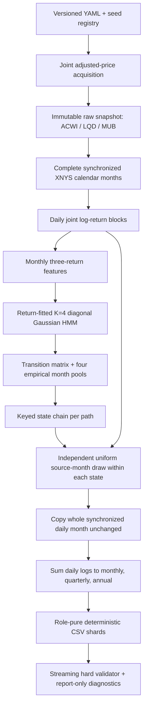

# PRPG v5: quant-developer onboarding and technical guide

## 1. Start here

This delivery is a self-contained private-research package for PRPG delivery
version 5. Its current result is one deterministic population of 5,000
synchronized 50-year paths for three investment roles:

| Role | Current ETF proxy | Consumer return column |
|---|---|---|
| Global equity | ACWI | `equity_log_return` |
| Municipal bond | MUB | `muni_bond_log_return` |
| Taxable investment-grade corporate bond | LQD | `taxable_bond_log_return` |

Daily returns are authoritative. Monthly, quarterly, and annual returns for the
same paths are exact sums of the daily log returns. There is no independently
simulated coarse-frequency population and no weekly v5 output.

The canonical result is
[`runs/v5/v5-production-5000-20260716`](runs/v5/v5-production-5000-20260716).
It contains 5,000 paths, 400 consumer CSV files, 67,150,736 rows, and
5,838,093,246 CSV bytes. Its full hard validation passed.

Read this file first. The other governing documents are:

- [`doc/PRPG-plan.md`](doc/PRPG-plan.md): the owner's original intent;
- [`doc/PRPG-technical-design-and-implementation-log.md`](doc/PRPG-technical-design-and-implementation-log.md): the complete design record, decisions, non-passes, approvals, and append-only implementation log;
- [`doc/PRPG-v5-user-and-maintenance-guide.md`](doc/PRPG-v5-user-and-maintenance-guide.md): exact canonical identities and operator details; and
- [`doc/PRPG-v5-historical-vs-simulated-summary.md`](doc/PRPG-v5-historical-vs-simulated-summary.md): the full-population historical comparison, explicitly descriptive rather than a release gate.

## 2. What is in the delivery

| Location | Purpose |
|---|---|
| `src/prpg/v5/` | Current v5 configuration, data, K4 fit, generator, validator, and diagnostics |
| `src/prpg/` | Complete application source, including preserved earlier-version code and shared primitives |
| `tests/` | Complete automated test suite; focused v5 tests are `tests/unit/test_v5_*.py` plus relevant CLI tests |
| `configs/` | Canonical and example configuration and seed registries |
| `artifacts/v5/data/` | Exact immutable raw ACWI/LQD/MUB snapshot and processed synchronized month library |
| `artifacts/v5/model/` | Exact approved K4 parameters, assignments, review, and provenance |
| `evidence/v5/` | Owner-facing K4 assignment CSV and review document |
| `runs/v5/v5-production-5000-20260716/` | The only delivered generated-return run |
| `reports/` and `doc/PRPG-v5-historical-vs-simulated-summary.md` | Machine-readable and human-readable historical comparison |
| `scripts/` | Delivery verification, comparison-report reproduction, and preserved project utilities |
| `dist/` | Installable PRPG wheel |
| `wheelhouse/` | Pinned CPython 3.11/macOS arm64 dependencies for offline installation |
| `requirements.lock` | Exact resolved environment captured for CPython 3.11.15 on macOS arm64 |
| `DELIVERY-MANIFEST.json` | Final package scope, source identity, and canonical-run summary |
| `DELIVERY-CHECKSUMS.sha256` | SHA-256 allowlist for every other non-Git file in this delivery |
| `LICENSE.txt` | Private-research license and redistribution limits |

The delivery intentionally excludes development smoke/parity/pilot runs,
superseded processed artifacts, caches, and the original nonrelocatable virtual
environment. Create a new local `.venv`; do not copy one from another machine.

## 3. Offline installation and first verification

Run all commands from the delivery root. The target environment is CPython
3.11 on macOS arm64; the exact development interpreter was 3.11.15.

First run the lightweight structural and isolation check. This uses only the
Python standard library and does not read all 5.8 GB of return data:

```bash
python3.11 scripts/verify_final_delivery.py . --skip-hashes
```

Create an isolated environment and install only from the included wheelhouse:

```bash
python3.11 -m venv .venv
source .venv/bin/activate
python -m pip install --no-index --find-links wheelhouse -r requirements.lock
python -m pip install --no-index --no-deps dist/prpg-*.whl
prpg doctor --json
prpg v5 config --config configs/v5-canonical.yaml --json
```

`doctor` should report the supported Python and pinned dependency versions.
It reports whether `FRED_API_KEY` exists but never reveals a credential value;
FRED is not a v5 data input.

For a full package-integrity pass, hash every delivered file and then verify
the canonical consumer files against their independent checksum list:

```bash
python scripts/verify_final_delivery.py .
cd runs/v5/v5-production-5000-20260716
shasum -a 256 --status -c checksums.sha256
cd ../../..
```

The full scientific and structural replay is:

```bash
prpg v5 validate \
  runs/v5/v5-production-5000-20260716 \
  --profile canonical \
  --config configs/v5-canonical.yaml \
  --json
```

It streams every CSV and checks the allowlist, hashes, schemas, period order,
row counts, finite values, deterministic state/source replay, exact
cross-frequency compounding, complete-path uniqueness, and the prospectively
approved ensemble risk/state limits. It does not mutate the CSVs.

## 4. Scientific architecture in one view



This is a semi-parametric model. The Gaussian HMM is fitted to standardized
monthly ACWI/LQD/MUB returns, but Gaussian emissions are not used to invent
asset returns. The HMM supplies only a hidden-state sequence and transition
persistence. For every simulated model month, the generator uniformly selects
one observed complete calendar month from that state's empirical pool and
copies every synchronized daily three-asset vector in its original order.

The first state is drawn from the fitted stationary distribution. Every later
state is drawn from the fitted transition row. Source-month selection is then
independent conditional on that state: it does not favor the previously used
historical month's successor. Sampling is with replacement, and selecting the
same source month twice in succession is allowed.

The delivered architecture is specifically **K=4 with state-specific diagonal
Gaussian covariance in standardized monthly-feature space**. The diagonal
choice keeps the 219-month fit stable; it does not remove observed cross-asset
dependence from generated returns because the empirical daily vector is copied
jointly. Changing the state count or covariance family is a versioned source,
model, and validation-contract change, not an ordinary YAML adjustment.

## 5. Data and return contract

The canonical raw acquisition requested adjusted daily total-return prices for
ACWI, LQD, and MUB from yfinance. The processed library contains 219 consecutive
complete synchronized months and 4,591 daily vectors from April 2008 through
June 2026. A month is accepted only when all three assets have the required
finite, positive adjusted prices on the complete expected XNYS session set,
including the preceding session needed for its first return. There is no
forward fill, backfill, per-asset date dropping, return imputation, or proxy
splicing.

All returns are decimal natural-log total returns:

```text
log_return = log(adjusted_price_t / adjusted_price_t_minus_1)
simple_return = exp(log_return) - 1
```

For example, a log return of `0.01` corresponds to a simple return of about
1.005%. Compound any consecutive interval by summing logs and applying
`exp(sum_of_logs) - 1` once. Do not add simple returns.

### CSV schemas

Daily files use:

```text
path_id,period_index,simulation_year,model_month,session_in_month,equity_log_return,muni_bond_log_return,taxable_bond_log_return
```

Monthly, quarterly, and annual files use:

```text
path_id,period_index,simulation_year,period_in_year,equity_log_return,muni_bond_log_return,taxable_bond_log_return
```

Rows are ordered by complete path and then by one-based `period_index`.
`model_month` is 1–12 and `session_in_month` resets at every selected month.
For coarse files, `period_in_year` is 1–12 for monthly, 1–4 for quarterly, and
1 for annual. Paths are identified as `P000001` through `P005000` in the
canonical run.

Every canonical path has exactly 600 monthly, 200 quarterly, and 50 annual
rows. Daily length is intentionally variable because source months retain
their real 19–23 common sessions. Production daily counts ranged from 12,467
to 12,704 per path, with mean 12,580.1472. Do not assume 252 daily rows in a
simulation year or treat model time as a real future date.

The canonical path-role split is:

| Role | Path IDs | Paths |
|---|---:|---:|
| Training | `P000001`–`P004000` | 4,000 |
| Validation | `P004001`–`P004500` | 500 |
| Test | `P004501`–`P005000` | 500 |

Do not train on validation or test paths. Consumer CSVs deliberately contain
no hidden state, source month, historical date, seed, or future-return field.

## 6. Accepted return-fitted K4 design

The actual assignment packet—not an idealized macro narrative—was reviewed
and accepted by the owner in implementation-log record IL-20260716-045. Unequal
state frequency is expected. The names are investment interpretations of what
the three assets did; they are not claims that a latent macroeconomic cause was
identified.

| State | Accepted interpretation | Assigned months | Historical share | Episodes | Mean episode | Stationary weight | Mean monthly simple return: equity / taxable / muni |
|---:|---|---:|---:|---:|---:|---:|---:|
| 0 | Persistent high-volatility stress/rebound | 30 | 13.7% | 7 | 4.29m | 13.87% | -1.848% / +0.141% / +0.178% |
| 1 | Broad bond selloff/rate pressure | 41 | 18.7% | 29 | 1.41m | 20.44% | -1.018% / -1.869% / -1.286% |
| 2 | Steady positive-return/normal market | 103 | 47.0% | 45 | 2.29m | 42.97% | +1.666% / +0.456% / +0.289% |
| 3 | Strong bond rally/mixed-equity relief | 45 | 20.5% | 37 | 1.22m | 22.72% | +2.267% / +2.352% / +1.725% |

The fitted transition matrix, with rows as the current state and columns as
the next state, is:

| From / to | S0 | S1 | S2 | S3 |
|---|---:|---:|---:|---:|
| S0 | 0.6742 | 0.0247 | 0.0224 | 0.2788 |
| S1 | 0.0717 | 0.2836 | 0.4694 | 0.1753 |
| S2 | 0.0091 | 0.2036 | 0.5369 | 0.2505 |
| S3 | 0.1172 | 0.2443 | 0.4400 | 0.1985 |

Investment intuition matters more here than semantic purity. S0 and S2 are
the most persistent fitted environments. S1 captures months in which both
bond proxies were broadly weak. S3 captures unusually strong bond months even
though equity behavior is mixed. These distinctions give the generator a
practical way to avoid ordering every observed month as if market conditions
were independent, without pretending the short ETF history proves a structural
economic regime model.

The exact 219 month assignments are in
[`evidence/v5/v5-k4-month-assignments-be5df93d382a.csv`](evidence/v5/v5-k4-month-assignments-be5df93d382a.csv),
and the complete state review is
[`evidence/v5/v5-k4-owner-review-be5df93d382a.md`](evidence/v5/v5-k4-owner-review-be5df93d382a.md).
The model artifact's internal `generation_authorized=false` field records that
the artifact was published before owner review; the later owner acceptance and
production authorization are recorded in IL-20260716-045.

## 7. What the generated population looks like

The full-population comparison is
[`doc/PRPG-v5-historical-vs-simulated-summary.md`](doc/PRPG-v5-historical-vs-simulated-summary.md),
with exact machine-readable values in
[`reports/v5-historical-vs-simulated-summary.json`](reports/v5-historical-vs-simulated-summary.json).
It uses all 3,000,000 delivered monthly observations, not the 24-path convenience
sample used by the separate diagnostics.

At a high level, historical versus simulated pooled annualized geometric
returns were 8.59% versus 8.05% for ACWI, 3.20% versus 3.24% for MUB, and 4.13%
versus 4.11% for LQD. Annualized monthly-log volatility was 16.81% versus
16.99%, 5.06% versus 5.18%, and 8.35% versus 8.47%, respectively. Monthly
tails and pairwise correlations were also close. Read the linked comparison
for the tail, correlation, per-path return, and matched-horizon/full-horizon
drawdown tables and their interpretation.

The hard daily validator reported volatility ratios
`[1.005043, 1.008400, 1.005868]`, maximum pairwise correlation error
`0.001420`, and relative covariance error `0.010213`. It found zero complete
daily-path duplicates and exact source replay and compounding errors of zero.

The separate canonical diagnostics in
[`runs/v5/v5-production-5000-20260716/diagnostics-report.json`](runs/v5/v5-production-5000-20260716/diagnostics-report.json)
are explicitly `diagnostic_report_only`, with `release_gate=false` and
`decision=null`. Among other disclosures, longer-lag absolute-return
autocorrelation is attenuated by synthetic month boundaries, and four of six
small-sample quarterly price-only probes looked more favorable in simulation
than in the single historical control. These observations are limitations to
consider in research design, not post-result release vetoes.

## 8. What is preserved—and what is not

### Preserved well by construction

- The exact synchronized three-asset daily vector for every selected source
  session.
- Original within-month daily order, month length, tails, short volatility
  clustering, joint shocks, and drawdown fragments.
- Empirical monthly return support conditional on the fitted state.
- K4 transition persistence and stationary long-run state mix in the ensemble.
- Exact daily-to-monthly-to-quarterly-to-annual log compounding identities.
- Path identity independent of worker scheduling and shard layout.
- Reproducibility from immutable data/model identities and keyed random streams.

### Not claimed or not preserved exactly

- Future expected returns, new shocks, or regimes absent from the 2008–2026 ETF
  history.
- Exact historical order across different source months or exact long-lag
  return/volatility autocorrelation.
- HMM parameter, transition-matrix, model-selection, or data-history uncertainty;
  every path is conditional on one accepted fit.
- A causal inflation, recession, policy, or credit-state interpretation.
- Real future calendar dates, a fixed 252-session year, or an intraday process.
- Daily-strategy safety against recognizing a reused historical month block.
- Instrument-level breadth beyond the three ETF proxies, credit defaults,
  duration changes, transaction costs, taxes, cash flows, or portfolio rules.
- Guaranteed absence of exploitable price-only patterns for every possible
  algorithm.

Source-month reuse is expected: 5,000 fifty-year paths cannot be populated
from 219 historical months without replacement. The model creates new
state/month orderings, not new observed daily shocks.

## 9. Appropriate and inappropriate uses

Good uses include:

- quarterly asset-allocation or rebalancing research across the three roles;
- RL training with strict 4,000/500/500 path separation and decisions based
  only on information available through the prior completed quarter;
- long-horizon retirement, drawdown, spending, liability, or policy experiments;
- comparing robust portfolio rules across many plausible orderings of observed
  market environments; and
- tax-aware allocation research when a separate, explicit tax and cash-flow
  environment is applied to the pre-tax MUB/LQD total returns.

Do not use this delivery as:

- a point forecast, capital-market assumption, expected-return promise, or
  investment recommendation;
- a certified daily-trading, intraday, market-impact, or execution simulator;
- evidence that an HMM state has a particular macroeconomic cause;
- a security-selection or issuer-default model;
- a complete tax simulator—the output contains pre-tax ETF total returns only;
- an externally redistributable market-data or scenario product; or
- regulated risk infrastructure without separate model governance and legal
  review.

## 10. Reproducing the canonical run

Canonical reproduction requires the included data/model artifacts, a clean Git
worktree, at most nine workers, and a fresh output root. Never point generation
at the delivered completed directory.

```bash
source .venv/bin/activate
prpg v5 generate \
  --model be5df93d382a499dbf21c00b1e0be9d47bfda08bd387d0ac70b36d47ba88d6c7 \
  --processed e2caa7756ec5f6b37806e6ef58e44fe827f741ed544e82b132a0cd2f1bbe1760 \
  --output runs/v5/v5-production-5000-replay \
  --run-name v5-production-5000-replay \
  --workers 9 \
  --profile canonical \
  --config configs/v5-canonical.yaml \
  --json
prpg v5 validate \
  runs/v5/v5-production-5000-replay \
  --profile canonical \
  --config configs/v5-canonical.yaml \
  --json
```

On the production 10-core Apple M4 Mac mini with 16 GiB RAM, generation took
44.34 seconds wall time and full streaming validation took about 208 seconds.
Measured maximum resident memory was about 262 MiB. The final CSVs occupy about
5.44 GiB; retain at least 20 GB of free disk before another canonical run.
Different hardware may differ materially.

## 11. Ordinary customization

Preserve the canonical files as a baseline. Put every experiment in a new YAML
file, use a new run name and fresh output directory, and retain the resulting
manifest. The `configured` profile is the ordinary interface for custom path
geometry; `canonical` deliberately enforces the delivered 5,000-by-600
contract.

Start with the included runnable example. It reuses the delivered data and K4
model to generate 12 two-year paths split 8/2/2 across training, validation,
and test. Four-path sharding creates 16 CSVs across the four frequencies. The
output directory must not already exist:

```bash
prpg v5 config --config configs/v5-configured-example.yaml --json
prpg v5 generate \
  --model be5df93d382a499dbf21c00b1e0be9d47bfda08bd387d0ac70b36d47ba88d6c7 \
  --processed e2caa7756ec5f6b37806e6ef58e44fe827f741ed544e82b132a0cd2f1bbe1760 \
  --output runs/examples/onboarding-smoke \
  --run-name onboarding-smoke \
  --profile configured \
  --path-seed 2026071701 \
  --workers 4 \
  --config configs/v5-configured-example.yaml \
  --json
prpg v5 validate \
  runs/examples/onboarding-smoke \
  --profile configured \
  --config configs/v5-configured-example.yaml \
  --json
```

Use a new output/run name if you repeat the example; generation never
overwrites or merges an existing root.

### 11.1 Paths, horizon, split, shards, workers, and path seed

Copy `configs/v5-configured-example.yaml` and
`configs/v5-configured-example-seeds.yaml` to new names, update the copied
config's `seed_registry` reference, then change:

- `simulation.paths` to 3–999,999 (each of the three roles must remain nonempty);
- `simulation.horizon_months` to a positive multiple of 12;
- all three positive role counts so training + validation + test equals paths;
- each corresponding inclusive role range in `path_generation`;
- `simulation.paths_per_shard` to the desired positive shard size—role counts
  need not divide it evenly;
- `execution.workers`, or pass `--workers`, from 1 through 9; and
- the output root and run name.

Keep `native_threads_per_worker: 1`; the worker launcher bounds native numerical
threads so process-level parallelism does not oversubscribe the Mac.

Use a nonnegative uint128 `--path-seed` to obtain a new deterministic path
population without changing or refitting the approved K4 model. The seed is
recorded in the new run identity and replayed by validation. Keep the
config/registry `run.master_seed` unchanged when reusing the canonical model
because that seed defines its deterministic fit namespace. A path-seed
override is available for noncanonical profiles, not for the frozen
`canonical` profile.

Random streams are keyed by scientific version, path seed, global one-based
path ID, and stage. Given the same model/data/seed/path ID, changing worker
count or shard size does not change that path's return values.

`configured` validation always enforces hashes, allowlists, schemas, counts,
finite values, exact replay and compounding, source-selection independence,
and duplicate-path checks. It reports risk/state metrics but does not apply the
canonical ensemble sampling bands to an arbitrarily small custom population.
When a custom configuration has at least 400 training, 50 validation, and 50
test paths, use the registered 500-path `pilot` profile before the full
configured run to apply those ensemble gates.

### 11.2 Changing tickers or historical coverage

The application supports exactly three distinct configured proxies mapped to
`equity`, `taxable_bond`, and `muni_bond`. Change `data.assets`, the yfinance
start/end request, and cutoff in a new config. `end_exclusive` must be exactly
one day after `cutoff`. The current calendar contract is XNYS, complete common
months, adjusted prices, and no imputation; a proxy without compatible data may
leave too little support and should fail visibly.

A ticker, cutoff, history, or materialization change requires a new immutable
raw snapshot, processed library, and K4 fit:

```bash
prpg v5 config --config configs/my-market-v5.yaml --json
prpg v5 acquire-data --config configs/my-market-v5.yaml --json
prpg v5 prepare-data \
  --raw RAW_FINGERPRINT_FROM_ACQUIRE \
  --config configs/my-market-v5.yaml \
  --json
git status --short
git rev-parse HEAD
prpg v5 fit-k4 \
  --processed PROCESSED_FINGERPRINT_FROM_PREPARE \
  --source-commit FULL_CLEAN_COMMIT_FROM_GIT \
  --review-dir evidence/my-market-v5 \
  --config configs/my-market-v5.yaml \
  --json
```

Replace the three uppercase fingerprint/commit tokens with the exact values
emitted by the preceding commands.

Acquisition is the only step here that needs network access. Preparation,
fitting, generation, and validation replay from immutable local artifacts.
Inspect every assigned month and the state/pool review before generating. A
new fit is not automatically owner-approved merely because numerical checks
pass.

### 11.3 Changing K4 numerical hyperparameters

The delivered K4 fitter exposes numerical settings in `model`, including
deterministic restart count, variance floor, start/transition priors, mean and
covariance priors/weights, iteration limit, convergence tolerance, population
standardization convention, minimum pool support, and numerical probability
tolerances. A change to any model-defining value creates a new model identity
and requires the same prepare-or-load, fit, assignment review, smoke, and
configured-run workflow as a new history.

Keep the seed registry consistent: its HMM state count remains 4 and its
inclusive restart range must contain exactly `deterministic_restarts` entries.
Changing `run.master_seed` changes HMM restart seeds, so it also requires a new
fit. Increment `scientific_version` when the scientific RNG contract or model
meaning changes; it must match in the config and seed registry.

Start from the delivered values unless there is a concrete research reason to
change them. Do not tune priors, pool floors, convergence rules, or validation
thresholds after observing an inconvenient candidate result.

### 11.4 Changes that require a new code/output version

These are not ordinary v5 configuration changes:

- K other than 4 or a full/tied/spherical covariance family;
- a different feature definition, macro inputs, or asset count;
- a sampling unit other than a complete synchronized calendar month;
- nonuniform pool sampling, successor-aware sampling, or no-replacement logic;
- a new output frequency such as weekly or a different return representation;
- different CSV columns, period semantics, or path-ID width; and
- within-month daily strategies as a certified use case.

For such changes, create a new scientific/generator/schema version, new
artifacts and run root, targeted tests for changed invariants, a human model
review, one representative multicore pilot, and one final validation. Do not
rewrite or relabel the accepted v5 artifacts.

## 12. Code map for maintainers

| Concern | Primary implementation |
|---|---|
| Strict config, cross-checks, fingerprints | `src/prpg/v5/config.py` |
| Joint acquisition and complete-month library | `src/prpg/v5/data.py` |
| Deterministic return-fitted K4 and review packet | `src/prpg/v5/hmm.py` |
| State/month selection, aggregation, sharding, manifest | `src/prpg/v5/generation.py` |
| Full-row replay, compounding, uniqueness, hard risk/state checks | `src/prpg/v5/validation.py` |
| Bounded tails/drawdown/ACF/strategy report | `src/prpg/v5/diagnostics.py` |
| CLI commands | `src/prpg/cli.py` |
| Keyed RNG | `src/prpg/simulation/rng.py` |
| Process pool and one-native-thread enforcement | `src/prpg/execution.py` |
| Atomic CSV formatting/publication primitives | `src/prpg/storage/` |
| Immutable data/model stores and shared HMM numerics | `src/prpg/data/`, `src/prpg/model/artifact.py`, `src/prpg/model/hmm.py` |
| Delivery assembly/integrity | `scripts/build_final_delivery.py`, `scripts/verify_final_delivery.py` |
| Full-population comparison | `scripts/build_v5_comparison_report.py` |

The many non-v5 modules preserve earlier project versions and the complete
audit trail. For ordinary v5 maintenance, start with the compact surface above.
Do not extend historical G3/G5 orchestration simply because it already exists;
reuse a low-level primitive only when its semantics exactly match v5.

## 13. Testing and maintenance workflow

For a localized change, run the smallest relevant tests first:

```bash
python -m pytest tests/unit/test_v5_config.py
python -m pytest tests/unit/test_v5_data.py
python -m pytest tests/unit/test_v5_hmm.py
python -m pytest tests/unit/test_v5_generation.py
python -m pytest tests/unit/test_v5_validation.py
python -m pytest tests/unit/test_v5_diagnostics.py
```

Add one targeted regression for each concrete defect fixed. Test consumer
outcomes and invariants—schema, counts, compounding, deterministic replay,
role separation, and real plausibility failures—rather than every possible
internal-object mutation or rare crash timing.

Before freezing a new production source, run formatting, linting, strict
typing, the full suite, and branch-enabled coverage once:

```bash
ruff format --check .
ruff check .
mypy src
python -m pytest --cov=prpg --cov-branch
git diff --check
```

The approved aggregate branch-enabled coverage floor is 80%. Coverage supports
testing; it is not a reason to manufacture low-value tests after the floor is
met. Use one worker versus multicore byte equality on a representative sample
when generation, RNG, sharding, or serialization changes. Use a smoke run,
then a bounded configured pilot, before a large fresh production run.

The hard validator protects false-pass risks in the real consumer bundle.
Tails, drawdowns, ACF, state interpretation, source-use summaries, and strategy
probes are report-only unless the owner prospectively and explicitly approves
a specific diagnostic as a release gate before seeing the candidate result.

## 14. Anti-overengineering guardrails

Before meaningfully adding complexity, a gate, a test family, a publisher, or
support infrastructure, answer all six questions in the change record:

1. What new consumer-visible output was produced?
2. Is this task on the critical path?
3. What concrete failure does this code prevent?
4. Is the current issue about the real production model or only a stress-test
   artifact?
5. Has a diagnostic silently become a release gate?
6. Is support code growing faster than the actual scientific logic?

The default decision is to defer work that neither produces nor directly
protects the next visible result. Unexpected rare operational errors may abort
cleanly without a bespoke typed publisher or crash-recovery system. One strong
test tied to a realistic failure is preferable to an adversarial campaign with
no decision-changing consumer consequence.

Per-task cryptographic publication, every-object fingerprints, exhaustive
crash cutpoints, every rare failure variant, large meta-campaigns, and repeated
full audits are outside the v5 maintenance standard unless a concrete real
production failure and explicit owner approval justify them. Final CSV hashes,
immutable data/model identities, deterministic seeds, and one run manifest are
retained because they directly protect reproducibility and delivery integrity.

## 15. Provenance, preservation, and license

The canonical run manifest records the exact generator commit
`07806dfba940be4f19f9d783e989f1c5354ea123`, configuration, seed registry,
processed-data fingerprint, model fingerprint, simulation/materialization/run
identities, toolchain, work units, row counts, and every consumer hash. The
final delivery has its own source commit and package-wide checksum list; this
does not rewrite the older commit that actually generated the canonical CSVs.

Preserve together:

- this complete delivery and its `DELIVERY-CHECKSUMS.sha256`;
- the canonical v5 run, manifest, checksum list, and validation report;
- the exact raw, processed, and model artifact directories;
- the config and seed registry used for each new run; and
- the Git commit and lock file used to build and execute it.

Never hand-edit a completed CSV, manifest, checksum list, or immutable artifact
to make a check pass. Generate into a fresh root. If a checksum differs,
restore a verified copy or reproduce the run from its frozen inputs.

The application, included provider data, derived artifacts, model, and
generated paths are licensed for the project owner's private local research
and internal development only. They are not licensed for publication,
redistribution, sublicensing, sale, or external hosting. Third-party packages
and the vendored Patton–Politis–White source retain their own licenses. This is
a research simulator, not investment advice, a forecast, or a guarantee of
future performance; see [`LICENSE.txt`](LICENSE.txt).
