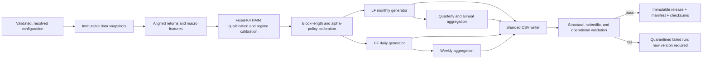

# PRPG Technical Design, Delivery Plan, and Implementation Log

## Document control

| Field | Value |
|---|---|
| Document role | Primary source of truth for the Plausible Return Path Generation (PRPG) project |
| Source intent | [PRPG-plan.md](PRPG-plan.md) |
| Status | Delivery version 5 is complete for the requested private local research use. Frozen generator commit `07806dfba940be4f19f9d783e989f1c5354ea123` generated and hard-validated one unified population of 5,000 fifty-year daily paths and exact monthly, quarterly, and annual derivatives with the owner-approved return-fitted K4 model. All 400 CSV hashes, 67,150,736 rows, schemas, counts, finite values, independent source replay, cross-frequency compounding identities, duplicate checks, and prospectively frozen risk/state gates passed. The bounded tails, drawdown, ACF, source-use, subsequence, and six-strategy diagnostics are complete and remain explicitly report-only |
| Document version | 1.2.0-as-built |
| Application version | 0.1.0 delivery version 5 complete for private local research |
| Planned CSV schema version | 2 for current v5; 1 retained for historical v4 |
| Last updated | 2026-07-16 |
| Owner | Project owner |
| Implementation owner | Codex implementation team |
| Current governing release/run | Local delivery `runs/v5/v5-production-5000-20260716`; manifest/checksum-list/validation-report SHA-256 `ce3edc2494151d1007e33919cc61ea6acc5afc29887c61965b45bfcced23339c` / `b9fd3951b81914772e1f0478318620f3fbf3092ee106897a3912e2218a2fb202` / `53d7b491b8794f51d35017f386b841350c0a44b6381ebd0fea52346a1e58ef20`; clean generator commit `07806dfba940be4f19f9d783e989f1c5354ea123`; processed data `e2caa775...e1760`; model `be5df93d...8d6c7`; 5,000 unified paths, 50 years, 400 CSV shards, 67,150,736 rows, 5,838,093,246 CSV bytes. The bundle is complete for private local research; source-data licensing does not authorize external redistribution |

This document is intentionally both a technical specification and a living
implementation record. Gate G0 was signed on 2026-07-14, so sections marked
**Planned** now describe the approved target, not implemented behavior. Sections
marked **As built** must be updated in the same change that implements or alters
behavior. The implementation log and decision log are append-only.

Normative words have their usual meanings within the delivery profile named by
their section: **MUST** is blocking for that profile, **SHOULD** requires a
recorded reason to deviate, and **MAY** is optional. For the completed private
local delivery version 5, ADR-031/032 and the as-built Section 30 supersede
conflicting requirements in the older enterprise release/resume profile.
Delivery version 4 remains a preserved benchmark under ADR-029/030 and the
as-built Sections 4.17, 18, 22, and 23. If this document and the older intent
memo differ, a signed decision record in this document controls implementation.
Historical intent is never silently edited.

Status vocabulary:

- **Proposed**: designed but not approved.
- **Approved**: accepted at a quality gate.
- **Implemented**: present in code but not yet fully verified.
- **Verified**: acceptance evidence exists and passed.
- **Released**: included in an immutable, approved release.
- **Deferred**: explicitly outside the current delivery, with rationale.

Sections 5–17 and 19–21 retain the original planned full-assurance design unless
an explicit as-built status or later ADR overrides them. They are useful future
design context, but deferred enterprise controls in those sections are not
completion requirements for delivery version 5. Section 30 is the current
pace-oriented as-built delivery contract. Sections 4.17, 18, 22, and 23 remain
the preserved version-4 contract and inventory; Section 30 does not invalidate,
relabel, or mutate those historical source, model, run, CSV, manifest,
checksum, evidence, or conclusion records.

## 1. Historical baseline outcome (superseded for current version 5)

Sections 1–29 preserve the original design and the as-built version-1 through
version-4 record. Section 30 is the current version-5 contract and result. The
historical baseline targeted an auditable Python application and two internally
consistent families of plausible, multivariate, synthetic total-return paths
for three asset-class proxies:

| Semantic asset | Historical proxy | Role |
|---|---|---|
| Equity | ACWI | Global equity |
| Municipal bond | MUB | Tax-exempt fixed income |
| Taxable bond | AGG | Broad taxable investment-grade fixed income |

The required production release is:

1. **Low-frequency family (LF):** 5,000 separately seeded 50-model-year paths.
   Each path contains 600 monthly observations. Its 200 quarterly and 50 annual
   observations are derived from those monthly observations, never simulated
   independently.
2. **High-frequency family (HF):** 1,000 separately seeded 50-model-year paths.
   Each path contains 12,600 daily observations using 252 model sessions per
   year. Its 2,600 weekly observations are derived from those daily
   observations, never simulated independently.
3. Every observation is one synchronized three-asset return vector. Consumer
   data is stored in versioned, sharded, plain CSV files with manifests and
   SHA-256 checksums.
4. The generator uses macro-only regime identification and a regime-conditioned
   multivariate stationary bootstrap. It does not expose macro variables,
   hidden regime states, source indices, or restart decisions to the RL
   consumer.
5. The application is deterministic from frozen inputs and seeds, fresh-run
   fail-fast, resource-bounded, configurable without source edits for ordinary
   changes, and optimized for measured throughput on a multicore Mac.

Absolute freedom from all software defects cannot be proven. The defensible
delivery claim is: every delivery-version-4 gate passed, deterministic
reproduction succeeded, no known blocker remains for the requested private
local use, and the evidence is archived.

## 2. Scientific context and scope

### 2.1 ORCA relationship

ORCA is intended to learn asset location and tax-aware portfolio behavior, not
to exploit a deterministic market-timing formula. PRPG therefore generates
plausible **pre-tax nominal total returns** while deliberately withholding the
macroeconomic state that conditions the simulation.

PRPG does not calculate account-level taxes, identify trades, train an RL
agent, optimize a portfolio, or produce market forecasts. It does not add a
VECM or another deterministic mean-reversion equation to prices.

The intent memo says ORCA independently handles interest, capital-gain, and tax
treatment. A total-return path alone cannot decompose income from price
appreciation. The current goal is the **standalone PRPG release profile**, which
delivers total-return paths with a prominent consumer warning. A later
**ORCA-integration certification profile** MUST add a contract test proving
that ORCA obtains any needed tax decomposition independently and does not
double-count distributions. That external integration test does not block
standalone PRPG implementation or release.

### 2.2 What “plausible” means

Plausibility is not visual resemblance and it is not exact equality with a
finite historical sample. Delivery version 4 uses a practical evidence-backed
standard: structural and leakage-boundary checks are hard requirements, while
finite-sample economic metrics and return-only alpha results are compared with
history/controls and transparently reported under ADR-030. The evidence covers:

- macro-regime occupancy, transitions, and dwell behavior;
- asset marginal returns, volatility, tails, drawdowns, and long-horizon
  compounding;
- contemporaneous covariance, correlation, cross-lag behavior, and return
  autocorrelation;
- volatility clustering and cross-asset stress dependence;
- the joint three-asset distribution and taxable-minus-municipal spread;
- exact cross-frequency algebra;
- path diversity and source-block reuse concentration; and
- absence of economically material, learnable pre-tax alpha relative to
  risk-matched static portfolios.

### 2.3 Explicit limitations

- The common ACWI/AGG/MUB history begins only after all three ETFs exist,
  leaving roughly a post-2008 sample. Thousands of 50-year simulations reduce
  Monte Carlo noise but do not create new historical information.
- The paths necessarily reuse observed regimes and events. They do not include
  unobserved secular regimes or shocks outside the empirical support unless a
  future, separately approved model extension is added.
- Version 1 conditions paths on one fitted parameter/model artifact. Unless an
  explicitly approved uncertainty layer is added, cross-path variation is
  process uncertainty, not parameter or model uncertainty; long-horizon
  compounded results remain especially sensitive to estimated means.
- AGG is a broad taxable investment-grade bond proxy, not a pure corporate-bond
  security. The semantic name remains `taxable_bond`, and the proxy mapping is
  always recorded.
- The output is an empirical scenario set, not a forecast of any named future
  50-year period.
- Current-vintage provider data may contain revisions. A release is
  reproducible from its frozen snapshot, not from refetching live sources.

## 3. Requirements and acceptance contract

### 3.1 Functional and non-functional requirements

| ID | Requirement | Release acceptance |
|---|---|---|
| FR-001 | Produce 5,000 LF paths | Exactly IDs `LF000001` through `LF005000`; 600 monthly rows per path |
| FR-002 | Produce LF quarterly and annual returns | Exactly 200 quarterly and 50 annual rows per LF path; derived from monthly logs |
| FR-003 | Produce 1,000 HF paths | Exactly IDs `HF000001` through `HF001000`; 12,600 daily rows per path |
| FR-004 | Produce HF weekly returns | Exactly 2,600 weekly rows per HF path; derived from daily logs using calendar v1 |
| FR-005 | Preserve the three-asset vector | Each row is derived jointly from one synchronized equity/muni/taxable source vector, followed only by its declared vector transform |
| FR-006 | Deliver CSV data | All five logical datasets use CSV schema v1, sharding, manifests, counts, and SHA-256 verification |
| FR-007 | Use macro-only regime features | No asset return or price is an HMM feature; no hidden feature/state enters consumer CSVs |
| FR-008 | Implement the conditioned stationary bootstrap | State, restart, boundary, and multivariate-copy rules match Section 8 |
| FR-009 | Support safe customization | Counts, integer horizon, the three fixed semantic-role proxy tickers, data cut-off, state candidates, block policy, seeds, workers, sharding, and output root are typed configuration |
| FR-010 | Provide an auditable application | Planned CLI stages, offline replay, logs, manifests, validation report, and documentation are complete |
| NFR-001 | Reproducibility | Frozen model/config/seed produces byte-identical CSV shards on the supported pinned environment, independent of worker count |
| NFR-002 | Multicore efficiency | Process-based generation is benchmarked on the target Mac; worker count maximizes measured throughput within resource limits |
| NFR-003 | Reliability | A fresh run uses exclusive output creation, atomic shard publication, deterministic receipts, clean aborts, and final checksum validation; crash resume is a deferred extension |
| NFR-004 | Software quality | Static checks pass; coverage thresholds pass; zero known Sev-1/Sev-2 defects; critical math has property and mutation tests |
| NFR-005 | Maintainability | Public APIs have docstrings; non-obvious statistical/concurrency invariants have rationale comments; this document matches as-built behavior |
| NFR-006 | Project usage accounting | Append-only checkpoints record authoritative goal-local and project-cumulative token use and elapsed time at every phase/gate transition and owner pause |
| STAT-001 | Assess alpha leakage | Six return-only strategies use correct historical-control scoring with no macro/HMM/source access; all results are reported under ADR-030 rather than forced through an absolute-zero gate that observed history fails |
| STAT-002 | Preserve dependence | Covariance, correlation, raw/absolute/squared-return ACFs pass the calibrated envelopes in G5-B |
| STAT-003 | Preserve the joint distribution | Three-dimensional distance, spread, copula, and tail tests pass G5-C |
| STAT-004 | Preserve regime/path plausibility | Occupancy, duration, marginal, drawdown, and diversity tests pass G3/G5-D |

### 3.2 Requirements traceability

This table is updated as implementation proceeds. Evidence points to an
immutable artifact ID, not an unversioned screenshot. At G0 each row also
receives a named owner/reviewer and invalidation rule.

| ID | Design/config | Named acceptance test | Gate/evidence | Status |
|---|---|---|---|---|
| FR-001 | Sections 5, 8, `simulation.low_frequency` | T-STRUCT-LF-MONTHLY | G4/G7, EV-007/011/042–045 | Passed: exact IDs `LF000001..LF005000`, each with 600 monthly rows; 3,000,000 rows total |
| FR-002 | Sections 5, 8.6 | T-AGG-LF-QA | G4/G7, EV-007/011/043/045 | Passed: 1,000,000 quarterly and 250,000 annual rows; all 5,000 paths passed exact log-sum aggregation |
| FR-003 | Sections 5, 8, `simulation.high_frequency` | T-STRUCT-HF-DAILY | G4/G7, EV-007/011/042–045 | Passed: exact IDs `HF000001..HF001000`, each with 12,600 daily rows; 12,600,000 rows total |
| FR-004 | Calendar/aggregation Sections 5/8.6 | T-AGG-HF-WEEKLY | G4/G7, EV-007/011/043/045 | Passed: 2,600,000 weekly rows; all 1,000 paths passed exact daily-to-weekly log-sum aggregation |
| FR-005 | Sections 7.2/8.5 | T-VECTOR-SYNCHRONY | G2/G4, EV-004/007/041–045 | Passed: all rows preserve synchronized equity/muni/taxable vectors; production observable scan receives only those vectors |
| FR-006 | Section 10, `export` | T-CSV-MANIFEST-HASH | G4/G7, EV-007/011/041–045 | Passed: exactly 190 CSV shards and 19,450,000 rows; every hash, header, path key, and period sequence verified |
| FR-007 | Sections 7.3/8.2 and consumer boundary | T-NO-ASSET-HMM / T-CONSUMER-NOLEAK | G3/G7, EV-005/011/027/030–045 | Passed: K4 classification is macro-only; production CSV allowlist exposes no state, source index, macro, or audit field |
| FR-008 | Sections 8.4/8.5 | T-BOOTSTRAP-BOUNDARY-RNG | G3/G4, EV-006/007/039–045 | Passed: approved monthly-2/daily-62 conditioned synchronized bootstrap produced and validated the full bundle |
| FR-009 | Sections 11/19 | T-CONFIG-CHANGE-IMPACT | G1/G8, EV-003/014/045 | Passed for supported customization: counts, horizon, workers, shards, output, and run identity are typed/configurable; scientific/data changes require a new version |
| FR-010 | Sections 10/11/18 | T-OFFLINE-REPLAY-CLI | G8, EV-014/015/045 | Passed: immutable offline data/model inputs, exact practical CLI, manifest/checksums, validation command, and maintenance guide are complete |
| NFR-001 | Section 9 | T-REPRO-1-VS-N | G6, EV-010/034/036/042/045 | Passed: representative one-worker/nine-worker full-horizon CSVs are byte-identical; production is bound to frozen source/config/data/seeds |
| NFR-002 | Section 12 | T-PERF-TARGET-MAC | G6, EV-002/010/035/036/042–045 | Passed: nine-worker production completed on the 10-core Mac in 94.9385 seconds; full validation took 24.3699 seconds |
| NFR-003 | Sections 10.5/12.4 | T-FAULT-RESUME-ATOMIC | G6, EV-010/041/045 | Passed for the practical fresh-only delivery: exclusive output creation, sibling receipts, hash validation, and clean aborts are implemented; exhaustive crash recovery remains intentionally deferred |
| NFR-004 | Section 13 | T-QUALITY-SUITE | G1–G8, EV-003/025/028/030–045 | Passed: Ruff, strict mypy, and all 2,828 tests passed; exact branch-enabled aggregate coverage was 88.43807873320081% >= 80% |
| NFR-005 | Sections 17–27 | T-DOC-CLEAN-REPLAY | G8, EV-014/015/045 | Passed for local handoff: README, Section 18, as-built status, evidence, commands, limitations, and customization policy match delivery version 4 |
| NFR-006 | Section 25.1 | T-USAGE-LEDGER-MONOTONIC | G0–G8, EV-016 | Passed through the final documentation-audit checkpoint TU-20260716-023: authoritative implementation-goal usage 11,888,099 tokens / 56,326 seconds; project-cumulative 12,255,693 tokens / 59,908 seconds |
| STAT-001 | Sections 8.1/14.3-A | T-ALPHA-DIRECTIONAL | G5/G7, EV-008/009/012/041/043/045 | Completed and reported on fixed 500-LF/200-HF production subset. Monthly quadratic/control gap `+0.122893` and daily reversal/control gap `+0.124670` remain visible report-only diagnostics under ADR-030 |
| STAT-002 | Section 14.3-B | T-DEPENDENCE | G5/G7, EV-008/009/012/043/045 | Passed with disclosure: raw dependence remains recognizable; absolute-return ACF is attenuated, especially monthly taxable bonds |
| STAT-003 | Section 14.3-C | T-JOINT-SPREAD | G5/G7, EV-008/009/012/043/045 | Passed with disclosure: means, volatility, tails, bond correlation, and drawdowns are plausible; equity/bond correlation is lower and the taxable-minus-muni spread more negative |
| STAT-004 | Sections 8.2/14.3-D | T-REGIME-DIVERSITY | G3/G5/G7, EV-005/009/012/025/027/030–045 | Passed: exact owner K4, conditioned transitions, zero complete-path duplicates, and repeated-subsequence rates/multiplicities below two-times-control limits |

## 4. Resolved ambiguities and governing decisions

The following choices make the intent implementable. The project owner approved
them without replacement or exception at G0 on 2026-07-14; they remain the
version-1 historical contract unless a later ADR explicitly supersedes them.
Section 4.9 prospectively supersedes only the stated block-bound and software-
coverage policies for version 2. Section 4.10 later establishes the prospective
version-3 fixed-`K=4` contract and supersedes only the clauses it names. Every
historical result remains unchanged.

| Topic | Governing decision | Reason |
|---|---|---|
| HMM regime count | Versions 1 and 2 historically fit K=2–5 and used the approved predictive/BIC viability selection. Prospective version 3 fixes `K=4`; K=2–5 comparison and BIC selection are historical or report-only, as Section 4.10 defines. | Preserves the original decision and version-2 diagnostic while implementing the owner's later economic-design judgment prospectively. |
| State names | Retain stable numeric IDs; assign descriptive names only after inspecting centroids. | “Expansion/contraction/stagnation” may not be supported by the short sample. |
| Viterbi smoothing | No arbitrary post-hoc smoothing. Validate HMM dwell behavior; adopt a sticky/explicit-duration model only through a new decision record if the gate fails. | Smoothed labels would be inconsistent with the fitted transition model. |
| Design holdout vs. production fit | Version 1 uses a sealed holdout for design evidence, then mandatorily refits/recalibrates a distinct production artifact on the full snapshot. Only the production artifact generates released paths. | Uses scarce history while preserving an honest, separately labeled held-out design check. |
| Return convention | Internal and canonical CSV values are nominal total **log returns** in decimal units. Simple returns are `expm1(log_return)`. | Matches the intent memo and makes aggregation exact and unambiguous. |
| Frequency generation | Generate monthly only for LF and daily only for HF; derive all requested coarser frequencies. | Prevents contradictory representations of the same path. |
| LF/HF relationship | LF and HF are separate, unpaired ensembles and path IDs are not paired across families. | Avoids silently mixing direct-monthly and daily-derived models. |
| Fifty years | Use a versioned ordinal model calendar with exact period counts, not future real-world dates. | Guarantees stable counts and avoids changing holiday rules or false forecast dates. |
| Alpha policy | Versions 1–3 planned a historical-vector baseline plus a possible state-mean-neutral candidate. Delivery version 4 uses the owner-approved historical-vector bootstrap and reports the six return-only strategy comparisons under ADR-030. | Preserves the requested empirical simulator without delaying delivery for a research gate that rejects the observed history itself. |
| Alpha-gate estimand | Conditional expected-return/directional alpha remains an important diagnostic. For delivery version 4, historical-control gaps and the former absolute-zero band are report-only under ADR-030; information leakage into the strategies remains prohibited. | Separates artificial information leakage from temporal patterns already present in the finite history that the simulator intentionally preserves. |
| “Perfect” preservation | Use equivalence envelopes calibrated from historical resampling. | Finite samples cannot perfectly match covariance or a joint distribution. |
| Carry test | Use only return-observable bond-relative signals and name them as proxies. | True carry is not observable from total-return CSVs alone. |
| CSV organization | Sharded wide CSVs, not one file per path or asset. | Avoids 17,000 files and preserves the multivariate row contract. |
| Hidden audit data | Store only under `audit_hidden/`, outside consumer discovery roots. | Prevents inadvertent RL state leakage. |

### 4.1 Gate G0 approval items

At G0 on 2026-07-14, the owner approved:

1. log return as the canonical CSV representation; simple-return CSV
   materialization is not part of version 1;
2. the two-ensemble relationship;
3. synthetic calendar `SC252-52-v1`;
4. the two-candidate alpha-policy selection and distortion-budget protocol;
5. retrospective current-vintage FRED labeling; the point-in-time/release-
   lagged macro policy is deferred;
6. the standalone total-return limitation (ORCA integration remains a separate
   deferred certification profile); and
7. the practical alpha margin and statistical family-wise error policy; and
8. the mandatory two-artifact design-holdout/full-data-production policy.

### 4.2 Approved owner G0 decision packet — version 1 defaults

This packet was prepared and approved on 2026-07-14 so the first external side
effect can be the immutable data fetch. The project owner gave the exact
directive **“Approve the recommended G0 packet”** with no replacements,
exceptions, or waivers. That directive approves all 13 items below, all
governing decisions in Section 4, and all eight approval items in Section 4.1.
The approval record is EV-001 and implementation-log entry IL-20260714-003.

This approval is a prospective authorization boundary: it permits Phase 1 to
begin and permits the first provider call only after the minimal tested G1
provenance foundation exists. It is not evidence that G1 has passed or that any
application code, environment, provider payload, data snapshot, transformed
dataset, test result, or later-gate artifact exists. Those states advance only
through their own as-built entries and gate evidence.

1. Approve all governing decisions in Section 4 and all eight items in Section
   4.1, including log-total returns, separate unpaired LF/HF ensembles,
   `SC252-52-v1`, historical-vector-first alpha policy, standalone PRPG scope,
   24-month design holdout followed by mandatory full-data production refit,
   planned directional-alpha margin `0.10`, overall 5% Holm-controlled family,
   and 90% TOST intervals.
2. Approve **current-vintage retrospective FRED labeling** for version 1.
   State `s_t` conditions the return ending in month `t`; states remain hidden,
   and all reports explicitly say this is not a real-time state estimate. A
   causal/ALFRED profile remains a separately fingerprinted future extension.
3. Freeze the acquisition cutoff at the last fully closed calendar month before
   this project started: raw daily requests include dates through
   `2026-06-30`. The yfinance exclusive `end` is `2026-07-01`. The modeling
   endpoint is deterministically the latest month on or before `2026-06-30`
   for which all three ETF and four transformed macro inputs pass completeness;
   it may be earlier and is recorded rather than imputed.
4. Freeze the canonical yfinance request per ticker: `start=2007-01-01`,
   `end=2026-07-01` (exclusive), `interval=1d`, `auto_adjust=False`,
   `actions=True`, `repair=False`, `keepna=True`, `prepost=False`,
   `threads=False`, and `timeout=30`. Retain OHLC, `Adj Close`, volume,
   dividends, splits, and history metadata. Returns use reconciled `Adj Close`.
   A `repair=True` fetch is diagnostic-only and can replace nothing silently.
   Normalize exchange timestamps to `America/New_York` session dates.
5. Use the official current-vintage FRED CSV service through a pinned adapter
   for `INDPRO`, `CPIAUCSL`, `T10Y3M`, and `BAA10Y`; no API key is currently
   present or required for this profile. Preserve exact response bytes, URL/
   parameters, retrieval UTC time, and hashes. Direct keyed FRED/ALFRED API
   support remains an adapter option for a future causal profile.
6. A daily FRED spread month passes when each series has finite observations on
   at least 80% of Monday–Friday dates in that calendar month. Do not forward
   fill. Exclude a month missing any required macro feature. Exclude an
   incomplete synchronized ETF month from both LF and HF source pools; retain
   its gap evidence but do not bridge it.
7. Flag, but never automatically remove, an adjusted one-session simple return
   whose absolute value exceeds 20% for ACWI or 10% for MUB/AGG, or an
   unexplained adjustment-factor move above 5%. Every flag must end as
   `valid_market_event`, `provider_adjustment_reconciled`,
   `provider_error_rejected`, or `unresolved_release_blocker`.
8. Freeze yfinance resilience at at most three acquisition rounds, with at most
   two library retries per round, redacted diagnostics after the first failed
   round, jittered inter-round backoff, `Retry-After`/minimum 60-second cooling
   for HTTP 429, and a ten-minute wall-clock cap per ticker. Freeze FRED at five
   total attempts with jittered exponential caps of 2, 5, 15, and 45 seconds,
   also honoring `Retry-After`. Deterministic/schema failures are not retried.
9. Freeze kernel-mean calibration at cumulative prefix-stable window counts
   `10,000, 20,000, 40,000, 80,000, 160,000, 320,000`. Cluster by window and
   require every asset/state/frequency annualized simultaneous confidence
   half-width to be at most `0.0010` (10 basis points), with two-sided 95%
   Student-t critical values Bonferroni-adjusted across all cells and six looks.
   Failure at 320,000 rejects the neutral candidate.
10. For neutral-policy raw-history distortion, every metric must be below the
    smaller of its independently calibrated raw-vs-raw 95% critical value and
    the following practical cap:

    | Metric | Hard practical cap |
    |---|---:|
    | Per-asset mean shift / raw annualized volatility | 0.05 |
    | Per-asset absolute annualized mean shift | 0.0100 |
    | Per-asset relative volatility change | 0.05 |
    | Per-asset `W1 / raw sigma` | 0.10 |
    | Eligible per-asset quantile shift / raw sigma | 0.15 |
    | Normalized covariance Frobenius distance | 0.10 |
    | Maximum absolute pairwise-correlation change | 0.05 |
    | Standardized sliced-Wasserstein or energy distance | 0.10 each |
    | Eligible tail/downside-co-exceedance probability change | 0.02 absolute |
    | Taxable-minus-muni mean shift / raw spread volatility | 0.05 |
    | Taxable-minus-muni absolute annualized mean shift | 0.0050 |
    | Spread relative volatility change | 0.05 |
    | Spread `W1 / spread sigma` | 0.10 |
    | Eligible spread-quantile shift / spread sigma | 0.15 |

    Pre-register daily quantiles `{0.01, 0.05, 0.50, 0.95, 0.99}` and monthly
    quantiles `{0.10, 0.50, 0.90}`, subject to Section 14.2 eligibility.
11. For every volatility-timing adversary, define the improvement gap as its
    timer-minus-fixed-comparator Sharpe improvement in simulation minus that in
    historical control. Its simultaneous family-wise corrected one-sided 95%
    upper bound must be strictly below `0.20` annualized Sharpe units. This does
    not replace or compensate for the direct directional-alpha `+/-0.10` gate.
12. Approve the discovered execution profile: Apple M4 Mac mini, ten cores,
    16 GB RAM, and 81 GiB free at inventory time; exclude device identifiers
    from evidence. Keep one core in reserve, cap application memory at 70%, and
    let Phase-6 benchmarks choose the production worker/writer count.
13. Confirm this is private local research use and approve the local-only source
    data policy: raw Yahoo/FRED/Moody's payloads are never committed, included
    in the consumer release, or redistributed. Release artifacts retain hashes,
    citations, and locally resolvable provenance subject to applicable terms.
    If the intended use requires sharing raw BAA10Y or Yahoo-derived data, stop
    and obtain permission or approve a new source/ADR before acquisition.

Approval of this packet closed the semantic G0 choices on 2026-07-14. Phase 1
now creates the minimal pinned/configured provenance foundation; the first
provider call occurs only through that tested pipeline, making data collection
the first scientific implementation stage rather than an unaudited manual
download.

### 4.3 Phase-0 feasibility findings — 2026-07-14

- Official iShares product pages report inception dates of 2003-09-22 for AGG,
  2007-09-07 for MUB, and 2008-03-26 for ACWI. ACWI therefore determines the
  theoretical common start. The interval through 2026-06 should exceed the
  planned 180-month/3,500-session minima, but only G2 provider/session checks
  can prove the usable counts.
- PyPI reports yfinance 1.5.1 as the current release at this checkpoint.
  PyPI reports hmmlearn 0.3.3, Python `>=3.8`, limited-maintenance status, and
  a CPython 3.11 macOS universal2 wheel. Because the machine-wide Python is
  3.13 and the macOS 3.13 wheel path is not established, Phase 1 will test and
  provision an isolated pinned CPython 3.11 arm64/universal2 environment rather
  than modifying or trusting the global Anaconda installation.
- The yfinance project states that it is unaffiliated with Yahoo, is intended
  for research/educational use, and that downloaded data remain subject to
  Yahoo terms. The official FRED BAA10Y page contains Moody's copyright and
  downstream use restrictions. The canonical snapshot is therefore private
  and local-only pending a recorded rights review; hashes and derived release
  evidence do not grant redistribution rights.
- No provider payload, package, code, or environment was downloaded or created
  during this readiness review. Owner approval of Section 4.2 was subsequently
  recorded on 2026-07-14; the first such action is now gated only by the minimal
  G1 provenance foundation.

### 4.4 Superseded initial G3/G5 preregistration packet — never approved

**Status: superseded before approval by the revised Section 4.5 packet; retained
as non-normative audit history.** Phase 3 implementation exposed choices
that the G0 design did not specify tightly enough to prevent discretion after
seeing fitted results. The following twelve-item packet freezes the recommended
version-1 values. **No canonical HMM candidate, block calibration, design
artifact, or production artifact may be fit, scored, calibrated, selected, or
serialized before the project owner approves this packet without exception or
records explicit replacements.** Toy fixtures and implementation tests are not
canonical scientific fits and may continue.

1. **HMM engine, optimization, regularization, and restart selection.** Use
   `hmmlearn 0.3.3` in float64 with full covariance,
   `implementation="log"`, `algorithm="viterbi"`, exactly 50 deterministic
   starts, `n_iter=1000`, and `tol=1e-6`. Set `startprob_prior=1.0`,
   `transmat_prior=1.0`, `means_weight=0`, `covars_prior=0`, and
   `covars_weight=0`; update `s`, `t`, `m`, and `c`. Symmetrize each covariance
   and impose an explicit eigenvalue floor of `1e-6` in standardized-feature
   units after every M-step. A restart is invalid if the raw minimum eigenvalue
   is below `-1e-10`, flooring changes covariance by more than 1% in relative
   Frobenius norm, the final condition number exceeds `1e6`, fewer than two EM
   iterations occur, convergence is not reported, any parameter/log likelihood
   is non-finite, or log likelihood decreases by more than
   `1e-8 * max(1, abs(previous_log_likelihood))`. Select the valid restart with
   the largest final regularized log likelihood; values tied within
   `1e-10 * max(1, abs(best_log_likelihood))` choose the smallest restart ID.
   Extend deterministic model-refit seed entities as
   `(scope << 28) | (replicate << 12) | (K << 8) | restart`, with scope IDs
   `0=design-main`, `1=design-bootstrap`, `2=rolling`,
   `3=production-main`, and `4=production-bootstrap`; validate every field's
   bit range and prohibit namespace reuse.

2. **Gap-aware fit, score, decode, and episode geometry.** The design-training
   sequence is one 193-observation segment ending 2024-04. The sealed
   24-complete-month holdout has segment lengths `(17, 7)`. The 217-observation
   production sample has segment lengths `(210, 7)`. Pass these exact lengths
   to every applicable fit, score, and Viterbi operation; never infer a
   transition, episode, run, likelihood continuation, or autocovariance pair
   across the missing 2025-10 month. BIC `T` is the total observed row count.
   A run is a maximal same-label interval inside one continuation segment; only
   runs bounded on both sides within that segment count as completed episodes.
   Boundary/gap-censored runs remain censored dwell observations but do not
   satisfy the completed-episode minimum.

3. **Stability refits.** For each candidate/artifact, run exactly 100
   non-circular, gap-aware stationary-bootstrap refits using the current
   preliminary monthly block length. Each refit uses all 50 starts, its own
   training-only scaler, and its own seed namespace, then decodes the same
   frozen reference sequence. Hungarian-align labels before ARI. Assign
   `ARI=0` to a failed refit. Separately require median bootstrap ARI `>=0.70`
   and median ARI across the six rolling refits `>=0.70`; do not pool the two
   families to rescue a failure. Reuse the 100 block-refit models only for the
   report-only parameter-uncertainty sensitivity, summarized at the 5th, 50th,
   and 95th percentiles.

4. **Rolling-origin score and tie semantics.** Use six expanding folds on the
   193-observation design sample, initially training through 2018-04 (121
   months), followed by 12-month validation blocks `2018-05..2019-04`,
   `2019-05..2020-04`, `2020-05..2021-04`, `2021-05..2022-04`,
   `2022-05..2023-04`, and `2023-05..2024-04`. Fit the scaler and all 50 HMM
   starts on each fold's training rows only. The fold score is
   `(log L(training + validation) - log L(training)) / validation_count`.
   Against the minimum-BIC candidate, form a paired two-sided 95% Student-t
   confidence interval over the six fold-score differences. A candidate with
   `delta BIC < 2` is predictively tied only when this paired interval contains
   zero; choose the smallest K among the tied candidates.

5. **Sealed-holdout role and veto.** The holdout never chooses K, tunes a
   threshold, or promotes a runner-up. Compare the selected design HMM's
   predictive log likelihood with a training-fit `K=1` full-covariance Gaussian
   baseline over the 24 observations, preserving holdout lengths `(17, 7)` and
   resetting at the gap. Require HMM-minus-baseline log score per observation
   to be `>=0`. Failure stops G3 and does not authorize selection of another K.

6. **Duration/state predictive validation.** Run exactly 10,000 fixed-seed
   replicates per artifact and validation family. Latent-generator replicates
   are 600-month chains. Decoded-model replicates use macro-emission sequence
   geometry matching `(193)` for design or `(210, 7)` for production, followed
   by the exact Viterbi decoder and label alignment. The primary vector is
   per-state occupancy, every off-diagonal transition probability, episode
   rate, one-month-spell rate, median dwell, and dwell-survival probabilities
   at months 1 through 12. Use an empirical 95% simultaneous max-absolute-z
   envelope within each family, quantile method `higher`, then Holm correction
   across the latent and decoded families. A zero-variance component requires
   exact equality. Both families must pass.

7. **Transition validity and practical mixing limits.** Reject an entry below
   `-1e-15` or a transition-row sum error above `1e-12`. Define graph edges by
   `P[i,j] > 1e-12`; require strong connectivity and graph period one. Require
   stationary-distribution residual `<=1e-12`. Record the second-largest
   eigenvalue modulus and spectral gap. Hard-reject `max(P[i,i]) >= 0.98`, or a
   chain for which no integer `t <= 120` months satisfies
   `max_i TV(e_i P^t, pi) <= 0.01`.

8. **Politis–White selector and PC1 convention.** Vendor and hash-pin the
   Patton–Politis–White 2009 corrected automatic stationary-bootstrap selector
   and retain golden selector fixtures. For each frequency, calculate PC1 from
   the correlation matrix of the three synchronized return series, in fixed
   `(equity, muni_bond, taxable_bond)` order, and choose its sign so the equity
   loading is positive. Center the resulting diagnostic series. Every
   autocovariance uses only index pairs within the same source-continuation
   segment. Variance `<=1e-12`, a non-finite estimate, or a non-positive
   estimate is a calibration failure, not a reason to drop a series.

9. **Effective block-length calibration.** Run exactly 10,000 fixed-seed,
   history-length simulations for every `(artifact, frequency, L)` candidate,
   with target-state initialization from the candidate's stationary law and
   the exact conditioned kernel. A realized block is a maximal chronological
   source-continuation run; include the terminal censored run at its observed
   length. Pool realized blocks by target state. Every state must have
   arithmetic mean realized block length `>=0.5 * L`. Store count, mean,
   median, 5th percentile, and 95th percentile for every state. Use no
   sequential stopping.

10. **Raw block length above the absolute bound.** Set
    `L_raw = ceil(max(L_j))`, with absolute allowed ranges `[2, 12]` months and
    `[2, 60]` sessions. Hard-reject the candidate whenever `L_raw > 12` months
    or `L_raw > 60` sessions. Do not truncate-and-pass and do not invoke a
    discretionary long-dependence pilot in version 1.

11. **Design-to-production stability bridge.** Require identical selected K,
    identical canonical centroid order, and both artifacts' absolute support
    gates to pass. Align states and evaluate centroid Euclidean shifts in
    common design-scaler units, every transition-cell shift, stationary
    occupancy shifts, median-dwell and dwell-survival shifts, monthly/daily
    block-length changes, pool-support ratios, and kernel-mean candidate-offset
    shifts. Calibrate a 95% simultaneous max-stat envelope from exactly 10,000
    fixed-seed nested design pseudo-pairs: fit one artifact to the first 193
    observations and the paired artifact to the corresponding 217-observation
    pseudo-history with the canonical continuation geometry. In addition to
    that envelope, hard-cap aligned centroid shift at `0.75` standardized
    Euclidean units, maximum transition-cell or occupancy shift at `0.10`,
    relative median-dwell shift at `25%`, monthly block change at two months,
    and daily block change at ten sessions. Bridge both alpha-candidate
    parameter artifacts at G3; alpha-policy selection and generated-output
    bridge metrics remain G5 work because neither exists at G3.

12. **G5 values that must be frozen before G3 results are visible.** Retain
    family-wise alpha `0.05` with Holm correction, 90% TOST confidence,
    annualized conditional-return margin `0.10`, volatility-timing cap `0.20`,
    and Monte Carlo precision target `0.001`. Begin every outer-null calibration
    with 10,000 fixed-seed replicates, add batches of 2,000 to a maximum of
    50,000, use quantile method `higher`, and stop only when every target tail
    probability's simultaneous 95% Clopper-Pearson interval has half-width
    `<=0.0025`. Set the neutral residual-mean equivalence margin for every
    state/asset to `+/-0.005` annualized. Use 512 scrambled-Sobol unit directions
    from the threshold-calibration seed namespace for projection metrics. Use
    one equal-history contiguous window per path, with deterministic offset
    `floor(U * (path_length - history_length + 1))`.

    Freeze the adversary registry as follows: daily momentum/trend lookbacks
    `21/63/126/252`, reversal `1/5`, bond-relative `21/63/252`, rebalance every
    21 sessions, minimum training 756 sessions, and refit every 252 sessions;
    monthly momentum/trend lookbacks `3/6/12`, reversal `1`, bond-relative
    `3/6/12`, rebalance monthly, minimum training 60 months, and refit every 12
    months. Use standardized inputs, deterministic long-only tie splitting,
    L2 logistic/ridge models with penalty `lambda=1.0`, an unpenalized
    intercept, no hyperparameter search, and path-clustered inference.

    Validate the suite with exactly 1,000 meta-replicates. The two-sided 95%
    Clopper-Pearson interval for observed type-I error must contain `0.05`; the
    one-sided 95% Clopper-Pearson lower confidence bound for detection power
    must be `>=0.90`. Material defects are alpha-Sharpe drift `0.10`, covariance
    distortion `0.10`, maximum correlation error `0.05`, one-session asset
    desynchronization, clipping at the 1st/99th percentiles, and `+0.10`
    diagonal-transition perturbation followed by row renormalization.

Two amendments in this packet are intentional supersessions upon owner
approval, not silent edits to earlier history:

- **Correlation-matrix PC1 plus gap-aware autocovariances supersede the current
  covariance-matrix PC1 implementation.** The implementation must be amended
  and reverified before canonical calibration; existing covariance-based PC1
  output is not eligible for G3 evidence.
- **The hard rejection of `L_raw > 12` months or `L_raw > 60` sessions
  supersedes Section 8.4's cap-plus-long-dependence-pilot language.** Version 1
  will neither truncate an over-cap selector result into eligibility nor use a
  post-result pilot to rescue it.

The realized HMM parameters, BIC values, predictive envelopes, outer-null
critical values, and bridge envelope are evidence generated only after
approval. They are not owner-selected thresholds and may not be manually
rounded or changed after results are seen.

### 4.5 Owner-approved revised G3/G5 preregistration packet — activated with Section 4.6

**Status: owner-approved and activated together with Section 4.6.** On
2026-07-14 the owner asked for the initial packet to be reconsidered against an
external technical critique. The review agreed with the critique's central
point: 193 design
months cannot support state-specific unrestricted covariance estimates for as
many as five states merely because many restarts or Monte Carlo replicates are
run. This revision therefore supersedes Section 4.4 before either packet was
approved. Section 4.4 remains only as audit history.

The revision deliberately chooses a tied unrestricted covariance instead of a
custom shrunk-covariance EM, a tiered bridge instead of recursively nesting
every stochastic gate, and a fixed 50,000-run G5 calibration instead of adding
a new confidence-sequence implementation. At the instant of approval, **no
canonical HMM candidate, score, block calibration, design/production artifact,
bridge result, or G5 threshold had been observed.** A final independent
contract audit then completed before activation and found the execution
defects recorded in Section 4.6. Canonical work therefore remained prohibited
until those corrections are approved. The owner approved Section 4.6 without
exception on 2026-07-14, so the unaffected clauses below and the corrective
clauses in Section 4.6 are now jointly binding. Conforming implementation and
verification still precede any canonical result. They remain the immutable
version-1/version-2 contract; prospective version 3 carries them forward except
for the HMM/support clauses superseded by Section 4.10 and the G5-only
adversary, calibration, and meta-validation clauses superseded by Section
4.13.2/ADR-028.

1. **HMM engine, complexity, optimization, identification, and model-fit RNG.**
   Use `hmmlearn 0.3.3` in float64 with `covariance_type="tied"`,
   `implementation="log"`, `algorithm="viterbi"`, exactly 50 deterministic
   starts for every ordinary fit, `n_iter=1000`, `tol=1e-6`, and
   `min_covar=1e-6`. The tied covariance is one unrestricted 4-by-4 matrix
   shared across states; it retains cross-feature covariance while avoiding a
   separate noisy matrix for every state. State-specific full covariance and
   custom shrinkage are deferred to a separately approved model version.

   Set `startprob_prior=1.0`, `transmat_prior=1.0`, `means_weight=0`,
   `covars_prior=0`, and `covars_weight=0`; update `s`, `t`, `m`, and `c`.
   Symmetrize the tied covariance and impose an explicit `1e-6` eigenvalue
   floor after every M-step. A restart is invalid if the raw minimum eigenvalue
   is below `-1e-10`, flooring changes covariance by more than 1% in relative
   Frobenius norm, the final condition number exceeds `1e6`, fewer than two EM
   iterations occur, convergence is not reported, a parameter or likelihood
   is non-finite, or likelihood decreases by more than
   `1e-8 * max(1, abs(previous_log_likelihood))`. Apply every numerical and
   preliminary Markov check to every restart before ranking. Select the valid
   restart with greatest final regularized likelihood; a tie within
   `1e-10 * max(1, abs(best_log_likelihood))` chooses the smallest restart ID.

   Use the tied-covariance parameter count

   `q = (K - 1) + K(K - 1) + Kd + d(d + 1)/2`, with `d=4`,

   giving `q = 21, 30, 41, 54` for `K = 2, 3, 4, 5`. On each exact segmented
   sequence calculate forward-backward posterior probabilities `gamma[t,s]`,
   with `0 log(0) := 0`, and require all of:

   - mean normalized posterior entropy `<=0.70`;
   - mean over rows of `max_s gamma[t,s] >=0.65`;
   - posterior effective mass for every state
     `sum_t gamma[t,s] >= max(24, 0.10T)`;
   - mean posterior probability of the Viterbi-assigned state, separately over
     rows assigned to each state, `>=0.60`; and
   - minimum pairwise Mahalanobis distance between state means under the tied
     covariance `>=0.75`.

   These are gross non-identification screens, not proof that states are
   literally observable economic categories. Add merged-state and overlapping-
   emission defects to Point 12 meta-validation.

   Encode model-refit entities as
   `(scope << 28) | (replicate << 12) | (K << 8) | restart`. Replicate and
   restart IDs are zero-based. Scope IDs are:

   | Scope | Meaning | Replicate range |
   |---:|---|---:|
   | 0 | design main | `0` |
   | 1 | design macro stability | `0..99` |
   | 2 | design rolling fold | `0..5` |
   | 3 | design parametric adequacy | `0..999` |
   | 4 | production main | `0` |
   | 5 | production macro stability | `0..99` |
   | 6 | production parametric adequacy | `0..999` |
   | 7/8 | model-DGP selection prefix/full | `0..249` |
   | 9/10 | nonparametric-DGP selection prefix/full | `0..249` |
   | 11/12 | model-DGP fixed-K prefix/full | `0..9,999` |
   | 13/14 | nonparametric-DGP fixed-K prefix/full | `0..9,999` |

   Validate the four-bit scope, sixteen-bit replicate, four-bit K, and
   eight-bit restart fields and prohibit namespace reuse.

2. **Gap-aware fit, score, decode, and episode geometry.** Retain the gap rule
   and define its representation exactly. A continuation mask has length `T`,
   is false at the first row of every segment, and is true at row `t` exactly
   when the forward link from row `t-1` exists. Use sequence lengths `(193)`
   for design, `(17, 7)` for the sealed holdout, and `(210, 7)` for production.
   Pass the applicable lengths to fit, likelihood, filtering, smoothing,
   scoring, Viterbi, transition, episode, autocovariance, and residual
   calculations. Never infer a relation across missing 2025-10. BIC `T` is
   total observed rows. A run is maximal inside one segment; only runs bounded
   on both sides in that segment count as completed episodes. Boundary/gap
   runs remain censored dwell evidence.

3. **Separate macro-bootstrap stability.** Never use an asset-return block
   length to resample macro features. On the applicable fit sample build seven
   diagnostics: the four standardized macro features, correlation-PC1,
   absolute PC1, and squared PC1. Apply Point 8's corrected gap-aware selector
   and set `L_macro = ceil(max_j L_macro,j)`. Its allowed range is `[2, 24]`
   months and it must also satisfy `L_macro <= floor(T/8)`; exceeding either
   bound means the sample cannot support the nonparametric stability exercise.
   `L_macro` is used only for macro-model stability, never return generation.

   Run exactly 100 synchronized, non-circular, gap-aware macro-bootstrap
   attempts per candidate/artifact. Every attempt recomputes its scaler, uses
   all 50 HMM starts, and decodes the same frozen reference sequence. A failed
   attempt remains in the denominator with `ARI=0` and zero state overlaps.
   Require at least 90 successful attempts, median ARI including failures
   `>=0.80`, 10th-percentile ARI with method `higher` `>=0.50`, and, for every
   aligned state, median Jaccard overlap `>=0.70` and 10th-percentile Jaccard
   `>=0.50`.

   Each of the six rolling models uses its training-only scaler but decodes the
   same frozen 193-row design reference. Require at least five successful
   rolling fits, median rolling ARI including failures `>=0.70`, minimum
   successful rolling ARI `>=0.40`, and every state's median aligned Jaccard
   overlap `>=0.60`. Do not pool bootstrap and rolling families.

4. **Rolling predictive selection.** Retain the six expanding fold dates from
   Section 4.4. For every candidate and validation month, store the one-step
   predictive log score conditional on fold-training history and preceding
   validation observations; do not refit inside a 12-month validation block.
   An invalid fold makes that candidate predictively ineligible. This produces
   72 paired monthly scores per candidate.

   Use exactly 10,000 common fixed-seed, fold-stratified, non-circular
   stationary-bootstrap resamples with expected block length four. Resample
   only inside each 12-month fold, never across a fold boundary, and apply the
   same sampled month indices to every candidate. Use a studentized max
   statistic over all candidate-versus-best mean differences to form
   simultaneous two-sided 95% intervals, quantile method `higher`. A zero
   standard error is an exact tie only when the difference is exactly zero.

   The predictive best has the greatest mean of its 72 scores; a numerical tie
   within `1e-12` chooses smaller K. A candidate is predictively near-best only
   when its simultaneous interval for candidate-minus-best contains zero.
   Separately calculate BIC for all pre-BIC viable candidates and retain only
   near-best candidates whose `delta BIC <=10` from minimum BIC. Choose the
   smallest K in that intersection. An empty intersection fails G3. Thus BIC
   is a complexity safeguard rather than the sole selector.

5. **Sealed-holdout veto and dynamic benchmark.** The holdout remains veto-only:
   it cannot select K, tune a threshold, or promote a runner-up. Compare the
   selected design HMM with both a training-fit `K=1` Gaussian and a fixed ridge
   VAR(1) on the four training-standardized macro features. Fit the VAR only on
   valid within-segment lag pairs using

   `(1/(2n)) sum_t ||x_t - c - A x[t-1]||^2 + 0.5 ||A||_F^2`.

   The intercept is unpenalized. Estimate residual covariance `S`, use
   `0.90 S + 0.10 trace(S)/4 I`, then apply the `1e-6` floor. Require finite
   parameters, condition number `<=1e6`, and VAR spectral radius `<0.995`; no
   hyperparameter search or fallback is allowed.

   At the first holdout row, the HMM conditions on the design filter's terminal
   distribution and the VAR on the last design macro vector. At the source
   gap, reset the HMM to its stationary law and score the VAR's first post-gap
   row from the VAR stationary Gaussian implied by the discrete Lyapunov
   equation; later rows use the actual previous observed vector. Require
   selected-HMM minus benchmark log score per holdout observation `>=0`
   against each benchmark separately. An invalid benchmark fails the gate.

6. **Generator correctness and refitted model adequacy.** Retain exactly 10,000
   fixed-parameter latent-chain replicates for generator correctness. The
   primary vector remains per-state occupancy, every off-diagonal transition,
   episode rate, one-month-spell rate, median dwell, and dwell-survival at
   months 1 through 12.

   Replace the fixed-parameter decoded adequacy gate with exactly 1,000
   parametric-bootstrap attempts per selected design/production artifact. Each
   attempt generates the artifact's exact macro geometry, recomputes its
   scaler, refits the same selected K with all 50 starts and Point 1 checks,
   aligns states in the original artifact's standardized coordinates, decodes,
   and computes the full adequacy vector. Require at least 950 valid refits;
   never replace failures.

   The formal refitted-adequacy vector contains the decoded duration/state
   summaries plus normalized posterior entropy, mean maximum posterior,
   per-state assigned posterior, one-step standardized-residual mean and
   covariance error, maximum absolute raw and squared predictive-residual ACF
   at lags `1,3,6,12`, within-Viterbi-state raw and squared residual ACF at
   lags `1..3` using only within-run pairs, per-feature one-step predictive PIT
   Cramer-von Mises statistics, and eligible marginal mean, variance, skewness,
   and kurtosis. A within-state ACF needs at least ten valid pairs; insufficient
   required support fails the candidate.

   Form a simultaneous 95% max-absolute-z envelope from successful refits,
   method `higher`; zero-variance components require exact equality. Apply
   Holm correction across latent correctness and refitted adequacy. A cheap
   fixed-parameter decoded family may remain report-only.

7. **Transition validity, historical support, and mixing.** Retain the exact
   numerical rules: reject an entry below `-1e-15` or row-sum error above
   `1e-12`; define numerical edges by `P[i,j] >1e-12`; require numerical strong
   connectivity and period one; stationary residual `<=1e-12`; record SLEM and
   spectral gap; reject `max(P[i,i]) >=0.98`; and require some `t<=120` with
   `max_i TV(e_i P^t, pi) <=0.01`.

   For each cell also store Viterbi count, forward-backward expected count,
   probability, bootstrap edge frequency, and 5th/50th/95th percentiles across
   Point 3 refits. A historically supported off-diagonal edge requires
   `P[i,j] >=0.01`, expected count `>=2`, and Viterbi count `>=1`. Require the
   historically supported graph—not the numerical graph—to be strongly
   connected and aperiodic, and require at least three decoded entries and
   exits per state. Numerical epsilon edges cannot rescue unsupported economic
   connectivity.

8. **Corrected PPW selector, PC1 convention, and sensitivity role.** Vendor and
   hash-pin the Patton–Politis–White 2009 corrected source and retain golden
   fixtures. Correlation-PC1, not covariance-PC1, is binding. Center each asset,
   scale by sample standard deviation, eigendecompose the 3-by-3 correlation
   matrix in fixed `(equity, muni_bond, taxable_bond)` order, and apply the
   largest-eigenvalue vector to those standardized columns. Fail when the top
   eigengap is `<=1e-10 * max(1, abs(lambda_1))` or the absolute equity loading
   is `<=1e-12`; otherwise choose sign so equity loading is positive.

   For globally centered/scaled diagnostic `z`, total observed count `n`, lag
   `k`, and within-segment pair set `V_k`, define

   `gamma_k = n^-1 * sum_(t in V_k) z[t] z[t-k]`

   and define the quiet-window correlation using the available-pair cosine
   denominator

   `rho_k = sum z[t]z[t-k] / sqrt(sum z[t]^2 * sum z[t-k]^2)`.

   Use `K_N=max(5,ceil(sqrt(log10(n))))`,
   `m_max=min(max_segment_length-1,ceil(sqrt(n))+K_N)`, significance band
   `2sqrt(log10(n)/n)`, the first K_N-lag quiet window (or otherwise the
   largest significant lag), `M=min(2*m_hat,m_max)`, the corrected flat-top
   weights, `G=sum lambda(k/M)|k|gamma_k`, and
   `D=2(sum lambda(k/M)gamma_k)^2`. Non-finite values, unavailable denominators,
   variance `<=1e-12`, `D<=1e-12`, or a non-positive selector estimate fail.

   The return selector still uses seven diagnostics: three assets,
   correlation-PC1, taxable-minus-muni, absolute PC1, and squared PC1. Treat
   `L_raw` as a variance-of-the-mean starting heuristic, not a theorem for the
   modified conditioned kernel. For the final L, run common-uniform diagnostic
   simulations at unique feasible values in `{L-1,L,L+1}`. Only L can be
   promoted; a neighbor can neither rescue nor replace it. L must place the
   historical vector of contemporaneous correlations and asset/PC1/spread ACFs
   (monthly lags `1..12`; daily lags `1,5,21,63`) inside its 95% simultaneous
   history-length predictive envelope. Neighbor and deterministic leave-one-
   calendar-year-out selector results are report-only robustness evidence.

9. **Effective block length and fragmentation.** For every
   `(artifact,frequency,L)`, run exactly 10,000 fixed-seed paired conditioned/
   ideal history-length simulations. Monthly lengths are 193/217 and daily
   lengths are 4,049/4,547 for design/production. Daily target states repeat
   monthly states for 21 sessions and terminally truncate to exact length.

   The paired ideal trace uses the same target states and Bernoulli restart
   uniforms but splits blocks only on the first row, target-state change, or
   random restart; it has no source-end, source-gap, or source-state-mismatch
   fragmentation. It is a diagnostic counterfactual, never a return generator.

   A realized conditioned block is a maximal chronological source-continuation
   run inside one target state. A random restart that selects the immediately
   next valid source row while target state is unchanged remains the same
   realized block. Target changes, non-adjacent source selection, source gaps,
   and source end split it. Include the terminal censored block.

   For every state require conditioned mean `>=0.50L`, conditioned median
   `>=0.50 * paired_ideal_median`, singleton fraction minus paired-ideal
   singleton fraction `<=0.10`, and absolute singleton fraction `<=0.50`.
   Store count, mean, median, singleton fraction, and 5th/95th percentiles with
   quantile method `higher`. Use no sequential stopping.

10. **Raw return block length above the absolute bound.** Keep
    `L_raw=ceil(max_j L_j)`, monthly range `[2,12]`, and daily range `[2,60]`.
    `L_raw>12` months or `L_raw>60` sessions hard-fails version 1. Never
    truncate, waive, or invoke a long-dependence rescue pilot; exceeding a cap
    means the version-1 bootstrap architecture failed.

11. **Dual-reference, tiered design-to-production bridge.** Use two DGP
    families that never use the observed holdout to set their reference law:

    - model DGP: simulate from the selected design HMM; and
    - nonparametric stress DGP: synchronously, non-circularly bootstrap the
      193-row design macro history with `L_macro`.

    Both create nested `(193)` prefix and `(210,7)` full histories; the full
    history resets at the production gap.

    **Tier A—selection stress:** run exactly 250 pseudo-pairs per DGP. Repeat
    the deterministic order-selection core for K `2..5`: candidate fits,
    numerical/identification/support checks, BIC, rolling scores, and Point 4
    selection. Do not recursively nest macro stability, parametric adequacy,
    return-block, kernel-mean, bridge, or G5 simulations. A pair succeeds only
    if both prefix and full select the actual design-selected K; a failed fit or
    empty selection counts as disagreement. In each DGP, the one-sided 95%
    Clopper-Pearson lower bound on the success fraction must be `>=0.90`.

    **Tier B—continuous fixed-K envelope:** fit the actual selected K to both
    members. At each DGP start with 1,000 pairs and add fixed 1,000-pair batches
    to at most 10,000. Normalize centroid, transition, occupancy, dwell, and
    survival shifts by their hard caps and take their maximum M. For the actual
    bridge statistic `M_actual`, estimate
    `p=P(M_pseudo >= M_actual)` separately in each DGP. At each of ten planned
    looks use a two-sided Clopper-Pearson interval with error
    `0.05/(2 DGPs * 10 looks)=0.0025`. Stop a DGP only when the interval is
    wholly above `0.025` (pass) or wholly below `0.025` (fail). An interval
    crossing `0.025` at 10,000 fails closed. Store the empirical 97.5th
    percentile using method `higher`; both DGPs must pass.

    Bridge pseudo-fits may use a predeclared ten-start accelerator: restart 0
    is a parent-parameter warm start and restarts 1..9 are registered starts.
    On the first 100 pairs of each DGP, also run starts 10..49. The accelerator
    is eligible only if at least 99/100 pairs have the same selected K, chosen
    likelihood within `1e-6` per observation, and identical hard-cap decisions
    under ten and fifty starts. Otherwise use 50 starts for all bridge fits or
    stop at the resource bound; never relax the comparison after observation.

    The actual bridge also requires identical K/order, centroid shift `<=0.75`
    design-scaler units, maximum transition-cell/occupancy/dwell-survival shift
    `<=0.10`, relative median-dwell shift `<=25%`, monthly block change `<=2`,
    daily block change `<=10`, aligned state-pool support ratios in `[0.80,1.25]`,
    and maximum annualized aligned kernel-offset change `<=0.005` for every
    state/asset/frequency. Do not nest effective-block, kernel-mean, alpha, or
    G5 simulations in Tier B; both actual artifacts independently pass those
    gates and these hard caps.

    Before launch benchmark 100 representative selected-K pair fits. Stop for
    owner-approved redesign if worst-case projection exceeds 72 wall-clock
    hours with nine workers or peak memory exceeds 70%; never silently reduce
    starts, DGPs, pairs, or diagnostics.

12. **G5 Monte Carlo, exact estimators, adversaries, and meta-validation.**
    Retain Holm family-wise alpha `0.05`, 90% TOST intervals, annualized direct-
    alpha margin `0.10`, volatility-timing cap `0.20`, neutral residual-mean
    margin `+/-0.005`, and quantile method `higher`. Replace optional outer-null
    looks with exactly 50,000 fixed-seed replicates and inspect the threshold
    once. If M tail probabilities are predeclared, use two-sided Clopper-Pearson
    intervals at simultaneous confidence `1-0.05/M`; every half-width must be
    `<=0.0025`, otherwise calibration fails.

    Generate 512 directions with
    `scipy.stats.qmc.Sobol(d=3,scramble=True,seed=registered_seed)`, then
    `random_base2(m=9)`. Clip each coordinate to
    `[2^-53,1-2^-53]`, transform with the standard-normal inverse CDF, and
    divide each three-vector by its Euclidean norm.

    Retain the registered momentum, reversal, bond-relative, warm-up, refit,
    and rebalance schedules. Freeze objectives at
    `mean(squared_error)/2 + ||beta||^2/2` for ridge and
    `mean(log(1+exp(-y*(X beta+b)))) + ||beta||^2/2` for logistic labels
    `y in {-1,+1}`. The intercept is unpenalized; training-only standardization
    is mandatory. Ridge uses a deterministic symmetric solve. Logistic uses
    L-BFGS, at most 5,000 iterations, gradient infinity norm `<=1e-8`, and
    fails closed on nonconvergence.

    Add two attack families. The quadratic attack augments every registered
    standardized feature vector with `z_i^2-1` and all interactions `z_i z_j`
    before applying the same ridge/logistic objectives. The memorization attack
    uses deterministic equal-weight five-nearest-neighbor predictors on
    flattened synchronized-return histories of daily lengths `5,21,63` and
    monthly lengths `1,3,6`, standardized Euclidean distance, overlap exclusion,
    and earliest-index tie-breaking. An exact-byte dictionary at the same
    lengths predicts the mean observed next vector for an exact key and falls
    back to the frozen training mean otherwise.

    Meta-validation remains exactly 1,000 fixed replicates and retains the
    existing fixed defects. Add merged/overlapping HMM states, nonlinear sign-
    interaction predictability scaled to alpha-Sharpe `0.10`, and an exact
    63-session/six-month subsequence with deterministic continuation inserted
    into 25% of paths. The two-sided 95% Clopper-Pearson interval for type-I
    error must contain `0.05`; every material defect's one-sided 95% power lower
    bound must be `>=0.90`.

    Every report distinguishes artificial predictability introduced by PRPG,
    historically observed predictability preserved by PRPG, and predictability
    deliberately removed for the alpha-neutral ORCA experiment.

    Non-model calibration entities use
    `(purpose << 28) | (artifact << 26) | (variant << 20) | replicate`, with
    four-bit purpose, two-bit artifact (`0=design`, `1=production`,
    `2=bridge-model`, `3=bridge-nonparametric`), six-bit purpose-specific
    variant, and twenty-bit zero-based replicate. Freeze purpose IDs before
    execution as: `0=macro bootstrap`, `1=rolling-score bootstrap`,
    `2=latent PPC`, `3=parametric-adequacy history`, `4=conditioned-block`,
    `5=ideal-block`, `6=dependence sensitivity`, `7=kernel estimation`,
    `8=kernel verification`, `9=bridge pseudo-history`, `10=G5 outer null`,
    `11=G5 qualification`, `12=meta type-I`, `13=meta power`,
    `14=Sobol/strategy`, and `15=reserved`. Domain, family, and stage remain
    separate RNG-key fields. Validate all ranges and forbid reuse.

The critique and this revision are supported by the primary discussion of HMM
order-selection pitfalls in [Pohle et al.](https://arxiv.org/abs/1701.08673),
the documented tied/full covariance distinction in
[hmmlearn 0.3.3](https://hmmlearn.readthedocs.io/en/stable/api.html), the use of
parametric bootstrap for dynamic/regime-switching goodness-of-fit in
[Remillard](https://papers.ssrn.com/sol3/papers.cfm?abstract_id=1966476), the
[corrected PPW implementation](https://public.econ.duke.edu/~ap172/opt_block_length_REV_dec07.txt),
and the optional-stopping distinction formalized by
[time-uniform confidence sequences](https://arxiv.org/abs/1810.08240).

Owner approval knowingly accepts three consequences: tied covariance
supersedes the original state-specific full-covariance plan; stricter
identification, dynamic-benchmark, support, and adequacy gates may leave no
admissible HMM; and bridge/G5 work remains substantial enough that its frozen
resource preflight may return the project for redesign. Failing any condition
stops version 1 rather than forcing a result.

**Section 4.5 approval record.** The project owner gave the exact directive
"I approve the updated recommended G3/G5 preregistration packet" on
2026-07-14. That directive approved all twelve Section 4.5 points without an
exception or replacement. The approval is preserved as historical evidence;
it did not waive implementation verification, resource preflight, or any later
discovered contract defect. The post-approval audit began before any canonical
scientific result was observed, so Section 4.6 is a pre-result correction
rather than threshold tuning.

### 4.6 Owner-approved corrective activation amendment to Section 4.5

**Status: owner-approved and binding.** A final
independent contract audit completed immediately after the Section 4.5 owner
approval and before any canonical fit or calibration. It found one
mathematically unattainable precision clause and several rules whose missing
execution details would otherwise be chosen in code after approval. This
amendment changes only the clauses named below. Every unaffected Section 4.5
value remains binding. The owner previously directed the Point-8 relaxation
from `+/-0.0025` to `+/-0.005` and subsequently approved this complete
corrective amendment without exception. Sections 4.5 and 4.6 together are the
final version-1/version-2 preregistration contract. Prospective version 3
retains every clause not expressly superseded by Section 4.10 or, for G5-only
adversary/calibration/meta-validation work, Section 4.13.2/ADR-028. Conforming
implementation and verification must complete before any canonical scientific
result is observed.

**Section 4.6 approval record.** On 2026-07-14, after the complete packet had
passed three independent contradiction-only audits and the pause-integrity
audit, the project owner gave the exact directive: "I approve Section 4.6
corrective activation amendment without exception." This activates every
clause in this section together with every unaffected Section 4.5 clause. It
does not waive implementation verification, the resource preflight, or any G3
or G5 pass criterion.

**Point-8 owner directive.** On 2026-07-14, the project owner stated exactly:
"I want you to \"Relax the ±0.0025 precision requirement.\" so that 50000 run
is enough". This approves the Point-8 replacement below, including exactly
50,000 single-look outer-null replicates and the conservative pointwise 95%
Clopper-Pearson half-width limit of `0.005`; it does not by itself approve the
other corrective clauses in this section.

1. **Exact identification and VAR definitions.** In Section 4.5 Point 1,
   normalized posterior entropy is exactly

   `H_norm = -(T log K)^-1 sum_t sum_s gamma[t,s] log(gamma[t,s])`,

   with `0 log(0) := 0`. A state with no Viterbi-assigned row fails the
   per-state assigned-posterior gate.

   In Point 5, over the `n` valid training links define
   `e_t=x_t-c-Ax[t-1]` and the maximum-likelihood residual covariance

   `S = n^-1 sum_t e_t e_t'`.

   Apply the approved `0.90 S + 0.10 trace(S)/4 I` shrinkage and eigenvalue
   floor afterward. The stationary VAR mean is `(I-A)^-1 c`; its covariance is
   the unique discrete-Lyapunov solution
   `Gamma=A Gamma A' + Sigma_e`. Failure to obtain a finite positive-definite
   solution fails the benchmark.

2. **Selection-valid rolling bootstrap max-z.** Point 4's six design folds
   retain the approved dates. For every unordered pair `(a,b)` of predictively
   eligible candidates, define the 72 paired differences
   `d[a,b,f,t]=score[a,f,t]-score[b,f,t]` for `f=0..5`, `t=0..11`, and let
   `dbar[a,b]` be their arithmetic mean.

   In each of exactly 10,000 common replicates, independently generate one
   12-position non-circular stationary-bootstrap trace inside each fold. The
   first index is uniform on `0..11`. For every later position, advance by one
   with probability `3/4` when the current index is below 11; a voluntary
   restart with probability `1/4`, or a forced restart from index 11, draws
   from the boundary-corrected distribution

   `g[0]=4/15; g[j]=1/15 for j=1..11`.

   This is the unique frozen restart rule for `n=12,p=1/4`; uniform is an exact
   invariant distribution, so every validation month retains expected weight
   one without circular wrapping. The same six traces apply to every
   candidate. Let
   `dbar_star[r,a,b]` be the resampled mean and

   `se[a,b] = sample_sd_r(dbar_star[r,a,b], ddof=1)`.

   For `se[a,b]>1e-12`, calculate

   `Z[r,a,b]=abs(dbar_star[r,a,b]-dbar[a,b])/se[a,b]`

   and `Z_max[r]=max_(a<b) Z[r,a,b]`. Let `q` be the empirical 95th percentile
   of the 10,000 `Z_max` values with method `higher`. The simultaneous interval
   is

   `[dbar[a,b]-q*se[a,b], dbar[a,b]+q*se[a,b]]`.

   If `se[a,b]<=1e-12`, use the point interval
   `[dbar[a,b],dbar[a,b]]`; it represents a tie only when
   `abs(dbar[a,b])<=1e-12`. If every pair is constant, set `q=0`. Construct the
   all-pairs family before identifying the observed predictive best, then
   derive every candidate-versus-best interval from that family. This is a
   bootstrap max-z procedure, not a bootstrap-t claim.

   Zero predictively eligible candidates fails G3. If exactly one candidate is
   eligible, no pairwise bootstrap is run: set `q=0`, treat that candidate as
   the predictive best and sole near-best candidate, then still apply the BIC
   guard and every other viability/veto gate.

3. **Exact latent/refitted adequacy gate.** The four binding cells are
   design-latent, production-latent, design-refitted-adequacy, and
   production-refitted-adequacy. They produce four empirical p-values, which
   are Holm-corrected together at family-wise alpha `0.05`.

   **Latent generator cells.** For each artifact generate exactly 10,000
   independent measured 600-month chains. For audit-safe boundary treatment,
   each replicate first draws sentinel `S[-1]` from the fitted stationary law,
   then advances with P through `S[0]..S[2599]`; only episode starts and
   occupancy/transitions in `S[0]..S[599]` enter the estimator. The fixed
   2,000-month extension exists only to finish a spell that starts in the
   measured window. A spell still uncompleted at `S[2599]` invalidates the
   latent cell rather than being censored or replaced.

   Pool raw sufficient statistics across all chains. Occupancy is total visits
   to state s divided by `10,000*600`. A transition uses the 600 links
   `S[t-1]->S[t]`, `t=0..599`; estimate each off-diagonal `P[i,j]` as its count
   divided by all measured links departing i. An episode starts when
   `S[t-1]!=s,S[t]=s`; its rate divides by `10,000*600`, and its complete dwell
   follows forward to the first non-s state. From the pooled complete dwell
   list calculate the one-period fraction, median with method `higher`, and
   survival fraction `count(dwell>=m)/episode_count` for `m=1..12`. A zero
   transition denominator or zero episode count fails.

   The analytic target, in canonical state order, is `pi_s`; every
   off-diagonal `P[i,j]` in lexicographic `(i,j)` order; episode-start rate
   `pi_s(1-P_ss)`; one-period-spell probability `1-P_ss`; median dwell `1` when
   `P_ss=0` and otherwise `ceil(log(0.5)/log(P_ss))`; and survival
   `P_ss^(m-1)`, `m=1..12`. Let the pooled estimate be `theta_hat`.

   Generate exactly 10,000 cluster-bootstrap replicates, each resampling 10,000
   whole chain IDs with replacement and recomputing all pooled ratios and dwell
   statistics. Stage, not a colliding variant, distinguishes this bootstrap
   from latent-chain generation. Let estimates be `theta_star[r,j]` and
   `se_j=sample_sd_r(theta_star[r,j],ddof=1)`. For `se_j>1e-12`, define

   `M_star[r]=max_j abs((theta_star[r,j]-theta_hat[j])/se_j)`

   and

   `M_0=max_j abs((theta_hat[j]-theta_target[j])/se_j)`.

   If `se_j<=1e-12`, first require
   `max_r abs(theta_star[r,j]-theta_hat[j])<=1e-12`; then require
   `abs(theta_hat[j]-theta_target[j])<=1e-12`; otherwise fail. Omit a passing
   constant component from the maximum. The latent-cell p-value is

   `p=(1+count_r(M_star[r]>=M_0))/10001`.

   **Refitted-adequacy cells.** Let `R[b,j]` be the ordered metric vectors from
   the successful refits and x the observed-history vector. There must be at
   least 950 successes among the fixed 1,000 attempts. Define
   `mu_j=mean_b R[b,j]` and `s_j=sample_sd_b R[b,j],ddof=1`.

   Two-sided components are decoded occupancy/transition/duration summaries,
   posterior entropy/probability summaries, predictive-residual means, signed
   upper-triangular entries of predictive-residual covariance minus identity,
   signed within-state residual ACFs, and marginal moments. Upper-tail
   components are per-feature max-absolute predictive raw/squared-residual ACF,
   PIT Cramer-von Mises values, and any retained covariance norm. For
   `s_j>1e-12`, a two-sided component contributes
   `abs((v_j-mu_j)/s_j)` and an upper-tail component contributes
   `(v_j-mu_j)/s_j`; `W(v)` is their maximum. For `s_j<=1e-12`, first require
   `max_b abs(R[b,j]-mu_j)<=1e-12`; then a two-sided observed component requires
   `abs(x_j-mu_j)<=1e-12`, while an upper-tail component requires
   `x_j<=mu_j+1e-12`. Otherwise fail; omit a passing constant. The cell p-value
   is

   `p=(1+count_b(W(R[b,:])>=W(x)))/(B+1)`.

   The unadjusted 95% max-stat quantile with method `higher` is report evidence;
   the four-cell Holm decision is authoritative. An observed required ACF with
   fewer than ten valid pairs fails. A simulated attempt with insufficient
   support is invalid, is never replaced, and counts against the 950-success
   minimum.

   For emission diagnostics, use fitted start probabilities at a segment's
   first row and `w_t=alpha[t-1]P` otherwise. With tied covariance Sigma,

   `m_t=sum_s w[t,s] mu_s`,

   `C_t=sum_s w[t,s] * (Sigma + (mu_s-m_t)(mu_s-m_t)')`.

   Let `L_t` be the positive-diagonal lower Cholesky factor of `C_t`; predictive
   residual is `e_t=L_t^-1(x_t-m_t)`. Predictive covariance error is the
   row-major upper triangle of `n^-1 sum_t e_t e_t' - I`. The feature-j PIT is

   `u[t,j]=sum_s w[t,s] Phi((x[t,j]-mu[s,j])/sqrt(Sigma[j,j]))`,

   clipped to `[2^-53,1-2^-53]`. For sorted PITs `u_(i)`,
   `CvM=1/(12n)+sum_i(u_(i)-(2i-1)/(2n))^2`.

   State-emission residuals are
   `r_t=Sigma^(-1/2)(x_t-mu[z_t])`, using the symmetric eigendecomposition of
   the floored tied covariance. For any residual component y, center y over
   all eligible rows, then calculate ACF by the available-pair cosine
   denominator; squared-residual ACF centers `y^2`. Predictive ACFs use e and
   lags `1,3,6,12`; within-state ACFs use r, lags `1..3`, require both endpoints
   in the same Viterbi run, and never cross a source segment.

   Endpoint order is decoded state/duration order above; normalized entropy;
   mean maximum posterior; per-state assigned posterior; macro-feature order
   `(industrial_production_growth,inflation_yoy,yield_curve_spread,
   credit_spread)` for residual mean, covariance upper triangle, predictive
   raw then squared max-ACF, PIT, and marginal moments; then canonical state,
   macro feature, lag, raw-before-squared for within-state ACF. Marginal moments
   are population mean and central moments `m2,m3/m2^(3/2),m4/m2^2`
   (non-excess kurtosis); `m2<=1e-12` fails.

4. **Historically supported transition graph.** Replace Point 7's
   off-diagonal-only period definition. A cell, including a self-cell, is
   historically supported exactly when `P[i,j]>=0.01`, posterior expected
   count `>=2`, and Viterbi count `>=1`. The supported off-diagonal graph must
   be strongly connected. Evaluate period on that graph augmented by supported
   self-cells and require at least one supported self-cell. In a strongly
   connected graph, that self-loop establishes period one. "Entries" and
   "exits" mean supported off-diagonal transitions into and out of a state;
   retain the minimum of three decoded entries and three decoded exits per
   state.

5. **Complete corrected PPW branches.** Retain Point 8's approved gap-aware
   `gamma_k` and available-pair `rho_k` definitions. Set

   `K_N=max(5,ceil(sqrt(log10(n))))`,

   `m_max=min(max_segment_length-1,ceil(sqrt(n))+K_N)`, and

   `band=2sqrt(log10(n)/n)`.

   Require `m_max>=K_N`; otherwise the diagnostic fails for insufficient lag
   support. Search `m=1..m_max-K_N+1` and choose the first `m` for which every
   `abs(rho_m)..abs(rho_(m+K_N-1))` is strictly below `band`. If none exists,
   choose the largest significant lag, where significant means
   `abs(rho_k)>=band`. If no lag is significant, set `m_hat=0`. When
   `m_hat=0`, the valid PPW estimate is exactly `b=1`; do not evaluate `G` or
   `D`.

   Otherwise set `M=min(2m_hat,m_max)`, define `gamma_-k=gamma_k`, and use

   `lambda(u)=1` for `abs(u)<=0.5`,

   `lambda(u)=2(1-abs(u))` for `0.5<abs(u)<=1`, and zero otherwise. Over
   `k=-M..M`, calculate

   `G=sum_k lambda(k/M) abs(k) gamma_k`,

   `S=sum_k lambda(k/M) gamma_k`,

   `D=2S^2`, and

   `b_unbounded=(2G^2/D)^(1/3)n^(1/3)`.

   For `M>0`, a non-finite quantity, `D<=1e-12`, or
   `b_unbounded<=0` fails the diagnostic. Let
   `B_max=ceil(min(3sqrt(n),n/3))` and `b=min(b_unbounded,B_max)`. Apply the
   project lower bound only after every diagnostic estimate succeeds:

   `L_raw=max(2,ceil(max_j b_j))`,

   `L_macro=max(2,ceil(max_j b_macro,j))`.

   These lower-bound formulas supersede Point 10's un-floored expression; all
   approved upper-bound hard failures remain unchanged.

6. **Exact dependence sensitivity and feasible fragmentation.** For every
   feasible value in `{L-1,L,L+1}`, reuse exactly the 10,000 Point 9
   conditioned histories under the unadjusted historical-vector policy. At the
   first macro month of each continuation segment, draw the target state from
   the fitted stationary distribution pi; at every later macro month draw from
   transition row `P[current,:]`. Reset to pi at every segment. Monthly cells
   use those states directly. Daily cells repeat each monthly state for 21
   sessions, then terminally truncate each segment: design daily geometry is
   `(4049)` from monthly `(193)`, and production daily geometry is
   `(4404,143)` from monthly `(210,7)`. Force a return-block restart at every
   return segment start. Materialize the resulting Markov states, restart
   uniforms, and source-rank uniforms once and reuse them across the three L
   values.

   In every artifact-frequency cell the dependence vector contains all three
   contemporaneous pairwise asset correlations and ACFs of all seven registered
   diagnostics--three assets, frozen correlation-PC1, taxable-minus-muni,
   absolute PC1, and squared PC1--at monthly lags `1..12` or daily lags
   `1,5,21,63`. Its dimension is therefore 87 monthly and 31 daily. Transform
   every correlation/ACF by
   `atanh(clip(r,-1+2^-53,1-2^-53))`. Freeze the historical centers, scales,
   and PC1 loading vector and apply them to every simulated history; do not
   recompute an adaptive PC1. Use the artifact's exact segment mask.

   Apply Point 3's two-sided max-z statistic and plus-one empirical p-value to
   the historical vector and 10,000 simulated vectors. Holm-correct the four
   selected-L artifact-frequency cells at alpha `0.05`. Only selected L is a
   hard gate. Feasible neighbors and deterministic leave-one-year-out results
   are report-only and cannot rescue or replace L. Describe this as a
   calibrated dependence-preservation diagnostic, not an independent
   goodness-of-fit test.

   Replace Point 9's impossible absolute `<=0.50` cap with both

   `conditioned_singleton_fraction <= ideal_singleton_fraction + 0.10`

   and `conditioned_singleton_fraction<=0.75`. This keeps `L=2` genuinely
   available while still rejecting severe fragmentation.

7. **Exact bridge scope, folds, accelerator, and downstream ratios.** Tier A
   is a macro/HMM order-selection stress test. It applies Point 1 numerical and
   identification screens, macro occupancy/episode checks, Point 7 transition
   support/mixing, BIC, and Point 4 predictive selection. It does not claim to
   repeat monthly/daily return-pool support, block calibration, macro-bootstrap
   stability, parametric adequacy, kernel calibration, or G5.

   Express folds as zero-based half-open intervals. For a 193-row prefix,
   training row counts are `121,133,145,157,169,181`, with corresponding
   validation intervals `[121,133)`, `[133,145)`, `[145,157)`, `[157,169)`,
   `[169,181)`, and `[181,193)`. For a 217-row full history, training row
   counts are `145,157,169,181,193,205`, with validations `[145,157)`,
   `[157,169)`, `[169,181)`, `[181,193)`, `[193,205)`, and `[205,217)`.
   The final full validation has segments `[205,210)` and `[210,217)`, lengths
   `(5,7)`, because row index 210 starts the post-gap segment. Tier A always
   uses the ordinary 50 registered random starts and never a warm start.

   The durable G3 task graph must encode this fail-closed ordering directly:
   both Tier-A DGP tasks must pass before either Tier-B DGP task may execute or
   publish evidence. A resource-preflight pass alone is not Tier-B authority.
   Each early bridge checkpoint binds only evidence available to that task;
   benchmark or Tier-A decisions must not be retroactively content-addressed
   by later Tier-B outcomes or the final bridge receipt.

   Restrict the accelerator to Tier B fixed-K pseudo-fits. For the first 100
   pairs in each DGP, compare an accelerated fit containing one
   parent-parameter warm start plus registered random starts `0..8` against the
   ordinary no-warm-start fit using registered starts `0..49`, for both prefix
   and full members. A pair agrees only when both member fits have identical
   valid/invalid status and, when valid, absolute per-observation
   chosen-likelihood difference `<=1e-6`, every absolute aligned
   hard-cap-normalized component difference `<=1e-3`,
   `abs(M_10-M_50)<=1e-3`, and identical component-level hard-cap decisions.
   Eligibility requires at least 99 agreeing pairs. If eligible,
   retain accelerated results for the first 100 and later pairs; otherwise
   retain the already-computed 50-start results and use 50 starts thereafter.
   Never use the accelerator for actual artifacts, Tier A, stability, or
   adequacy.

   For aligned state `s`, the monthly and daily support ratios are separately
   `count_production[s]/count_design[s]`; each must lie in `[0.80,1.25]` and a
   zero denominator fails. For every offset-grid lambda, aligned state, and
   asset, require

   `12 abs(delta_production,monthly-delta_design,monthly) <=0.005`

   and

   `252 abs(delta_production,daily-delta_design,daily) <=0.005`.

8. **Owner-directed fixed and attainable G5 Monte Carlo precision.** Replace
   Point 12's adjusted `+/-0.0025` sentence as the owner directed on
   2026-07-14. Run exactly 50,000 outer-null replicates and inspect them once.
   For every outer-null exceedance probability whose event and numerical
   threshold were fixed independently of these 50,000 IID replicates,
   calculate its ordinary two-sided 95% Clopper-Pearson interval and define
   half-width conservatively as
   `max(p_hat-lower,upper-p_hat)`, where `p_hat=X/50,000`. Do not claim
   simultaneous coverage for these audit-precision intervals; the scientific
   max-stat and Holm procedures remain the multiplicity controls. Require every
   pointwise half-width to be `<=0.005`. At 50,000, the worst case occurs near
   `p_hat=0.5`; exhaustive evaluation of all possible counts gives maximum
   `0.004392602182149319`, so this rule is attainable for every observed
   count. An empirical critical quantile selected from these same
   replicates is not assigned a binomial Clopper-Pearson interval; record its
   exact order-statistic rank instead. The 1,000-run meta-validation and bridge
   probabilities retain their separately declared intervals and are outside
   this `+/-0.005` rule. No additional outer-null look is allowed.

9. **Exact memorization attacks and meta-defects.** Internal development path
   IDs are exactly `DLF000001..DLF000100` and
   `DHF000001..DHF000020`; untouched qualification IDs are exactly
   `QLF000001..QLF000500` and `QHF000001..QHF000200`. Candidate-policy and
   historical-control bundles use separate scientific-version scopes and are
   never pooled. LF uses initial cutoff `n0=60` and refit interval 12; HF uses
   `n0=756` and interval 252. For query target t, its cutoff is
   `c=n0+floor((t-n0)/interval)*interval`; `t<n0` is warm-up and is not scored.

   A base-frequency training example `(path,u,h)` has feature rows `[u-h,u)`
   and target row u; its closed support interval is `[u-h,u]`, and every row
   must lie in one continuation segment. At cutoff c, the frozen pool contains
   every valid example with `u<c` from all development paths plus examples
   with `u<c` from the queried qualification path's own prefix. No other
   qualification path enters. A query is `(path,t,h)`. Purge a same-path
   training example exactly when `[u-h,u]` intersects `[t-h,t]`; because
   `u<t`, post-purge eligibility is `u<t-h`. Cross-development-path examples
   are retained intentionally. Freeze the pool, standardizer, and fallback
   until the next registered cutoff.

   Flatten row-major in `(equity,muni_bond,taxable_bond)` order. Standardize
   with training-pool population means and standard deviations (`ddof=0`); a
   non-finite value or standard deviation `<=1e-12` fails the adversary. k-NN
   uses squared Euclidean distance and exact ordering
   `(distance_squared,canonical_path_rank,target_index)`. Predict with the
   component-wise `math.fsum` mean of exactly five targets. Fewer than five
   eligible examples fails closed.

   An exact dictionary is separate by artifact, base frequency, h, refit
   cutoff, and policy. Its key is the complete finite `h`-by-3 matrix converted
   to C-order little-endian float64 after canonicalizing both signed zeros to
   `+0.0`; full bytes, not a digest alone, decide equality. Store every match
   separately in canonical `(path_rank,target_index)` order and apply the same
   overlap purge at lookup. One eligible match suffices. Predict the
   component-wise `math.fsum` mean of all eligible next vectors. If the key is
   absent or every match is purged, use the frozen mean of all valid targets in
   the full pre-purge refit pool. An empty/non-finite fallback fails.

   Freeze the HMM-identification meta-DGP at `K=3`, 193 rows, no gap,
   stationary initialization, tied covariance `I_4`, `P_ii=0.90`, and
   `P_ij=0.05` for `i!=j`. Clean means are `(-2,0,0,0)`, `(0,0,0,0)`, and
   `(2,0,0,0)`; merged means are `(-1,0,0,0)`, `(-1,0,0,0)`, and
   `(1,0,0,0)`; overlapping means are `(-0.25,0,0,0)`, `(0.25,0,0,0)`, and
   `(2,0,0,0)`. Fit K=3 with the ordinary Point 1 procedure. A merged or
   overlapping replicate is detected when the fit fails or any Point 1
   identification screen rejects it. For the clean screen, the one-sided 95%
   Clopper-Pearson upper bound on false rejection must be `<=0.05`; power keeps
   the rule below.

   Every return-path power defect starts from a pristine paired
   development/qualification bundle, is applied alone, and reuses the null
   bundle's latent/source/emission uniforms. Parameters are estimated from the
   pristine development paths only and then frozen for qualification. The six
   original material fixtures are exactly:

   - **Linear alpha-Sharpe drift 0.10.** In each LF/HF family, standardize
     pristine development returns and set
     `q_t=sign0(z[t-1,equity])` on rows with an in-segment predecessor. Pool q
     over all development paths, center it, and scale to RMS one, yielding g.
     Let `sigma0=sample_sd(g_t*x[t,equity],ddof=1)` on that pool and
     `a=0.10*sigma0/sqrt(m)`. Apply
     `x'[t,equity]=x[t,equity]+a*g_t` to development and qualification with the
     frozen transform. Detection means the designated G5-A linear
     ridge/logistic directional-alpha family rejects; another-family rejection
     does not count.
   - **Normalized covariance distortion 0.10.** For each family let mu and
     Sigma be the development population mean/covariance. For
     `A(c)=diag(1+c,1,1)`, use 80 fixed bisection iterations on `c in [0,4]` to
     solve
     `||A(c) Sigma A(c)'-Sigma||_F/||Sigma||_F=0.10`; a missing bracket or
     final absolute error above `1e-10` invalidates the fixture. Apply
     `x'=mu+A(c)(x-mu)` to both splits. Detection means the designated G5-B
     normalized-covariance endpoint rejects.
   - **Maximum correlation error 0.05.** In fixed pair order
     `(equity,muni)`, `(equity,taxable)`, `(muni,taxable)` and sign order
     `+1,-1`, choose the first edit that adds `sign*0.05` to only that symmetric
     off-diagonal entry of the development correlation matrix while leaving a
     valid correlation matrix with minimum eigenvalue `>1e-6`. Let Sigma-target
     use the pristine marginal standard deviations and edited correlation.
     With positive-diagonal lower Cholesky factors `L,L_target`, set
     `A=L_target L^-1` and apply `x'=mu+A(x-mu)`. Require maximum development
     correlation error `0.05+/-1e-10`. Detection means the designated G5-B
     maximum-correlation endpoint rejects.
   - **One-session desynchronization.** HF only: inside every uninterrupted
     path segment, retain the first taxable-bond return and replace every later
     taxable-bond return by the preceding pristine taxable-bond return; equity
     and muni remain unchanged. Detection means the predeclared G5-B
     cross-lag/desynchronization endpoint rejects.
   - **First/99th-percentile clipping.** Separately by family and asset,
     calculate pristine pooled-development quantiles `0.01` and `0.99` with
     method `higher`, then clip both development and qualification returns to
     those frozen bounds. Detection means the designated G5-D marginal-tail
     max-stat family rejects.
   - **Diagonal transition perturbation.** Set
     `P'[i,i]=P[i,i]+0.10`, leave the other pre-normalization cells unchanged,
     then divide every cell in row i by `1.10`. Generate both LF/HF target
     chains from P-prime while keeping every other pristine mechanism fixed.
     Detection means the designated G5-D latent transition/dwell family
     rejects.

   Each construction must pass its stated numeric identity before execution;
   fixture-construction failure is invalid meta-validation, not detection.

   For the nonlinear defect, use pristine returns. Separately within each
   meta-replicate and LF/HF family, pool all eligible rows across that family's
   development paths only; fit one asset center/scale vector on that pool and
   reuse it for the same-family qualification paths. At annualization `m`
   (`252` daily, `12` monthly), set
   `q_t=sign0(z[t-1,equity])*sign0(z[t-1,muni])`, where `sign0(v)=+1` for
   `v>=0` and `-1` otherwise. Using only development rows with an in-segment
   predecessor, compute one pooled q mean and RMS and transform both
   development and qualification q with those frozen values, producing g; a
   zero/non-finite scale invalidates the fixture. On the development pool let
   `u_t=g_t*x[t,equity]`,
   `sigma0=sample_sd(u,ddof=1)`, and
   `a=0.10*sigma0/sqrt(m)`. Inject only
   `x'[t,equity]=x[t,equity]+a*g_t` on every development/qualification row
   with an in-segment predecessor. Record and require the development-pool
   algebraic paired oracle alpha-Sharpe increment
   `sqrt(m)*a/sigma0=0.10` within `1e-12`.

   Nonlinear daily and nonlinear monthly are two separate material claims.
   For the relevant family, combine the quadratic-ridge and quadratic-logistic
   directional-predictability endpoints into the one predeclared G5-A
   quadratic max-stat family. A nonlinear replicate is detected exactly when
   that family rejects after the complete suite's G5-A/B/C/D Holm correction;
   either constituent may attain the within-family maximum, but two separate
   constituent rejections are not required. Rejection by any other family does
   not count toward nonlinear power.

   Daily subsequence power uses `n0=756,h=63`; monthly uses `n0=60,h=6`.
   Require each development and qualification path count divisible by four.
   Separately within each split, one registered uniform per path selects
   exactly the lowest quarter, ties by path ID. In each selected path, let
   `s=n0-(h+1)` and copy the synchronized binary64 slice
   `X[s:n0,:]` byte-for-byte to `X[n0:n0+h+1,:]`. Thus the source key/target
   and replay key/target are disjoint and exactly equal, and the replay query
   occurs before the first scheduled refit. Recompute derived frequencies
   after injection.

   Subsequence daily and subsequence monthly are two separate material claims.
   At the injected horizon only--`h=63` daily or `h=6` monthly--combine the
   five-nearest-neighbor and exact-dictionary next-vector predictability
   endpoints into the one predeclared G5-A memorization max-stat family. A
   subsequence replicate is detected exactly when that family rejects after
   the complete suite's G5-A/B/C/D Holm correction; either constituent may
   attain the within-family maximum, but two separate constituent rejections
   are not required. Rejection at another horizon or by another family does
   not count toward subsequence power.

   The complete G5 suite's 1,000 null replicates record one "any Holm false
   rejection" indicator; its ordinary two-sided 95% Clopper-Pearson interval
   must contain `0.05`, equivalently 37 through 64 false rejections. There are
   exactly twelve material power claims: the six original defects, merged HMM,
   overlapping HMM, nonlinear daily/monthly, and subsequence daily/monthly.
   Apply Bonferroni one-sided 95% bounds across those twelve claims. Each lower
   bound must be `>=0.90`, which requires at least 925 detections in 1,000.

10. **Closed model/non-model RNG registry.** Variants are zero-based;
    unlisted purpose/variant/family combinations are invalid; variants `25..63`
    are forbidden in version 1; purpose 15 has no permitted stream. Validate
    uniqueness over `(scientific_version,domain,family,stage,purpose,artifact,
    variant,replicate)`. A common draw is materialized once and passed to every
    comparison, never regenerated with a colliding key. Deterministic
    subexperiments may have semantic variant IDs but instantiate no RNG stream.

    Amend Point 1's model-fit entity registry as follows. Production scope 4
    uses replicate `0` for the main fit and `1..6` for its rolling folds. In
    Tier-A scopes `7..10`, encode
    `replicate=7*pseudo_pair+role`, with zero-based pair `0..249`, role
    `0=main` and roles `1..6=rolling folds`; prefix/full and DGP remain
    distinguished by scope. Scopes `11..14` remain Tier-B fixed-K pair IDs
    `0..9999`. Register the last four-bit value, scope 15, for HMM
    identification meta-validation replicates `0..999`; the 50 restart seeds
    for a replicate are materialized once and deliberately shared across its
    clean, merged, and overlapping fits. No other scope-15 use is valid.

    Upon approval, the Section 4.5 model-fit entity and the non-model table
    below supersede Section 9's older `(K<<16)|restart` and one-based
    calibration-replicate entity sentences. Base development, qualification,
    production, and release path entities remain their public numeric path
    IDs. Every bit-packed calibration replicate is zero-based.

    | Purpose | Closed variant allocation |
    |---:|---|
    | 0 | `v0` synchronized macro-bootstrap history, common across K |
    | 1 | `v0` fold-stratified rolling-score resample, common across candidates |
    | 2 | `v0` latent-PPC chain |
    | 3 | `v0` parametric-adequacy macro history |
    | 4 | `v0` conditioned-block target states/restart/source-rank uniforms, common across L |
    | 5 | `v0` ideal-block audit; consumes purpose-4 inputs and creates no RNG |
    | 6 | `v0` dependence audit; consumes purpose-4 inputs and creates no RNG |
    | 7 | `v0` unadjusted kernel-estimation trace |
    | 8 | `v0` deterministic kernel verification; consumes purpose-7 inputs and creates no RNG |
    | 9 | `v0` Tier-A history; `v1` Tier-B history; accelerator reuses first 100 Tier-B histories |
    | 10 | `v0` common raw outer-null pair; transformed references derive from it |
    | 11 | `v0` frozen-policy qualification result; consumes base paths/purpose-14 offsets and creates no RNG |
    | 12 | `v0` common meta type-I null suite |
    | 13 | `v0` alpha drift; `v1` covariance; `v2` correlation; `v3` desynchronization; `v4` clipping; `v5` transition; `v6` merged HMM; `v7` overlapping HMM; `v8` nonlinear; `v9` subsequence |
    | 14 | `v0` Sobol directions; `v1` evaluation-window offsets; `v2..v5` momentum; `v6..v9` trend; `v10..v11` reversal; `v12..v14` bond-relative; `v15` linear ridge; `v16` linear logistic; `v17` quadratic ridge; `v18` quadratic logistic; `v19..v21` k-NN; `v22..v24` dictionary |
    | 15 | Reserved; no variants |

    Purpose-14 family interpretation is: HF momentum/trend `21,63,126,252`,
    reversal `1,5`, bond-relative `21,63,252`, and k-NN/dictionary `5,21,63`;
    LF momentum/trend `3,6,12` (the fourth variant invalid), reversal `1` (the
    second invalid), bond-relative `3,6,12`, and k-NN/dictionary `1,3,6`.
    Linear ridge/logistic `v15/v16` and quadratic ridge/logistic `v17/v18` are
    valid for both LF family 1 and HF family 2; their base-frequency-specific
    feature schedules are the registered schedules above.
    Purpose-13 `v3` is HF-only; `v6/v7` are HMM-only; `v8/v9` have distinct LF
    and HF families. Candidate K does not enter the non-model variant because
    common resampling across K is intentional; HMM fit randomness remains in
    Point 1's separate model-fit entity.

    The complete allowed stream-key allocation is below. Domain/family/stage
    numbers are those in Section 9. `A` is the two-bit artifact/context field.
    For purposes `12..14` only, `A=0` means null/control and `A=1` means
    defect/candidate; this purpose-scoped meaning supersedes the ordinary
    design/production label. Any combination not listed is invalid.

    | Purpose/variant | Domain | Family | A | Stage(s) | Zero-based replicate |
    |---|---:|---:|---:|---|---|
    | `0/v0` | 2 | 0 | 0 or 1 | 6 | `0..99` bootstrap attempt |
    | `1/v0` | 2 | 0 | 0, 1, 2, or 3 | 6 | `0..9999` common score trace; bridge traces are reused across pseudo-pairs |
    | `2/v0` | 2 | 0 | 0 or 1 | 2 chain; 6 chain-cluster bootstrap | `0..9999` |
    | `3/v0` | 2 | 0 | 0 or 1 | 2 state; 5 emission | `0..999` adequacy attempt |
    | `4/v0` | 2 | 1 or 2 | 0 or 1 | 2 state; 3 restart; 4 source rank | `0..9999` paired history |
    | `5/v0`, `6/v0`, `8/v0`, `11/v0` | — | — | — | no stream | deterministic consumer only |
    | `7/v0` | 2 | 1 or 2 | 0 or 1 | 6 | `0..319999` prefix-stable window |
    | `9/v0` | 2 | 0 | 2 or 3 | 2/5 for A=2; 6 for A=3 | `0..249` Tier-A pair |
    | `9/v1` | 2 | 0 | 2 or 3 | 2/5 for A=2; 6 for A=3 | `0..9999` Tier-B pair |
    | `10/v0` | 3 | 1 or 2 | 0 or 1 | 6 | `0..49999` outer-null replicate |
    | `12/v0` HMM | 3 | 0 | 0 | 2 state; 5 four-normal emission | `0..999` null replicate |
    | `12/v0` G5 | 3 | 1 or 2 | 0 | 2 state; 3 restart; 4 source rank | `0..999` null replicate |
    | `13/v0..v8` | — | 0, 1, or 2 as declared | 1 | no stream | deterministic transform of same-family purpose-12 replicate |
    | `13/v9` | 3 | 1 or 2 | 1 | 7 recipient ranking | `0..999` defect replicate; one uniform per path |
    | `14/v0` | 3 | 0 | 0 | 7 | replicate `0`, one Sobol engine seed producing all 512 directions |
    | `14/v1` | 5 | 1 or 2 | 0 or 1 | 7 | canonical zero-based path rank |
    | `14/v2..v24` | — | 1 or 2 as declared | 0 or 1 | no stream | deterministic strategy identifier |

    For purpose `14/v0`, use the applicable historical-control bundle's
    `scientific_version`, domain 3, family 0, `A=0`, stage 7, and entity
    `(14<<28)|(0<<26)|(0<<20)|0`. Construct the version-1 `SeedSequence` from
    that complete RNG key and set

    `sobol_seed=int(seed_sequence.generate_state(1,dtype=np.uint32)[0])`.

    Pass that unsigned 32-bit value, converted to a Python `int`, directly as
    `seed` to the pinned `scipy.stats.qmc.Sobol`; do not interpose PCG64DXSM or
    a NumPy `Generator`. Materialize the resulting 512-by-3 binary64 direction
    matrix once, record the decimal seed and its canonical-byte SHA-256, and
    pass those exact bytes to every candidate or defect comparison using that
    control bundle.

    In every stage-5 four-dimensional HMM emission stream, consume exactly
    four standard normals per macro row in the frozen macro-feature order,
    including the first row of every segment; no validity branch changes that
    consumption. Purpose-12 pristine inputs are materialized once, and every
    purpose-13 defect consumes those bytes rather than regenerating a
    semantically "common" stream.

The Section 4.6 corrections are supported by the same primary sources cited in
Section 4.5. The PPW `B_max`, symmetric lag sum, and `M=0` branch reproduce the
[corrected reference implementation](https://public.econ.duke.edu/~ap172/opt_block_length_REV_dec07.txt).
The fixed single-look Monte Carlo rule continues to avoid the optional-stopping
problem described by [Howard et al.](https://arxiv.org/abs/1810.08240), while
the owner-directed `+/-0.005` precision makes exactly 50,000 replicates
mathematically sufficient.

### 4.7 Owner-directed G3 scope freeze and vertical-slice sequencing

**Status: binding implementation sequencing; no scientific rule changed.** On
2026-07-14, before any canonical G3 computation, the project owner found that
operational hardening had been pulled ahead of the first runnable G3 path and
directed a course correction. The owner specifically required the project to
freeze new G3 scope and focus on: one closed 26-task success-path runner; the
single-execution production refit; only those scientific-failure controls
needed to prevent a false pass; deterministic nine-worker execution of the
heavy HMM families; one reduced and explicitly noncanonical end-to-end
rehearsal; the full software gate and resource projection; and a source
freeze/commit followed by one canonical G3 execution.

This is a sequencing amendment, not a waiver or post-result threshold change.
Every G3 scientific estimator, count, seed rule, threshold, gate, and artifact
content requirement in Sections 4.5 and 4.6 remains binding, as do clauses not
later superseded by Section 4.10 or Section 4.13.2/ADR-028. Existing verified
integrity controls remain in the codebase and must continue to pass; the
project will not remove working safeguards merely to make the vertical slice
smaller. The freeze instead prevents new prelaunch machinery from being added
unless it is necessary to execute the success path, prevent a scientifically
false pass, or satisfy the binding safety/resource limit.

The G3 launch-critical work is now exactly:

1. close the single-execution production-fit producer/view/source-slot parity
   path;
2. implement one code-owned, noninjectable dispatcher that executes the 26
   registered tasks in order on the all-success path, including the exact-v2
   first-25 assembly, artifact-pair publication, task-26 integrity result, and
   non-generation-authorizing G3 evidence;
3. preserve narrow exception handling wherever a broad catch could silently
   exclude a candidate, fabricate evidence, or otherwise turn an invalid
   computation into a pass; all unexpected model, integrity, filesystem,
   memory, process, and programming errors abort without publishing G3 pass
   evidence;
4. parallelize the heavy HMM families with nine macOS workers using primitive
   worker results and deterministic parent-process assembly; demonstrate
   worker-count identity for the exercised path and constrain each worker's
   numerical-library threads;
5. run a reduced-geometry, explicitly noncanonical end-to-end rehearsal that
   cannot publish canonical task results, artifacts, pairs, or G3 evidence;
6. pass Ruff formatting/checking, strict mypy, one full branch-enabled test
   suite with the approved aggregate coverage floor, and a conservative
   full-graph wall/RSS/disk/utilization projection of at most 72 hours on nine
   workers; and
7. freeze and commit the exact source/configuration environment before the
   single planned canonical G3 launch.

The following work is deliberately deferred to the gate where it is consumed:

- exhaustive crash-cutpoint and fresh-process rehydration for every numerical
  producer;
- publication variants for every rare scientific failure, including every
  possible pre-experiment `not_started` or mixed-frequency branch, when the
  same condition can safely abort without producing a false pass;
- production CSV crash recovery beyond the already verified storage primitive,
  until Phase 4 executes production output;
- lean-G5 implementation and qualification work under Section 4.13.2 beyond
  the already verified no-G3-bypass boundary, until Phase 5; and
- new cryptographic intermediate-publication mechanisms beyond those already
  required by the 26-task success path.

An unexpected operational error during rehearsal or canonical execution is
not a scientific G3 failure and cannot be converted into one. It aborts
cleanly, leaves G3 unpassed, and requires an incident record and explicit owner
disposition before another canonical launch. A rare scientific branch without
a launch-critical typed publisher likewise aborts rather than inventing a
result. This is conservative: it may withhold a result, but it cannot create a
false pass.

The prelaunch defect scope is frozen at `DEF-001` through `DEF-017`. Further
audit observations are post-vertical-slice backlog unless they demonstrate a
direct false-pass path, make the 26-task success path impossible, or violate
the 72-hour/resource safety gate. Discovery of one of those three conditions
permits a bounded correction to the existing launch item; it does not reopen
unbounded architecture work.

**2026-07-15 owner reinforcement.** The owner directed strict enforcement of
this freeze. Preserve immutable data/provenance, frozen configuration and
seeds, deterministic/no-leak boundaries, HMM convergence/identification/
stability, sealed holdout, block/dependence and compounding identities, exact
CSV schema/count/hash contracts, representative single-versus-multicore
equality, observable plausibility/tail/correlation/drawdown checks, and final
manifest/reproduction evidence. Complete the already-developed two-DGP,
250-pair fixed-K4 bridge without expanding it. Do not add new G3 gates or
broaden prelaunch machinery: per-task cryptography for every intermediate,
exhaustive rare-failure/recovery/tamper variants, overlapping coverage audits,
premature G5 authority, and production-CSV recovery remain deferred to their
consuming gates. Unsupported or unexpected branches abort cleanly. This
reinforcement changes engineering sequence and assurance depth only; it does
not change data, scientific estimators, thresholds, seeds, or acceptance
rules.

### 4.8 Prelaunch deterministic PPW scientific stop

**Status: preserved version-1 scientific non-pass; the former owner-authority
block was resolved prospectively by Section 4.9; no canonical launch
consumed.** On 2026-07-14, while mapping the reduced resource
rehearsal and before any launch/run/artifact store was created, the exact
approved `preliminary_block_calibrations` estimator was applied read-only to
the canonical G2 design slice. The input was the immutable processed snapshot
`84a9604691ae43f6e5c9325ac4001e61477931922816b50516f141d91b017fb5`, using
the frozen 24-month holdout. Its processed-data provenance configuration is
`36e65977455fa7e870e4e97b95afe201cc0854bf2cc77b2dd0d018a871a2e7b3`; the
current G3 calibration/preflight configuration is
`862979400fa3cccede643ce3fadaff280d4418309c0178e02ec792e8d9e44824`; and the
resulting canonical calibration-input fingerprint is
`92cd5e80b6a9daea15f55c31631c88adb6d0e48c62e65ad615fa4ca284095808`.
The earlier wording that called the processed-data provenance fingerprint the
current canonical configuration was imprecise; the verified loader keeps the
two identities separate. This documentation correction changes no input bytes
or scientific result. The estimator raised the code-owned scientific outcome
`PreliminaryBlockLengthCapFailure` with exact details:

```json
{"frequency":"daily","raw_ceiling_length":108,"upper_bound":60}
```

This is not an operational exception, software defect, or discretionary
threshold choice. Section 4.5 Point 10 and Section 4.6 require
`L_raw=ceil(max_j L_j)` and hard-fail version 1 when the daily value exceeds 60;
they explicitly prohibit truncation, waiver, or a post-observation rescue
pilot. The deterministic 108-session result therefore makes the current
all-success version-1 path scientifically impossible before HMM fitting. It
must not be converted to a pass, and the explicit `--canonical-launch` command
must not be invoked merely to reproduce an already known upstream abort.

The read-only component decomposition established why the result occurred.
The registered daily design sample has 4,049 rows after withholding 498 daily
rows for the 24-month holdout and has one uninterrupted continuation segment;
gap handling therefore did not inflate the selector. For absolute PC1,
`K_N=5`, `m_max=69`, and the correlation significance band is
`0.059696671122561364`. Every lag 1 through 69 remains significant, so there is
no five-lag quiet window and `m_hat=M=69`. The corrected PPW calculation gives
`G=283.8603512050585`, long-run sum `S=16.209245562769496`,
`D=525.4792834283252`, and unbounded block estimate
`b=107.48401519235527`. The PPW finite-sample bound is 191, so PPW itself did
not truncate the estimate; applying the preregistered ceiling produces 108,
which then exceeds the separate project hard cap of 60.

| Daily diagnostic | `m_hat` | `M` | PPW estimate |
|---|---:|---:|---:|
| Equity return | 2 | 4 | 4.803634 |
| Muni return | 7 | 14 | 31.988875 |
| Taxable return | 3 | 6 | 10.055407 |
| Correlation PC1 | 9 | 18 | 7.832621 |
| Taxable minus muni | 4 | 8 | 30.724233 |
| **Absolute PC1** | **69** | **69** | **107.484015** |
| Squared PC1 | 11 | 22 | 43.593983 |

Absolute PC1 is therefore the sole cap-exceeding diagnostic and represents
persistent common-factor return magnitude/volatility clustering rather than
ordinary signed PC1 autocorrelation. Correlation PC1 is numerically well
identified: its fixed-order loadings are `(0.2202536953, 0.7041565795,
0.6750198673)`, correlation eigenvalues are `(1.5114057452, 0.9920982672,
0.4964959876)`, and the top eigengap is approximately `0.51931`, far above the
binding numerical floor. Monthly preliminary calibration had already passed
with raw length 10; the exact pipeline stopped at the daily result before macro
calibration or any HMM fit.

The owner-directed sequencing rule in Section 4.7 also makes downstream bridge
rehearsal and resource work inappropriate while this upstream scientific stop
controls. That work is paused rather than expanded. No `runs/` content,
calibration checkpoint, model artifact, pair receipt, G3 evidence, threshold,
generated return, or release artifact was created.

If the delivery goal remains unchanged, the scientifically clean route is to
preserve version 1 as a documented non-pass and approve a prospective version-2
model amendment before any new result is observed under that amendment. Such
an amendment must define and justify the replacement dependence architecture
or cap, update the preregistration/ADR and applicable tests, and then receive
owner approval before another launch. Silently increasing 60 to accommodate
the observed 108, clipping to 60, or calling the current contract passed is
prohibited.

On 2026-07-15, after the owner-disposition requirement persisted for the
original scientific-stop turn and two consecutive automatic goal
continuations, three independent read-only audits confirmed that no meaningful
authorized launch-critical work remained. The full software gate had already
passed; the success runner, nine-worker determinism, and pure resource
projection were implemented; and the only remaining Section 4.7 actions were
the measured rehearsal, source freeze/commit, and canonical launch that this
section expressly stops. The structured goal was therefore formally marked
`blocked`. This administrative status changes no scientific rule or result.
The exact authority needed to resume is:

```text
I authorize a prospective version-2 block-dependence redesign and preserve version 1 as a documented scientific non-pass.
```

On 2026-07-15, the owner supplied that exact scientific authorization and also
directed a prospective software-coverage change. This resolves the
administrative block recorded by IL-20260715-019/EV-024, but it does not alter,
erase, waive, or pass the version-1 result. Section 4.9 is the sole governing
prospective amendment for version 2. The later owner-approved version-3 HMM
redesign is separately and prospectively governed by Section 4.10.

### 4.9 Owner-approved prospective version-2 block and coverage amendment

**Status: owner-approved and implemented as the historical version-2 contract; core implementation,
identity rotation, preliminary selector, fresh software/static/coverage gate,
and read-only preflight passed. The exact noncanonical all-K diagnostic found
no admissible HMM, so rehearsal/resource/G3 verification remains incomplete
and no version-2 source freeze or canonical launch occurred. Section 4.10 now
governs the prospective version-3 redesign. No version-2 canonical result
existed at approval or now.** On
2026-07-15, the project owner gave the exact directive:

```text
OK, I authorize a prospective version-2 block-dependence redesign and preserve version 1 as a documented scientific non-pass. And I want to lower the software coverage requirement to 80%, no need to keep the gate at 90%.
```

The daily bound was already presented to the owner as a narrow six-model-month
policy, exactly 126 sessions under `SC252-52-v1`; this section records that
approved interpretation. The owner's coverage instruction is made executable
by the root interpretation below so that no implementation may choose a
favorable denominator after running tests.

#### 4.9.1 Exact prospective contract

| Item | Version-2 governing rule |
|---|---|
| Version-1 disposition | Permanently preserve `L_raw=108 > 60` as the legitimate version-1 scientific non-pass in Section 4.8/EV-023. No version-2 result may relabel it. |
| Monthly return block range | Retain `[2,12]` months. |
| Daily return block range | Replace version 1's `[2,60]` with `[2,126]` sessions. Under `SC252-52-v1`, 126 sessions are exactly six 21-session model months. |
| Meaning of `L` | `L` is the **mean intended stationary-bootstrap block length**, with random-restart probability `p=1/L`; it is not a hard maximum duration for every realized source block. Geometric continuation may exceed `L`, while target-state changes, source-state changes, gaps, and source ends may shorten realized blocks. |
| Raw selector decision | Continue to calculate `L_raw=ceil(max_j L_j)` from the seven registered diagnostics. `L_raw>12` monthly or `L_raw>126` daily is a hard version-2 scientific failure. Never clip to the cap, waive the result, substitute a neighbor, or introduce a post-result rescue pilot. |
| Feasibility reduction | A within-bound `L_raw` remains only the starting value. The approved state support, eligible-start, effective-length, fragmentation, fixed-point, and selected-length dependence gates may reduce `L`; they may not increase it or rescue a failed cap decision. |
| Other scientific rules | Every G3/G5 estimator, diagnostic definition, HMM rule, holdout, production refit, bridge, support threshold, seed rule, planned-look rule, 50,000-run G5 rule, alpha policy, and qualification gate in Sections 4.5/4.6 remained unchanged for version 2. Section 4.10 later and prospectively supersedes only its named HMM/support rules for version 3. |
| Software coverage | At every version-2 software gate, require each of repository-wide statement/line coverage, repository-wide branch coverage, branch-enabled combined Coverage.py coverage, and the formerly 95%-floored critical-module statement/line coverage to be `>=80.00%`. Every applicable category is independently binding. |

The known design-sample value 108 lies inside the prospective daily range, but
it was motivation for the amendment rather than version-2 pass evidence. The
selector was subsequently rerun by the version-2 pipeline under new identities
as recorded in Section 4.9.3. Its reproduced 108 clears only the preliminary
cap check; it does not imply that per-state support, dependence preservation,
production calibration, the design-to-production bridge, or G3 as a whole
passes.

The root coverage interpretation is exact:

1. statement coverage is covered statements divided by measured statements;
2. branch coverage is covered branches divided by measured branches; and
3. combined coverage is `(covered statements + covered branches) / (measured
   statements + measured branches)`, using the same fresh branch-enabled run.

Rounding is report-only: comparisons use the unrounded fractions. A passing
combined value cannot rescue overall statements, branches, or an applicable
critical-module line value below 80%, and vice versa.
The former 90% statement, 85% branch, configured 90% combined, and 95% critical-
module numeric floors are retained as historical requirements/results but are
superseded for prospective version 2. Critical numerical and integrity modules
still require focused examples, boundary/property tests, and the approved
targeted mutation checks; lowering a percentage does not waive a failing test,
lint/type error, mutation requirement, or known Sev-1/Sev-2 defect.

This coverage amendment is an explicit owner-approved engineering policy
change, not a scientific threshold rescue. The software suite had already
passed the stricter historical floors at 94.36% statements, 86.21% branches,
and 92.33% combined before this directive. Those measurements and the earlier
failed 2,094-test coverage run remain unchanged in the append-only record.

#### 4.9.2 Required change impact and repeat-work boundary

Before any version-2 canonical G3 launch, the implementation team MUST:

1. change every code, configuration, schema, validator, report, and CLI
   authority that encodes the daily upper bound from 60 to 126 while retaining
   monthly `[2,12]` and hard rejection at 127/13;
2. assign a new block-policy/model-contract version and rotate all affected
   configuration, task-binding, artifact, calibration-input, simulation, and
   evidence fingerprints. Version-1 fingerprints and EV-023 remain immutable;
3. add or update boundary tests for daily 125/126/127 and monthly 11/12/13,
   including preliminary, fixed-point, candidate, production, bridge,
   artifact-load, and generation-policy enforcement paths;
4. update the executable coverage configuration and gate report to independent
   80% overall statement/line, overall branch, combined, and applicable
   critical-module line floors, run coverage from a fresh database, and retain
   the exact numerator/denominator report;
5. reuse and integrity-verify the frozen G2 data rather than reacquire it, then
   rerun preliminary monthly, daily, and macro calibration under the new
   identity. Monthly 10 and daily 108 are expected reproducibility checks, not
   assumed outcomes; macro was never reached under version 1;
6. execute the complete design G3 work: K=2..5 fits, registered restarts,
   stability/duration/adequacy/holdout checks, the HMM/block fixed point,
   per-state support and fragmentation simulations, selected-length dependence
   preservation, and kernel/alpha-candidate calibration;
7. refit and recalibrate independently on the complete production sample, then
   run the unchanged design-to-production bridge, including the binding
   design/production daily-length-difference limit;
8. rerun Ruff, strict mypy, the full tests and new 80/80/80 coverage gate,
   one-worker/nine-worker determinism, the explicitly noncanonical reduced
   rehearsal, and measured resource projection; and
9. freeze and commit the exact version-2 source/configuration environment, then
   consume at most one canonical G3 launch under the existing launch policy.

G4 and G5 are not repeated because neither has run canonically. If version 2
passes G3, they begin using only the version-2 artifact pair, fingerprints, and
mechanically assigned untouched streams. The amendment does not authorize G4
generation before G3 or G5 generation authority. A production `L_raw>126`, an
unsupported per-state length, a failed dependence gate, or a failed bridge is a
legitimate version-2 non-pass rather than grounds for another silent cap
change.

#### 4.9.3 First authorized version-2 preliminary result

After the Section 4.9 owner approval and core identity/configuration update,
the implementation team ran `execute_registered_preliminary_calibrations`
read-only on the unchanged canonical G2 design slice. This was not a canonical
G3 launch and created no run store, checkpoint, model, block artifact, artifact
pair, or G3 evidence. The identities were:

| Identity | SHA-256/value |
|---|---|
| Processed data | `84a9604691ae43f6e5c9325ac4001e61477931922816b50516f141d91b017fb5` |
| Version-2 resolved configuration | `46e8266c6dcbbf2c5f6cc020dac111efc8b9deb662944edd6020c894e8ccab72` |
| Version-2 calibration input | `1b83a835980905b994bbf8bf62f469adaf908bf44cf02527c51a93a99389354f` |
| Block policy | `ppw2009-stationary-frequency-wide-v2` |
| G3 contract | `sections-4.5-4.6-owner-approved-20260715-v2` |
| Active simulation scientific version | `6` (`historical_vector_v2`) |
| Reserved version-2 policy seed codes | `6..10`: historical vector, then neutral lambda `0.25`, `0.50`, `0.75`, and `1.00` |

The complete preliminary decision passed:

| Frequency | Raw ceiling | Binding upper bound | Controlling diagnostic | Unrounded PPW estimate | Result |
|---|---:|---:|---|---:|---|
| Monthly returns | 10 | 12 | Registered monthly maximum | — | Passed |
| Daily returns | 108 | 126 | `abs_pc1` | `107.48401519235527` | Passed |
| Monthly macro | 20 | 24 absolute/sample bound | `macro_pc1` | `19.809659243514602` | Passed |

The aggregate result was `passed=true`, with no truncation, waiver, rescue, or
failure branch. The daily reproduction is also an identity/data regression:
the v2 calculation retains the exact estimator and data that produced the v1
value, while the prospectively approved bound alone changes its cap decision.
The macro result is newly observed because version 1 stopped at daily before
reaching macro calibration. These three passes authorize entry to the next G3
work; they do not pass an HMM candidate, the block/HMM fixed point, design
holdout, production refit, bridge, resource gate, or G3 itself.

The core implementation now sets the version-2 block policy and daily bound,
the new G3 contract string, canonical/smoke `scientific_version: 6`, seed codes
6 through 10, and Coverage.py `fail_under = 80`. Independent statement/line and
branch floors remain a gate-report check in addition to Coverage.py's configured
combined floor. Sections 4.9.4 and 4.9.5 record the subsequent diagnostic,
rehearsal-stop, software, and preflight outcomes.

#### 4.9.4 First version-2 noncanonical candidate-family diagnostic

After the preliminary selector passed, the implementation team attempted the
explicitly noncanonical reduced rehearsal required by Section 4.7. The first
attempt stopped safely when the exact-start K=5 design fit failed the approved
posterior-identification screen. The candidate-family implementation was then
narrowly corrected so that a code-owned posterior-identification or
all-restarts numerical rejection is retained as immutable evidence for that K
and the other registered K values are still evaluated. Generic `ModelError`,
integrity, filesystem, memory, process, runtime, and unexpected failures remain
fatal and cannot be converted into a favorable scientific rejection.

A separate read-only diagnostic evaluated every registered design candidate
K=2 through K=5 on the same 193-month design sample, with exactly 50 registered
starts per K and the public deterministic nine-worker fitter. The unchanged
effective-mass floor is `max(24, 0.10 * 193) = 24` months. Results were:

| K | Best restart / seed | Normalized entropy | Mean maximum posterior | Minimum Mahalanobis distance | Posterior effective masses | Binding rejection |
|---:|---|---:|---:|---:|---|---|
| 2 | `42 / 3802485788` | `0.9210883117466523` | `0.6574398034391806` | `0.17503485519920653` | `[67.38100693552589, 125.61899306447401]` | Entropy exceeds `0.70`; separation is below `0.75` |
| 3 | `4 / 2214058732` | `0.024140261084431184` | `0.988522922861769` | `3.8336952273553355` | `[10.99705958592521, 39.2032492512912, 142.79969116278343]` | State 0 effective mass is below 24 |
| 4 | `3 / 1125027648` | `0.014838938610421933` | `0.9903144057524484` | `3.1983982830221964` | `[11.000536681977747, 25.917041431150057, 95.03218171358174, 61.0502401732905]` | State 0 effective mass is below 24 |
| 5 | `14 / 2230972024` | `0.023234045345221447` | `0.9822680523188753` | `3.178050414500047` | `[1.0, 8.00003496940931, 27.798269920389124, 56.65888776094705, 99.54280734925452]` | States 0 and 1 effective masses are below 24 |

Thus every registered K is inadmissible under the unchanged Section 4.5
screens. The reduced rehearsal consequently stopped with `ModelError:
rehearsal found no admissible exact-start design HMM`. It emitted no rehearsal
report or resource projection and created no canonical launch, run,
checkpoint, planned-look receipt, accepted `GaussianHMMFit`, model artifact,
artifact pair, G3 evidence, generated return, or release state.

This is genuine prospective evidence that the current version-2 HMM design
cannot reach its success path, but it is **not** a canonical version-2 G3
scientific non-pass: the one-shot canonical launch was deliberately not
consumed and no canonical outcome was published. It is nevertheless
launch-blocking. Raising the daily block cap further would not cure these HMM
identification failures. Continuing requires a separately prospective,
owner-approved HMM redesign; the implementation MUST NOT relax the entropy,
posterior-mass, or separation rules after observing these values.

The owner later supplied that prospective redesign in Section 4.10. That
decision does not alter this version-2 diagnostic, accept its K=4 fit, or make
any version-2 artifact canonical; it creates a new version-3 contract that must
be implemented and verified under new identities.

When an admissible candidate exists, the reduced-harness implementation is
designed to exercise real HMM, block, kernel, latent, dependence, and bridge
resource families, deterministic one-versus-nine-worker parity, and fail-closed
telemetry. This invocation stopped during design HMM selection and reached none
of the downstream families. Moreover, the harness's remaining synthetic task
hashes prove graph traversal rather than every launch-critical
numerical/decision stage handoff.
Accordingly, the literal Section 4.7 end-to-end rehearsal gate and measured
resource-projection gate both remain unmet; no narrower interpretation is
silently substituted.

The diagnostic was bound to processed data
`84a9604691ae43f6e5c9325ac4001e61477931922816b50516f141d91b017fb5`,
configuration `46e8266c6dcbbf2c5f6cc020dac111efc8b9deb662944edd6020c894e8ccab72`,
calibration input
`1b83a835980905b994bbf8bf62f469adaf908bf44cf02527c51a93a99389354f`,
executable source
`5d05a2a6e26d1769541d8f9a4b7632603d88be97f198dc15772a8f2d87b35ef1`,
and dependency lock
`bd03d5d02faf50e5acff83f5c1489d93a701714af7387db153eec8f5fe783d7c`.
Root invoked `.venv/bin/python /tmp/prpg_v2_candidate_diagnostic.py`
(ephemeral script SHA-256
`4e47c2fc69a19ba34eb48a00eea1862153329ba25f09a1bef772477366755523`)
and `.venv/bin/python /tmp/prpg_v2_rehearsal.py` (ephemeral script SHA-256
`504bd9761ab55be4a0fd6144f2a773252c60ab8ee3e36fba96697839ca5542e6`).
The scripts were read-only wrappers around repository-owned loaders and
producers; they are diagnostic command records, not source or durable evidence
artifacts.

#### 4.9.5 Fresh version-2 software gate and read-only preflight

**Status: historical version-2 Phase-3 test/static/coverage gate passed;
read-only version-2 G3 preflight passed. Section 4.10/EV-031 later records a
bounded version-3 focused-test/preflight checkpoint, but no version-3 full
software, scientific rehearsal, or measured resource evidence exists.**

The first fresh branch-enabled run found two test-only version-rotation issues:
the serial-generator golden fixture still expected the old scientific-version
stream, and an exact aggregation identity used an insufficiently conservative
floating-point reassociation tolerance. That run had 2,487 passing and two
failing tests in 1,227.26 seconds, so it was correctly not accepted despite
coverage already exceeding 80%. The team updated the version-6 deterministic
golden states/source indices and used a scale-aware `16 * epsilon` test
tolerance; no production algorithm, scientific threshold, estimator, source
data, or runtime tolerance changed. Its rejected coverage JSON SHA-256 was
`ae2e5bb71fcd9da5daf3eff76fda1d274be93a58c25ce605b3c6097d3fdda5f7`.

The clean rerun command was:

```text
env COVERAGE_FILE=/tmp/.coverage-v2-g3-rerun .venv/bin/python -m pytest --cov=prpg --cov-branch --cov-report=term --cov-report=json:/tmp/v2-g3-coverage-rerun.json
```

All 2,489 tests passed in 1,218.53 seconds. Coverage decisions used the
unrounded JSON numerators and denominators:

| Independently binding category | Covered / measured | Unrounded percent | Required | Decision |
|---|---:|---:|---:|---|
| Repository statements/lines | 29,646 / 31,553 | `93.95620067822394%` | `>=80%` | Passed |
| Repository branches | 8,949 / 10,472 | `85.45645530939649%` | `>=80%` | Passed |
| Combined statements plus branches | 38,595 / 42,025 | `91.83819155264723%` | `>=80%` | Passed |

Every designated critical module independently cleared its 80% line floor:

| Critical module | Covered / statements | Unrounded line percent | Decision |
|---|---:|---:|---|
| `simulation/rng.py` | 273 / 279 | `97.84946236559139%` | Passed |
| `model/bootstrap.py` | 286 / 288 | `99.30555555555556%` | Passed |
| `simulation/aggregation.py` | 124 / 125 | `99.2%` | Passed |
| `data/calendar.py` | 70 / 71 | `98.59154929577464%` | Passed |
| `storage/csv_v1.py` | 249 / 270 | `92.22222222222223%` | Passed |
| `storage/group_commit.py` | 609 / 649 | `93.8366718027735%` | Passed |
| `model/materialization_identity.py` | 129 / 130 | `99.23076923076923%` | Passed |

The coverage JSON SHA-256 is
`4da478a9e2bd7609adad9f28936996cf87d7710e391fd0b6b62d0c4316ab3d31`.
Repository-wide `.venv/bin/ruff format --check .` reported 167 files already
formatted, `.venv/bin/ruff check .` passed, and `.venv/bin/mypy src` passed all
86 source files.

The subsequent command
`.venv/bin/prpg calibrate --preflight-only --config configs/canonical.yaml
--json` passed all nine registered checks with preflight fingerprint
`45e5a6a585130c61c87d47e86c0f5f77e0c44747ec028a0523daff02c304caf9`,
source `5d05a2a6e26d1769541d8f9a4b7632603d88be97f198dc15772a8f2d87b35ef1`,
lock `bd03d5d02faf50e5acff83f5c1489d93a701714af7387db153eec8f5fe783d7c`,
toolchain `c7216e45e5a357885ac03219227141767865e785d8d273582cb551df6a53645d`,
and nine workers. Its static resource check estimated 9,149,177,600 peak
memory bytes out of 17,179,869,184 and 4,294,967,296 disk bytes against
85,594,267,648 free. It explicitly reported `launch_created=false` and
`scientific_result_observed=false`.

This software/preflight pass does not rescue EV-027, produce the missing
measured resource projection, satisfy the literal reduced end-to-end rehearsal,
or authorize source freeze/canonical launch. Mutation and later release-gate
evidence also remain pending. Because Section 4.10 changes the scientific
contract and executable source, this version-2 result cannot be reused as the
fresh version-3 full software gate or final post-freeze preflight.

### 4.10 Owner-approved prospective version-3 fixed-`K=4` HMM amendment

**Status: closed as a legitimate canonical version-3 old-contract non-pass;
prospectively superseded for delivery by Section 4.16/ADR-029.
The fixed-K4 path, Tier-A bridge correction, software gate, deterministic
one-versus-nine checks, reduced rehearsal/resource projection, source freeze,
and one-shot launch all completed. The exact canonical design fit then stopped
inside the retained macro-stability campaign as corrected in Section 4.15 and
EV-039. It minted no accepted model or generation authority.** On 2026-07-15,
after reviewing the exact EV-027 diagnostic, the
project owner gave the following directive verbatim:

```text
I want you to mark the K=4 HMM regime design as the approved design and move forward with the overall project. The overwrite note should say, it's expected that not every hidden state has equal chance to appear in a given history of the market. And the K=4 design is logical and intuitive with economic beliefs. I want you to take that design and go ahead with the overall project
```

The governing economic interpretation is therefore explicit: not every hidden
market state is expected to have equal probability or frequency in one finite
realization of market history. Four regimes are a logical and intuitive model
architecture consistent with the owner's economic beliefs. A rare but
economically coherent state is not invalid merely because it occurs less often
than the other states.

#### 4.10.1 Immutable prior results and scope of authority

This amendment is prospective version 3. It does not rewrite any earlier
contract or result:

1. Version 1 remains the documented `L_raw=108 > 60` scientific non-pass in
   Section 4.8/EV-023.
2. EV-027 remains the exact version-2 noncanonical diagnostic under the
   then-binding Sections 4.5/4.6/4.9 rules. In particular, the version-2 K=4
   fit's posterior effective masses were
   `[11.000536681977747, 25.917041431150057, 95.03218171358174,
   61.0502401732905]`; state 0 failed the then-binding minimum of 24 months.
   That rejection was correct under version 2.
3. The version-2 diagnostic fit is not grandfathered into version 3. It may be
   cited as design motivation only; it is not an accepted fit, model artifact,
   rehearsal result, resource projection, or canonical G3 result.
4. No canonical G3 launch has been consumed. No accepted model, generation
   authority, generated return, `COMPLETE`, or `RELEASED` state exists.

The owner approval resolves the missing scientific-design authority and
authorizes the implementation team to continue. It does not waive the
remaining launch sequence or authorize generation.

#### 4.10.2 Exact machine-testable version-3 HMM and support contract

For version 3, the following rules supersede only the named version-1/version-2
selection and support clauses in Section 4.5 Points 1, 4, 7, and 11; Section
4.6 Points 2, 4, and 7; the Section 4.9.1 `Other scientific rules` row only to
the extent that it carried those former HMM selection/support rules forward;
and Section 8.2. The version-2 block/coverage rows and every clause not
expressly replaced below remain binding.

| Item | Prospective version-3 governing rule |
|---|---|
| Regime cardinality | Fit exactly `K=4` for the design artifact and exactly `K=4` for the full-data production refit. Use the approved tied unrestricted 4-by-4 emission covariance, exactly 50 registered deterministic starts for every ordinary fit, and the unchanged optimization/canonical-label rules. |
| Cross-K selection and BIC | K=2..5 candidate competition, predictive near-best selection, smallest-K tie-breaking, and BIC selection are historical or optional report-only diagnostics. They MUST NOT accept, reject, replace, or rescue the version-3 K=4 model. If calculated, the K=4 tied-covariance BIC uses `q=41` and is stored only as descriptive evidence. |
| Binding numerical fit checks | Retain every Section 4.5 Point 1 restart-level finite-likelihood, convergence, monotonicity, covariance eigenvalue/floor-change/condition-number, preliminary Markov, ranking, and deterministic tie rule. All 50 starts being invalid remains a scientific non-pass; operational/integrity failures still abort. |
| Binding emission-identification checks | Retain mean normalized posterior entropy `<=0.70`, mean maximum posterior `>=0.65`, per-state mean posterior on Viterbi-assigned rows `>=0.60`, and minimum pairwise tied-covariance Mahalanobis distance `>=0.75`. A state with no assigned row cannot define the assigned-posterior statistic and therefore fails this retained gate. |
| Nonbinding rarity diagnostics | Record, but do not gate on, posterior effective mass, posterior fraction, Viterbi count, Viterbi occupancy, the former monthly count floor `max(24,5L_monthly)`, or the former daily count floor `max(252,5L_daily)`. The former posterior floor `max(24,0.10T)` and 10% occupancy floor are nonbinding. None may be silently reintroduced through a generic candidate-viability predicate. |
| Binding recurring-history support | For each of the four canonical states, require at least **two observed monthly episodes** and at least **two daily runs**. An observed monthly episode is a maximal same-state Viterbi run within one monthly continuation segment; both boundary/gap-censored and completed episodes count once. A daily run is a maximal same-state inherited-state run within one gap-free daily continuation segment. Completed-versus-censored episode counts are retained as diagnostics only and have no minimum. |
| Numerical transition validity | Retain finite row-stochastic transition checks, numerical edges `P[i,j]>1e-12`, numerical strong connectivity, period one/aperiodicity, a unique stationary distribution with residual `<=1e-12`, `max(P[i,i])<0.98`, SLEM/spectral-gap reporting, and a `t<=120` mixing time satisfying the approved total-variation bound. These numerical chain-validity gates remain release-blocking. |
| Historical transition support | The historically observed graph criteria `P[i,j]>=0.01`, posterior expected count `>=2`, Viterbi count `>=1`, supported-graph strong connectivity/aperiodicity/self-loop, and minimum three observed entries/exits per state are advisory diagnostics for fixed K=4. They MUST be reported but MUST NOT reject or rescue the version-3 fit. |
| Block-length bounds | Retain version 2's frequency-wide preliminary bounds `[2,12]` monthly, `[2,126]` daily, and `[2,24]` macro, including hard failure above a raw cap without truncation, waiver, substitution, or a post-result rescue pilot. |
| Binding block feasibility | Starting at each within-cap raw return-block length, search downward one integer at a time through 2. At a tested `L`, every state must have at least `max(8,L)` gap-free same-state monthly eligible starts or `max(50,2L)` gap-free same-state daily eligible starts, as applicable. Every state must also have realized effective mean block length `>=0.50L` in the fixed-size calibration simulation. Select the greatest tested L satisfying every applicable rule. If no L through 2 passes, the fixed-K=4 HMM/block combination is a legitimate version-3 non-pass. Completed-episode count has minimum zero in this search and is diagnostic only. |
| Design fixed point | Refit/re-evaluate fixed K=4 and both block frequencies in the approved order until `(4,L_monthly,L_daily)` is identical for two consecutive iterations, with at most five iterations. Record every iteration. Oscillation or no consecutive repeat by iteration five fails G3; no earlier favorable iteration may be selected. There is no version-3 admissible-K set or selected-K component. |

The read-only K=4 support diagnostic that informed the executable wording
observed monthly total episode counts `[2,2,2,3]` and completed-episode counts
`[2,1,2,2]`. Its first feasible support points were monthly `L=2` with eligible
starts `[9,24,93,58]` and daily `L=62` with eligible starts
`[126,427,1913,1093]`. These values explain why completed episodes are
diagnostic while actual block eligibility remains binding. They are
noncanonical diagnostic observations only: they are not a version-3 accepted
fit, finalized fixed point, end-to-end rehearsal, resource projection, or G3
pass, and they may not be hard-coded as expected results.

#### 4.10.3 Retained scientific gates and fixed-K bridge interpretation

The fixed K and rarity-diagnostic decisions do not create a general support or
plausibility waiver. The following remain binding exactly as previously
approved unless this section gives the fixed-K interpretation:

1. **Macro and rolling stability.** Section 4.5 Point 3's attempt counts,
   success denominators, aligned ARI/Jaccard thresholds, gap rules, and macro
   PPW calibration remain. Rolling stability refits always use K=4. Cross-K
   rolling predictive selection/max-z is report-only, but the stability family
   is not.
2. **Sealed holdout.** Section 4.5 Point 5 remains a veto. The fixed-K=4 HMM
   must meet the unchanged per-observation log-score rules against both the
   K=1 Gaussian and fixed ridge VAR(1). The holdout may not tune or replace K=4.
3. **Latent correctness and refitted adequacy.** Section 4.5 Point 6 and
   Section 4.6 Point 3 remain binding, including the retained entropy,
   mean-maximum-posterior, assigned-posterior, residual, PIT, moment, duration,
   and within-state ACF definitions, attempt counts, simultaneous envelopes,
   and Holm correction. In particular, the existing ten-valid-pair minimum for
   a required within-state ACF is not waived by making occupancy report-only.
4. **Block/dependence/alpha gates.** The conditioned-fragmentation,
   selected-length dependence, kernel calibration/verification, alpha-policy,
   and dual raw/transformed-reference rules remain binding.
5. **Design-to-production bridge.** Both bridge DGP families, folds, attempt
   counts, accelerator validation, continuous fixed-K Tier-B envelope,
   production/design support ratios, offset limits, and downstream bridge
   gates remain. Version-3 Tier A uses fixed K=4 rather than order selection:
   each pseudo-pair succeeds only when both prefix and full K=4 fits pass all
   retained fit/chain/identification rules and each has at least two observed
   monthly episodes per state, after which the states align successfully. Run
   exactly 250 pseudo-pairs per DGP and retain the one-sided 95%
   Clopper-Pearson lower-bound requirement `>=0.90`. Posterior/count/occupancy
   and historical-transition graph diagnostics named nonbinding above cannot
   change that decision. Tier B continues to fit K=4 to both members. The
   fixed-K4 Tier-A path is implemented and included in the 858-test integrated
   focused pass. It remains unexecuted as canonical scientific evidence and
   may not be expanded before G3.
6. **G5 and G7.** Section 4.13.2 governs G5 through six price-only families,
   three control banks, one 10,000-resample look, grouped decisions, and
   bounded targeted-defect checks. The retained non-alpha dependence,
   joint-distribution, marginal/drawdown, diversity, no-leak, structural, and
   final G7 validation gates remain binding. Later evidence may legitimately
   fail one of these gates; such a result is a scientific non-pass, not
   authority to relax or bypass it.

Unexpected model, integrity, filesystem, memory, process, and programming
errors remain operational aborts. They cannot be converted into favorable
scientific rejections or passes.

#### 4.10.4 Version-3 identity allocation and implementation gate

The HMM K/support/bridge-policy change requires a new model and scientific
contract under Section 19.1. Scientific stream codes 11 through 15 are now
registered as follows. Code 11 is the active prospective version-3 policy in
canonical/smoke configuration; codes 12–15 remain registered and unused until
their corresponding alpha candidate is qualified:

| Version-3 scientific policy | Stream code | Current state |
|---|---:|---|
| `historical_vector_v3` | 11 | Configured prospective policy; no scientific result/artifact |
| `kernel_mean_neutral_lambda_0_25_v3` | 12 | Registered; unused |
| `kernel_mean_neutral_lambda_0_50_v3` | 13 | Registered; unused |
| `kernel_mean_neutral_lambda_0_75_v3` | 14 | Registered; unused |
| `kernel_mean_neutral_lambda_1_00_v3` | 15 | Registered; unused |

Codes 1–10 and every version-1/version-2 seed/result remain immutable and
must not be reused. Implementation MUST rotate the model/scientific contract,
block/support policy where applicable, resolved configuration,
calibration-input, task/binding, artifact/evidence, rehearsal/projection, and
source identities. The canonical G2 processed-data fingerprint may be reused
only after integrity verification because this amendment changes no source
data or transform.

The bounded implementation checkpoint now contains:

- canonical/smoke `regime_selection_policy: owner_fixed_k4_v3`,
  `fixed_regime_count: 4`, diagnostic `regime_candidates: [2,3,4,5]`, and
  `scientific_version: 11`;
- G3 contract `section-4.10-owner-approved-fixed-k4-20260715-v3`, block policy
  `ppw2009-stationary-frequency-wide-v3`, rehearsal contract/report schema v3,
  and resource-projection schema v3;
- resolved configuration fingerprint
  `2e4e92047ffa50a5b5923c01076b1d9491951526b60d587489350f80f78c23a7`
  and calibration-input fingerprint
  `c35df827973f5230bd0ab31e75f8eccd2f3e2ab56ca4b76a3a3be631b896a086`;
- 127/127 focused tests passing in 4.65 seconds under the exact command
  `.venv/bin/python -m pytest tests/unit/test_config.py tests/unit/test_g3_preflight.py tests/unit/test_scientific_artifact.py -q`; and
- a read-only nonlaunching preflight pass with checkpoint fingerprint
  `55b86981c14f448631e43f37485b55d3d5342ce790369975003c63062ac88917`,
  source `41ea7ad64d02cf932cdc4f1fe05bd2465e58ff4827ff249940068b0db3caca9d`,
  toolchain `4d060f3f26cde526833d7a490a6ca68a2bd98f208ae9cee031a7e2d54b04fa8d`,
  unchanged dependency lock `bd03d5d02faf50e5acff83f5c1489d93a701714af7387db153eec8f5fe783d7c`,
  and nine workers.

The preflight/source/toolchain fingerprints are transient implementation
evidence because executable integration is still changing. They MUST be
recomputed after source freeze and MUST NOT be cited as final launch authority.
The stable configuration/calibration fingerprints likewise require
reconfirmation if configuration changes.

Before the single permitted version-3 canonical G3 launch, the team MUST:

1. implement the exact fixed-K/support/bridge contract in code and canonical/
   smoke/seed configuration without altering historical evidence;
2. add boundary and negative tests proving every newly nonbinding diagnostic
   cannot reject and every retained gate still fails closed;
3. pass one full branch-enabled software suite with unrounded aggregate
   Coverage.py coverage `>=80%`, plus Ruff and strict mypy; statement, branch,
   and module-specific values are recorded diagnostics, not separate gates;
4. demonstrate deterministic one-worker versus nine-worker identity for the
   changed fixed-K path;
5. complete the explicitly noncanonical reduced end-to-end rehearsal and the
   conservative measured wall/RSS/disk/utilization projection;
6. reconcile exact fingerprints and evidence into this log; and
7. freeze and commit the exact source/configuration environment.

The original bounded-core checkpoint satisfied the initial implementation and
configuration portion. Subsequent integration closed the fixed-K4 success
path and bridge. EV-034 closes the environment-specific software and
representative HMM parity checks; EV-035 preserves the first rehearsal's
legitimate RSS-telemetry non-pass; EV-036 records the corrected, passing
attempt. Prerequisites 1–6 are therefore complete. Prerequisite 7 and the
post-freeze fingerprints remain pending. As Section 4.11.4 records, that freeze
was formerly delayed by whole-package provenance. Section 4.13.1 supersedes
that ordering: freeze the scoped G3 execution closure in its own commit and
worktree, run the one final gate/rehearsal/preflight there, and launch without
waiting for downstream implementation.

Only after all seven prerequisites pass may the one canonical G3 launch occur.
Even a canonical G3 pass remains generation-disabled: generation authority can
arise only from the later approved G5 qualification and G7 validation chain.

### 4.11 Owner-reinforced outcome-centered delivery and current checkpoint

**Status: binding scope governance; no new scientific gate.** The owner found
that assurance machinery had outgrown the needs of a local three-asset
research simulator and reaffirmed the central question: do the generated
returns remain plausible, reproducible, structurally correct, and safe to
consume? Section 4.7 therefore controls G3 strictly, and the same principle
controls G4–G8.

The controls that remain launch- or release-relevant are immutable historical
data and provenance; frozen configuration and seed registry; deterministic
repeatability; exclusion of asset returns from regime classification; HMM
convergence, identification, and stability; sealed holdout comparison;
block-support and dependence checks; exact cross-frequency compounding; CSV
schema, row-count, and checksum validation; representative one-worker versus
nine-worker equality; return, volatility, correlation, tail, drawdown, and
regime plausibility; and the final manifest and reproducibility guide.

Per-task cryptographic publication beyond the already-integrated success path,
typed publishers for every rare failure, fresh-process recovery of every
intermediate numerical object, internal-object substitution/tamper campaigns,
repeated full-suite audits after localized changes, premature G5 generation
authority, and production CSV crash recovery before Phase 4 are not G3 entry
requirements. They are deferred unless a concrete path could create a false
scientific pass or corrupt an observable deliverable. Unexpected cases abort
without pass evidence.

The closed G3 sequence has now completed through evidence reconciliation. The
software/multiprocessing closure is EV-034, the immutable first rehearsal
non-pass is EV-035, and the passing rehearsal/resource projection is EV-036.
Source freeze/commit and the one canonical G3 execution remain. Section 4.11.4
is historical; Section 4.13.1 now controls the scoped commit/worktree, final
frozen gate/rehearsal/preflight, and isolated launch sequence. This is not a
new G3 scientific gate.

For G4–G8, acceptance work focuses on observable outcomes: exact dates,
securities, schemas, and row counts; daily-to-weekly and monthly-to-quarterly-
to-annual compounding identities; deterministic repeat and multicore output;
plausible returns, volatility, correlations, tails, drawdowns, and regime
behavior; absence of NaN/Inf, truncation, duplication, and history
memorization; successful smoke, pilot, and full runs; and final checksums plus
reproducible operating instructions. No new gate may be added without an owner
decision.

#### 4.11.1 Integrated verification and environment-complete software closure

The integrated fixed-K4 launch path passed 858 focused tests in 177.52 seconds.
One full version-3 gate execution then collected 2,545 tests: 2,543 passed and
two failed in 1,106.10 seconds. One failure was a stale scientific-version-6
serial-generator golden; its expected state/source-index arrays were corrected
to version 11 and its targeted rerun passed 1/1. The remaining failure is the
real multiprocessing rehearsal test: inside the current sandbox, the macOS
semaphore-limit query raises `PermissionError` before a worker can start.

Coverage and static analysis passed. The exact branch-enabled run recorded
29,942/32,162 statements (`93.09744418879423%`), 9,025/10,696 branches
(`84.3773373223635%`), and 38,967/42,858 aggregate items
(`90.92118157636847%`). The aggregate exceeds the binding 80% floor; the other
values are diagnostics. The coverage JSON at `/tmp/v3-k4-coverage.json` has
SHA-256
`ec279ebbd6f45cfd308b5f415425b0ce3cb5988b3cd73f96777afc781633dc99`.
Ruff format/check is clean across 169 files, and strict mypy is clean across 87
source files.

The then-current read-only preflight also passed without creating a launch or
scientific result. It recorded preflight
`89a208d5d1fc1bfd7ebb48d056a06f41308d85ce1b3f6a99f59d9fdbe64d44fa`,
source `5a2d1611a993437570db5b7ea632380ae9a4e3d65e1ee8c941d2a47b74429483`,
toolchain `296dea553991475d2e8be436d9af74e6d99a0e25c0d8b8ac763f6396db4419c6`,
and unchanged lock
`bd03d5d02faf50e5acff83f5c1489d93a701714af7387db153eec8f5fe783d7c`.
Those values remain transient until source freeze.

The environment limitation was then isolated without rerunning the full suite.
The exact blocked command
`.venv/bin/python -m pytest -q
tests/unit/test_g3_rehearsal_integration.py::test_private_small_rehearsal_runs_real_families_but_cannot_project`
passed outside the sandbox (`1 passed in 72.82s`). The representative real-HMM
command `.venv/bin/python -m pytest -q
tests/unit/test_hmm.py::test_real_hmmlearn_fifty_restart_tied_smoke_with_two_segments`
also passed outside the sandbox (`1 passed in 2.45s`) and exercised the
one-worker/nine-worker equality boundary. Together with the accepted coverage,
Ruff, mypy, focused, and targeted-golden evidence above, this closes the one
version-3 G3 software gate. The sandbox failure remains an environment fact,
not a waived or hidden test failure.

#### 4.11.2 Noncanonical rehearsal attempt 1 — legitimate resource non-pass

The registered command
`caffeinate -i .venv/bin/python scripts/run_v3_g3_rehearsal.py --config
configs/canonical.yaml --output
evidence/v3-g3-noncanonical-rehearsal.json` used launcher SHA-256
`4866dd88a0aaf3af4f6f3d248a424de7dff615e621bddadd7bad92196a5b546c`.
It completed the reduced workload and all 26 graph observations, verified the
`hmm`, `kernel`, and `bridge` parity families on nine workers, and verified the
native-thread cap. It nevertheless returned resource `passed=false` for the
single exact reason `rss_telemetry_incomplete`. This outcome is retained as a
legitimate non-pass; its artifact is never overwritten or relabeled.

| Attempt-1 field | Exact recorded value |
|---|---|
| Evidence path / file SHA-256 | `evidence/v3-g3-noncanonical-rehearsal.json` / `356dafc6f55691448d789bd9654ece9dc0b42b6e7443a222f3d943e21bea2755` |
| Report / source / registry fingerprint | `8a7957ad1e695fab0015feaef7ca1df1e4ddfa95dc1ed54a6dc62d6e498b50d4` / `5a2d1611a993437570db5b7ea632380ae9a4e3d65e1ee8c941d2a47b74429483` / `f94a6521132ed7e233cd2bfb7e6daf20ad4e7f28e7c2f2473120d756963e63dd` |
| Observed wall / process-tree CPU | `1413.127140833065` / `3271.704381864` seconds |
| Observed peak process-tree RSS | `3868164096` bytes; completeness flag `false` |
| Projected total / binding maximum | `82962.81932228555` / `259200.0` seconds |
| Projected peak / physical RAM / fraction | `9149177600` / `17179869184` bytes / `0.5325522273778915` |
| Required free disk / observed free disk | `12884901888` / `85425897472` bytes |
| Authority flags | `g3_passed=false`; `canonical_authority=false`; `generation_authorized=false`; `releasable=false` |

The cause was not missing memory data from the host. A short-lived spawned
worker could exit after `psutil` enumerated the process tree but before the
sampler read that child's RSS; the resulting `psutil.NoSuchProcess` set the
global completeness flag false even though an exited process has zero current
resident memory. No scientific result or resource threshold was changed.

#### 4.11.3 Bounded telemetry correction and passing attempt 2

The sampler was narrowed so `psutil.NoSuchProcess` during that enumeration/read
race contributes zero current RSS and does not invalidate otherwise available
telemetry. `psutil.AccessDenied`, other operating-system errors, missing disk or
swap observations, and invalid CPU measurements remain fail-closed. The
regression test constructs one live and one just-exited child and requires both
complete telemetry and the exact live RSS total.

The same registered launcher then wrote a new immutable path:
`caffeinate -i .venv/bin/python scripts/run_v3_g3_rehearsal.py --config
configs/canonical.yaml --output
evidence/v3-g3-noncanonical-rehearsal-attempt-2.json`. It again used nine
workers and the exact reduced geometry: 128 block histories, 100 bridge
coordinates, 50 HMM restarts per diagnostic K, 1,152 kernel windows per cell,
512 latent chains per role, and 512-by-512 latent bootstrap geometry. All 26
registered tasks recorded `graph_traversed_noncanonical`; all telemetry flags,
worker parity, native-thread cap, time, memory, and disk checks passed; the
resource reason list is empty.

| Attempt-2 identity | Exact recorded value |
|---|---|
| Schema / rehearsal contract | `prpg-g3-noncanonical-rehearsal-report-v3` / `g3-reduced-rehearsal-v3` |
| G3 / block / selection contract | `section-4.10-owner-approved-fixed-k4-20260715-v3` / `ppw2009-stationary-frequency-wide-v3` / `owner_fixed_k4_v3` |
| Scientific version / selected K | `11` / `4` |
| Evidence path / file SHA-256 | `evidence/v3-g3-noncanonical-rehearsal-attempt-2.json` / `a8de8a9c5ce39347ddb27d50c41a43aa2c3c2f2233b5fda4e6d4137832be916b` |
| Report fingerprint | `4045d3754805843960252247d0b8717f8387e211e24489e026d1b51346e702dc` |
| Source / task-registry fingerprint | `49d81972642c4d5558626ed80ce603b2610f969afec5395180e16ade847324d8` / `f94a6521132ed7e233cd2bfb7e6daf20ad4e7f28e7c2f2473120d756963e63dd` |
| Worker-parity families / fingerprint | `hmm`, `kernel`, `bridge` / `738c71623d576d165a37000c04a2f47ca9ab98972444268f04f5f3b3ba64abdc` |
| Configuration / calibration input | `2e4e92047ffa50a5b5923c01076b1d9491951526b60d587489350f80f78c23a7` / `c35df827973f5230bd0ab31e75f8eccd2f3e2ab56ca4b76a3a3be631b896a086` |
| Raw / processed data | `7334739d68ddad659df6f7a5acb2c7b96cfe181bf1d839db5b25f49ddac485d5` / `84a9604691ae43f6e5c9325ac4001e61477931922816b50516f141d91b017fb5` |
| Dependency lock | `bd03d5d02faf50e5acff83f5c1489d93a701714af7387db153eec8f5fe783d7c` |

| Attempt-2 measured/resource field | Exact recorded value |
|---|---|
| Observed wall / process-tree CPU | `1417.889786957996` / `3261.3488583440003` seconds |
| Peak process-tree RSS / physical RAM | `3925590016` / `17179869184` bytes |
| Swap before / maximum / after | `1114112` / `1114112` / `1114112` bytes |
| Free disk / serialized report bytes | `85558358016` / `15215` bytes |
| Worker-capacity utilization | `0.2555714123232419` |
| Projected subtotal / 10% contingency / total | `75083.40430519331` / `7508.34043051934` / `82591.74473571265` seconds (`22.942151315475737` hours) |
| Binding wall maximum | `259200.0` seconds (72 hours) |
| Projected peak / RAM fraction / maximum | `9149177600` bytes / `0.5325522273778915` / `0.7` |
| Projected disk / multiplier / required / available | `4294967296` bytes / `3` / `12884901888` / `85558358016` bytes |
| Telemetry and parity | RSS, swap, CPU, disk, native-thread cap, and one-versus-nine parity all `true`; reasons `[]` |
| Authority flags | Resource `passed=true`; `g3_passed=false`; `canonical_authority=false`; `generation_authorized=false`; `releasable=false` |

The family projection, including its frozen formula identifier, is:

| Family | Measured seconds | Projected seconds |
|---|---:|---:|
| `nonbridge_hmm` | `10.325827957945876` | `8473.100485359959` |
| `block_materialization` | `0.058153375051915646` | `6.133363775006728` |
| `block_calls` | `44.924036376178265` | `13468.16936004143` |
| `kernel` | `19.08922387601342` | `7189.956172900455` |
| `dependence` | `1.9720953338546678` | `207.9944297424845` |
| `latent_generation` | `0.12353829096537083` | `3.281403071696332` |
| `latent_bootstrap` | `0.08756633289158344` | `52.14829434940782` |
| `bridge_benchmark` | `170.3725970420055` | `212.9657463025069` |
| `bridge_remaining` | `18.35571900010109` | `43127.78155290418` |
| `lightweight` | `1170.9367483730894` | `2341.8734967461787` |

`passed=true` applies only to the rehearsal's conservative resource projection.
The report is designed to keep `g3_passed=false` and every canonical,
generation, and release authority false. It is readiness evidence, not an HMM
artifact, block artifact, canonical G3 result, or scientific pass.

#### 4.11.4 Historical downstream-first sequencing -- superseded

**Historical status:** this was the controlling sequence before the owner's
Section 4.13 course correction. It is retained to explain why canonical G3 had
not launched, but it no longer controls the next action. The whole-package
fingerprint was an unnecessarily broad provenance boundary; the scoped G3
execution closure in Section 4.13 replaces it prospectively before any
canonical G3 launch.

The public CLI currently exposes placeholders for `prpg generate`, `prpg
validate`, `prpg qualify`, `prpg release`, and `prpg release attest`; each
aborts as not implemented. Serial generation, aggregation, CSV-v1 writing, and
group-commit primitives exist and are tested, but no closed G4–G8 application
path can execute a smoke, pilot, qualification, production, validation, or
release run. Therefore none of those commands may be represented as complete.

Canonical G3 is intentionally deferred while those executable paths are built.
The canonical preflight and evidence bind a whole-package source fingerprint.
Freezing and consuming the one-shot G3 launch now, then adding the required
G4–G8 source, would immediately make the live application differ from the
source provenance attached to G3. Avoiding that stale-provenance state is
sequencing, not a new scientific gate and not a waiver of G3.

The controlled order is now:

1. implement and test the G4–G8 command paths using test-only or explicitly
   noncanonical fixtures; do not mint canonical G3/G5/generation authority;
2. pass the applicable downstream observable-outcome tests and one final
   whole-package software/static gate;
3. freeze and commit the exact complete source, configuration, lock, and seed
   registry, then rerun the nonlaunching preflight and reconcile live hashes;
4. consume the single canonical G3 launch; if it passes, continue through the
   approved G4–G8 smoke, pilot, qualification, production, validation, and
   release sequence without changing the frozen scientific package; and
5. if implementation after the freeze becomes necessary, stop and record the
   provenance impact before any rerun rather than silently substituting source.

The owner superseded this ordering on 2026-07-15 before any canonical launch or
G5 result. Downstream G5 code may now evolve in a separate worktree without
changing the frozen G3 execution closure or invalidating its evidence.

### 4.12 Historical G5 estimator feasibility stop -- superseded

**Status: historical pre-result stop, prospectively resolved by Section
4.13.2 before any G5 value was observed.** A downstream implementation audit found
that `src/prpg/validation/adversaries.py` is a simplified prototype and is not
an implementation of the owner-approved Sections 4.5/4.6 adversary registry.
The prototype uses a `1e-3` ridge penalty, one-period sign features, three
pairwise sign interactions, and one longest-horizon digest lookup, producing
nine per-asset payoff-Sharpe values. The approved contract instead fixes a
penalty of `1.0`, correctly normalized ridge and L-BFGS logistic objectives,
the registered daily/monthly feature and refit schedules, full standardized
quadratic expansion, and walk-forward five-nearest-neighbor plus full-byte
dictionary attacks at three horizons with continuation, overlap-purge,
fallback, and canonical tie-order rules. The prototype also omits the
registered traditional momentum, trend, reversal, and bond-relative attacks.
It therefore cannot calibrate or qualify G5 and remains fail-closed behind the
non-generation-authorizing boundary.

The audit also made explicit a feasibility consequence that had not been
quantified when the matched-null language was approved. After the one frozen
100-LF/20-HF development fit, a literal interpretation in which each of the
50,000 outer-null replicates receives fresh clusters of 500 LF and 200 HF
candidate histories requires 25,000,000 LF candidate histories, 10,000,000 HF
candidate histories, 50,000 LF references, and 50,000 HF references. At the
frozen reference lengths of 217 monthly and 4,547 daily observations, this is
51,133,200,000 history rows and 35,100,000 exact adversary-scoring calls after
including the required historical-control reference scores.

A bounded engineering alternative has been designed but is **not approved**:
materialize an independent 50,000-LF/50,000-HF candidate-observable reservoir
and 50,000 independent references per base frequency, then run the fixed
50,000 cluster-level null replicates by registered resampling from that frozen
reservoir. This preserves the 500/200 estimator geometry and single-look
50,000-run precision rule conditionally on the reservoir, but adds a finite-
reservoir bootstrap approximation. It uses 476,400,000 history rows and
200,000 scoring calls--about 107.33 times fewer rows and 175.5 times fewer
score calls--with preliminary durable-storage estimates of about 1.443 GB for the
baseline or 2.416 GB when neutral raw references are also retained. The final
50,000-by-4 null matrix is about 1.666 MB. Neither design has a defensible wall-
time estimate until the approved adversary registry is reconciled; timing the
prototype would understate the real cost.

At this historical checkpoint no canonical Purpose-10 stream could be consumed
and no G5 threshold or generation authority could be produced until the owner
made a prospective choice. The owner later rejected both the literal
fresh-cluster and large-reservoir responses as disproportionate and approved
Section 4.13.2's lean six-family, three-bank design. The arithmetic and stop
remain audit history; they are not current implementation requirements.

#### 4.12.1 Withdrawn prospective G5 revision-2 packet -- never approved

**Status: withdrawn, never active.** This packet is retained as pre-result
design history because it documents the discovered implementation mismatch and
workload arithmetic. The owner rejected its 37-strategy registry, large
reservoir, dictionary machinery, sensitivity layer, and 1,000-by-12 meta
campaign as disproportionate. It minted no seed, threshold, qualification,
policy, G7, generation, or production authority and is superseded by Section
4.13.2.

1. **Prospective boundary and fail-closed history.** Name the replacement
   contract `g5-lean-reservoir-v2`. Preserve every prior approval, non-pass,
   and implementation finding as history. The live nine-value prototype and
   any result derived from it remain noncanonical and cannot mint a threshold,
   qualification result, G7 scientific pass, generation authority, or
   production output. No Purpose-10 canonical value, G5 threshold,
   qualification statistic, or policy result had been inspected when this
   packet was written.

2. **Baseline-first policy is unchanged.** Historical-vector policy version
   11 receives its own development fit, reservoir calibration, and untouched
   qualification. A neutral version 12--15 may run only when version 11 fails
   solely on the registered G5-A/directional decisions. Each attempted policy
   receives its own fit, reservoir, references, threshold, and untouched
   qualification; none is reused across policies.

3. **Closed 37-strategy registry.** Replace the contradictory phrase "nine
   registered adversaries" with exactly 17 LF and 20 HF subvariants. LF keeps
   momentum `3/6/12`, trend `3/6/12`, reversal `1`, bond-relative `3/6/12`,
   linear ridge/logistic, quadratic ridge/logistic, and exact dictionary
   `1/3/6`. HF keeps momentum and trend `21/63/126/252`, reversal `1/5`,
   bond-relative `21/63/252`, the same four learned models, and exact
   dictionary `5/21/63`. Purpose-14 k-NN variants `v19..v21` are retired and
   forbidden, not repurposed. The exact dictionary `v22..v24` remains because
   it directly tests copied histories; exact five-nearest-neighbor is removed
   as the computationally dominant, scientifically overlapping attack.

4. **Exact traditional signals and weights.** Let `r[t,a]` be log return and
   `C(a,h,t)=sum(r[t-h:t,a])`, using only rows before target `t`. Let
   `ell[j,a]=sum(r[0:j+1,a])`. Momentum score is `C`; trend score is
   `ell[t-1,a]-mean(ell[t-h:t,a])`; reversal score is `-C`. Bond-relative
   assigns taxable score `C(taxable,h,t)-C(muni,h,t)`, muni the negative of
   that value, and makes equity ineligible. At each registered rebalance,
   invest fully in the asset or assets with the greatest finite score; exact
   binary64 equality splits a tie equally and no tolerance or cash fallback is
   used. LF rebalances monthly and HF every 21 sessions. The first decision is
   at `n0=60` LF or `n0=756` HF; its weight applies to return row `t` and is
   held until the next rebalance. No macro value, HMM state, source index, or
   audit field is observable.

5. **Exact learned feature and fit schedule.** At each rebalance concatenate,
   in Purpose-14 variant/horizon and asset order, the three-asset momentum,
   trend, and reversal scores plus the scalar taxable-minus-muni
   bond-relative score. This gives 24 LF and 33 HF linear features. For every
   registered cutoff `c=n0+k*interval`, materialize once and freeze a
   development-only model using eligible examples with target `u<c` from the
   attempted policy's 100 LF or 20 HF development paths; LF interval is 12 and
   HF interval 252. Features and target must have complete prior support.
   Standardize linear features with pooled-development population moments
   (`ddof=0`); nonfinite values or scale `<=1e-12` fail. Ridge predicts the
   next three simple returns under
   `mean(SSE)/2+||beta||^2/2`. Logistic fits three independent signs, using
   `+1` when the next simple return is `>=0`, under the approved objective,
   unpenalized intercept, L-BFGS/5,000-iteration/`1e-8` gradient rules. The
   quadratic vector is `[z, z_i^2-1, z_i z_j for i<j]` with no second
   standardization. Ridge selects the largest predicted return and logistic
   the largest predicted positive-return probability, with the same exact
   tie split. Candidate, reference, qualification, and G7 scoring use this
   one frozen development schedule; they never refit a parametric model.

6. **Exact dictionary and own-prefix rule.** Retain all Section 4.6 Point-9
   full-byte dictionary mechanics at the three registered horizons: complete
   C-order little-endian float64 keys with signed zeros canonicalized, every
   eligible match retained in canonical `(path_rank,target_index)` order,
   exact support and overlap purge, component-wise `math.fsum` target mean,
   and the frozen full-pool fallback. The development tables at each cutoff
   are derived once from the 100/20 paths. At scoring time only the queried
   path's own eligible prefix is added under the registered cutoff; no other
   candidate, reference, or qualification path enters. Convert the predicted
   next vector to the same winner/tie-split long-only weight. This path-local
   deterministic augmentation is not a model-selection or hyperparameter
   refit.

7. **One interpretable alpha endpoint per path and subvariant.** Convert the
   three asset log returns to simple returns. Let `w[t]` be the held strategy
   weight and let `w_bar` be its development-only average weight, calculated
   over every eligible base row to which a development weight applies. For
   each scored path form `y[t]=(w[t]-w_bar)'r_simple[t]` and regress `y` on an
   intercept and the three contemporaneous asset simple returns. Require full
   column rank, at least five eligible rows, and finite
   `sigma_e=sqrt(sum(e^2)/(T-4))>1e-12`; otherwise fail. Define
   `alpha_sharpe=sqrt(m)*intercept/sigma_e`, with `m=12` LF or `252` HF.
   Next-return ridge loss and logistic sign accuracy are diagnostics. Apply
   the exact same frozen fit and comparator to every historical-control
   reference--reference alpha is never zero-filled. G5-A requires simultaneous
   90% TOST equivalence for all 37 candidate endpoints inside
   `[-0.10,+0.10]` and the one-sided historical leakage-gap max-stat below
   `0.10`. Add one inverse-volatility timer per base frequency, using trailing
   6 LF or 63 HF rows and the same long-only normalization/comparator, for the
   separately retained `0.20` volatility-improvement-gap cap.

8. **Finite-reservoir conditional outer null.** For each attempted policy,
   independently materialize 50,000 LF pseudo-candidate histories, 50,000 HF
   pseudo-candidate histories, and 50,000 independent references per
   frequency, all at the frozen 217/4,547-row historical lengths. Score both
   candidate and reference histories once: 476,400,000 rows and 200,000
   history-level score calls. Each of exactly 50,000 registered outer
   replicates draws with replacement 500 LF and 200 HF candidate-observable
   rows and uses its own independently generated reference of each frequency,
   then runs the unchanged path-cluster estimator. Qualification paths never
   enter the fit, reservoir, references, or thresholds. Reports must call this
   inference conditional on the frozen development fit and finite reservoir,
   not the literal unconditional fresh-cluster null.

9. **Binding no-extra-history reservoir sensitivity.** Split candidate rows
   by zero-based rank parity into disjoint 25,000-member even and odd pools.
   Recompute 50,000 outer statistics from each half using the same full
   reference set and common cluster uniforms mapped deterministically into the
   chosen half. For each G5-A/B/C/D family calculate the 95th-percentile
   `higher` critical values `q_even` and `q_odd`; require both finite and
   positive and
   `max(q_even,q_odd)/min(q_even,q_odd)<=1.05`. The full 50,000-member
   reservoir remains the sole primary threshold source: never pool, average,
   select, or substitute a half threshold. Failure is a terminal scientific
   non-pass for that policy version, with no enlargement, waiver, or rescue
   after observation.

10. **Thresholds and all non-alpha science remain unchanged.** Retain exact
    `higher` order-statistic ranks, plus-one empirical p-values, the one-look
    50,000-run rule, pointwise 95% Clopper-Pearson half-width `<=0.005`,
    within-family max statistics, and Holm FWER `0.05` across G5-A/B/C/D.
    Preserve every G5-B/C/D covariance, correlation, serial/cross-lag,
    location, tail, drawdown, joint-distance, spread, source-diversity, and
    regime check; neutral raw-history distortion and state-conditional means;
    actual target-state scoring; both exact G3 latent/refitted-adequacy parents;
    and every G7 compounding, schema, row-count, checksum, duplicate-path,
    repeated-subsequence, plausibility, and reproducibility gate.

11. **Meta-validation strength remains unchanged.** Keep exactly 1,000 clean
    complete-suite replicates, the accepted 37--64 false-rejection count, all
    twelve material power claims, and at least 925 detections per claim under
    the registered Bonferroni one-sided bounds. Map linear drift to the linear
    ridge/logistic family, nonlinear daily/monthly to quadratic
    ridge/logistic, and subsequence daily/monthly to the exact dictionary at
    the injected horizon. Preserve the K=3 clean/merged/overlapping HMM DGP,
    all 50 starts, and its identification rules. Each defect remains isolated
    on one pristine replicate and the complete Holm procedure remains in the
    loop.

12. **RNG, evidence, pilot, and exact supersession.** Purpose-10 `v0` remains
    the artifact-separated pseudo-candidate/reference materialization; add
    `v1` only for independent cluster-index uniforms. Retired Purpose-14
    `v19..v21` stay reserved. Threshold identity binds the exact development
    fit, all candidate/reference reservoir files, estimator, index stream,
    split-sensitivity result, policy/G3 parents, source, lock, and seed
    registry. Before canonical execution, one reduced retired-stream pilot
    must prove one-versus-nine equality and pass measured wall/RAM/disk
    projection; the canonical count may not then be reduced. This packet
    supersedes only the contradictory nine-versus-43 adversary language, the
    underdefined signal/weight/fit/alpha formulas, the k-NN variants, and the
    literal fresh-cluster interpretation. Every other approved scientific
    threshold, count, policy rule, and gate remains binding.

Historical suggested approval wording, never given:

> I approve the recommended prospective G5 revision-2 packet, all 12 points,
> without exception.

### 4.13 Owner-directed G3 isolation and lean-G5 course correction

**Status: active prospectively; no canonical G3 or G5 value had been observed
when adopted.** The owner identified two different issues and directed them to
be handled separately:

- the G3 HMM/bootstrap calibration is scientifically ready to run but was
  administratively coupled to unrelated downstream source through an overly
  broad whole-package fingerprint; and
- the live G5 alpha prototype is scientifically wrong, but replacing it with
  the withdrawn Section 4.12.1 machinery would again overbuild the project.

The project therefore freezes and runs the actual G3 execution closure now and
implements a small outcome-focused G5 separately. This section supersedes the
ordering in Section 4.11.4, the pending disposition in Section 4.12, and the
never-approved design in Section 4.12.1. It
does not relabel either version-1 non-pass, either version-2 diagnostic, either
version-3 rehearsal attempt, or any prior evidence.

#### 4.13.1 Scoped G3 provenance, freeze, and canonical execution

1. **Freeze the transitive execution closure, not every application module.**
   Create a versioned ordered manifest containing the dedicated canonical and
   rehearsal launchers, every local module they can import in the parent or a
   spawned worker, the vendored PPW source/metadata/license, `.python-version`,
   and `configs/seed-registry.yaml`. Bind `configs/canonical.yaml`, the resolved
   configuration, G2 data/calibration input, dependency lock, runtime versions,
   task/look registries, and scientific constants through their existing
   identities. G4--G8 modules, tests, documentation, and coverage configuration
   do not belong to the G3 scientific-source digest. The generic whole-package
   identity remains available for downstream release provenance.

2. **Use a narrow launcher.** Canonical execution runs through
   `python -m prpg.g3_launch`, which imports only the G3 closure. The eager
   all-application `prpg.cli` import surface is not the canonical G3 authority
   boundary. The source identity persists both its aggregate digest and its
   exact ordered file manifest. A fresh-process import audit must show that
   every loaded local PRPG module is present; an omitted module or dynamic
   resource fails preflight.

3. **Create one immutable Git point and isolated worktree.** After the scoped
   provenance implementation passes, create an initial audited commit and a
   dedicated `codex/g3-frozen-v3-20260715` worktree. Copy--never symlink--the
   verified local G2 data and pinned environment into an ignored run-specific
   runtime directory. Preflight compares every exact distribution pin in
   `requirements.lock`, including transitive numerical dependencies. Invoke
   only that dedicated environment with `PYTHONPATH` pointing at the frozen
   worktree and `PYTHONDONTWRITEBYTECODE=1`; never invoke the editable console
   script or mutate the dedicated environment while G3 runs.

4. **Run one final software gate, not repeated overlapping gates.** The owner
   requested G3-specific verification. Because this repository has no earlier
   commit and the existing aggregate-80% gate is already implemented, the
   implementation team retains one final frozen-source full gate as a bounded
   exception: historically it costs about 18--20 minutes and is safer and
   simpler than inventing a new scoped-coverage denominator immediately before
   a 23-hour run. It runs once with branch coverage, Ruff, and strict mypy. A
   failure requires a new commit/worktree; the frozen tree is never patched.

5. **Rerun the one registered noncanonical rehearsal and preflight.** The
   rehearsal uses nine workers, real macOS multiprocessing and telemetry, must
   traverse 26 tasks, reproduce one-versus-nine equality for the registered
   families, keep every authority flag false, and pass wall/RAM/disk
   projection. Its measured comparator is 1,417.889786957996 seconds (23m38s).
   A final nonlaunching preflight then binds the frozen manifest/commit and
   proves that no canonical run namespace exists.

6. **Launch once from the frozen runtime.** Use `caffeinate`, nine process
   workers, and one native thread per worker. The current formal projection is
   82,591.74473571265 seconds (22h56m32s), 9,149,177,600 peak bytes, and
   12,884,901,888 required free-disk bytes. Check once after approximately 30
   minutes for immediate launch failure, then only every four to six hours or
   on process exit. Never automatically retry a nonzero exit; preserve the
   run directory and treat a scientific gate failure as useful evidence.

7. **Develop downstream work separately.** The mutable worktree may implement
   lean G5 while G3 runs, but it must not write into the frozen source tree or
   G3 runtime. A downstream-only change does not alter the scoped G3 digest.
   Any change to a manifested G3 byte, configuration, seed registry, lock,
   runtime, data identity, or scientific constant requires a new prospective
   source point and cannot be substituted into the running result.

This separation is not weaker provenance. It more accurately binds the code
that can affect the G3 result and removes unrelated downstream code from that
scientific identity.

#### 4.13.2 Lean six-family G5 contract

**Contract ID:** `g5-lean-six-family-three-bank-v1`. This is the exact
pre-result implementation interpretation of the owner's bounded-pilot
direction. It prospectively supersedes the G5-only adversary, literal
fresh-cluster, 50,000-run, and large meta-validation clauses in ADR-020/021;
all G3 science and historical results remain unchanged.

**Policy order.** Historical-vector version 11 is always evaluated first. Only
if it fails solely G5-A may development evidence select the smallest neutral
lambda in `0.25/0.50/0.75/1.00` that passes the registered development checks.
Exactly that one neutral version receives one untouched qualification; the
qualification result never selects among lambdas.

**Six price-only attack families.** At both LF and HF retain only:

1. six-month momentum;
2. twelve-month trend;
3. one-month reversal;
4. six-month taxable-versus-municipal switching;
5. one linear ridge return predictor; and
6. one quadratic ridge return predictor.

The corresponding HF lookbacks are 126, 252, 21, and 126 sessions; LF
lookbacks are 6, 12, 1, and 6 months. HF rebalances every 21 sessions and LF
monthly. Momentum chooses the asset with the greatest trailing cumulative log
return, which has the same ordering as compounded return; trend chooses the
asset whose cumulative log-wealth index is furthest above its trailing average;
reversal chooses the worst recent performer; bond switching chooses only the
better trailing-return bond. Every rule is fully invested, long-only, and
splits exact ties equally. It sees returns only--never macro values, hidden
states, source indices, generator audit fields, or future rows.

The learned feature vector has ten ordered values: each asset's preceding
one-month return, six-month momentum, and twelve-month trend, plus the
six-month taxable-minus-muni spread. Ridge uses the normalized approved
`lambda=1` objective. Quadratic ridge uses the same standardized base vector
plus every `z_i^2-1` and `z_i*z_j` for `i<j`, without a second
standardization. Both predict the next one-month/21-session three-asset simple
return and choose the largest prediction. No logistic model, hyperparameter
search, rolling refit, k-NN, or dictionary is permitted.

Fit the learned models once on one registered 217-row LF or 4,547-row HF
equal-history window from each of the attempted policy's 100 LF and 20 HF
development paths. Freeze feature moments, coefficients, average strategy
weights, and their fingerprints. Qualification paths never enter fitting.

**Correct alpha and historical control.** Score every simulated and historical
control path with the identical frozen rules, models, warm-up, rebalance
schedule, and development-average static comparator. Historical alpha is
calculated, never filled with zero. For each path and attack, form active simple
return `y[t]=(w[t]-w_bar)'r_simple[t]`, regress it on an intercept and the three
contemporaneous asset simple returns, and define
`alpha_sharpe=sqrt(m)*intercept/residual_sd`, where `m=12` LF or `252` HF.
This exposure-controlled regression remains mandatory: raw strategy Sharpe can
mistake ordinary equity/bond risk rotation for artificial expected-return
predictability.

The twelve frequency-by-attack components are diagnostics inside one grouped
G5-A decision, not 12 independently selectable release gates. A 10,000-draw
path-cluster bootstrap produces one simultaneous 90% max-t interval family;
every component interval must lie inside `[-0.10,+0.10]`. The same draws
produce the one-sided simultaneous 95% upper bound for
`alpha_simulated-alpha_historical_control`; its maximum must be below `0.10`.
One separately reported inverse-volatility timer per frequency retains the
G0-approved historical-control improvement-gap cap of `0.20`.

**Small three-bank null.** Each attempted policy owns three independent
historical-bootstrap control banks A, B, and C, each with exactly 500 LF and
200 HF equal-history paths. Banks A and B calibrate G5-A/B/C/D null statistics
with exactly 10,000 resamples of the final 500/200 path-cluster geometry. Bank
C is the untouched historical comparison for the 500-LF/200-HF simulated
qualification. Histories are scored once; resamples operate only on compact
path-observable rows. There is no 50,000-history reservoir, literal fresh
cluster per replicate, or split-reservoir sensitivity layer.

Use a single look, `higher` empirical quantiles, plus-one empirical p-values,
within-family maximum statistics, and Holm across the four grouped G5-A/B/C/D
p-values at FWER `0.05`. At the planned 5% tail, 500 exceedances out of 10,000
give the ordinary two-sided 95% Clopper--Pearson interval
`[0.04580994219877061,0.05445452702835893]`, maximum distance
`0.004454527028358926 < 0.005`; failure of the registered precision check is a
non-pass, not a reason for a second look. The four simulated/historical and
LF/HF path-resampling streams are distinct registered seeds; the assessment
binds the canonical int64 bytes of all four realized index matrices in one
fingerprint.

**Non-alpha outcome gates retained.** Keep covariance, pairwise correlation,
raw/absolute/squared autocorrelation and cross-lag behavior; marginal and joint
tails; drawdowns; taxable-minus-muni spread; K4 occupancy, transition, and
dwell behavior; state-conditional means; source concentration/diversity;
duplicate complete paths and repeated subsequences; cross-frequency
compounding; exact schemas, row counts, finite values, checksums,
one-versus-nine determinism, and the reproducibility manifest. These remain
grouped into G5-B/C/D and observable G7 checks rather than expanded into new
administrative gates. Any exact complete-path duplicate is a hard non-pass.
Expected bootstrap block reuse is not: at each frequency, qualification's
direct repeated-subsequence copy rate and excess maximum multiplicity must be
no greater than twice the largest corresponding A/B/C historical-control
value. G7 checks complete-path uniqueness across every production base path
and repeats the direct subsequence/plausibility scan on the fixed first 500 LF
and 200 HF paths, avoiding an unnecessary all-output in-memory hash campaign.

**Bounded verification.** Before canonical G5, a reduced pilot uses 100 LF and
40 HF histories per stream plus 1,000 resamples, proves one-versus-nine exact
equality, and projects wall/RAM/disk with a 1.5-times contingency. It must
project below 72 hours, 70% RAM, and one-third of then-free disk. Targeted
reduced-geometry integration uses one fixed pristine case plus one isolated
injection for each material defect: linear alpha 0.10, quadratic-interaction
alpha 0.10, covariance 0.10, correlation 0.05, one-session desynchronization,
1st/99th clipping, and transition-diagonal +0.10. The pristine case must pass
and every injected case must trip its designated grouped gate. Copied-path and
repeated-subsequence fixtures must fail deterministically. These are bounded
software-wiring checks, not a repeated power campaign or population-power
claim.

Explicitly retired for this version are multi-horizon grids, logistic models,
rolling adversary refits, exact k-NN, dictionary machinery, 37 separate
release endpoints, the K3 meta-DGP, 1,000 clean complete-suite replicates, and
twelve 1,000-replicate power campaigns. Their old RNG variants remain reserved
and cannot be reused. Unexpected operational errors abort without pass
evidence; no exhaustive rare-failure publisher or crash matrix is required.

### 4.14 Delivery-first critical path

**Status: the K4 decision is resolved and delivery execution is active.** A
time-boxed audit confirmed that the existing serial generator, aggregation,
deterministic multicore engine, CSV writer, receipts, and streaming structural
scanner can materialize the required 19,450,000 rows in 190 shards. The exact
primary K4 fit has now been reproduced and its complete month labeling matches
the owner's approved four investment regimes. No further HMM research campaign
may delay the critical path.

The remaining sequence is: persist the exact reviewed model input; run one
small end-to-end smoke and bounded lean plausibility/predictability pilot; run
one representative one-versus-nine full-horizon resource check; generate all
5,000 LF and 1,000 HF paths; and run one structural/scientific scan followed by
checksums and operating documentation. A failing observable output check may
still stop delivery; a legacy HMM research screen may not.

Until validated CSVs exist, defer the withdrawn reservoir/meta machinery,
exact k-NN/dictionaries, exhaustive crash/failure matrices, large worker-count
benchmark grids, repeated whole-suite audits, all-in-one orchestration, and
external cryptographic release ceremony. Exposure-controlled alpha and the
fixed production-subset plausibility scan are not deferred because they
directly answer whether the simulator creates exploitable predictability and
whether the delivered paths are credible.

### 4.15 Canonical version-3 historical result, corrected attribution

**Status: preserved old-contract non-pass; superseded prospectively by Section
4.16.** At the planned first sparse check after the 2026-07-15 20:24 MDT launch,
the canonical process had exited with code 20 and emitted the typed error
`HMMCandidateInadmissibility`, failure code `posterior_identification`, message
`HMM posterior-identification gates failed`. The run directory contains the
passed input-integrity result and no published G3 model artifact.

The original interpretation incorrectly described this as the primary design
fit failing. Exact RNG-namespace reconstruction establishes that restart 10,
seed `75985424`, belongs to `DESIGN_MACRO_STABILITY`, replicate 53, K4. It was
one refit of a bootstrapped synthetic macro history inside the 100-attempt
stability campaign. It was **not** the `DESIGN_MAIN` model. The primary design
model had already fit successfully at restart 43, seed `2529155491`, with
counts `[11,26,95,61]`; its complete month path is the intuitive four-regime
design approved in Section 4.16.

The failed bootstrap-refit evidence was:

| Diagnostic | Observed | Version-3 requirement | Meaning |
|---|---:|---:|---|
| Mean maximum posterior | `0.6384672589805506` | `>=0.65` | Overall state assignment was slightly too ambiguous |
| Assigned-state mean posteriors | `[1.0, 0.9988675096499329, 0.5267753273408381, 0.5546607519448258]` | each `>=0.60` | The two large states overlapped too much to be confidently distinguished |
| Minimum pairwise Mahalanobis distance | `0.15852128288523074` | `>=0.75` | At least one pair of macro-state centers was far too close |
| Posterior effective masses | `[1.0, 1.9983061672328857, 92.43342261386887, 97.56827121889815]` | rarity itself nonbinding | This synthetic bootstrap history placed almost all mass in two states |
| Normalized posterior entropy | `0.42959473270760873` | `<=0.70` | This diagnostic passed |

Under the version-3 contract, that failed bootstrap refit aborted the campaign
instead of being recorded as one unsuccessful stability attempt. Therefore the
version-3 run remains a legitimate non-pass under its own immutable rules. It
does not establish that the primary K4 labels were unintuitive, nor that the
primary state-conditioned return pools contained only one or two months.

No CPU, RAM, disk, multiprocessing, test-coverage, data-integrity, source-
provenance, generator, or CSV design problem blocked the run. The planned
23.66-hour calculation stopped early, so the full projected compute budget was
not consumed. The `launch-state.json` file remains at its launch-time value
`running` because the early typed failure occurred before final-state
publication; this is recorded as an operational limitation, not used to
reinterpret or recover the scientific result, and does not authorize a retry.

The unexecuted 2-by-2 redesign proposal that previously followed this result
is withdrawn. The owner selected the existing primary K4 design instead.

### 4.16 Owner-approved delivery version-4 final-K4 disposition

**Status: approved and active.** The owner reviewed the complete primary K4
month assignment, counts, economic measurements, and investment
interpretations and ordered that design accepted as-is. The exact reviewed
model is `DESIGN_MAIN`, replicate 0, restart 43, seed `2529155491`, fitted on
193 months from 2008-04 through 2024-04 using only industrial-production
growth, year-over-year inflation, the yield-curve spread, and the credit
spread. Asset returns never enter state classification.

| State | Owner-approved month ranges | Count | Investment interpretation |
|---|---|---:|---|
| Acute contraction / credit crisis | 2008-09–2009-05; 2020-03–2020-04 | 11 | Exceptional contraction and credit stress |
| High inflation / rate stress | 2008-04–2008-08; 2021-04–2022-12 | 26 | Inflation and rate repricing pressure; weak stock/bond diversification |
| Steep-curve recovery / easy-policy expansion | 2009-06–2017-03; 2020-05 | 95 | Low-inflation recovery under accommodative policy |
| Flat-curve, tight-credit risk-on environment | 2017-04–2020-02; 2020-06–2021-03; 2023-01–2024-04 | 61 | Mature expansion, reopening, or soft landing with healthy credit |

This qualitative month-label review is the sole substantive HMM acceptance
check for delivery version 4. Unequal state frequency is expected. Release-
blocking HMM handling is limited to ordinary engineering integrity needed to
run the simulator: macro-only/no-leak inputs, exact deterministic reproduction
of the reviewed parameters and labels, finite converged parameters, usable
covariance, a finite row-stochastic transition matrix and stationary law,
canonical labels, and nonempty monthly/daily return pools.

Posterior confidence, entropy, Mahalanobis separation, effective mass,
occupancy, episode and historical-transition floors, rolling/macro bootstrap
stability, HMM holdout comparisons, HMM adequacy campaigns, a production HMM
refit, and the fixed-K bridge are report-only or deferred. They cannot stop
this delivery. The 193-month/4,049-session reviewed design pool is the frozen
source pool; a full-data HMM refit is deliberately omitted because it would
create a different, unreviewed state definition.

The delivery keeps controls tied directly to final usefulness: all three
asset returns are sampled together; target-state changes force a source
restart; source continuation must be gap-free and remain in the same state;
monthly/quarterly/annual and daily/weekly compounding must be exact;
one-worker and nine-worker representative output must match; CSV schemas,
counts, finite values, and checksums must be correct; lean price-only alpha
must be calculated and reported under the delivery-version-4 interpretation
in Section 4.17.5/ADR-030; and plausibility, duplicate-path, and repeated-
subsequence checks must pass.

The binding delivery policy is historical-vector sampling, monthly block
length 2, daily block length 62, and stationary initial state. Its exact
machine-readable evidence is
`evidence/owner_approved_k4_delivery_v4.json`. Version 3 and EV-039 remain
historical under their former contract; this prospective decision does not
rewrite their disposition.

### 4.17 Delivery version-4 practical implementation and final disposition

**As-built status: local production delivery complete.** Section 4.16's owner
decision is connected end to end to the conditioned bootstrap and CSV engine
without reviving the former HMM research graph. Sections 4.17.1--4.17.5 retain
the dirty-worktree pilots as development history. Section 4.17.6 records the
final software gate and exact operating command; Section 4.17.7 records the
clean frozen production run, all-output validation, and final observable scan.

#### 4.17.1 Compact model and command path

`src/prpg/model/practical_k4.py` exactly reproduces `DESIGN_MAIN` replicate 0,
restart 43, seed `2529155491` from the immutable design input. It checks the
owner-approved month ranges and ordinary numerical usability, builds the
generation policy with monthly block length 2 and daily block length 62, and
persists only the arrays and identities needed to generate returns. The
content-addressed result is:

| Identity | SHA-256 |
|---|---|
| Practical K4 artifact | `135fb99e9f25b99b4b42ca2e0c83686d548b9ca61655b794098b1c8b4480f160` |
| Numerical model | `bb43d397f2162493eb05b48417ff23dc94388c9050ce3932985980e09ae1075e` |
| Processed source snapshot | `84a9604691ae43f6e5c9325ac4001e61477931922816b50516f141d91b017fb5` |
| Resolved source configuration | `572e0a843a540b0a6e307cfb72c3c9c43d2fb6cafc8c2c52f6691f408c38ae58` |

The practical application surface is deliberately small:

- `prpg prepare-k4` reproduces, verifies, and content-addresses the exact
  reviewed artifact;
- `prpg generate-k4` binds that artifact and the immutable processed input to
  the existing serial generator, partitions LF/HF paths into deterministic
  work units, executes with up to nine spawn workers, verifies worker receipts,
  and publishes `manifest.json` plus `checksums.sha256`; and
- `prpg validate-k4` performs bounded streaming checks of manifest identity,
  the CSV allowlist, schemas, row keys/counts, finite three-asset returns,
  checksums, monthly-to-quarterly/annual and daily-to-weekly log compounding,
  and duplicate complete base paths.

`src/prpg/simulation/serial.py` supplies the narrow artifact-to-generator input
binding; `src/prpg/simulation/practical_production.py` owns practical work-unit
coordination and final manifest publication; and
`src/prpg/validation/practical_delivery.py` owns read-only structural
validation. This path does not mint the old per-task evidence objects or
require their 26-task calibration publisher.

#### 4.17.2 Concurrent CSV directory defect and correction

The first real host smoke exposed one ordinary multiprocessing race. Two
workers could both observe a missing shared consumer/frequency directory; one
created it, and the other received `FileExistsError` and aborted even though
the desired safe directory now existed. The fix in
`storage.csv_v1._prepare_relative_directory` catches only that losing
`FileExistsError`, then runs the existing postcondition that rejects a symlink
or non-directory winner. No overwrite, broad retry, crash-recovery framework,
or weakened path-safety rule was introduced. A targeted race regression and
the subsequent multicore smoke passed.

#### 4.17.3 Focused software, determinism, and structural evidence

The final focused command for the practical path was:

```bash
.venv/bin/pytest -q \
  tests/unit/test_practical_cli.py \
  tests/unit/test_practical_k4.py \
  tests/unit/test_practical_production.py \
  tests/unit/test_practical_delivery.py \
  tests/unit/test_csv_storage.py \
  tests/unit/test_lean_g5_strategies.py \
  tests/unit/test_lean_g5_control_banks.py \
  tests/unit/test_lean_g5_assessment.py \
  tests/unit/test_lean_g5_statistics.py
```

It passed `168 passed, 1 warning in 23.05s`. Focused Ruff checks on the changed
practical/scorer source and test files and strict mypy on the four affected
source modules also passed. This is the proportionate version-4 focused gate;
it supplements rather than rewrites version 3's historical full-suite record.

| Run/check | Geometry | Workers | Result | Observed generation time |
|---|---:|---:|---|---:|
| Corrected host smoke | 4 LF, 2 HF, 2 years, 1,352 rows/10 shards | representative multicore | Completed; checksum summary matched the comparison smoke byte for byte | development smoke; timing not used |
| Full-horizon parity A | 100 LF, 20 HF, 50 years, 389,000 rows/23 shards | 1 | Completed | `6.040577292` s |
| Full-horizon parity B | same seeds, geometry, and source | 9 | Completed; `checksums.sha256` byte-identical to parity A | `4.579837333` s |
| Science pilot | 200 LF, 60 HF, 50 years, 1,082,000 rows/42 shards | 9 | Completed; 93,284,667 CSV bytes | `7.93439820909407` s |

The science-pilot command was:

```bash
.venv/bin/prpg generate-k4 \
  135fb99e9f25b99b4b42ca2e0c83686d548b9ca61655b794098b1c8b4480f160 \
  --output runs/practical-k4-science-pilot-v1 \
  --run-name practical-k4-science-pilot-v1 \
  --config configs/canonical.yaml \
  --lf-paths 200 --hf-paths 60 \
  --lf-shard-size 20 --hf-shard-size 10 \
  --workers 9 --json
.venv/bin/prpg validate-k4 runs/practical-k4-science-pilot-v1 --json
```

The manifest identity is `21defb2b5959a73a35767aead8a0c3894d21ae6e1f1c32b2ef5c15218fdaa941`
and the manifest file SHA-256 is
`759cd1fc1d9ca89de98b84221d63603a76956d49b7cd94594c6385e12c75686e`.
The structural CLI passed in `1.3087567` seconds. It verified all 42 shard
checksums, all 1,082,000 rows, exact frequency geometry and compounding, finite
values, and zero duplicate complete LF or HF paths.

#### 4.17.4 Science-pilot plausibility observations

The following are direct summaries over 200 monthly and 60 daily 50-year
paths. Values are asset-ordered `(equity, muni bond, taxable bond)`. They are a
bounded plausibility diagnostic, not calibrated release bands and not a claim
that a finite pilot proves the final production population.

| Diagnostic | Historical | Simulated pilot mean | Interpretation |
|---|---|---|---|
| Monthly annualized log mean | `(8.21%, 3.08%, 2.73%)` | `(7.48%, 3.29%, 2.57%)` | Close in level; expected Monte Carlo spread remains |
| Monthly annualized volatility | `(16.88%, 5.08%, 4.67%)` | `(16.82%, 5.01%, 4.65%)` | Very close |
| Monthly correlations `(E,M)/(E,T)/(M,T)` | `(0.331, 0.317, 0.760)` | `(0.265, 0.259, 0.771)` | Bond correlation preserved; equity/bond correlation modestly lower |
| Monthly 1% return quantile | `(-12.08%, -3.03%, -2.85%)` | `(-12.73%, -3.13%, -3.06%)` | Left-tail scale close |
| Daily annualized log mean | `(8.23%, 3.09%, 2.73%)` | `(8.21%, 3.70%, 2.78%)` | Equity/taxable close; muni somewhat higher |
| Daily annualized volatility | `(20.25%, 5.34%, 5.46%)` | `(19.73%, 4.85%, 5.03%)` | Close, with slightly quieter bonds |
| Daily correlations `(E,M)/(E,T)/(M,T)` | `(0.154, 0.030, 0.507)` | `(0.068, -0.027, 0.465)` | Direction broadly retained; equity/bond relationships lower |
| Daily 1% return quantile | `(-3.90%, -0.95%, -0.85%)` | `(-3.83%, -0.88%, -0.79%)` | Left-tail scale close |

Mean complete 50-year maximum drawdowns were `(55.7%, 16.9%, 22.0%)` for
monthly paths and `(55.6%, 20.3%, 24.8%)` for daily paths. The corresponding
maximum drawdowns in the much shorter historical samples were
`(51.7%, 11.6%, 17.1%)` and `(56.3%, 13.7%, 18.4%)`; larger bond drawdowns over
a simulated 50-year horizon are therefore visible and must not be described as
an exact historical match. Direct scans found no duplicate complete path among
the 200 LF or 60 HF paths. Repeated 6-month/63-session subsequences do occur,
as expected for a historical-vector block bootstrap, and remain reported rather
than being confused with complete-path duplication.

#### 4.17.5 Alpha diagnostic and static-exposure amendment

The pilot exposed a narrow scorer issue and a broader interpretation issue.
First, some fitted linear predictors select exactly one constant asset-weight
vector. After contemporaneous asset exposure is removed, such a strategy has
no timing residual, so the timing-alpha estimand is exactly zero rather than an
operational regression failure. The scorer now returns zero only if weights
are exactly static, the fitted intercept is numerically zero, and the residual
norm is numerically zero; all dynamic or otherwise degenerate cases still
abort. The explicit `static_exposure_only` flag was observed for 68/100 LF and
21/40 HF linear-control fits. This is not arbitrary alpha zero-filling.

Second, the former universal absolute alpha-neutrality band of `+/-0.10` is
report-only for delivery version 4. Applied literally, it rejects actual market
history itself: examples include daily quadratic `+0.3362` and taxable-versus-
muni `+0.1878`, and monthly reversal `-0.2508` and quadratic `+0.1390`.
Therefore the absolute band cannot, on its own, distinguish simulator-created
predictability from patterns in the historical data the simulator is required
to preserve. Historical-relative and unconditioned-control comparisons remain
visible diagnostics.

For strategy order `(momentum, trend, reversal, taxable-versus-muni, linear,
quadratic)`, the observed candidate/control mean alpha Sharpes were:

| Frequency | Candidate means | Unconditioned-control means |
|---|---|---|
| Monthly | `(+0.1096, +0.0997, -0.1200, +0.0185, +0.0611, +0.2919)` | `(+0.0910, +0.1086, -0.1192, -0.0447, +0.0559, +0.2051)` |
| Daily | `(+0.0379, -0.0123, +0.1367, +0.0062, +0.0963, +0.1757)` | `(+0.0273, +0.0059, -0.0835, -0.0861, +0.0266, +0.1265)` |

The daily reversal result is explicitly retained: candidate `+0.1367` versus
unconditioned control `-0.0835`, a point gap of `+0.2201`. Actual-history
reversal was `+0.0300`, so the actual-history-relative point gap was `+0.1067`.
This is not hidden and is not called neutral. A whole-month order permutation
reduced daily reversal from `+0.1367` to `+0.0309`, while permuting sessions
within each month left it at `+0.1367`; separately, permuting the complete
monthly order reduced quadratic alpha from `+0.2919` to `-0.028`. The evidence
therefore localizes these signals to month-to-month temporal ordering--the
feature the owner approved K4 to preserve--rather than to a fabricated daily
micro-pattern. Delivery version 4 reports this tradeoff and retains the
historical-relative diagnostics instead of imposing an absolute veto that the
source history cannot pass.

The detailed pilot calculation exists as the inspected
transient `/private/tmp/prpg_science_pilot_audit.json` (SHA-256
`a97b4cfba90c9cd1e08b1974baaaa1030e36766a00a638433d5924199d5aa08a`).
It remains supporting development calculation. The production result is now
durably summarized in `evidence/practical_k4_v4_production_summary.json`; its
fixed production subset independently re-estimates the six strategy results.

#### 4.17.6 Final software gate and exact production starting guide

The single final host gate passed on the complete delivery-version-4 candidate:
Ruff format checked 227 files, Ruff lint passed, strict mypy passed all 119
source files, and all 2,828 tests passed in 1,323.37 seconds. Coverage was
branch-enabled and the exact unrounded aggregate was
`52,052 / 58,857 = 88.43807873320081%`, above the approved 80% floor. The
coverage JSON SHA-256 is `eed52cfd86d6385da258c561869f77b818ec616edcc4b504f9565d46259bc7e7`;
the durable compact result is
`evidence/practical_k4_v4_software_gate.json`. The run used the unrestricted
macOS host, so real multiprocessing checks were not weakened by sandbox
semaphore restrictions.

From the repository root under the pinned environment:

```bash
source .venv/bin/activate
.venv/bin/prpg prepare-k4 --config configs/canonical.yaml --json
.venv/bin/prpg generate-k4 \
  135fb99e9f25b99b4b42ca2e0c83686d548b9ca61655b794098b1c8b4480f160 \
  --output runs/practical-k4-delivery-v4 \
  --run-name practical-k4-delivery-v4 \
  --config configs/canonical.yaml \
  --lf-paths 5000 --hf-paths 1000 \
  --lf-shard-size 100 --hf-shard-size 50 \
  --workers 9 --json
.venv/bin/prpg validate-k4 runs/practical-k4-delivery-v4 --json
```

The output root must be new. A new run uses a new root/name; outputs are never
merged or overwritten. This exact command completed successfully from the
clean source commit recorded below. It is both the reproduction command and
the command used for the delivered bundle.

#### 4.17.7 Frozen production, all-output validation, and observable result

Commit `98fbd8f750249bee7ed681292b16ae5ccd872b5a` froze the complete tested
application. The full command above then ran with nine workers on the 10-core,
16-GiB target Mac and completed in `94.93851504102349` seconds. Its manifest
records `dirty_worktree=false`, the exact commit, dependency lock, data,
configuration, artifact, model, simulation, materialization, toolchain, and run
identities. The resulting bundle is `runs/practical-k4-delivery-v4`:

| Result | Observed value |
|---|---:|
| LF/HF paths | 5,000 / 1,000 |
| Horizon | 50 years each |
| CSV shards / work units | 190 / 70 |
| Total rows / CSV bytes | 19,450,000 / 1,671,856,813 |
| Manifest SHA-256 | `eaec5d4b80ec717617b2a9e2299dcda497e88a0ae1bcfa7460dd7ff58c4c12f9` |
| Checksum-list SHA-256 | `bf94c63b54b40dd0590367af3840c4eb7a739004931a4a9e0f54f3d20efd7c1c` |

Streaming validation completed in `24.369942000019364` seconds. It verified
all 190 CSV hashes, schemas, path IDs, period sequences, finite values, and the
file allowlist; checked exact aggregation for all 6,000 paths and 11,550,000
derived values; and found zero duplicate complete base paths. The first 200 LF
and 60 HF production paths also matched the previously audited pilot exactly
across all five frequencies: 1,082,000 rows, zero metadata/value mismatches,
and maximum numeric difference zero.

The full population's historical/production annualized log means were equity
`8.21%/7.84%`, muni `3.08%/3.35%`, and taxable `2.73%/2.65%` monthly, and
`8.23%/8.15%`, `3.09%/3.46%`, and `2.73%/2.61%` daily. Annualized volatility
was similarly close. Tails and bond-to-bond correlation remained credible.
Transparent limitations are lower equity/bond correlation, attenuated
absolute-return ACF, deeper bond maximum drawdowns over 50-year horizons, and
a somewhat more negative taxable-minus-muni spread. No generated one-period
return exceeded historical-vector support.

The fixed `LF000001..LF000500` / `HF000001..HF000200` observable scan took
`33.8169` seconds. Models were fit once on the registered first 100 LF/20 HF
paths and scored out of sample on the remaining 400 LF/180 HF paths. The six
strategies received only synchronized returns. Monthly quadratic and daily
reversal candidate-minus-control alpha-Sharpe gaps were respectively
`+0.122893` and `+0.124670`; they remain visible report-only diagnostics under
ADR-030 and are not represented as zero. Binding repeated-subsequence checks
passed: monthly copy rate `0.03573585 <= 0.07067925` and multiplicity
`28 <= 55`; daily copy rate `0.29029543 <= 0.70152508` and multiplicity
`127 <= 207`. There were no complete duplicates.

The compact durable production report is
`evidence/practical_k4_v4_production_summary.json`, SHA-256
`9d067de76a97790f3af14771b765cf1da1aba6fb04197b9d9155858f63df6931`.
The application and requested private local CSV delivery are complete. The
Yahoo/FRED-derived source history and outputs are not authorized for external
redistribution; that legal/distribution boundary is not a simulation failure.

## 5. Exact model calendar and dataset volume

### 5.1 Synthetic calendar SC252-52-v1

Canonical files use ordinal time, not real dates.

- A model year has 12 model months, 4 quarters, 52 model weeks, and 252 model
  sessions.
- Each model month has exactly 21 sessions. Session `d` belongs to month
  `floor((d - 1) / 21) + 1`.
- Week boundary `b_w = floor(252 * w / 52)` for `w = 0..52`. Week `w`
  contains sessions `b_(w-1)+1` through `b_w`. This yields 44 five-session
  weeks and eight four-session weeks, covers every session exactly once, and
  creates no partial periods.
- An HF monthly regime state is repeated across the 21 sessions in its model
  month. Weeks may span a model-month boundary.
- An optional presentation-date adapter MAY be created later, but its dates are
  not canonical and it receives a separate materialization fingerprint.

For a configured positive integer horizon Y, the engine derives `12Y`
monthly states, `4Y` quarters, `Y` annual periods, `252Y` sessions, and
`52Y` weeks. The tables and release requirements below are the immutable
canonical profile with `Y=50`; they are not hard-coded algorithm limits.

### 5.2 Exact output size

| Dataset | Paths | Periods/path | Rows | Paths/shard | Shards |
|---|---:|---:|---:|---:|---:|
| LF monthly | 5,000 | 600 | 3,000,000 | 100 | 50 |
| LF quarterly | 5,000 | 200 | 1,000,000 | 100 | 50 |
| LF annual | 5,000 | 50 | 250,000 | 100 | 50 |
| HF daily | 1,000 | 12,600 | 12,600,000 | 50 | 20 |
| HF weekly | 1,000 | 2,600 | 2,600,000 | 50 | 20 |
| **Total** | — | — | **19,450,000** | — | **190** |

The release contains exactly 58,350,000 return values. At an estimated 85–115
bytes per wide CSV row, canonical uncompressed data should occupy approximately
1.65–2.24 GB decimal before manifests and reports. A pilot measures the actual
bytes per row. Production preflight requires free space of at least three times
the measured final estimate, with an absolute floor of 8 GiB.

## 6. System architecture



### 6.1 Component boundaries

1. **Configuration:** validates schema, rejects unknown fields, resolves defaults,
   separates scientific settings from operational settings, and produces a
   canonical hash.
2. **Data acquisition:** fetches source data only; it never generates returns.
3. **Preparation:** aligns dates, transforms prices/macros, creates immutable
   numeric arrays, and produces data-quality evidence.
4. **Regime calibration:** fits and qualifies the fixed-K4 HMM, canonicalizes
   labels, and produces transition/state-pool artifacts.
5. **Bootstrap calibration:** selects frequency-specific restart probabilities
   and the alpha policy.
6. **Reference generator:** provides the simple, serial, authoritative
   implementation against which optimized execution is tested.
7. **Parallel engine:** assigns complete path-range shards to processes without
   changing scientific results.
8. **Aggregation:** derives weekly, quarterly, and annual returns.
9. **Storage:** writes deterministic CSV, receipts, manifests, and checksums.
10. **Validation/reporting:** evaluates every hard invariant and the
    pre-registered statistical gates.
11. **Release coordinator:** publishes only complete, passing runs.

## 7. Data acquisition and preparation design

### 7.1 Immutable source snapshots

Planned sources follow the intent memo:

- provider-adjusted ACWI, AGG, and MUB price series from `yfinance`, used as
  total-return proxies only after validation; and
- FRED series `INDPRO`, `CPIAUCSL`, `T10Y3M`, and `BAA10Y`.

Every network acquisition creates a new immutable snapshot. The manifest MUST
record provider, series/ticker, request parameters, requested and actual date
ranges, retrieval timestamp in UTC, provider/library version, adjusted-price
semantics, raw file hash, cleaned file hash, and any warnings. A released run
MUST reproduce offline from the snapshot; it MUST NOT silently refetch.

The exact yfinance request is frozen, including `auto_adjust` versus explicit
`Adj Close`, action retrieval, timezone, and repair options. Sample splits
and cash distributions are reconciled against raw close/action records so the
plan does not assume provider adjustment semantics without evidence.

Snapshots live in a content-addressed artifact store such as
`artifacts/data/sha256/<data-fingerprint>/`. Its manifest contains a
relocatable local path or approved artifact URI plus hashes. At minimum, every
release bundles or content-addressably links the small processed price/return
matrix, macro matrix, feature scalers, source-gap mask, and transformation
metadata needed for replay. Raw payloads are retained for the supported life of
the release within an authorized store, subject to source licensing; if they
cannot be redistributed, their required location, access scope, retention
owner, and hashes remain in the audit manifest.

Secrets such as `FRED_API_KEY` are read from the environment or macOS
Keychain, redacted from logs, and never written to configuration or manifests.
Applicable source-data and redistribution terms are reviewed before artifacts
are shared.

#### 7.1.1 Acquisition resilience and diagnostic contract

A 2026-07-14 research checkpoint reviewed the official
[yfinance configuration documentation](https://ranaroussi.github.io/yfinance/advanced/config.html),
[yfinance download interface](https://ranaroussi.github.io/yfinance/reference/api/yfinance.Tickers.html),
and [FRED observations API](https://fred.stlouisfed.org/docs/api/fred/series_observations.html).
The yfinance documentation exposes exponential-backoff retries plus controls
to reveal exceptions and enable debug logging; its download interface exposes
the adjustment, action, repair, threading, and timeout parameters that this
project must freeze. FRED exposes explicit observation, real-time, output-type,
and vintage-date parameters, so the selected vintage policy can be captured in
the request and manifest rather than inferred later.

The Phase-2 adapters therefore MUST:

- fetch each ticker/series independently so one failure cannot erase successful
  siblings, while preserving one acquisition-group identity;
- use a bounded, versioned retry policy for timeouts, connection resets, HTTP
  408/429, and 5xx responses; use exponential backoff with jitter, honor
  `Retry-After`, cap both attempts and wall-clock time, and record every attempt;
- avoid multiplying hidden and outer retries accidentally: the manifest records
  which layer owns retries and its exact attempt/delay limits;
- never retry authentication, invalid-parameter, schema, semantic-validation,
  or deterministic transformation failures as though they were transient;
- switch a failed yfinance attempt into a redacted diagnostic mode that reveals
  exceptions and provider debug events without logging cookies, credentials, or
  sensitive query values;
- request explicit start/end, interval, adjustment, actions, repair, timezone,
  pre/post-market, threading, keep-NA, and timeout behavior—never library
  defaults whose meaning can change;
- persist a successful provider-returned table and metadata before downstream
  transformation, hash it, and reuse it offline instead of repeatedly calling
  the provider; and
- fail closed after the bounded retry budget, preserving the attempt log and
  partial noncanonical evidence for debugging while never publishing it as a
  valid snapshot.

Exact retry counts/delays, yfinance arguments, cutoff, and FRED vintage policy
are frozen in the G0/G1 acquisition contract before the first canonical fetch.
An ad hoc download cannot be promoted retroactively into a release snapshot.

### 7.2 Asset return processing

1. Normalize timestamps and session labels before computing returns.
2. Materialize a version-pinned historical XNYS expected-session index
   (separate from output calendar SC252-52-v1). Validate each ticker’s own date
   set against it **before** intersection, reconciling exchange-wide closures,
   ticker-specific gaps, and provider anomalies.
3. Persist a per-ticker and common source-gap mask. Never let inner alignment
   hide a missing ticker session.
4. Compute a ticker return only when both price endpoints are present and
   consecutive expected sessions; otherwise mark the interval invalid. Then
   inner-join the three one-session return series into synchronized vectors.
   Do not forward-fill prices or returns.
5. Compute each valid daily log total-return proxy:

   `x_t = log(P_t / P_(t-1))`.
6. Compute monthly historical log returns from aligned common-session
   month-end prices and cross-check them against summed daily logs where the
   month contains every required valid one-session vector. An incomplete month
   is excluded from that daily-sum cross-check/pool under the frozen policy.
7. Flag large returns for source/corporate-action reconciliation; do not
   automatically winsorize, clip, or delete crisis observations.
8. Use only the common post-inception interval. Do not splice mutual-fund
   proxies into the canonical dataset.

Minimum data gate: at least 180 common monthly return vectors and 3,500 common
one-session daily return vectors. G0 freezes these minimum rules before seeing
the production snapshot; G2 evaluates the actual snapshot and cannot tune the
thresholds afterward.

### 7.3 Macro feature engineering

The four-dimensional monthly feature vector is:

- industrial production growth: `100 * log(INDPRO_t / INDPRO_(t-1))`;
- inflation: `100 * log(CPI_t / CPI_(t-12))`;
- monthly mean of available daily `T10Y3M`;
- monthly mean of available daily `BAA10Y`.

Daily spread series require the approved minimum within-month observation
coverage (planned minimum 80% of expected source observations); missing months
are not silently imputed. Features are joined to asset return months under a
documented period-end rule: under the retrospective baseline, state `s_t`
conditions the asset return ending in the same model month `t`; a causal
policy instead applies its frozen availability lag before that join. Features
are standardized to z-scores using stored means and standard deviations and
never include an asset price or return.

The initial canonical design may use current-vintage, retrospectively decoded
macro states because states are hidden and the task is unconditional scenario
generation. If this is approved, documentation MUST say “retrospective” and
must not claim a real-time state estimate. A causal/release-lagged design using
availability timestamps or historical vintages is a separately testable
configuration and requires a new data fingerprint.

### 7.4 Data quality checks

- strictly increasing, unique timestamps;
- finite, positive adjusted prices;
- no unexplained schema/type changes;
- no NA/Inf in the final aligned matrices;
- recorded common sample range and exclusions;
- daily macro coverage meets the approved percentage per month;
- every large-return flag has a resolution record;
- transformations match independently calculated fixtures;
- snapshot hashes reproduce byte-for-byte; and
- descriptive tables expose whether any proposed state could have inadequate
  observations or episodes before fitting.

## 8. Statistical model design

### 8.1 Return and alpha policy

All simulation occurs in log-return space. Version 1 pre-registers two
candidate policies and qualifies them in this order:

1. **`historical_vector` (intent-faithful baseline):** copy the sampled
   synchronized historical log-return vector exactly.
2. **`kernel_mean_neutral` (directional-alpha remedy):** translate the whole
   sampled vector by a frequency/state-specific deterministic offset. This
   candidate is considered only if the baseline fails the directional-alpha
   gate; it is not automatically safer or more plausible.

The bootstrap kernel does not sample every state observation with identical
long-run weight because run endpoints and forced restarts affect inclusion.
Neutralization therefore uses **kernel-weighted**, not raw pool, means. For
base frequency `f` and state `s`, a large fixed-seed calibration simulation
of at least 10,000 history-length windows estimates the **unadjusted**
`m_kernel[f,s]`. If its simultaneous Monte Carlo confidence half-width
exceeds the G0 tolerance, double the cumulative sample under the same registry
up to five refinement batches; no offset is applied during estimation.
`m_target[f]` is the component-wise
arithmetic mean of all complete synchronized base-frequency historical log
vectors in the permitted fit sample. For the pre-registered grid
`lambda in {0.25, 0.50, 0.75, 1.00}`:

`delta[f,s,lambda] = lambda * (m_kernel[f,s] - m_target[f])`

`x_candidate = x_sampled - delta[f,s,lambda]`.

Monthly and daily estimates are separate; units are never mixed. For each
lambda, compute the declared delta **once** from the final unadjusted
`m_kernel`; offsets are never accumulated or iteratively fed back. A separate
fixed verification stream applies that one-shot delta without updating it.
The smallest lambda that passes conditional-mean, direct directional-alpha,
raw-distortion, and cross-frequency-mean gates is selected. If the raw kernel
mean cannot reach its Monte Carlo precision target or no lambda passes, no
production policy is qualified.

Lambda/model tuning uses development and calibration namespaces only. Exactly
one neutral lambda is frozen before its untouched qualification run. If the
historical baseline fails qualification, the neutral candidate is evaluated as
a new scientific version with mechanically assigned streams; qualification is
never used to choose among multiple lambdas.

Translation preserves centered within-state covariance but changes
between-state mean covariance, pooled correlation, marginal/joint
distributions, ACFs, and potentially the taxable/municipal spread. Neutralized
qualification therefore has two release-blocking references:

- **policy-fidelity reference:** historical vectors transformed by the exact
  frozen frequency/state offsets, used to test whether the generator
  implements the selected policy; and
- **raw-history plausibility reference:** untransformed historical vectors,
  used with separately pre-registered distortion budgets for covariance,
  marginal/tail behavior, joint dependence, and taxable/municipal spread.

No policy is described as ORCA-certified until it passes G5 and G7. The
manifest and consumer manifest name the selected policy and its version, but
the consumer bundle does not expose state-specific parameters.

### 8.2 HMM fixed regime design and qualification

Under the prospective version-3 contract in Section 4.10, the planned
implementation uses a Gaussian HMM on the four standardized macro features
with:

- exactly `K=4` for design and production;
- one unrestricted tied 4-by-4 emission covariance shared by all states, with
  the approved eigenvalue floor and numerical checks;
- exactly 50 registered deterministic initializations for every ordinary fit;
- the unchanged finite-convergence, likelihood, covariance, chain-validity,
  entropy, mean-maximum-posterior, assigned-posterior, and Mahalanobis gates;
  and
- optional report-only K=4 BIC using tied-covariance parameter count
  `q=(K-1)+K(K-1)+Kd+d(d+1)/2=41` for `K=d=4` and
  `BIC=-2 log(L)+q log(T)`.

Versions 1 and 2 historically evaluated K=2..5 and used predictive/BIC
selection. Version 3 does not: K=2, K=3, and K=5 fits, cross-K rolling-score
max-z intervals, delta-BIC filtering, and smallest-K tie rules are historical
or optional report-only work. They cannot accept, reject, replace, or rescue
the fixed K=4 model.

The binding K=4 fit rules are the exact numerical and identification checks in
Section 4.10. Posterior effective mass/fraction, Viterbi state count/occupancy,
the old `max(24,5L_monthly)` and `max(252,5L_daily)` source-count floors, and
the historically observed transition/entry/exit graph thresholds are always
stored but are nonbinding diagnostics. They cannot be hidden or converted back
into rejection through another support predicate.

Every state must instead have at least two observed monthly episodes and two
daily runs. A monthly episode is one maximal same-state Viterbi run within a
continuation segment and counts whether it is completed or boundary/gap-
censored. A daily run is one maximal same-state inherited-state run within a
gap-free daily segment. Completed and censored counts are reported separately,
but completed count has no minimum. The stronger eligible-start and effective-
block rules in Section 8.4 remain binding independently.

State labels are canonicalized by a deterministic centroid ordering with a
documented tie-break. Human-readable labels are descriptive metadata only.
For the retrospective baseline, historical monthly states are decoded with the
selected model’s Viterbi path and are not smoothed afterward; each historical
daily return inherits the state of its return-ending month.

For stability ARI, every resampled/refitted model decodes the same frozen
reference feature sequence. Labels are Hungarian-aligned before ARI is
calculated. Rolling refits use only their common overlap dates. ARI is never
computed between unrelated resampled row sets.

Block length and state viability are jointly calibrated without a circular
shortcut: compute a preliminary frequency-wide Politis–White length before HMM
fit, apply the fixed-K=4 retained gates and recurring-history support, finalize
both return-block lengths, then re-run the same rules. The preliminary selector
uses only the design-training period. Iterate in that fixed order until
`(4, monthly length, daily length)` is unchanged for two consecutive
iterations, with a maximum of five iterations. Oscillation or failure to
converge blocks G3; it is not resolved by choosing a favorable iteration. Every
iteration is recorded.

Model-design selection uses rolling-origin evaluation plus a sealed last
24-complete-month historical holdout (or another exact G0-approved length).
During design qualification, the holdout is excluded from feature scalers,
model fit, state/return source pools, state/global means, block selection, null
calibration, and threshold tuning. It is used only for pre-declared evaluation.
Fold-specific feature scalers are fitted on training data only.

Version 3 then **mandatorily** creates a distinct fixed-K=4 production artifact
by refitting on the full snapshot. The design and production artifacts have
separate model/scaler/data-pool fingerprints. After design qualification, the
production pipeline recomputes from the full snapshot: feature scalers, HMM and
Viterbi states, state/source pools, block policy, kernel means/offset
candidates, and raw/transformed reference samples/scales needed by the later
G5 calibration and qualification for the production fingerprints.
At G3 this artifact contains the complete unqualified candidate-policy set and
is evidence-only. Only the exact production artifact wrapped by a later passed
G5 policy-selection and qualification authority can feed G7 generation.

The full-data policy consumes the holdout, so final G5/G7 evidence is explicitly
labeled conditional/in-sample rather than independent. Held-out design results
remain supporting evidence. The pre-registered fixed-K bridge must show that
K=4 viability, centroid interpretation, transition/duration behavior, block
lengths, alpha policy, and primary output metrics remain within approved
changes from the held-out design model. Passing gates again on full data does
not restore holdout independence.

### 8.3 Regime duration policy

A standard HMM implies geometric dwell times. The baseline therefore simulates
from its transition matrix without post-hoc label smoothing. Initial state is
drawn directly from the fitted chain’s stationary distribution. Because a
geometric dwell distribution is memoryless, no burn-in or special residual-
duration correction is required for this baseline.

Before stationary initialization, the selected transition matrix MUST be
finite, row-stochastic within a frozen numerical tolerance, irreducible,
aperiodic, and have a unique non-negative stationary distribution whose
residual is below `1e-12`. G3 also records observed transition support,
spectral gap, implied mixing time, and near-absorbing-state diagnostics. A
reducible, periodic, non-unique, or unacceptably slow-mixing chain is rejected
rather than numerically patched.

Compounding sampled returns always produces a continuous wealth path; a change
in the hidden return regime does not itself create a separate price-level
jump. Autoregressive emissions are therefore not added merely to “smooth”
prices.

Duration/state validation has two non-interchangeable gates:

1. **Latent generator correctness:** production target-state sequences must
   reproduce the selected transition matrix’s stationary occupancy,
   transitions, geometric dwell law, and spell rates within finite-simulation
   tolerance.
2. **Decoded model adequacy:** simulate macro emission histories with the same
   length as the observed macro sample from the fitted HMM, apply the exact same
   Viterbi decoder/canonical label alignment, and compare decoded occupancy,
   transition/episode rates, one-month-spell rate, and dwell survival curves
   with the observed Viterbi path under simultaneous predictive envelopes.

Historical return block pools/support diagnostics always use observed Viterbi
labels; they are never compared directly with un-decoded latent states. A
block-refit parameter-uncertainty sensitivity is reported separately. Failure
of either gate rejects the candidate. A sticky HMM or explicit-duration
semi-Markov/HSMM alternative may be introduced only by an approved decision
record, refit, threshold recalibration, and new simulation fingerprint.

### 8.4 Block-length calibration

Monthly and daily restart probabilities are calibrated separately with one
frequency-wide mean intended length per base frequency. State-specific lengths
remain deferred. Version 1 used a daily upper bound of 60 and remains the
documented scientific non-pass in Section 4.8. Version 2 raised only that bound
to 126. Prospective version 3 retains the version-2 block bounds but replaces
the named state-support gates exactly as Section 4.10 specifies.

Run the following exact algorithm first on the design-training sample and then,
after design freeze, independently on the full production sample. Only the
second result enters the production simulation fingerprint:

1. Build seven diagnostic series: each of the three asset log returns, PC1 of
   the synchronized vector, taxable-minus-municipal spread, absolute PC1, and
   squared PC1.
2. Center and scale each non-constant series to unit variance; run the approved
   Politis–White stationary-bootstrap selector on every series. Any non-finite,
   non-positive, or otherwise invalid result blocks calibration rather than
   being discarded.
3. Let `L_raw = ceil(max(L_j))`. Apply the version-3 absolute bounds `[2,12]`
   months and `[2,126]` sessions. If `L_raw` exceeds an upper bound, hard-fail
   the version-3 calibration. Do not truncate to the bound, waive the result,
   substitute a neighbor, or invoke a rescue pilot.
4. Before selecting either return-block length, require every fixed-K=4 state
   to have at least two observed monthly episodes and two daily runs under the
   exact Section 4.10 definitions. Completed and censored episode counts are
   recorded separately, but completed count has no minimum. From the applicable
   starting length down to 2, choose the largest integer L for which every
   state also has:
   - monthly: at least `max(8, L)` start positions having L consecutive
     same-state, gap-free observations; and
   - daily: at least `max(50, 2L)` such start positions.
5. Run a fixed-size calibration simulation and require each state’s realized
   effective mean block length to be at least 50% of L. If not, continue
   downward. If no L passes, the HMM/block combination is inadmissible.
6. Set `p = 1/L` and store every diagnostic estimate, bound decision, observed
   and completed/censored episode count, daily-run count, support/reduction
   reason, eligible-start count, mean intended L, and realized state-specific
   effective distribution.

`L` is the geometric stationary-bootstrap **mean intended length**, not a hard
maximum realized block. Random continuation can produce a source block longer
than L; target-state changes, gaps, source-state changes, and source ends can
produce one shorter than L. The six-model-month/126-session value is an upper
bound on the calibrated mean, not a forced result or a truncation target.

The HMM/support iteration and five-iteration fail-closed rule are defined in
Section 8.2. Any future change to series, combination operator, rounding,
bounds, feasibility counts, or effective-length threshold creates a new block-
policy version and requires G3–G7.

### 8.5 Exact conditioned stationary-bootstrap rule

For each ensemble and path:

1. For configured integer horizon Y, simulate `12Y` target monthly states
   from the selected state generator (the canonical profile has `Y=50` and
   therefore 600).
2. LF uses one target state per monthly observation. HF expands each monthly
   state to its 21 model sessions.
3. Before sampling returns, the path RNG creates one restart uniform and one
   source-rank uniform for every base observation. This fixed consumption is
   independent of later branch decisions; the first restart uniform is
   deliberately ignored.
4. At target observation `t` with state `s`, force a source-block restart
   when:
   - `t` is the first observation;
   - `t > 1` and the target state differs from the preceding target state;
   - the next historical source index is beyond the data;
   - the next source observation crosses a missing-data gap; or
   - the next source observation’s decoded state does not equal target state
     `s`.
5. If no deterministic condition forces a restart, restart when the
   pre-drawn uniform is below `p`; otherwise continue. This is exactly one
   Bernoulli decision per continuation-eligible position while preserving a
   branch-invariant draw contract.
6. On restart, map that observation’s pre-drawn source-rank uniform to a
   uniformly selected eligible historical index whose state equals `s`:
   sort eligible indices chronologically and select rank
   `floor(U_source * n_eligible)` (uniforms are in `[0,1)`). Otherwise
   advance to the next chronological source index.
7. Read ACWI, MUB, and AGG from that one synchronized source index as a vector.
   `historical_vector` copies it exactly; `kernel_mean_neutral` applies its
   declared deterministic vector offset afterward.
8. Never circularly wrap the historical last row to the first row.

This is equivalent to geometric intended block lengths while preventing a
block from inventing adjacency across an incompatible historical regime. Every
target state segment starts a new independently selected source block, as
required by the intent. Every restart, continuation, source-index, target-
transition, and RNG-consumption rule receives unit/property/golden-draw tests.

If baseline historical blocks allow a strategy to memorize source
subsequences, the release fails STAT-001. The pre-declared remediation order is:

1. reduce mean block length within the dependence-preservation envelope;
2. evaluate a versioned tapered/transition-context block rule; then
3. consider a jointly smoothed multivariate residual perturbation under a new
   generator version.

Mean offsets are not treated as a subsequence-memorization remedy. Each
algorithm change receives a new generator version and must re-pass
dependence/tail/alpha gates. Thresholds are never relaxed after observing a
failure.

### 8.6 Cross-frequency aggregation

For asset `a`, a derived log return is the exact sum of constituent log
returns:

`x_derived,a = sum(x_base,a)`.

- LF quarterly groups consecutive months 1–3, 4–6, 7–9, and 10–12.
- LF annual groups all 12 months.
- HF weekly uses the exact `SC252-52-v1` boundaries.
- No base observation is dropped or repeated and each is assigned to exactly
  one bin within each applicable derived frequency.
- Simple-return equivalence is independently checked:
  `expm1(sum(x)) = product(1 + expm1(x_i)) - 1`.

CSV round-trip tolerance targets are absolute `1e-12` for log sums and
`1e-10` for the simple-return identity. G0 approves these targets; G4 verifies
them against the implemented canonical serializer before the gate closes.

## 9. Determinism and random-number contract

The RNG is part of the scientific API, not an implementation detail.

- RNG contract v1 uses NumPy `SeedSequence` with `PCG64DXSM`; the exact
  NumPy version is pinned.
- `master_seed` is a required unsigned integer in `[0, 2^128 - 1]`.
- Every stream uses:
  `SeedSequence(entropy=master_seed,
  spawn_key=(contract, scientific_version, domain, family, entity, stage))`,
  where every spawn-key value is an unsigned 32-bit integer.
- `scientific_version` is a preallocated candidate/version code from the
  append-only seed registry. The historical baseline, each neutral/algorithm
  candidate, and every post-failure scientific revision receive different
  codes before results, so “untouched” streams never reuse inspected uniforms.
- Domain registry v1 is:
  `1=model_fit`, `2=block_alpha_calibration`,
  `3=threshold_calibration`, `4=development`,
  `5=qualification`, `6=production`, and
  `7=release_validation`.
- Family registry is `0=not_applicable`, `1=LF`, and `2=HF`.
- For production/development/qualification, `entity` is the numeric path ID.
  For a model start it is `(K << 16) | restart_index`; for calibration or
  validation it is the one-based replicate ID. Limits are schema-validated.
- Stage registry v1 is `1=hmm_library_seed`, `2=state_chain`,
  `3=restart_uniforms`, `4=source_rank_uniforms`,
  `5=optional_residual_noise`, `6=reference_resampling`, and
  `7=validation_sampling_or_strategy`. A more granular frozen registry may
  be added at G1 without changing these meanings.
- A model-start seed is the first generated `uint32` from its stage-1
  SeedSequence and is passed to the pinned HMM library.
- A path’s stage-2 stream consumes one uniform for the initial state and one
  for every later monthly transition. Categorical states are selected with a
  documented cumulative-probability search and last-bin fallback, not a
  library `choice` whose algorithm could change.
- Stage 3 and 4 each pre-draw exactly one uniform per base observation. Section
  8.5 specifies which values are ignored or used. Optional stochastic
  transforms consume a fixed three variates per base vector from stage 5.
- Never use Python’s randomized `hash()`, a shared module-global generator,
  scheduling-dependent `spawn()` calls, or data-dependent sharing of a stream
  between stages.
- Generate paths/rows in canonical sorted order. A path’s values depend only on
  its scientific inputs and key, not worker count, shard size, completion
  order, validation thresholds, or resume history.

An append-only seed registry freezes the project master seed, contract version,
candidate scientific-version codes, and domain use before results.
Development, calibration, qualification, and production namespaces are
mechanically separated by the registry above. A failed G5/G7 result cannot be
rerolled by changing only a seed; a new version code requires a documented
scientific change, requalification, and retained failed evidence.

Byte identity is required for generation from the same fitted-model artifact
on the supported pinned platform/toolchain. Re-fitting on a different BLAS or
architecture may be scientifically but not bitwise reproducible; that
limitation is recorded.

Four content identities are maintained:

1. `data_fingerprint`: raw snapshot plus transformations;
2. `simulation_fingerprint`: data, fitted model, scientific generation
   configuration, alpha/block policies, production seed, RNG contract,
   scientific-version code, generator-algorithm/code hash, and toolchain
   fingerprint;
3. `qualification_fingerprint`: simulation identity plus validation code,
   threshold artifact/policy, qualification seeds, and primary metric
   definitions; and
4. `materialization_fingerprint`: simulation identity plus CSV schema,
   exact serializer implementation/version, float grammar, compression, and
   shard layout.

Worker count is operational and cannot change the simulation fingerprint.
Changing only a validation threshold cannot change generated values, but it
does create a new qualification fingerprint and can never retroactively rescue
an inspected failed run.

The `toolchain_fingerprint` includes the clean generator-code commit/hash,
dependency lock, CPython, NumPy, HMM library, serializer, and required
OS/architecture identity. Every receipt and resume attempt must match the
simulation, materialization, and toolchain identities, preventing mixed-version
siblings. Development may record a dirty tree only by archiving and hashing the
exact patch; canonical production requires a clean pinned generation commit.
The absolute output root is deliberately absent from all four content
fingerprints: it is an operational location binding in `run-state.json`, so a
verified completed bundle can be relocated without changing its identity.
An incomplete run may resume only at its recorded staging binding unless an
explicit recovery command revalidates every receipt and rewrites that
operational binding. G8 records a separate documentation/release commit and
tag after the as-built material is frozen. Replay validates the generation
commit and executable-source hash; release audit validates both provenances.

## 10. CSV, manifest, and run contracts

### 10.1 CSV schema v1

Every frequency uses this exact wide-row header:

```text
path_id,period_index,simulation_year,period_in_year,equity_log_return,muni_bond_log_return,taxable_bond_log_return
```

Field contract:

| Field | Type | Meaning |
|---|---|---|
| `path_id` | string | Matches either `^LF[0-9]{6}$` or `^HF[0-9]{6}$`; canonical ranges are `LF000001..LF005000` and `HF000001..HF001000`; configured family count is at most 999,999 |
| `period_index` | positive integer | One-based global index within the path/frequency |
| `simulation_year` | positive integer | One through configured integer Y; canonical Y is 50 |
| `period_in_year` | positive integer | Month 1–12, quarter 1–4, week 1–52, day 1–252, or 1 for annual |
| `equity_log_return` | float64 decimal | Nominal total log return for ACWI proxy |
| `muni_bond_log_return` | float64 decimal | Nominal total log return for MUB proxy |
| `taxable_bond_log_return` | float64 decimal | Nominal total log return for AGG proxy |

Serialization rules:

- UTF-8, comma delimiter, LF line endings, one header, no DataFrame/index
  column, and no blank line;
- rows sorted by `path_id`, then `period_index`;
- integer fields have no decimal point;
- float64 values use canonical `format(value, ".17g")` under the pinned
  CPython/C locale, with lowercase `e`; reject non-finite values and normalize
  every value equal to zero, including negative zero, to the single byte `0`;
- no empty cell, `NaN`, `Inf`, state, macro feature, source index, restart
  flag, price, ticker-dependent column name, or percent-form value;
- CSV schema v1’s header/order/field grammar is immutable; any added, removed,
  renamed, reordered, or semantically changed column requires CSV schema v2.
  Minor versions may change compatible manifest metadata only; and
- a detached shard is valid only with its matching manifest and checksum.

Plain `.csv` is canonical. A deterministic `.csv.gz` mirror MAY be created
as an archival materialization, but it is not a substitute for the requested
plain-CSV release and receives its own fingerprint.

The serializer implementation, CPython version, locale enforcement, newline/
delimiter behavior, and quoting policy are code-hashed in the materialization
fingerprint. G4 freezes golden row bytes, including ordinary, subnormal,
scientific-notation, negative, and zero values. G6 may benchmark only
implementations that reproduce those bytes exactly.

### 10.2 Shard contract

Default filenames:

```text
consumer/returns/low/monthly/part-00000-path-LF000001-LF000100.csv
consumer/returns/low/quarterly/part-00000-path-LF000001-LF000100.csv
consumer/returns/low/annual/part-00000-path-LF000001-LF000100.csv
consumer/returns/high/daily/part-00000-path-HF000001-HF000050.csv
consumer/returns/high/weekly/part-00000-path-HF000001-HF000050.csv
```

A low-family work unit owns the monthly, quarterly, and annual files for one
contiguous 100-path range. A high-family work unit owns the daily and weekly
files for one contiguous 50-path range. An optional compatibility exporter can
materialize one requested path, but the production release does not create
17,000 per-path files.

### 10.3 Run directory

**Profile status:** Sections 10.3–10.5 below preserve the original
enterprise/external-release and resumable-run design. Delivery version 4 does
not claim or require that profile. Its as-built fresh-only root contains
`manifest.json`, `checksums.sha256`, `consumer/returns/**`, and
`receipts/storage/**`; it rejects an existing output root, aborts cleanly on an
unexpected error, and is accepted by full read-only checksum/structure/
compounding validation. `DATA_VALIDATED`, `COMPLETE`, `RELEASED`, external
EV-015 attestation, and crash resume are deferred unless a future external
release profile is authorized. See Sections 4.17, 18, 22, and 23.

```text
runs/<run-id>/
  RUNNING
  run-state.json
  config/
    resolved-config.yaml
  data/
    data-manifest.json
    processed-inputs/
  model/
    model-manifest.json
    model-parameters.npz
    block-calibration.json
  consumer/
    consumer-manifest.json
    SHA256SUMS
    returns/
      low/{monthly,quarterly,annual}/
      high/{daily,weekly}/
  audit_hidden/
  receipts/
  validation/
    thresholds.json
    gate-results.json
    metrics.json
    report.md
    figures/
  logs/
    events.jsonl
  run-manifest.json
  SHA256SUMS
  DATA_VALIDATED
  COMPLETE
  RELEASED
```

`RUNNING` above illustrates the initial state; the allowed marker combinations
and transitions are normative in Section 10.5. `INTERRUPTED` and `FAILED` may
appear in place of `RUNNING` during recovery or terminal failure.

`audit_hidden/` is never under the configured consumer return root. It MAY
contain sampled state/source traces needed for audits, but storing every source
index is not required for replay because the model, data, and RNG contract are
frozen. Model arrays use JSON and NumPy NPZ with `allow_pickle=False`; unsafe
pickle serialization is prohibited.

`consumer/` is the only tree that may be granted to ORCA/RL. Its minimal
manifest contains schema/calendar/generator-policy version, semantic proxy
mapping, path/period counts, simulation/materialization fingerprints, and CSV
hashes—never HMM states, centroids, transition matrices, block source data,
thresholds, or audit paths. Release scans the entire consumer tree against an
allowlist of expected files and schemas; scanning CSV columns alone is
insufficient.

`run-state.json` is the single-coordinator atomic ledger of work-unit states
and receipts. It is operational/audit metadata, not consumer data. Its update,
recovery, and final-freeze behavior follows Section 10.5.

### 10.4 Manifest minimum fields

The run manifest MUST include:

- application, generator, schema, calendar, RNG-contract, and threshold-policy
  versions;
- distinct clean `generation_commit` and executable-source hash, plus the
  later `release_commit` and annotated release tag; whether either source tree
  was dirty (canonical release requires both to be clean);
- Python, dependency-lock hash, OS, architecture, physical/logical CPU counts,
  RAM, and relevant numerical-library versions;
- data, simulation, qualification, and materialization fingerprints;
- provider provenance and every raw/processed input hash;
- resolved scientific and operational configuration hashes;
- HMM candidate outcomes, selected model, canonical state order, transition
  matrix, occupancies, episode counts, and fit seeds;
- distinct design-model and full-data production-model/scaler/pool
  fingerprints, their fit ranges, stability bridge, and an explicit
  `generation_model_role=production`;
- block selector/version, intended and realized block lengths by base
  frequency;
- alpha policy and its parameter estimates;
- master seed and named bit generator;
- calendar boundary vector;
- per dataset: family, frequency, return semantics, path/period counts, expected
  and actual rows, shard ranges, bytes, and hashes;
- command, start/end timestamps, elapsed time, resolved workers, peak RSS, and
  benchmark baseline;
- every G0–G7 result and G8 prerequisite/release-authorization result,
  threshold source/hash, evidence path, waiver if permitted, and review
  timestamp; the post-freeze final G8 result is authoritative only in external
  EV-015; and
- known limitations and superseded-run relationship.

`consumer/SHA256SUMS` covers the consumer manifest and return shards, excluding
itself. Root `SHA256SUMS` lists all immutable run/audit/consumer files in
deterministic relative-path order and excludes itself plus all state markers
`RUNNING`, `INTERRUPTED`, `FAILED`, `DATA_VALIDATED`, `COMPLETE`, and
`RELEASED` to avoid cycles. The final G8 attestation is stored outside the run
root and binds the root checksum, `COMPLETE`, generation commit, release
commit/tag, reviewer, and decision. `RELEASED` contains the attestation URI and
SHA-256 together with the run ID and root-checksum hash; it is
checksum-excluded so that this independent post-finalization attestation cannot
create a hash cycle. Verification is strictly one-way:
`RELEASED -> external EV-015 -> COMPLETE/root SHA256SUMS`. EV-015 authorizes
but does not hash or bind the later `RELEASED` bytes.
Checksums prove integrity, not authorship; optional signing is a future
extension.

### 10.5 Atomicity, resume, and immutability

1. The coordinator obtains an exclusive run lock, creates an atomic
   `run-state.json` ledger with a monotonic transition sequence, and writes
   `RUNNING`.
2. A worker writes every sibling output for its work unit to same-filesystem
   temporary names.
3. It flushes and fsyncs each file, closes it, validates header/count/order/
   finiteness, calculates SHA-256, then atomically renames every sibling file
   and fsyncs the containing directories where the platform supports it.
4. Only after all sibling renames succeed does it atomically create the single
   work-unit receipt with fingerprints, path range, rows, bytes, hashes, worker
   identity, and duration. This receipt is the logical group commit. Workers
   never edit a shared manifest.
5. The coordinator atomically merges receipts into `run-state.json`.
6. `--resume` accepts only `INTERRUPTED`, or a stale `RUNNING` state recovered
   under an exclusive lock, with identical data, simulation, materialization,
   toolchain, run-ID, and staging-root bindings. It never accepts `FAILED`,
   `DATA_VALIDATED`, `COMPLETE`, or `RELEASED`. Qualification identity is
   checked before validation/release but does not alter return generation. A
   shard is reused only after receipt, sibling-set, hash, schema, row-count,
   and path-range verification.
7. Orphan temporary files are ignored or quarantined. Canonical-named sibling
   files without a valid group receipt are also quarantined and the entire work
   unit is regenerated. A corrupted completed shard invalidates and regenerates
   its whole LF/HF work unit so base and derived siblings cannot mix versions.
8. SIGINT/SIGTERM stops new dispatch, reconciles receipts, atomically changes
   `RUNNING` to `INTERRUPTED`, and leaves verified shards resumable. An
   unexpected crash may leave stale `RUNNING`; recovery must prove that no
   writer or live lock remains before converting it to `INTERRUPTED`.
9. An unrecoverable scientific, integrity, configuration, or terminal
   operational failure atomically changes the active marker to `FAILED` and
   records cause/evidence. `FAILED` is terminal: remediation creates a new run.
10. After G7, the coordinator closes generation/validation writers, removes
    the active marker, freezes receipt state, and writes `DATA_VALIDATED`.
    Shard receipts and hashes are complete, but release checksums are not yet
    final. A G7 candidate is not resumable and is not consumable.
11. G8 first completes documentation, clean replay, provenance freeze, and an
    independent **release authorization**. `prpg release` then requires
    `DATA_VALIDATED` and the absence of `RUNNING`, `INTERRUPTED`, `FAILED`,
    `COMPLETE`, and `RELEASED`; it closes logs; freezes final run-state, run
    manifest, consumer manifest, documentation, and evidence indices in an
    in-root `FINALIZATION_PENDING` ledger state; writes and fsyncs consumer then
    root checksum files; and atomically writes `COMPLETE` containing the run ID
    and root-`SHA256SUMS` hash. No covered file may change afterward. The
    checksum-excluded `COMPLETE` marker and the external lifecycle ledger record
    this post-freeze transition; the frozen in-root ledger/manifest do not.
    `COMPLETE` means content-finalized, not yet released.
12. A different independent verifier rechecks the immutable root, `COMPLETE`,
    clean-start evidence, generation commit, and release commit/tag. On pass,
    the verifier writes immutable `attestations/<run-id>-g8.json` outside the
    run root. `prpg release attest` verifies that record and atomically adds
    checksum-excluded `RELEASED` with its URI and hash. An external append-only
    lifecycle ledger records the `COMPLETE`, final-G8-attested, and `RELEASED`
    events plus marker hashes. `RELEASED` references EV-015; EV-015 does not
    claim to hash a marker that is created afterward. Only this completes G8
    and makes `consumer/` consumable.
13. The only valid marker sets are: `{RUNNING}`, `{INTERRUPTED}`, `{FAILED}`,
    `{DATA_VALIDATED}`, `{DATA_VALIDATED, COMPLETE}`, and
    `{DATA_VALIDATED, COMPLETE, RELEASED}`. Startup, resume, validation,
    release, inspection, and consumption fail closed on every other set.
    Pre-freeze marker transitions update the in-root ledger under the run lock.
    `COMPLETE` and `RELEASED` transitions update only the external lifecycle
    ledger. All marker writes use same-directory temporary files plus atomic
    rename/fsync; crash reconciliation uses the in-root ledger before freeze and
    the root checksum, markers, attestations, and external ledger afterward.

`prpg reproduce` promises identical consumer return values/CSV bytes and
their scientific/materialization content hashes on the pinned environment.
Operational logs, receipts, elapsed times, worker IDs, and execution timestamps
are expected to differ and are not part of the byte-identity promise.
Relocating a completed bundle changes no content fingerprint; resuming an
incomplete run at a different root requires the controlled recovery described
above.

## 11. Configuration and application interface

### 11.1 Configuration principles

Configuration is versioned, typed, and validated before any network or write
operation. Unknown keys and scientifically invalid combinations fail closed.
The resolved configuration is immutable within a run.

Typed configuration does not imply equal change impact. Worker cap, log level,
and output root are operational. Seed/path count require a new run and
size-aware QA. Horizon changes `12Y/252Y/52Y` path structure and
horizon-dependent validation, so they are simulation-contract changes.
Changing tickers, dates, macro series/transforms, state candidates, alpha
policy, block policy, or calendar invalidates downstream scientific artifacts
as described in Section 19.

Illustrative planned configuration (not an implemented file):

```yaml
schema_version: 1
run:
  name: canonical-prpg
  master_seed: 20260714
data:
  snapshot_mode: immutable
  assets:
    equity: ACWI
    muni_bond: MUB
    taxable_bond: AGG
  macro:
    industrial_production: INDPRO
    inflation: CPIAUCSL
    yield_curve_spread: T10Y3M
    credit_spread: BAA10Y
  common_history_only: true
  forbid_price_forward_fill: true
model:
  regime_candidates: [2, 3, 4, 5]  # diagnostic/report-only family
  regime_selection_policy: owner_fixed_k4_v3
  fixed_regime_count: 4
  covariance_type: tied
  deterministic_restarts: 50
  alpha_policy_candidates:
    - historical_vector
    - kernel_mean_neutral
  neutral_lambda_grid: [0.25, 0.50, 0.75, 1.00]
  initial_state: stationary
bootstrap:
  monthly:
    block_selector: politis_white_multivariate
  daily:
    block_selector: politis_white_multivariate
simulation:
  calendar: SC252-52-v1
  low_frequency:
    paths: 5000
    years: 50
    base_frequency: monthly
  high_frequency:
    paths: 1000
    years: 50
    base_frequency: daily
export:
  format: csv
  return_representation: log_total_decimal
  low_paths_per_shard: 100
  high_paths_per_shard: 50
execution:
  workers: auto
  reserve_physical_cores: 1
  memory_fraction_limit: 0.70
validation:
  profile: release
```

The production seed, source cut-off, macro vintage policy, exact threshold
settings, and dependency versions are frozen at their designated gates rather
than assumed from this example.

The study configuration may list both alpha-policy candidates as above, but
each generated candidate/run has a resolved immutable configuration naming
exactly one policy (and, when applicable, one lambda/offset artifact).
Production never selects a policy dynamically while generating paths.

### 11.2 Planned library boundaries

The Python API is layered so scientific logic does not depend on CLI or CSV
details:

- immutable configuration/data/model value objects;
- provider protocols for source acquisition;
- pure transformation functions;
- a regime-model protocol;
- a base-frequency path generator;
- pure aggregation functions;
- storage and manifest interfaces;
- streaming validation accumulators; and
- orchestration services.

Public APIs receive complete typed inputs and do not read hidden global state.
Core math functions are deterministic and side-effect free where practical.

### 11.3 Planned CLI

The following commands are targets and do not exist until marked implemented:

| Command | Purpose |
|---|---|
| `prpg config validate` | Resolve configuration and report errors without side effects |
| `prpg doctor` | Inspect Python, CPU/RAM, disk, credentials, and dependency compatibility |
| `prpg data fetch` | Create an immutable provider snapshot |
| `prpg data validate` | Transform, align, and run data gates |
| `prpg calibrate` | Fit HMM candidates, select a model, and calibrate blocks |
| `prpg validation calibrate` | Create immutable three-bank thresholds and bounded pilot/targeted-defect evidence for a frozen candidate and sample-size contract |
| `prpg benchmark` | Measure worker/shard/CSV throughput on the target Mac |
| `prpg plan` | Dry-run exact rows, files, bytes, workers, and disk requirement |
| `prpg generate [--resume]` | Produce staging shards from frozen artifacts |
| `prpg validate` | Run structural and scientific gates |
| `prpg qualify` | Consume frozen thresholds on untouched qualification or production-subset seeds |
| `prpg release` | After G8 prerequisites and release authorization, finalize immutable content/checksums and write `COMPLETE` |
| `prpg release attest` | Independent verifier checks the finalized root, stores the external G8 attestation, and writes `RELEASED` |
| `prpg inspect` | Summarize lineage, progress, metrics, and hashes |
| `prpg reproduce` | Replay a run from a manifest and frozen artifacts |
| `prpg run` | Optional orchestration of the approved stages |

Commands return stable exit codes, concise human output, and structured JSONL
events. Data fetching remains separate so every other release operation can
run offline.

## 12. Multicore, memory, and resilience design

### 12.1 Parallel execution on macOS

Path generation is embarrassingly parallel, but CSV conversion and SSD writes
may become the bottleneck. The application therefore uses measured
process-based parallelism:

- fit/calibrate the model once in the coordinator;
- use the macOS-compatible `spawn` multiprocessing context;
- store processed historical arrays as read-only memory-mapped NumPy arrays so
  spawned workers do not receive copied DataFrames;
- initialize each worker once with read-only model metadata;
- assign complete, non-overlapping shards to workers;
- generate and serialize locally in each worker, never transfer millions of
  rows through an inter-process queue;
- cap BLAS/OpenMP threads at one per worker before numerical-library import to
  avoid workers multiplied by BLAS threads; and
- benchmark `1, 2, 4, ... available physical cores`, then choose the
  best-throughput count rather than blindly saturating CPU or SSD.

`--workers auto|all|N` is supported, but an unsafe value is rejected or
reduced under the memory policy. The resolved setting and hardware are logged.

### 12.2 Memory and I/O model

One HF path is only `12,600 * 3 * 8 = 302,400` bytes of raw return values.
The engine streams a path or bounded record batch and never retains the full
19.45-million-row release in RAM. Online validation tracks moments,
covariances, path metrics, and deterministic reservoir samples without loading
all CSVs into a DataFrame.

The benchmark chooses a C-backed, round-trip-safe CSV path. A writer has bounded
buffers and owns its temp files. Backpressure limits concurrent writers if SSD
throughput saturates. Production preflight checks free bytes, file descriptors,
configured memory ceiling, and projected temp/final space.

### 12.3 Performance acceptance

The target Mac is inventoried at G0. G6 passes when:

- one-worker and selected-worker outputs have identical shard hashes;
- peak process-tree RSS remains below 70% of physical RAM and there is no
  sustained swap pressure;
- a representative full-horizon pilot shows at least 60% parallel efficiency
  through the useful CPU range, or a measured I/O ceiling is documented and the
  selected worker count is demonstrably throughput-optimal;
- no performance regression exceeds 10% from the approved same-machine
  baseline without an accepted explanation;
- projected full-run time and disk use are within the owner-approved budget;
  and
- the final manifest records elapsed time, CPU utilization summary, write
  throughput, peak RSS, and bytes.

### 12.4 Fault scenarios

Fault testing is introduced at the gate that consumes the affected durable
output. G3 requires unexpected worker/process/filesystem errors to abort
without pass evidence; it does not require exhaustive recovery for every
intermediate numerical object. Phase 4/G6 cover the representative production
risks—worker exception, coordinator interruption, disk-full behavior, corrupted
or stale output, checksum mismatch, changed configuration on resume, and
partial derived-frequency output. No incomplete artifact may appear complete.

## 13. Software quality and test strategy

### 13.1 Quality policy

Planned tooling includes formatting/linting, strict typing for core modules,
dependency locking, vulnerability review, `pytest`, property-based tests,
coverage reporting, targeted mutation tests, and reproducible offline fixtures.
Exact packages and supported Python/macOS versions are selected and pinned in
Phase 1.

Coverage is supporting evidence, not proof. Version 3 has one numeric coverage
gate: branch-enabled aggregate Coverage.py coverage must be at least 80% from
the designated full-suite execution, without rounding. Statement, branch, and
module-specific values are recorded to find weak areas but are not additional
pass/fail floors. Focused boundary/property tests protect seed derivation,
source-vector synchronization, block restarts, aggregation, row counts, and
release-state logic. Mutation testing is targeted only when it answers a
concrete risk; a blanket mutation campaign is not a G3 prerequisite.

The historical version-1 policy required 90% overall line, 85% overall branch,
90% configured combined, and 95% critical-module line coverage. Version 2 used
independent 80% statement, branch, combined, and critical-module floors. Those
values remain attached to their historical evidence and are not prospective
version-3 floors. Version 3 must still produce its own full-suite evidence; the
historical version-2 pass cannot be carried forward.

No lint/type error, failing test, or known Sev-1/Sev-2 defect is permitted at
release. Public APIs have docstrings. Comments explain statistical rationale,
invariants, numerical tolerances, and concurrency decisions rather than
restating code.

### 13.2 Test layers

1. **Static and documentation:** formatter, linter, type checker, secret scan,
   dependency review, broken-link/config-schema checks, public-API docs.
2. **Unit tests:** price/log-return transforms, macro transforms, alignment,
   BIC parameter count, label canonicalization, stationary distribution,
   geometric restart, source eligibility, alpha transform, calendar boundaries,
   aggregation, float formatting, hashes, and config validation.
3. **Property tests:** arbitrary small histories/states; no state/gap crossing;
   mandatory new source block at every target-state transition; branch-invariant
   restart/source RNG draw counts; all three assets transformed together; no
   multi-session daily interval; every base period used once per derived
   frequency; path seed scheduling invariance; no invalid returns; randomized
   noncanonical shard sizes; consumer-bundle allowlisting; and aggregation
   identities near numerical extremes.
4. **Component tests:** mocked/frozen providers, known-regime synthetic HMM
   data, tagged toy bootstrap histories, writer/receipt/resume, and manifest
   verification.
5. **Integration tests:** a wholly offline tiny end-to-end run with fixed data
   and golden observable schema/count/hash results. Interruption and resume are
   tested at the phase where the corresponding durable output is introduced.
6. **Statistical regression tests:** fixed-seed small/medium suites plus
   deliberately corrupted alternatives for alpha, covariance, synchronization,
   tails, and duration.
7. **System/load tests:** full-horizon pilot, multiprocessing, memory/I/O,
   disk preflight, representative failure handling, and clean macOS install.
8. **Manual release review:** trace a few provider rows through transforms and
   CSV output, inspect primary diagnostic plots, and sign the traceability
   report. Manual review never replaces automation.

Golden fitted floats are avoided across different BLAS implementations.
Generation from a stored fitted-model artifact is the byte-exact regression
boundary.

## 14. Statistical validation methodology

### 14.1 Pre-registration and fair comparison

For version 3 G5, Section 4.13.2/ADR-028 controls wherever this section's
historical nine/43-adversary, literal-fresh-cluster, 50,000-run, or large-meta
language conflicts. The equal-history, untouched-qualification, path-cluster,
max-stat, Holm, and observable-outcome principles remain binding.

Thresholds, seeds, primary metrics, effect margins, lag sets, sampling
algorithms, multiplicity correction, and minimum calibration repetitions are
frozen before production output is inspected.

The historical sample contains far less information than the simulation.
Tests therefore compare equal-information windows and do not treat millions of
synthetic rows as independent observations.

**Fixed evaluation unit and size**

- The inferential unit is one contiguous simulated window with exactly the same
  number of base observations as the corresponding frozen historical
  reference. One deterministic window offset is selected per path; inference
  clusters by path.
- G5 uses 500 LF and 200 HF qualification paths from the dedicated
  qualification namespace. G7 uses the fixed production subsets
  `LF000001..LF000500` and `HF000001..HF000200`. Thresholds are calibrated
  for exactly those path-cluster counts.
- The 100-LF/20-HF development bundle fits the two learned attacks and freezes
  every six-family rule/model/comparator. It cannot pass the primary scientific
  release gate. The separate 100-LF/40-HF reduced resource pilot is also
  nonauthorizing.
- All six attacks are frozen before qualification. Compact null resamples reuse
  scored path-observable rows from the two registered historical calibration
  banks; they never refit an attack. Changing a rule, coefficient,
  standardizer, comparator, control bank, or grouped estimator invalidates the
  threshold. No G5 threshold or candidate result existed when this was fixed.
- Full 5,000/1,000-path estimates are reported as higher-precision secondary
  summaries. They are release-blocking only if a separately hashed
  production-size threshold artifact was calibrated in advance.
- A path-count change below the fixed evaluation sizes, or any change to the
  primary estimator/window count, requires size-aware threshold recalibration.

**Independent outer references**

- Raw-return sampling variability uses a separately versioned **unconditioned
  non-circular stationary bootstrap** of synchronized chronological historical
  vectors: restart at the first row, on an independent reference Bernoulli
  draw, at history end, or across a source gap; otherwise advance one row.
  Starts are uniform over valid rows. Its Politis–White reference block length
  is frozen from the artifact’s permitted fit sample (design-training for
  held-out evidence; full snapshot for the production-conditional artifact)
  and it never calls the candidate HMM or conditioned kernel. It materializes
  three independent banks A/B/C of 500 LF and 200 HF equal-history controls per
  attempted policy. A/B calibrate the null and C remains untouched for the
  simulated qualification comparison.
- A neutralized candidate additionally uses the exact transformed historical
  policy reference from Section 8.1. Raw and transformed references have
  separate threshold IDs and both are release-blocking.
- HMM state checks use two threshold families from Section 8.3: latent-chain
  simulations for generator correctness, and equal-length macro-emission
  simulations passed through the same Viterbi decoder for decoded model
  adequacy. Neither uses the return-resampling kernel. Block-refit/parameter-
  uncertainty results are reported separately and cannot be mislabeled as
  uncertainty included in production paths.
- Every one of exactly 10,000 null resamples applies the same estimator, window
  count, balanced sampling, and path aggregation as the candidate statistic,
  but operates on the already scored A/B observable rows rather than generating
  fresh histories. For covariance,
  `Sigma_sim` is the mean of per-window covariance matrices across the fixed
  path subset; it is not one pooled matrix that erases path clustering.

Exactly 10,000 fixed-seed resamples are inspected once. The registered 5% tail
must pass the ordinary pointwise 95% Clopper--Pearson precision check in
Section 4.13.2; there is no second look. Within each metric family, a
max-statistic creates the simultaneous envelope. Holm correction across the
pre-registered G5-A/B/C/D grouped families controls overall release family-wise
error. Pointwise 99% values may be diagnostics but form no second gate.

The validation suite itself uses the bounded 20-bundle injected-defect
integration in Section 4.13.2. It makes no population-power claim. Exploratory
metrics may explain a result but cannot replace a failed grouped primary gate.

### 14.2 Core metrics

Daily and monthly are the inferential bases. Derived-frequency algebra is
always a hard gate, but a derived distribution metric is hard only when the
historical effective sample meets its pre-registered eligibility rule:

- a tail quantile at probability `p` requires at least 20 effective
  observations in each relevant tail;
- skew/kurtosis requires at least 100 effective observations;
- ACF lag `l` requires at least `max(100, 10(l+1))` effective observations;
- a rolling H-year empirical distribution requires at least ten
  non-overlapping H-year historical windows; and
- an ineligible metric is clearly labeled exploratory/report-only and cannot
  be used as a substitute primary endpoint.

For frequency with `m` periods/year:

- annualized log mean is `m * mean(log_return)`;
- annualized volatility is `sqrt(m) * sample_sd(log_return)`; and
- arithmetic annual return is the mean of
  `expm1(sum(log_return within model year))`, never
  `m * mean(simple_return)`.

Eligible metrics include:

- annualized log mean, annual simple return, volatility, skew, kurtosis, and
  eligible quantiles;
- eligible rolling compounded-return distributions;
- drawdown depth/duration/recovery on history-length candidate windows, with an
  unrecovered drawdown right-censored at the window end;
- raw-return ACF at daily lags 1–20 and monthly lags 1–12;
- absolute/squared-return ACF at daily lags 1–60 and monthly lags 1–12;
- cross-lag cross-asset correlations;
- covariance/correlation matrices, stress-period equity–bond correlation,
  downside co-exceedance, and empirical tail dependence;
- taxable-minus-municipal spread distribution and rolling spread;
- state occupancy, transitions, dwell distribution, episode counts, and
  one-month-spell rate;
- source-start concentration, effective unique blocks, duplicate complete
  paths, and repeated-subsequence diagnostics; and
- cumulative wealth positivity and numerical stability.

Full 50-year wealth, maximum drawdown, recovery, worst-year, and 5/10-year
summaries are valuable model-implied diagnostics but are not called
independently historically validated when the source history is shorter.
Very-low-tail inference uses daily evidence when monthly/annual effective tail
counts are inadequate.

### 14.3 Core plausibility gates inherited from the intent

The G5-A text below records the original preregistered research gate. For
delivery version 4, Section 4.17.5 and ADR-030 prospectively supersede its two
absolute alpha pass/fail requirements: both the historical-control gap and the
absolute `[-0.10,+0.10]` TOST are report-only diagnostics because the latter
rejects the observed history being modeled. The six price-only strategies,
information-boundary check, correct historical-control scoring, and transparent
candidate/control/history reporting remain required. This amendment changes
no structural, compounding, determinism, schema, hash, or plausibility control.

**G5-A — Pre-tax neutrality / alpha leakage**

- Pre-register the Section 4.13.2 price/return-only six-family suite: six-month
  momentum, twelve-month trend, one-month reversal, six-month taxable-versus-
  muni switching, and one-time frozen linear and quadratic ridge fits. Fix all
  lookbacks, development splits, warm-up, rebalancing, and long-only
  constraints before qualification.
- The strategies receive exactly the planned RL-observable return history—no
  macro variable, HMM state, source index, or audit field.
- Use zero transaction costs for conservative directional-leakage detection.
  Risk-free/cash return is fixed at zero because no cash series is generated.
- Primary forbidden effect is conditional expected-return/directional
  predictability after exposure control—not all risk-management benefit.
  Primary endpoints are next-return mean/sign out-of-sample performance and
  annualized regression alpha divided by residual volatility
  (`alpha_sharpe`), from a regression on the three contemporaneous asset
  returns with the frozen inference method.
- The comparison static portfolio uses average strategy asset weights estimated
  on development/training data, normalized under the same long-only rules, and
  remains fixed in qualification. It is never hindsight volatility-matched on
  qualification paths.
- Define `leakage_gap = alpha_sharpe_simulated -
  alpha_sharpe_historical_control`. The simultaneous family-wise corrected
  upper 95% bound MUST be below the G0-approved practical margin (planned
  0.10).
- Independently of historical control, **every** production policy must pass a
  direct multiplicity-adjusted practical-equivalence gate against zero
  directional alpha: the simultaneous 90% TOST interval for each directional
  adversary’s `alpha_sharpe_simulated` must lie inside
  `[-0.10, +0.10]` (or the replacement margin approved at G0). A baseline
  failure here triggers evaluation of the pre-declared neutral candidate.
- Next-return predictability must remain inside its historical-null envelope.
  A neutral candidate must additionally pass a multiplicity-adjusted
  equivalence test for each state’s conditional mean.
- Volatility forecasting/timing is reported separately as permitted risk
  management because the design intentionally preserves state-dependent risk.
  It fails release only if its improvement over historical-control behavior
  exceeds a separately approved leakage/distortion bound; it is not required
  to have zero direct Sharpe advantage.
- Annualization factors are 252/52/12/4/1 for daily/weekly/monthly/quarterly/
  annual endpoints. Qualification paths are never used to tune strategies or
  the generator.

Failure creates a new scientific simulation version under the mechanical seed
registry. It cannot be remedied by changing only qualification/production seed,
removing a strategy post hoc, or relaxing a threshold.

**G5-B — Covariance and autocorrelation preservation**

- Primary covariance statistic is normalized Frobenius distance:
  `D_cov = norm(Sigma_sim - Sigma_hist, F) / norm(Sigma_hist, F)`.
- For `historical_vector`, `Sigma_hist` is the raw aligned historical
  covariance under the outer reference. For a neutral policy, policy-fidelity
  uses the transformed historical covariance while raw-history distortion is
  separately bounded against the raw covariance. Both must pass.
- `D_cov` and maximum pairwise-correlation error MUST be inside their single
  simultaneous 95% outer-reference envelope after global family correction.
- The pre-registered raw, absolute, squared, and cross-lag ACF max-statistic
  MUST be inside its simultaneous envelope.
- Eligible mean, volatility, quantile, drawdown, and annualized
  taxable/municipal spread summaries must pass; the covariance gate alone is
  insufficient.

**G5-C — Full joint distribution and asset-location spread**

- Standardize the three-dimensional return vector using the explicitly named
  raw or transformed reference’s frozen training-only scales.
- Compute fixed-seed sliced Wasserstein distance over at least 256 documented
  unit directions and **energy distance** as the second primary joint metric.
  Balanced samples are drawn from the fixed contiguous path windows; the outer
  reference preserves chronological blocks.
- Both primary joint distances MUST be within their calibrated outer-reference
  thresholds. A neutral policy must pass transformed-policy fidelity and
  separately budgeted raw-history distortion.
- Separately gate the taxable-minus-municipal spread’s mean, volatility, tail
  quantiles, one-dimensional Wasserstein distance, rolling behavior, and
  downside co-exceedance only where Section 14.2’s effective-sample rule permits.
- Gate empirical copula/tail-dependence summaries so a central-distribution
  match cannot conceal broken tail relationships; unsupported low-tail metrics
  are report-only rather than falsely precise.

This replaces the unattainable phrase “perfect overlay” with
“statistically equivalent within pre-registered historical sampling
variability.”

**G5-D — Regime, marginal, long-horizon, and diversity plausibility**

- Latent production state windows pass fitted-chain generator-correctness
  envelopes. Separately, Viterbi-decoded simulated macro histories pass decoded
  model-adequacy envelopes against the observed Viterbi path for occupancy,
  transition/episode rates, median/eligible dwell quantiles, and one-period-
  spell rate. Raw 600-month latent counts are never compared directly with an
  approximately 200-month decoded history.
- Eligible marginal/tail/drawdown metrics in Section 14.2 pass. Full-50-year
  extremes are model-implied report-only unless a separately approved
  posterior-predictive gate exists.
- Complete-path duplicate checks hash only canonical base-frequency return
  matrix bytes, excluding path IDs and all time/metadata fields.
- Source-block concentration and repeated-subsequence metrics remain below
  thresholds calibrated from the available history and block policy.
- The report explicitly states effective historical diversity; it never calls
  5,000 resampled paths 5,000 independent pieces of economic evidence.
- As an audit-only coherence test, aggregate HF daily returns into its 21-
  session model months, quarters, and years. Compare these with historical
  aggregates and balanced LF samples under the same calibrated distance rules.
  Gate annualized asset means and taxable/municipal spread consistency,
  including `12 * mean_monthly` versus `252 * mean_daily`, under a
  pre-registered sampling tolerance. A material inconsistency blocks the
  combined required release even though the extra HF aggregates are not
  exported.
- For a neutral policy, kernel-calibrated state conditional means must pass
  their residual equivalence margins on untouched qualification paths.

### 14.4 Full structural scan

Unlike expensive distribution metrics, structural validation scans every
released row:

- exact file/path/period/row counts from Section 5;
- exact path namespaces and contiguous period indices;
- sorted rows and no duplicate key `(path_id, period_index)`;
- all one-based year/period fields consistent with frequency;
- 58,350,000 finite return values;
- no hidden or unknown CSV columns and no non-allowlisted file, key, or content
  anywhere in `consumer/`;
- every shard hash and receipt valid;
- all LF quarterly/annual and HF weekly rows recomputed from bases within
  tolerance;
- every daily/monthly base observation assigned exactly once to one bin within
  each applicable derived frequency; and
- reconstructed simple returns are strictly greater than -1 and cumulative log
  wealth remains finite.

## 15. Quality gates and failure policy

The table below is the original versions 1–3 full-assurance gate map. Delivery
version 4 prospectively replaced its research and external-publication exits
with ADR-029/030's compact gates: exact owner-reviewed K4 reproduction, one full
software gate, representative one-versus-nine determinism, full production,
all-output structural validation, whole-population plausibility reporting, and
one bounded observable scan. Those gates all passed in EV-040–045. The
`DATA_VALIDATED`/`COMPLETE`/`RELEASED` lifecycle is not part of the private local
version-4 acceptance profile.

| Gate | Scope | Required evidence | Hard exit criteria |
|---|---|---|---|
| G0 | Requirements/design freeze | Approved decisions, resource budget, traceability, risk register | No unresolved item changes semantics, row counts, model family, or primary threshold policy |
| G1 | Engineering foundation | Package/config/CLI contracts, tiny fixtures, static checks | Config fails closed; lint/type/tests pass; schemas and RNG contract approved |
| G2 | Immutable data | Snapshot manifest, data dictionary, QC report | Coverage/minimums, alignment, transforms, provenance, hashes, and secret checks pass |
| G3 | Model/calibration | Fixed-K4 HMM report, stability/dwell/support, block report | The viable converged K=4 model and supported block pools pass every retained version-3 constraint |
| G4 | Reference generator | Serial end-to-end fixture, property tests, structural report | Exact vector/boundary/calendar/aggregation/schema behavior and golden generation pass |
| G5 | Scientific qualification | Frozen threshold, pilot, and targeted-defect reports | G5-A/B/C/D all pass on untouched qualification seeds |
| G6 | Parallel/operational readiness | Representative 1-vs-N hashes, benchmark, and durable-output fault/resume evidence | Byte parity, resource, throughput, atomicity, and representative resilience criteria pass |
| G7 | Production data validation / release candidate | Full counts/shard hashes/QA, traceability, defect report | All 19,450,000 rows and every scientific/structural gate pass; zero Sev-1/Sev-2 defects; `DATA_VALIDATED` written |
| G8 | Documentation/handoff and final release | As-built docs, final checksums, clean-start replay, external final attestation | Authorized content is finalized as `COMPLETE`; a different verifier confirms its root/provenance and writes externally attested `RELEASED` |

Gates fail closed. G0–G7 scientific and structural failures cannot be waived by
changing a threshold after seeing output. Any permitted lower-severity waiver
records owner, rationale, evidence, scope, expiry, and remediation. A
scientific/config/code change after qualification creates new fingerprints,
mechanically assigned untouched qualification streams under the seed registry,
and a new run; a seed-only change is not a scientific remedy, and failed
artifacts remain immutable for audit.

## 16. Phased implementation and delivery plan

This section preserves the original phased plan and its historical checkpoints.
Delivery version 4's later owner-approved critical path is recorded in Sections
4.16–4.17 and its actual completion criteria are Section 22. In particular,
unfinished enterprise release markers, exhaustive resume/recovery, and external
attestation steps below are deferred rather than pending private-delivery work.

Each historical phase had a single accountable owner and a reviewer. A phase
could develop several components, but its gate was passed only once applicable
evidence was linked in this document.

### Phase 0 — Requirements, contracts, and feasibility freeze

**Entry:** this document and the intent memo exist.

**Work**

- Review and approve every decision in Section 4.
- Inventory the target Mac: processor/architecture, physical and logical cores,
  RAM, free disk, filesystem, Python availability, and expected thermal/power
  conditions.
- Freeze return semantics, ordinal calendar, two-ensemble relationship, asset
  mapping, standalone total-return warning, output schema, severity policy, and
  supported platform scope. ORCA integration certification remains deferred.
- Define historical cut-off/vintage policy and whether macro labeling is
  retrospective or causal.
- Pre-register primary statistical endpoints, practical margins, family-wise
  alpha, threshold repetitions, and failure/remediation rules.
- Validate the row/file/storage arithmetic and agree to the full-run resource
  budget.
- Capture the G0 hardware profile with a manual/system inventory template;
  Phase 1’s `prpg doctor` later reproduces and validates it.
- Convert every requirement to a traceability row with an owner and evidence
  placeholder.

**Deliverables**

- approved version 1 contracts and decision records;
- target-Mac inventory and resource budget;
- initial risk register and severity policy;
- accepted statistical analysis plan; and
- G0 sign-off.

**Exit:** no open question can change output meaning/counts, scientific model,
validation endpoint, or standalone consumer interface. If one remains,
implementation does not start.

**As-built phase status (2026-07-14): Complete.** The project owner approved
the recommended G0 packet without exception; EV-001 records the sign-off. The
version-1 requirements, contracts, scientific thresholds, data cutoff/vintage
policy, resource budget, limitations, and ADRs are frozen. Phase 1 entry is
satisfied. No application code, environment, provider payload, or data snapshot
had been created or acquired at this transition.

### Phase 1 — Package, configuration, and verification foundation

**Entry:** G0 passed.

**Work**

- Create the `src/` package, version metadata, dependency lock, supported
  Python/macOS matrix, and developer commands.
- Implement strict configuration models, canonical resolution/hashing, negative
  tests, and redaction.
- Establish logging/event schema, error taxonomy, stable exit codes, run IDs,
  fingerprints, and manifest JSON schemas.
- Implement the RNG key contract and calendar `SC252-52-v1` as independently
  tested pure components.
- Set up formatting, linting, typing, unit/property tests, coverage, mutation
  targets, and offline fixtures.
- Document the public package boundaries and contribution/test workflow.

**Deliverables**

- installable skeleton and planned CLI help;
- config and manifest schemas;
- RNG/calendar contract tests;
- tiny approved fixture; and
- automated quality report.

**Exit/G1:** clean installation succeeds on the target Mac; configuration
rejects unknown/invalid values; calendar counts and seed derivation pass; all
static/tests are green; no production data is generated.

**As-built phase status (2026-07-14): Verified; G1 passed.** The Phase 1
foundation consists of the pinned CPython 3.11 project/environment metadata,
strict configuration and fingerprinting, CLI diagnostics/resource planning,
stable errors, `SC252-52-v1` calendar arithmetic, deterministic RNG contract,
approved YAML configurations, and their focused tests. The supported `.venv`
runs CPython 3.11.15; editable installation succeeded and every pinned runtime
dependency reported by `prpg doctor` matched its expected version.

The verified canonical configuration fingerprint is
`36e65977455fa7e870e4e97b95afe201cc0854bf2cc77b2dd0d018a871a2e7b3`.
The canonical resource plan reports exactly 19,450,000 rows, 58,350,000 return
values, and 190 CSV shards. At this checkpoint, the Phase 1 focused pytest run
passed all 97 tests, Ruff was clean, strict mypy was clean, and branch-aware
branch-enabled combined Coverage.py total was 92%. The G1 doctor evidence reports macOS arm64, ten logical CPUs,
17,179,869,184 physical-memory bytes, and 85,723,836,416 free-disk bytes.

This checkpoint does not qualify Phase 2. Provider, immutable-snapshot,
pipeline, and transformation components and their tests are in development;
no canonical provider payload, processed data snapshot, data fingerprint, or
G2 quality evidence is claimed here.

### Phase 2 — Immutable data pipeline

**Entry:** G1 passed.

**Work**

- Implement yfinance and FRED adapters with bounded retry/backoff, provider
  schema validation, and immutable caching.
- Snapshot raw payloads and provenance without credentials.
- Align the three price series on common sessions without forward filling.
- Implement daily/monthly log returns and all macro transforms from Section 7.
- Implement current-vintage/lag policy approved at G0.
- Reconcile outliers and gaps; create the data dictionary and descriptive
  feasibility report.
- Store processed numeric arrays, hashes, transforms, and replay metadata.
- Prove an offline rebuild from the raw snapshot.

**Deliverables**

- immutable raw and processed snapshot;
- data manifest/dictionary;
- transformation test report;
- common-history/support analysis; and
- data-quality report.

**Exit/G2:** minimum sample coverage, uniqueness, finiteness, alignment,
transform accuracy, outlier resolution, provenance, hash replay, and secret
checks all pass. Provider schema drift or inadequate common history blocks the
gate.

**As-built phase status (2026-07-14): Verified; G2 passed.** Canonical network
acquisition group `acq-20260714T173341Z-e8738ba7cbae` acquired all seven
approved sources, each successfully on its first recorded attempt. The
immutable raw snapshot fingerprint is
`7334739d68ddad659df6f7a5acb2c7b96cfe181bf1d839db5b25f49ddac485d5`;
its ignored local manifest is authoritative for each raw row count, date range,
request/attempt record, and file hash. The canonical processed/data fingerprint
is `84a9604691ae43f6e5c9325ac4001e61477931922816b50516f141d91b017fb5`.

Canonical QC recorded 4,903 expected XNYS sessions. Within each ticker's
observed range, ACWI, MUB, and AGG each had zero missing expected sessions and
the reconciliation report contained zero outlier flags. Asset processing found
219 complete months and 4,591 synchronized daily vectors before macro
alignment. Macro processing found 220 complete months; every T10Y3M and BAA10Y
daily month met the approved 80% Monday–Friday coverage rule. Final
same-month retrospective alignment contains 217 monthly vectors and 4,547
daily vectors from 2008-04 through 2026-05, passing the frozen 180/3,500
minimums. The endpoint is May 2026 because June INDPRO was unavailable; 2025-10
was excluded because CPI was missing. Monthly and daily continuation masks each
record two source segments rather than bridging either discontinuity.

Secret scanning passed. Raw and processed integrity verification passed, and a
second offline processed rebuild was byte/content-identical with the same
fingerprint. The final suite passed all 305 tests; Ruff formatting/checking and
strict mypy were clean, the branch-enabled combined Coverage.py total was 97%, and the Git whitespace
diff check was clean. Verified Phase 2 modules are `providers.py`,
`snapshot.py`, `pipeline.py`, `transform.py`, and `processed.py` with their
unit/component tests.

Processed fingerprints `55baf652...`, `bf533482...`, and `f6e3ec43...` remain
recorded as superseded, pre-G2 development iterations. They respectively
preceded the final QC-identity, descriptive-statistics, and
continuation-evidence additions. Their local payload directories were removed
during the 2026-07-16 disk cleanup; none is canonical, generation-authorized,
released, or eligible to replace the intact canonical fingerprint above.

Phase 3 is authorized against only the canonical G2 data fingerprint. No HMM,
block calibration, production model, or G3 evidence is claimed at this
checkpoint.

### Phase 3 — Regime and block calibration

**Entry:** G2 snapshot frozen.

**Work**

- Fit the fixed-K=4 tied-covariance Gaussian HMM with exactly 50 registered
  restarts for each required design, fold, stability, adequacy, bridge, and
  production fit.
- Verify likelihood, convergence, covariance conditioning, retained
  identification gates, numerical chain validity, observed episode/run support,
  report-only rarity diagnostics, and deterministic label ordering.
- Run rolling/block-resampled stability and duration diagnostics.
- Treat K=2–5/BIC selection as historical or report-only; qualify and serialize
  only the fixed-K=4 design without pickle.
- Calibrate the version-3 frequency-wide mean intended block lengths through
  the exact Politis–White/support algorithm and the `[2,12]` monthly/
  `[2,126]` daily hard bounds and support rules in Section 4.10.
- Calibrate kernel-weighted means and the pre-registered neutral-offset
  candidates without declaring a production policy.
- Run state-pool eligibility and source-continuation feasibility checks for both
  monthly and daily arrays.
- After all design choices freeze, repeat scaler/model/Viterbi/pool/block/
  kernel-reference calibration on the full snapshot, create the distinct
  production artifact, and run the pre-registered design-to-production
  stability bridge.

**Deliverables**

- fixed-K=4 fit/qualification report plus every required report-only rarity
  diagnostic;
- separate held-out-design and full-data-production model manifests/arrays;
- design and production block calibration reports;
- design and production alpha-policy/reference parameter reports;
- stability-bridge report; and
- model/stability/duration evidence.

**Exit/G3:** both the supporting design artifact and the evidence-qualified,
non-generation-authorizing production artifact satisfy support, stability,
duration, numerical, no-asset-feature, and bridge rules, and their separate
role-specific alpha-candidate parameter sets are bound by one logical pair
receipt. If the full-data refit changes the qualified design beyond approved
bridge limits, stop and return to fixed-K=4 design qualification rather than
silently using either model. Generation authority remains impossible until G5
selects and qualifies one production policy.

**As-built phase status (2026-07-15): In progress; the Section 4.10/ADR-026
fixed-K4 success path and bridge are integrated. EV-034 records the completed
software/multiprocessing closure and EV-036 the passing rehearsal/resource
projection; attempt 1's RSS-telemetry non-pass remains preserved. The scoped
provenance implementation, immutable commit/worktree, one final frozen gate,
rehearsal, preflight, and canonical execution now proceed under Section
4.13.1.** Implemented deterministic,
array-only primitives in `src/prpg/model/{stability,hmm,block_length,
bootstrap,selection,alpha,input,artifact}.py`, with focused unit tests. In
addition to gap geometry, fitting, stability, block, and bootstrap arithmetic,
the approval-independent layer now provides immutable model-input contracts,
predictive-selection arithmetic, provenance-bound alpha-calibration inputs,
and exact authenticated artifact storage. The artifact reader rejects
descriptor races, symlinks, hard links, noncanonical arrays, hash mismatches,
and secret-like content; it does not claim scientific qualification.

The historical version-2 amendment remains preserved in code/evidence: block policy
`ppw2009-stationary-frequency-wide-v2`, daily bounds `(2,126)`, G3 contract
`sections-4.5-4.6-owner-approved-20260715-v2`, active scientific version 6,
reserved version-2 policy codes 6–10, and configured combined coverage floor
80. The authorized read-only preliminary execution passed monthly/daily/macro
at 10/108/20 against 12/126/24 under the identities in Section 4.9.3/EV-026.
This is preliminary evidence only, not a canonical candidate score or G3 pass.

The owner has approved the exact Section 4.10 version-3 policy, including
fixed K=4, report-only rarity/observed-transition floors, at least two observed
monthly episodes and two daily runs per state, and unchanged eligible-start and
effective-length gates. The integrated implementation includes the fixed-K4
configuration policy/count, scientific version 11 and stream codes 11–15, G3
contract `section-4.10-owner-approved-fixed-k4-20260715-v3`, block policy
`ppw2009-stationary-frequency-wide-v3`, and v3 rehearsal/resource schemas.
The current resolved configuration and calibration-input identities are bound
by the scoped preflight and will be recorded exactly at freeze. The earlier 127-test checkpoint
in EV-031 is preserved; the subsequent integrated 858-test suite and transient
nonlaunching preflight in Section 4.11/EV-033 passed. No accepted canonical
version-3 fit, finalized fixed point, artifact, or canonical evidence has been
created; the noncanonical rehearsal evidence is EV-035/036.

The historical documentation checkpoint before version-1 activation passed 850 tests with
96.07% branch-enabled combined Coverage.py total, clean Ruff format/check, and strict `mypy src`.
The version-3 coverage/Ruff/mypy and real-host multiprocessing checks pass.
Section 4.13.1 retains one final frozen-source gate rather than repeating
overlapping audits; its rehearsal, preflight, and fingerprints remain to be
recorded from the isolated worktree. No canonical HMM has yet been fit, no
model has been qualified canonically, and no block/model artifact has been
created.

### Phase 4 — Serial reference generator and storage

**Entry:** G3 artifacts frozen.

**Work**

- Implement the exact serial algorithm in Section 8 before optimization.
- Implement LF/HF path namespaces, state expansion, vector sampling, both
  declared alpha-policy candidates, and pure aggregators.
- Implement CSV v1 formatting, sharding, group-commit receipts, run ledger,
  manifests, checksums, and all lifecycle markers.
- Build tagged toy histories that expose every continuation and restart case.
- Verify deterministic generation from stored model artifacts.
- Implement a tiny fully offline end-to-end fixture and compatibility
  simple-return conversion test.

**Deliverables**

- reference engine;
- schema/storage engine;
- golden tiny run and manifest;
- unit/property/component/integration evidence; and
- initial structural validator.

**Exit/G4:** exact base/derived counts, vector synchronization, boundaries,
calendar grouping, aggregation identities, CSV round trip, hash stability, and
hidden-column exclusion pass.

### Phase 5 — Statistical gate calibration and scientific qualification

**Entry:** G4 reference engine and the full-data production candidate
fingerprint are frozen; held-out design results are supporting evidence only.

**Work**

- Implement the six price-only families and identical nonzero historical-
  control scoring in Section 4.13.2; expose no macro, HMM, source, or audit
  information.
- Fit the linear and quadratic strategies once on the registered 100-LF/20-HF
  development paths and freeze coefficients, feature moments, comparators, and
  fingerprints.
- Materialize independent A/B/C historical control banks of 500 LF and 200 HF
  paths per attempted policy; use A/B for one 10,000-resample threshold look
  and untouched C for qualification.
- Retain grouped G5-A/B/C/D plausibility, leakage, dependence, distribution,
  tail, drawdown, spread, diversity, and regime decisions.
- Run the bounded 100-LF/40-HF, 1,000-resample deterministic resource pilot and
  the 20-pristine/seven-isolated-defect integration campaign. These are
  targeted checks, not population-power claims.
- After all tuning and policy selection stop, run the release-equivalent
  qualification design on 500 LF and 200 HF untouched simulated paths against
  Bank C, matching the G7 primary subset's cluster counts.

**Deliverables**

- statistical analysis implementation;
- threshold artifact and hash;
- pilot and targeted-defect reports;
- alpha-adversary definitions/results; and
- accepted/rejected simulation and qualification fingerprints plus the named
  selected policy.

**Exit/G5:** all G5-A/B/C/D endpoints pass for one named policy. A failure loops
back to the relevant design phase, creates a new scientific version under the
mechanical seed registry, and cannot be fixed by editing thresholds or rerolling
only a seed.

### Phase 6 — Parallel, resumable, performance-qualified engine

**Entry:** G4 functionality and G5 scientific candidate passed.

**Work**

- Add spawned process workers, read-only memory mapping, shard ownership,
  coordinator receipts, locking, bounded writers, and graceful shutdown.
- Prove each path’s bytes are independent of scheduling, workers, and resume.
- Implement `doctor`, `plan`, benchmark, progress, and resource preflight.
- Benchmark worker counts, internal record-batch sizes, and writer concurrency
  on the target Mac. Canonical 100-LF/50-HF paths per shard remain fixed; a
  different shard size is a materialization-contract change that must update
  Section 5 before production.
- Profile CPU, RSS, SSD throughput, serialization, and validation costs.
- Run fault-injection and interrupted/resumed full-horizon pilots.
- Select measured operational defaults without altering scientific fingerprints.

**Deliverables**

- parallel/resumable engine;
- one-vs-N hash comparison;
- worker/shard benchmark and selected defaults;
- peak-resource/full-run forecast;
- fault/resume report; and
- clean-environment install record.

**Exit/G6:** deterministic parity, resource bounds, throughput criterion,
atomicity, resume, corruption detection, disk preflight, and owner-approved
full-run forecast pass.

### Phase 7 — Frozen full production generation and data validation

**Entry:** clean pinned generator commit, lockfile, data/simulation/materialization/
qualification fingerprints, mechanically registered production seeds, and
target output location are frozen; G0–G6 green.

**Work**

- Run `prpg plan` and archive its resource estimate/sign-off.
- Generate the 50 LF work units and 20 HF work units without changing source or
  configuration mid-run.
- Resume only through verified receipts if interrupted.
- Perform the full structural scan while accumulating online metrics.
- Run primary release science on the frozen 500-LF/200-HF production subsets
  with size-matched thresholds; report all-path estimates as secondary unless a
  separate production-size threshold artifact exists.
- Produce all shard/receipt hashes, provisional manifests, performance
  measurements, and traceability links.
- Manually trace a stratified sample from source artifact through final CSV.

**Deliverables**

- 190 canonical CSV shards;
- 19,450,000 verified rows and 58,350,000 verified return values;
- full structural and scientific QA;
- validated shard hashes and provisional G7 manifests;
- defect/waiver report; and
- release candidate ID.

**Exit/G7:** every count, shard hash, aggregation identity, primary statistical
metric, performance invariant, and requirement passes; no Sev-1/Sev-2 defect;
the entire consumer bundle scan contains no hidden data. Only then is
`DATA_VALIDATED` written. The run is a release candidate, not yet consumable.

### Phase 8 — Documentation, handoff, and maintenance baseline

**Entry:** G7 release candidate complete.

**Work**

- Replace every planned interface/default with exact as-built documentation.
- Record software/schema/model/run versions, commands, paths, benchmarks,
  limitations, and decision outcomes.
- Complete user start, operations, customization, troubleshooting, audit, and
  supersession guides.
- Have a reviewer reproduce a tiny run using only the written guide and frozen
  artifacts.
- Confirm the clean G7 `generation_commit`; update as-built documentation in a
  separate clean `release_commit`, freeze the annotated tag, and record both
  provenances. A Phase-8 change to executable source, build inputs, dependency
  lock, or numerical runtime invalidates G6/G7 and requires regeneration and
  requalification; documentation-only changes do not.
- Obtain release authorization after all G8 prerequisites pass. This is not
  final G8 sign-off.
- Execute `prpg release` and the final freeze/checksum sequence in Section
  10.5; write `COMPLETE` only after its root checksum is durable.
- Have a different verifier check the immutable root and provenance, store the
  external EV-015 attestation, then execute `prpg release attest` to write
  `RELEASED`. The attestation remains outside the run root and the marker is
  checksum-excluded, so neither invalidates the checksum being attested.

**Deliverables**

- updated primary source of truth;
- tested starting/maintenance guide;
- clean replay evidence;
- audit index, release authorization, and external final sign-off;
- final release/tag record.

**Exit/G8:** a maintainer can install, reproduce, validate, locate lineage,
diagnose a failed gate, and make a safe config-only change without unwritten
knowledge; `DATA_VALIDATED`, `COMPLETE`, `RELEASED`, and the matching external
EV-015 attestation all verify.

## 17. Planned repository structure

```text
PRPG/
  pyproject.toml
  README.md
  CHANGELOG.md
  configs/
    canonical.yaml
    smoke.yaml
  doc/
    PRPG-plan.md
    PRPG-technical-design-and-implementation-log.md
  src/prpg/
    __init__.py
    cli.py
    config.py
    errors.py
    data/
      providers.py
      snapshot.py
      transform.py
      calendar.py
    model/
      hmm.py
      selection.py
      labels.py
      block_length.py
      alpha_policy.py
    simulation/
      rng.py
      bootstrap.py
      aggregate.py
      reference.py
      worker.py
    storage/
      csv_schema.py
      writer.py
      receipt.py
      manifest.py
      checkpoint.py
    validation/
      structural.py
      regime.py
      marginal.py
      dependence.py
      joint_distribution.py
      neutrality.py
      performance.py
    reporting/
      events.py
      report.py
  tests/
    fixtures/
    unit/
    property/
    component/
    integration/
    statistical/
    system/
  artifacts/
    data/
      sha256/     # content-addressed authorized snapshots; not committed
  runs/          # generated runs; not committed
  attestations/  # external-to-run final G8 attestations; immutable, not committed
```

Module names are proposed, not as-built. Large/raw/generated data is not placed
in Git. Small legally permitted deterministic fixtures are versioned.

## 18. As-built starting, operating, and maintenance guide

This section describes the tested delivery-version-4 application. The older
generic `generate`/`qualify`/formal-release sequence is not required for this
private local delivery; the supported path is `prepare-k4`, `generate-k4`, and
`validate-k4`.

### 18.1 Prerequisites and local artifacts

- macOS on Apple silicon, CPython 3.11, and the pinned environment in `.venv`;
- a clean Git worktree for a full-size run;
- the canonical processed data directory
  `artifacts/data/processed/sha256/84a9604691ae43f6e5c9325ac4001e61477931922816b50516f141d91b017fb5`;
- the practical model artifact
  `artifacts/models/practical-k4/sha256/135fb99e9f25b99b4b42ca2e0c83686d548b9ca61655b794098b1c8b4480f160`;
- nine workers on the 10-core reference Mac, or a smaller explicit value; and
- at least 5 GiB free disk for a full run plus validation/backup margin. The
  delivered bundle uses about 1.56 GiB.

Raw data, processed data, model artifacts, and `runs/` are intentionally
ignored by Git. Back them up separately. Yahoo/FRED-derived history is for
private local research and must not be redistributed.

### 18.2 Verify the delivered bundle

From the repository root:

```bash
source .venv/bin/activate
.venv/bin/prpg validate-k4 runs/practical-k4-delivery-v4 --json
cd runs/practical-k4-delivery-v4
shasum -a 256 -c checksums.sha256
```

The validator must report `status=passed`, 190 hashes, 6,000 paths,
19,450,000 rows, 11,550,000 aggregation values, and zero duplicate base paths.
The manifest file SHA-256 must be
`eaec5d4b80ec717617b2a9e2299dcda497e88a0ae1bcfa7460dd7ff58c4c12f9`;
the checksum-list SHA-256 must be
`bf94c63b54b40dd0590367af3840c4eb7a739004931a4a9e0f54f3d20efd7c1c`.

### 18.3 Reproduce a new full bundle

Never overwrite or merge an existing output root. Return to the repository
root, choose a new root/name, and run:

```bash
.venv/bin/prpg prepare-k4 --config configs/canonical.yaml --json
.venv/bin/prpg generate-k4 \
  135fb99e9f25b99b4b42ca2e0c83686d548b9ca61655b794098b1c8b4480f160 \
  --output runs/practical-k4-delivery-v4-replay \
  --run-name practical-k4-delivery-v4-replay \
  --config configs/canonical.yaml \
  --lf-paths 5000 --hf-paths 1000 \
  --lf-shard-size 100 --hf-shard-size 50 \
  --workers 9 --json
.venv/bin/prpg validate-k4 runs/practical-k4-delivery-v4-replay --json
```

On the reference Mac, generation took 94.94 seconds and validation 24.37
seconds. Different machines/filesystems may change time, never numerical CSV
content under the supported pinned environment.

### 18.4 Consume the CSVs correctly

- Verify `manifest.json` and `checksums.sha256` before reading shards.
- Consumer files are under `consumer/returns/{low,high}/{frequency}`.
- The schema is `path_id,period_index,simulation_year,period_in_year,` followed
  by `equity_log_return,muni_bond_log_return,taxable_bond_log_return`.
- Treat the three return columns as one simultaneous observation; do not mix
  assets from different rows.
- Values are decimal **log total returns**. Convert `x` to a decimal simple
  return with `expm1(x)`; do not divide by 100.
- LF and HF paths are independent. Matching numeric suffixes do not make a
  monthly path and daily path representations of the same scenario.
- `simulation_year` and `period_in_year` are ordinal model time, not historical
  or forecast calendar dates.
- The RL process needs only `consumer/returns`; do not expose model state,
  source indices, macro data, receipts, or the audit manifest as predictors.

### 18.5 Supported customization

For ordinary experiments, change only command-line path counts, horizon,
worker count, shard sizes, output root, and run name, or create a versioned YAML
configuration. Use a run name containing `pilot` or `smoke` only for explicitly
noncanonical reduced runs. The CLI refuses existing output roots.

Changes to tickers, data cutoff, macro features, K4 definitions, block lengths,
seeds, calendar, return representation, or asset roles are scientific changes.
They require a new data/model/configuration version and appropriate pilot/full
validation; do not silently reuse the approved artifact. The fixed delivery
supports exactly the three semantic assets equity, municipal bond, and taxable
bond.

### 18.6 Troubleshooting

| Symptom | Safe response |
|---|---|
| Provider/API failure during a new acquisition | Let the bounded retry/backoff finish or use the frozen snapshot; never fabricate or forward-fill data |
| Artifact/config fingerprint mismatch | Stop and select the matching immutable data/model/configuration; do not edit a manifest |
| Existing output-root error | Pick a new run root/name; never overwrite or merge runs |
| Dirty-worktree rejection for a full run | Commit or set aside intentional source changes, then launch from the exact clean commit |
| Worker exception or interrupted fresh run | Preserve it for diagnosis, fix the cause, and start a new output root; the practical path intentionally favors clean abort over exhaustive recovery |
| Checksum or validator failure | Quarantine the entire bundle and regenerate from the frozen inputs; never edit CSV content in place |
| Disk-space failure | Move the new run to a volume with at least the documented margin; do not bypass validation |
| Lower equity/bond correlation or deeper long-horizon bond drawdown | Consult Section 4.17.7 and the production summary; these are disclosed model limitations, not silent corruption |

### 18.7 Backup and maintenance baseline

Back up the complete run root as one unit: all 190 CSVs, all 70 receipts,
`manifest.json`, and `checksums.sha256`. Also back up the exact processed-data
and practical-model artifact directories above, source commit `98fbd8f`,
`requirements.lock`, `configs/canonical.yaml`, and the evidence directory.
After copying, rerun `validate-k4` at the destination. Never back up only a
subset of sibling frequencies and represent it as the complete delivery.

## 19. Customization and change-impact policy

### 19.1 Change tiers

| Change | Minimum invalidation/action |
|---|---|
| Worker count, logging verbosity | Operational change; rerun parity/performance checks; simulation fingerprint unchanged |
| Shard size or compression | New materialization fingerprint; canonical shard-size changes also update the output contract/DoD before generation |
| Output/staging root | Operational location only; content fingerprints stay unchanged. Bind an incomplete run to its recorded root; relocation requires controlled recovery, while a completed verified bundle may move freely |
| Documentation-only release change | New release commit/tag and attestation; simulation/materialization identity unchanged |
| Executable source, build input, or lockfile change | New toolchain/code identity; invalidate G6/G7 and regenerate/requalify before release |
| Master seed | New simulation fingerprint/run and full QA; never changed merely to reroll a failed gate |
| Path count | New run plus evaluation-subset/cluster-count threshold applicability check; recalibrate size-dependent thresholds when required |
| Horizon Y | New simulation contract using 12Y/252Y/52Y counts; update rows/storage and recalibrate all horizon-dependent thresholds |
| Calendar or return representation | New schema/calendar decision; aggregation and consumer contract tests; usually schema major |
| Historical cut-off/snapshot | New data fingerprint; refit model, recalibrate blocks/thresholds, rerun G2–G7 |
| Proxy ticker within one of the three semantic roles or macro feature | Scientific redesign; full G0 and G2–G7 |
| Asset dimension/semantic role | Outside v1; new requirements and schema major |
| Macro transform/vintage/release lag | New data/scientific version; full calibration and validation |
| HMM K/covariance/duration or state-support/observed-transition gating policy | New model/scientific contract; rotate configuration/calibration/task/artifact/evidence identities, use unused qualification seeds, and rerun G3–G7. Never relabel an earlier fit or non-pass; Section 4.10 assigns version-3 codes 11–15, whose integrated implementation status is recorded in EV-031/033 |
| Alpha or block algorithm | New generator version; G3–G7, threshold recalibration, and targeted-defect revalidation |
| Block-length bound | New block-policy/model-contract version; rotate affected configuration/calibration/artifact/evidence identities, rerun G3, and use untouched version-specific G5 streams; never relabel the prior failed result |
| Software coverage floor | New engineering-quality policy; run the designated branch-enabled aggregate coverage and static gate. Component statement/branch/module values are diagnostics unless an owner decision makes them binding. A coverage change does not alter a scientific artifact or rescue a scientific non-pass |
| Numerical dependency/runtime | Deterministic/scientific regression and performance gates; new lock hash |
| CSV column/semantic change | Schema major, migration note, downstream contract test |

### 19.2 Maintenance procedures

**Refresh source data**

Create a new immutable snapshot and run; never overwrite the old one. Re-run
data feasibility, HMM selection, block/threshold calibration, pilots, and final
validation. Compare new and old metrics before superseding a release.

**Upgrade dependencies**

Create a branch and new lock. Run static/unit/property/integration/statistical
regressions and 1-vs-N parity. If refitting differs because numerical libraries
changed, record a new model fingerprint. Rebenchmark on the target Mac.

**Change path volume**

Keep the fitted model only if horizon/family/calendar/scientific semantics are
unchanged. Confirm that the fixed qualification-subset size and estimator still
match the threshold artifact; otherwise recalibrate size-dependent thresholds.
Create a mechanically seeded new run, update exact row arithmetic, and re-run
all structural and release scientific checks.

**Change assets or features**

Treat as a new scientific study: revisit provider/licensing, common history,
tax semantics, macro rationale, HMM support, output schema, and every
statistical threshold.

**Supersede a release**

Never delete or mutate the older run. Mark it superseded in a new manifest and
this document, give the reason, affected requirements/defects, replacement run
ID, and migration guidance.

## 20. Risk register

| ID | Risk | Impact | Mitigation / trigger |
|---|---|---|---|
| R-001 | Short common post-2008 history | Sparse regimes, reused crises, uncertain 50-year means/tails | Hard state-support gates, fewer states, diversity reporting, prominent limitation; no silent proxy splice |
| R-002 | HMM local optima/label switching | Unstable state pools and results | 50+ deterministic restarts, canonical labels, stability ARI, covariance checks |
| R-003 | Geometric HMM dwell is unrealistic | Flickering or implausible regimes | Dwell gate; reject baseline; versioned sticky/HSMM redesign, no post-hoc smoothing |
| R-004 | Regime inference creates directional alpha | RL times conditional means despite hidden state | Qualify historical baseline first; kernel-calibrated neutral candidate if needed; directional adversarial gate |
| R-005 | Exact blocks are memorizable | Next source returns become predictable | Reuse diagnostics, alpha gate, shorter blocks or jointly smoothed bootstrap under new version |
| R-006 | Provider revision/schema drift/outage | Non-reproducible or wrong inputs | Immutable snapshots, schema checks, hashes, offline replay, bounded retry |
| R-007 | Provider-adjusted-price/tax semantic mismatch | Wrong total-return proxy or double-counted ORCA distributions | Action-event validation, explicit total-log-return warning; later ORCA integration contract |
| R-008 | AGG interpreted as corporate-only | Consumer draws wrong conclusion | Manifest/disclosure that AGG is broad taxable investment-grade |
| R-009 | Joint central fit hides tail failure | Implausible crises and asset-location spreads | Copula, co-exceedance, CVaR, drawdown, stress correlation, and spread gates |
| R-010 | P-hacking after a failed full run | False plausibility certification | Pre-registration, frozen thresholds/seeds, immutable failed runs, new version on change |
| R-011 | Parallel RNG depends on scheduling | Non-reproducible paths | Stable per-path keys and 1-vs-N byte equality |
| R-012 | BLAS/worker oversubscription | Slow run, thermal pressure, excess RAM | One numerical thread per worker and measured worker selection |
| R-013 | CSV conversion/SSD bottleneck | Poor multicore utilization | Bounded writers, worker/shard benchmark, throughput-optimal setting |
| R-014 | Disk exhaustion/corrupt partial files | Lost run or false completeness | Preflight, temp+atomic rename, receipts, controlled resume, hashes, `COMPLETE` only after root finalization and independently attested `RELEASED` last |
| R-015 | Consumer mistakes model periods for future dates | Incorrect forecast interpretation | Ordinal schema and explicit calendar documentation |
| R-016 | Hidden state leaks to RL files | Look-ahead/alpha contamination | RL-accessible consumer root only; whole-bundle allowlist scan; separate audit/model roots |
| R-017 | Numerical/platform drift | Hash mismatch after upgrade | Lock/toolchain scope, stored model boundary, versioned regression |
| R-018 | Source redistribution restrictions | Sharing/compliance issue | Review applicable terms before distribution; keep provenance and access scope |
| R-019 | Literal “bug-free” expectation | Unverifiable assurance | Evidence-based release policy, severity gates, fault testing, known-defect register |
| R-020 | Fixed fitted parameters understate epistemic uncertainty | Path spread may look more certain than the short history supports | Label v1 conditional-on-fit; report mean/model uncertainty separately; require a new model version for parameter-resampled paths |
| R-021 | Mean neutralization distorts raw dependence/tails/spreads | Alpha remedy creates a less plausible joint distribution | Kernel-weighted calibration plus separate transformed-fidelity and raw-distortion hard gates |
| R-022 | Unsupported annual/tail/50-year inference | False precision from roughly 18 years of history | Metric eligibility/effective-sample rules; equal-length windows; full-horizon extremes report-only |
| R-023 | Missing source session becomes a multi-session “daily” return | Daily labels and blocks are invalid | Expected-session validation before intersection, persisted gap mask, one-session endpoint rule |

Risk owners, probability, residual severity, review date, and status are added
at G0. Any high residual risk requires explicit acceptance before production.

## 21. Security, provenance, and audit controls

- No credential appears in Git, config, console history captured by the app,
  logs, reports, manifests, fixtures, or exception messages.
- Network access is limited to explicit acquisition. Calibration, generation,
  validation, and reproduction can operate offline.
- Input/output paths are normalized and constrained under configured roots;
  path traversal and accidental overwrite tests are required.
- CSV content is fixed numeric/schema-controlled data, preventing formula
  injection through arbitrary text fields.
- Dependencies are locked and reviewed for known high/critical vulnerabilities
  before release.
- Every scientific artifact is content-addressed or hashed and linked to its
  producer command/config/commit.
- Consumer and hidden audit roots are explicitly separated.
- Completed runs are read-only by policy; edits create a new run.
- Logs are structured, UTC-stamped, redact secrets, and include actionable
  context without storing huge arrays.
- Data license/redistribution review is recorded as release evidence.

## 22. Definition of Done

The requested private local delivery version 4 is done when all statements
below are true. EV-040–045 and the as-built inventory in Section 23 show that
each is satisfied:

- The frozen application reproduces the exact owner-approved macro-only K4
  labels, transition matrix, and conditioned synchronized bootstrap artifact.
- The bundle contains exactly 5,000 LF and 1,000 HF 50-year paths, 190 CSV
  shards, 19,450,000 rows, and 58,350,000 finite three-asset returns.
- Monthly/quarterly/annual and daily/weekly schemas, path IDs, period sequences,
  row counts, allowlists, and all 190 CSV hashes pass full streaming validation.
- Every quarterly, annual, and weekly value recomputes from its base frequency
  for all 6,000 paths; no complete base path is duplicated.
- Consumer CSVs contain only the approved return schema and expose no macro,
  hidden state, source index, or audit field.
- Frozen data, configuration, seed, model, source commit, dependency lock,
  simulation/materialization identities, manifest, and checksum list have
  recorded provenance and content hashes.
- Representative one-worker and nine-worker generation is byte-identical; the
  full run completed with nine workers on the target 10-core Mac.
- Ruff, strict mypy, all 2,828 tests, and the approved 80% branch-enabled
  aggregate coverage gate passed; no known Sev-1/Sev-2 delivery-v4 defect
  remains.
- Whole-production plausibility and the fixed 500-LF/200-HF six-strategy/
  repetition scan are durably reported, including rather than hiding the
  ADR-030 alpha, correlation, ACF, drawdown, and spread limitations.
- README and Section 18 give exact verification, regeneration, consumption,
  customization, troubleshooting, backup, and maintenance instructions.

This definition deliberately does not require the original enterprise
`DATA_VALIDATED`/`COMPLETE`/`RELEASED` marker lifecycle, external EV-015
attestation, exhaustive crash-cutpoint recovery, or resumability. Those controls
are deferred. The delivered bundle is complete for private local research;
external redistribution remains unauthorized and would require a separately
approved release profile.

## 23. Current as-built baseline

| Area | Actual state as of 2026-07-16 | Status |
|---|---|---|
| Intent memo | `doc/PRPG-plan.md` exists | Recorded |
| Phase/gate | Phases 0–2 and canonical data passed. Version 1–3 outcomes remain immutable history. Delivery version 4 froze the exact approved K4 application at `98fbd8f`, passed its final host gate, generated the requested full bundle, passed all-output validation, and passed the fixed observable scan | Requested private local delivery complete |
| Technical design | The compact version-4 path exercises immutable data, exact owner K4 transitions, synchronized conditioned sampling, aggregation, nine-process CSV publication, streaming validation, and bounded output science end to end. ADR-030 records the proportionate alpha interpretation. No former 26-task HMM research graph is required | Implemented and production-proven |
| Target-Mac baseline | Apple M4/macOS arm64, CPython 3.11.15, 10 physical/logical cores, and 17,179,869,184 RAM bytes. Nine-worker production completed in `94.93851504102349` seconds and validation in `24.369942000019364` seconds with about 78 GiB free before launch | Target-Mac execution passed |
| Python package/application | `prpg` 0.1.0 includes `model.practical_k4`, practical serial binding, `simulation.practical_production`, `validation.practical_delivery`, the exact-static scorer rule, and the public practical CLI. Artifact `135fb99e...0f160` / model `bb43d397...1075e` produced the final run | Delivered for local use from generation commit `98fbd8f` |
| Configuration/CLI | Resolved config `572e0a...ae58`; processed data `84a960...fb5`. `prepare-k4`, `generate-k4`, and `validate-k4` support counts, horizon, shard sizes, workers, run identity, and output-root customization. Sections 4.17/18 and README contain exact commands | Implemented, executed, and documented |
| Data snapshot | Acquisition group `acq-20260714T173341Z-e8738ba7cbae`; 7/7 first-attempt sources; raw fingerprint `7334739d68ddad659df6f7a5acb2c7b96cfe181bf1d839db5b25f49ddac485d5`; processed fingerprint `84a9604691ae43f6e5c9325ac4001e61477931922816b50516f141d91b017fb5`; aligned 217 monthly/4,547 daily vectors for 2008-04..2026-05; integrity, secret, support, and identical offline replay checks passed | Canonical and verified at G2 |
| HMM/block calibration | Historical version outcomes remain immutable. Delivery version 4 persists exact primary counts `[11,26,95,61]`, approved month ranges, transition matrix, and fixed operational block lengths monthly 2/daily 62 in artifact `135fb99e...0f160` | Owner intuitive-label acceptance and compact artifact reproduction passed |
| Generator/CSV output | `runs/practical-k4-delivery-v4`: 5,000 LF and 1,000 HF fifty-year paths, 70 work units, 190 CSV shards, 19,450,000 rows, and 1,671,856,813 CSV bytes. All 190 hashes, every row key/schema/finite value, 11,550,000 aggregation values, and complete-path uniqueness passed | Full production and structural validation passed |
| Tests/benchmarks | Final unrestricted-host gate: 2,828/2,828 tests in 1,323.37 seconds; Ruff and strict mypy clean; exact branch-enabled aggregate coverage 88.43807873320081%. One/nine-worker representative outputs are byte-identical. Full production/validation took 94.9385/24.3699 seconds | Passed |
| Statistical thresholds/results | Whole-production means, volatility, tails, correlation, ACF, drawdowns, spread, and diversity are durably recorded. Fixed 500-LF/200-HF six-strategy and repeat scan passed. No complete path duplicated. Monthly quadratic gap `+0.122893` and daily reversal gap `+0.124670` remain disclosed report-only ADR-030 diagnostics; lower equity/bond correlation and deeper 50-year bond drawdowns are explicit limitations | Passed with disclosed limitations |
| Production release | Private local bundle `runs/practical-k4-delivery-v4`; manifest `eaec5d4...c12f9`; checksum list `bf94c63b...fd7c1` | Complete for requested local research use; external redistribution not authorized |

This section MUST never imply planned behavior is implemented. Each phase
updates it with exact files, versions, commands, and evidence.

## 24. Decision record index

| ID | Decision | Current status | Approval/evidence |
|---|---|---|---|
| ADR-001 | Two separate, unpaired LF/HF ensembles; coarser frequencies derived | Approved at G0 | Owner directive 2026-07-14 / EV-001 |
| ADR-002 | Canonical nominal total log-return CSV | Approved at G0 | Owner directive 2026-07-14 / EV-001; later ORCA contract remains separate |
| ADR-003 | Ordinal calendar SC252-52-v1 | Approved at G0 | Owner directive 2026-07-14 / EV-001 |
| ADR-004 | Sharded wide CSV v1 and plain CSV canonical | Approved at G0 | Owner directive 2026-07-14 / EV-001 |
| ADR-005 | K=2–5 admissibility then BIC/stability selection | Historical version-1/version-2 decision; prospectively superseded for version 3 by ADR-026 | Owner directive 2026-07-14 / EV-001; version-2 outcome EV-027 |
| ADR-006 | No post-hoc state smoothing; duration-gated HMM baseline | Historical versions 1–3 rule; delivery version 4 retains the unmodified exact owner-reviewed K4 label path and treats former duration research vetoes as nonbinding under ADR-029 | Owner directive 2026-07-14; Sections 4.16–4.17 / EV-001/040/045 |
| ADR-007 | Stationary initial distribution for the HMM baseline | Verified for delivery version 4: the practical artifact binds the validated transition matrix and generator-derived stationary initial distribution | Owner directive 2026-07-14; `practical_k4`/serial binding / EV-041/042/045 |
| ADR-008 | Mandatory source restart at each target-state transition; state/gap-aware, non-circular stationary bootstrap | Verified for delivery version 4 through the practical serial generator, property suite, one/nine parity, and full production validation | Owner directive 2026-07-14; ADR-029/030 / EV-041–045 |
| ADR-009 | Exact version-1 frequency-wide multivariate Politis–White/support rule | Version-1 contract closed as a scientific non-pass; prospectively superseded only as to the daily upper bound by ADR-023 | Owner directive 2026-07-14 / EV-001; Section 4.8 / EV-023 |
| ADR-010 | Qualify historical-vector baseline first; kernel-mean-neutral candidate only under the frozen alpha/distortion protocol | Historical versions 1–3 design; superseded for delivery version 4 by ADR-029/030's owner-approved historical-vector generator and transparent return-only diagnostics | Owner directive 2026-07-14; Sections 4.16–4.17 / EV-040–045 |
| ADR-011 | Stable per-path RNG keys and worker-count invariance | Verified for delivery version 4: representative one-worker and nine-worker consumer checksum summaries are byte-identical | Owner directive 2026-07-14; EV-042/045 |
| ADR-012 | Bootstrap-calibrated equivalence and multiplicity policy | Historical versions 1–3 inferential design; superseded for private delivery version 4 by ADR-030's bounded fixed-subset observable scan and report-first scientific interpretation | Owner directive 2026-07-14; ADR-030 / EV-043/045 |
| ADR-013 | Current-vintage retrospective FRED labeling for version 1; causal/ALFRED profile deferred | Approved at G0 | Owner directive 2026-07-14 / EV-001 |
| ADR-014 | Standalone total-return release now; ORCA tax-decomposition contract deferred to integration certification | Approved at G0; integration profile deferred | Owner directive 2026-07-14 / EV-001 |
| ADR-015 | Release severity and waiver policy | Approved at G0 | Owner directive 2026-07-14 / EV-001 |
| ADR-016 | RL-accessible consumer bundle separated from audit/model/run metadata | Verified for delivery version 4: full allowlist/schema validation proves the consumer tree exposes returns only | Owner directive 2026-07-14; EV-041/045 |
| ADR-017 | Four location-independent fingerprints plus exclusive run-state transitions, G7 `DATA_VALIDATED`, content-final `COMPLETE`, and externally attested `RELEASED` | Historical enterprise/external-release profile. Delivery version 4 retains frozen identities, manifest, checksums, exclusive fresh-root creation, and receipts; marker lifecycle and external attestation are explicitly deferred and do not block private local completion | Owner directive 2026-07-14; ADR-029/030; Sections 10.3/22/23 / EV-045 |
| ADR-018 | Sealed holdout for design evidence followed by mandatory, separately fingerprinted full-data production refit/recalibration | Historical for versions 1–3; prospectively superseded for delivery version 4 by ADR-029, which freezes the exact owner-reviewed design pool/model and deliberately omits an unreviewed full-data HMM refit | Owner directive 2026-07-14 / EV-001; Sections 4.16/4.17; EV-040/045 |
| ADR-019 | Use the Codex goal tracker as the authoritative token/elapsed-time counter and preserve phase/gate checkpoints in Section 25.1 | Approved | Owner directive 2026-07-14 / EV-016 |
| ADR-020 | Tied-covariance, dual-reference, exact G3/G5 preregistration packet, including correlation-PC1/gap-aware selector and hard rejection above absolute block bounds | Owner-approved; all clauses carried into version 2 except ADR-023's daily bound. For version 3, ADR-026 supersedes its named HMM selection/support clauses and ADR-028 supersedes its G5-only adversary, calibration, and meta-validation clauses; all other scientific controls remain binding | Sections 4.5/4.6/4.9/4.10/4.13; owner directives 2026-07-14 and 2026-07-15 / EV-017/018/021/025/030/037 |
| ADR-021 | Exactly 50,000 single-look G5 outer-null replicates with ordinary pointwise 95% Clopper-Pearson audit half-width `<=0.005`; scientific max-stat/Holm multiplicity remains separate | Historical G5 design; prospectively superseded before any G5 result by ADR-028's bounded 10,000-resample three-bank design. The precision principle and no-second-look rule remain | Owner directives 2026-07-14 and 2026-07-15 / Sections 4.6/4.13 / EV-018/021/037 |
| ADR-022 | G3 stores one evidence-only design/production pair with separate role-specific, unqualified alpha-candidate parameter sets; only a later G5-qualified wrapper may select a policy and authorize generation | Historical versions 1–3 authority architecture. Delivery version 4 prospectively replaces it with the compact owner-approved artifact-to-generator binding in ADR-029/030; the frozen production manifest proves the exact binding used | DEF-012/014; Sections 4.16–4.17 / EV-040–045 |
| ADR-023 | Preserve version 1 as the `108 > 60` scientific non-pass; for version 2 retain monthly mean intended L `[2,12]`, expand daily mean intended L to `[2,126]`, and hard-fail above either cap without truncation, waiver, substitution, or rescue; all other version-2 G3/G5 science unchanged | Owner-approved and implemented for version 2; version 3 inherits the block bounds but is separately governed by ADR-026 | Exact owner directive 2026-07-15; Sections 4.9/4.10 / EV-025/026/030 |
| ADR-024 | Version 2 historically used independent `>=80%` statement, branch, aggregate, and critical-module line floors. Under the owner-reinforced Section 4.7 strategy, version 3 uses one `>=80%` branch-enabled aggregate Coverage.py gate; component figures are diagnostics, and focused property/mutation work follows concrete risks rather than blanket quotas | Owner-approved and active as amended for version 3. Version-2 evidence remains historical. Version 3's aggregate coverage, Ruff, mypy, corrected golden, and exact outside-sandbox multiprocessing closure pass; the one G3 software gate is complete | Owner directives 2026-07-15; Sections 4.9–4.11 / EV-025/028/030–034; IL-20260715-021/023–028 |
| ADR-025 | Treat only code-owned post-fit HMM identification/support failures and all-50 numerical invalidity as per-K scientific inadmissibility; never catch generic model/integrity/operational errors. Any rehearsal/resource benchmark must bind its actual admissible K, conservatively scale Tier-A K=5 work by `(5/K)^3` when K is lower, and prohibit rejected raw parents | Historical version-2 implementation/evidence. Its narrow exception and operational-abort rules carry forward; its cross-K benchmark assumptions must be re-versioned for ADR-026's fixed K=4 | Section 4.7/4.9.4; DEF-015/017; IL-20260715-022; EV-027/030 |
| ADR-026 | Prospective version 3 fixes the tied-covariance HMM at `K=4`; K=2..5/BIC competition and the former posterior-mass/fraction, Viterbi count/occupancy, completed-episode, and historically observed transition-entry/exit graph floors are nonbinding diagnostics. Require at least two observed monthly episodes and two daily runs per state; retain `max(8,L)` monthly/`max(50,2L)` daily eligible starts, realized effective length `>=0.50L`, downward search, numerical/identification, stability, holdout, adequacy, fixed-K bridge, G5, and G7 gates | Closed for version 3 as a legitimate canonical non-pass. Corrected attribution shows the stop occurred when macro-stability bootstrap refit 53 failed retained confidence/separation gates; it was not the primary design K4. ADR-029 supersedes these research vetoes prospectively without relabeling the run | Exact owner directives in Sections 4.10/4.11/4.13; corrected Section 4.15; IL-20260715-024–036; EV-030–040 |
| ADR-027 | Bind and freeze the exact G3 transitive execution closure in a dedicated commit/worktree; downstream-only source is excluded from the G3 digest and may evolve separately while the immutable nine-worker G3 run executes | Implemented successfully. Commit `bd11ed8`, scoped source `dd2a72e5...3166`, final gate, rehearsal, and preflight passed; canonical run `9eb50787...44203f` launched once and its scientific non-pass remains isolated and reproducible | Exact owner course correction 2026-07-15; Section 4.13.1 / EV-037–039 |
| ADR-028 | Replace the unapproved overbuilt G5 response with the lean six-family, correct-historical-control, three-bank/10,000-resample grouped design and bounded targeted defect campaign; retire k-NN/dictionary/37 endpoints/large meta campaign | Historical version-3 lean-G5 design; canonical version 3 stopped before G5. Delivery version 4 retains the six return-only families and correct controls but prospectively drops the unused authority/meta machinery under ADR-030. Its fixed production-subset scan is complete | Exact owner course correction 2026-07-15; ADR-030 / EV-037/039/043/045 |
| ADR-029 | Prospectively finalize the exactly reproduced primary design-main K4 model, restart 43/seed `2529155491`, after owner review of its complete month labels and investment interpretation. Unequal and rare states are expected. Former HMM identification, support, stability, holdout, adequacy, production-refit, and bridge research screens are nonbinding/deferred for delivery version 4. Retain macro-only/no-leak inputs, deterministic numerical usability, nonempty pools, conditioned synchronized sampling, lean predictability/plausibility, multicore equality, compounding, schemas, counts, and hashes | Owner-approved and fully implemented. The compact artifact, pilot, software gate, frozen nine-worker production, all-output validation, and final observable scan passed | Exact owner directive 2026-07-16; Sections 4.16–4.17; `evidence/owner_approved_k4_delivery_v4.json`; EV-040–045 |
| ADR-030 | Use the compact `prepare-k4`/`generate-k4`/`validate-k4` path for delivery version 4. Treat the universal absolute `+/-0.10` alpha-neutrality band as report-only because it rejects observed historical scores; retain historical-relative/control diagnostics and permutation probes. Define timing alpha as zero only for provably exact static exposure with zero intercept/residual; all other regression degeneracy fails. Preserve and report the daily reversal `+0.2201` control gap and `+0.1067` actual-history-relative gap | Implemented through final production. The fixed 500-LF/200-HF scan reports monthly quadratic/control `+0.122893` and daily reversal/control `+0.124670`; repetition and duplicate checks pass. This decision waives no schemas, hashes, compounding, determinism, plausibility reporting, or production geometry | Section 4.17; IL-20260716-037/038; EV-041–045 |
| ADR-031 | Prospectively replace the separate LF/HF version-4 design in delivery version 5 with one 5,000-path, 600-model-month ensemble whose authoritative daily ACWI/LQD/MUB returns are copied as synchronized complete calendar-month blocks selected by a return-fitted K4 HMM; derive monthly, quarterly, and annual returns from those daily rows | Owner-approved, implemented, and verified. Weekly is retired; exactly 10 source months is admissible and fewer than 10 pauses with the K4 result shown; generated paths split 4,000/500/500; the final HMM/pools and every split use all eligible complete synchronized history. The owner accepted the actual K4 assignments and authorized P9-G3–G7. P9-G0–G7, canonical production, full-population hard validation, the bounded report-first diagnostics, and the user/maintenance handoff are complete for private local research | Exact owner directives 2026-07-16; Section 30; IL-20260716-039–050; EV-046–048 |
| ADR-032 | Require a six-question complexity checkpoint before any meaningful addition of architecture, support code, hard gate, diagnostic family, test campaign, recovery mechanism, evidence machinery, or abstraction in delivery version 5 | Owner-mandated and active for all future Phase 9 work. Production outcomes and concrete false-result risks control scope; stress-only artifacts and diagnostics are report-only by default; support code may not outgrow the scientific/consumer path without an explicit simplification review and owner decision | Exact owner directive 2026-07-16; Section 30.17; IL-20260716-041 |

When accepted, each ADR entry is expanded with context, alternatives, decision,
consequences, approver, date, and affected versions. Reversals append a new ADR
and mark the older decision superseded; they do not rewrite history.

## 25. Append-only implementation log

| Log ID | Date | Phase/gate | Change/result | Requirements | Commit/artifact/evidence | Status/next action |
|---|---|---|---|---|---|---|
| IL-20260714-001 | 2026-07-14 | Planning | Read the intent memo and created the initial technical design, gated delivery plan, maintenance guide, and audit structure. No code or data was created. | All (planning) | `doc/PRPG-technical-design-and-implementation-log.md` | Proposed; obtain G0 decisions |
| IL-20260714-002 | 2026-07-14 | Phase 0 / G0 readiness | Audited the empty implementation baseline and target Mac; researched official yfinance retry/debug and FRED observation/vintage controls; added the acquisition-resilience contract and token-accounting requirement. The audit found that ADR-013, the canonical cutoff, and missing statistical tolerances require owner approval before a faithful canonical fetch. No code or data was created. | NFR-002, NFR-006, ADR-013 | EV-002, EV-016; Section 7.1.1 sources | Await owner G0 decision packet |
| IL-20260714-003 | 2026-07-14 | Phase 0 / G0 sign-off | Project owner gave the exact directive “Approve the recommended G0 packet” without replacement, exception, or waiver. All 13 packet items, all Section 4 governing decisions, and all eight Section 4.1 items are binding for version 1. Phase 0 is complete and Phase 1 is authorized. No code, environment, provider payload, or data snapshot had been created or acquired at sign-off. | All approved version-1 requirements; ADR-001–ADR-018 | EV-001; Section 4.2 approval record; approver: project owner | G0 passed; begin Phase 1 provenance foundation before first provider call |
| IL-20260714-004 | 2026-07-14 | Phase 1 / G1 verification | Author: Codex implementation team. Reviewer: Codex root integration agent. Implemented and independently checked the CPython 3.11.15/pinned-dependency environment, installable 0.1.0 package foundation, strict config/hash contract, safe CLI doctor/resource plan, stable errors, `SC252-52-v1`, deterministic RNG streams, documentation, and focused tests. Editable install succeeded; all doctor dependency versions matched; canonical config fingerprint was `36e65977455fa7e870e4e97b95afe201cc0854bf2cc77b2dd0d018a871a2e7b3`; plan totals were 19,450,000 rows, 58,350,000 values, and 190 shards; 97 tests passed; Ruff and strict mypy were clean; branch-enabled combined Coverage.py total was 92%. Files/components reviewed: `.python-version`, `pyproject.toml`, `requirements.lock`, `README.md`, `CHANGELOG.md`, `configs/canonical.yaml`, `configs/smoke.yaml`, `configs/seed-registry.yaml`, `src/prpg/__init__.py`, `src/prpg/cli.py`, `src/prpg/config.py`, `src/prpg/errors.py`, `src/prpg/data/calendar.py`, `src/prpg/simulation/rng.py`, and `tests/unit/{test_calendar,test_cli,test_config,test_errors,test_rng}.py`. | FR-009 foundation; NFR-002 inventory; NFR-004; NFR-005 foundation; NFR-006; ADR-003; ADR-011 | EV-002, EV-003, EV-016; TU-20260714-004 | G1 passed. Phase 2 provider/snapshot/pipeline/transform work remains in development and unqualified; G2 not passed. |
| IL-20260714-005 | 2026-07-14 | Phase 2 / G2 verification | Author: Codex implementation team. Reviewer: Codex root integration agent. Implemented and verified `src/prpg/data/providers.py`, `snapshot.py`, `pipeline.py`, `transform.py`, and `processed.py` plus their tests. Canonical group `acq-20260714T173341Z-e8738ba7cbae` acquired 7/7 sources on their first recorded attempts; raw fingerprint `7334739d68ddad659df6f7a5acb2c7b96cfe181bf1d839db5b25f49ddac485d5` and final processed fingerprint `84a9604691ae43f6e5c9325ac4001e61477931922816b50516f141d91b017fb5` passed provenance, secret, integrity, transformation, support, and identical offline-replay checks. QC: 4,903 XNYS sessions; zero within-observed ticker gaps and zero outlier flags; 219 asset-complete months/4,591 pre-macro daily vectors; 220 macro-complete months with every daily-spread month above 80%; final 217 monthly/4,547 daily vectors for 2008-04..2026-05; June INDPRO unavailable; 2025-10 CPI missing; monthly/daily continuation masks each contained two segments. Superseded local processed iterations `55baf652...`, `bf533482...`, and `f6e3ec43...` remain noncanonical pre-G2 evidence for the added QC identity, descriptive statistics, and continuation evidence. Final verification: 305 tests passed, Ruff format/check clean, strict mypy clean, 97% branch-enabled combined Coverage.py total, Git whitespace diff check clean. | FR-005; FR-007 data boundary; FR-010 data replay; NFR-003 data integrity; NFR-004; NFR-005 foundation; NFR-006; ADR-013 | EV-003, EV-004, EV-016; raw/processed local ignored manifests; TU-20260714-005 | G2 passed. Phase 3 authorized against only the canonical processed fingerprint; G3 not passed. |
| IL-20260714-006 | 2026-07-14 | Phase 3 preregistration readiness / owner pause | Author: Codex implementation team. Reviewer: Codex root integration agent. Added and independently verified `src/prpg/model/stability.py`, `hmm.py`, `block_length.py`, and `bootstrap.py` with `tests/unit/test_model_stability.py`, `test_hmm.py`, `test_block_length.py`, and `test_bootstrap.py`. The primitives implement gap-aware segment geometry, rolling splits, Hungarian label alignment/ARI and simultaneous envelopes; exactly 50 deterministic full-covariance HMM restarts with scaler boundaries, BIC, canonicalization, pure Viterbi, numerical/path/Markov diagnostics, and non-pickle arrays; seven frequency-wide block diagnostics, corrected PPW selector/support and realized-block diagnostics; and the exact seven-outcome conditioned non-circular bootstrap trace with fixed uniform-consumption precedence. Root integration ran `.venv/bin/python -m pytest --cov=prpg --cov-branch --cov-report=term-missing` (506 passed; 96.95% branch-enabled combined Coverage.py total), `.venv/bin/ruff format --check .`, `.venv/bin/ruff check .`, and `.venv/bin/mypy src` (all clean). No canonical fit, score, selection, calibration, or artifact was run. The audit exposed unregistered choices and produced the twelve-item Section 4.4 packet. Two proposed amendments are explicit: correlation-matrix PC1 with gap-aware autocovariances replaces the provisional covariance-PC1 code, and hard rejection above 12 months/60 sessions replaces cap-plus-pilot. | FR-007 primitive boundary; FR-008 primitive boundary; NFR-004; NFR-005; NFR-006; STAT-004 readiness; ADR-005–ADR-010, ADR-018, proposed ADR-020 | EV-003, EV-005/006 readiness only, EV-016; Section 4.4; TU-20260714-006 | G3 not passed. Pause canonical work until project owner approves Section 4.4 without exception or records exact replacements; then amend provisional defaults/selector before any canonical fit. |
| IL-20260714-007 | 2026-07-14 | Phase 3 revised preregistration / owner sign-off | Author: Codex implementation team. Reviewers: Codex root integration agent and independent statistical/artifact review agents. Reconsidered all twelve initial packet points against the owner-supplied critique; replaced per-state full covariance with tied covariance, separated macro stability resampling, replaced six-fold t inference, added a fixed dynamic benchmark and refitted adequacy, distinguished numerical/historical transitions, added dependence/fragmentation sensitivity, defined a dual-reference tiered bridge, fixed G5 at 50,000 outer-null runs, and added nonlinear/memorization attacks. The owner then gave the exact directive "I approve the updated recommended G3/G5 preregistration packet," approving Section 4.5 without exception. Approval-independent work also added and independently hardened `model/{selection,alpha,input,artifact}.py`; full integration passed 850 tests with 96.07% branch-enabled combined Coverage.py total, Ruff, and strict mypy. No canonical fit, score, calibration, artifact, or threshold was observed. | FR-007/008 readiness; NFR-004/005/006; STAT-001/002/004 readiness; ADR-020 | EV-003, EV-017, EV-016; Section 4.5; TU-20260714-007 | Section 4.5 owner-approved; final contract audit still had to complete before activation; G3 not passed. |
| IL-20260714-008 | 2026-07-14 | Phase 3 post-approval contract audit / owner pause | Author: Codex implementation team. Reviewers: three independent statistical, artifact, and contract agents plus Codex root integration agent. The final audit completed before activation and found that Section 4.5's simultaneous `+/-0.0025` Clopper-Pearson width was unattainable at 50,000 for enough endpoints, the off-diagonal-only period rule rejected K=2 by construction, the singleton cap contradicted L=2, and max-z, adequacy, PPW, dependence, bridge, adversary, defect, and RNG clauses needed executable closure. Section 4.6 records exact pre-result corrections. The owner explicitly directed relaxation of Monte Carlo precision; Point 8 now fixes exactly 50,000 single-look runs and ordinary pointwise 95% Clopper-Pearson half-width `<=0.005`, whose worst case is below 0.0044. No scientific result was observed and no implementation default was silently changed. | NFR-005/006; STAT-001/002/004; ADR-020/021 | EV-018, EV-016; Section 4.6; TU-20260714-008 | Precision correction owner-approved; consolidated Section 4.6 activation approval still required. Canonical G3 remains prohibited and not passed. |
| IL-20260714-009 | 2026-07-14 | Phase 3 corrective activation packet / final owner pause | Author: Codex implementation team. Reviewers: three independent statistical, artifact-contract, and implementation-contract agents plus Codex root integration agent. Recorded the owner's exact directive to relax the `+/-0.0025` precision requirement so 50,000 runs are enough. Section 4.6 Point 8 now requires exactly 50,000 single-look outer-null replicates and conservative ordinary pointwise 95% Clopper-Pearson half-width `<=0.005`; exhaustive evaluation of all 50,001 possible counts found a maximum `0.004392602182149319`. Closed the final meta-power detection and Sobol-seed derivation ambiguities. Independent re-audits then reported no remaining P0/P1 mathematical, statistical, determinism, or implementability blocker. No code, canonical fit, calibration, artifact, threshold, or scientific result was created or observed during this documentation-only correction. | NFR-005/006; STAT-001/002/004; ADR-020/021 | EV-018, EV-016; Section 4.6; TU-20260714-009 | Point 8 owner-approved and corrected packet audit-clean; obtain consolidated Section 4.6 activation approval before canonical G3 work. |
| IL-20260714-010 | 2026-07-14 | Phase 3 owner-pause integrity verification | Author: Codex root integration agent. Reviewer: independent Phase-3 audit agent. Performed a read-only filesystem, CLI, configuration, code, and documentation audit while Section 4.6 activation remained pending. `artifacts/` contained only the approved G2 raw/processed data; `runs/` and `attestations/` were absent; no model, calibration, threshold, qualification, output, release, completion-marker, manifest, parameter archive, G3 report, or run-log artifact existed. Canonical fit/calibrate/generate/qualify/release CLI commands remained hard-disabled as `NOT_IMPLEMENTED`, and provisional covariance/selector code had not been represented as Section 4.5/4.6-conforming. Documentation consistently recorded G3 as not passed and EV-005/006 as readiness-only. | NFR-005/006; STAT-004; ADR-020/021 | EV-019, EV-016; TU-20260714-010 | Pause integrity passed; no canonical result exists. Consolidated Section 4.6 owner activation approval remains the sole authority needed before conforming implementation and canonical G3 work may begin. |
| IL-20260714-011 | 2026-07-14 | Phase 3 formal owner-gate block | Author/reviewer: Codex root integration agent applying the structured-goal blocked-audit contract. The same missing consolidated Section 4.6 activation approval persisted for the original precision-directive turn and two consecutive automatic goal continuations. Safe in-scope work was exhausted: the correction packet was made executable, three independent P0/P1 audits passed, the requested 50,000-run rule was verified and recorded, and an independent pause-integrity audit proved no canonical result existed. Proceeding further would either implement an unapproved scientific contract or run a prohibited canonical calibration. | NFR-005/006; STAT-001/002/004; ADR-020/021 | EV-020, EV-016; Section 4.6; TU-20260714-011 | Goal formally blocked pending one owner directive: `I approve Section 4.6 corrective activation amendment without exception.` Resumption starts a fresh blocked audit and authorizes conforming implementation before canonical G3. |
| IL-20260714-012 | 2026-07-14 | Phase 3 Section 4.6 activation / goal resumption | Author: Codex root integration agent. Approver: project owner. The owner gave the exact directive "I approve Section 4.6 corrective activation amendment without exception." The previously blocked structured goal resumed automatically as active. Sections 4.5 and 4.6 are now jointly binding; ADR-020/021 are activated; the fixed 50,000-run `+/-0.005` rule remains unchanged. No canonical result was observed at activation. Three parallel read-only implementation-gap audits were launched before changing conforming code or running the canonical fit. | NFR-005/006; STAT-001/002/004; ADR-020/021 | EV-021, EV-016; Sections 4.5/4.6; TU-20260714-013 | Approval gate passed and formal block resolved. Close implementation gaps, rerun the full software gate, perform resource preflight, then run canonical G3 exactly once under the activated contract. |
| IL-20260714-013 | 2026-07-14 | Phase 3 authority hardening and Phase 4 storage primitive | Authors: Codex implementation team. Reviewer: Codex root integration agent. Branch/commit: `main`, unborn repository with no commit; work remains in the shared uncommitted workspace. Corrected the bridge DAG so both Tier-A tasks precede either Tier-B task (task-registry fingerprint `f94a6521132ed7e233cd2bfb7e6daf20ad4e7f28e7c2f2473120d756963e63dd`); added exact-next binding-aware task publication/replay and binding-aware evidence loading with incomplete sources refused; replaced raw handler inputs with sealed task views; added registered rolling-bootstrap materialization, split latent simulation/bootstrap RNG identities with immutable deep-result verification, and producer-sealed kernel/transition identities required by the block boundary. Added deterministic serial LF/HF source/aggregation and crash-safe CSV group commit: exact scope IDs, all-sibling prepublication staging and fsync, sealed logical-commit receipts, valid-owner protection, SIGKILL hard-link reconciliation, and whole-scope quarantine. Root commands passed: serial/storage `108`; kernel/transition/boundary `77`; calibration/candidate/views `53`; adequacy/assembly/handler/publication `103`; focused Ruff and strict scoped mypy all clean. No config, G2 data, model, threshold, scientific checkpoint, or generated-return hash changed; no canonical G3 computation ran. Documentation recorded DEF-001–005, resolved DEF-003/004, and retained fail-closed DEF-001/002/005. | FR-007/008 authority readiness; FR-009 storage foundation; NFR-003/004/005/006; STAT-004; ADR-020/021 | EV-003 readiness, EV-005/006 readiness only, EV-016; TU-20260714-014; `src/prpg/model/{g3_registry,g3_task_binding,g3_task_publication,g3_evidence_store,g3_boundary_views,g3_calibration_views,g3_science_handlers,calibration,candidate_gate,adequacy_execution,adequacy_gate,kernel_execution,transition_bootstrap}.py`; `src/prpg/{simulation,storage}` serial/CSV modules and focused tests | Integrated primitives are verified but G3 is not passed. Finish binding/source-slot v2, dependence staging, and staged bridge RNG identity; then run the full software gate and noncanonical resource rehearsal before any canonical launch. |
| IL-20260714-014 | 2026-07-14 | Phase 3 fixed-point/lifecycle/failure audit checkpoint | Authors: Codex implementation team. Reviewer: Codex root integration agent. Branch/commit: `main`, unborn repository with no commit; work remains in the shared uncommitted workspace. Implemented and root-verified the producer-sealed design fixed point with complete 1..5 history, exact PPW/prior-finalized iteration starts, adjacent-only convergence, typed no-admissible/selection/oscillation/max-five outcomes, task-2 final-only and task-3 full-history projections, and task-8 exact final block reuse. Corrected the G3→G5 lifecycle so G3 bundle/finalization/durable load are passed evidence with `generation_authorized=false`; added distinct qualification-only and final-production G5 capability types; made canonical serial generation accept only the final G5 type; and isolated an unreleasable rehearsal path. Added narrow HMM all-50 numerical-restart failure and a sealed production-fit failure outcome, while generic implementation/operational faults propagate. Added run-store terminal-or-`not_started` planned-look dispositions without synthetic receipts. A read-only 26-task audit recorded DEF-015–017 for remaining outcome variants, exact-v2 numerical runner/finalization/recovery, and parent-minted multicore/durable performance work. Root commands passed: lifecycle/pair/serial/storage `278`; candidate/fixed-point/view/binding/publication `84`; planned-look/legacy compatibility `20`; HMM/production-fit `109`; run-store `43`; `ruff check .`; strict `mypy src`; and `git diff --check`. Full-repository Ruff formatting is not yet a claimed gate: 20 files still require the mechanical formatter after active shared-file work finishes. No config fingerprint, canonical G2 data fingerprint, fitted model, threshold, checkpoint, artifact, generated return, or release hash changed; no canonical G3 computation ran. | FR-007/008 authority and failure readiness; FR-009 reference-engine boundary; NFR-004/005/006; STAT-004; ADR-020/021/022 | EV-003 readiness, EV-005/006 readiness only, EV-016; TU-20260714-016; `src/prpg/model/{registered_fixed_point,candidate_suite,candidate_gate,g3_calibration_views,g3_boundary_views,g3_task_binding,g3_task_publication,g3,g3_assembly,g3_science_handlers,g3_evidence_store,g3_coordinator,g5_generation_authority,hmm,production_fit_execution,run_store,scientific_artifact_pair}.py`; `src/prpg/simulation/serial.py`; focused tests | DEF-013/014 resolved and DEF-015 partially resolved. DEF-001/008/011/015/016/017 remain release-blocking; complete the success production-fit parity path, remaining typed failure variants, exact-v2 runner/recovery, multicore parent-mint, full software gate, noncanonical rehearsal, and fresh preflight before canonical G3. |
| IL-20260714-015 | 2026-07-14 | Phase 3 owner-directed scope freeze | Author/reviewer: Codex root integration agent. Approver: project owner. Branch/commit: `main`, unborn repository with no commit. The owner found that later-gate operational hardening had been pulled ahead of the first runnable G3 path and directed the project to freeze new G3 scope. Section 4.7 records the binding minimum launch path: one closed 26-task success dispatcher, the single-execution production refit, only false-pass-preventing scientific failure controls, deterministic nine-worker HMM execution, one explicitly noncanonical end-to-end rehearsal, the full software/resource gate, and a source freeze/commit before one canonical launch. Exhaustive fresh-process/crash-cutpoint recovery, every rare failure publisher, production CSV recovery work, and further G5/publication hardening are deferred to their consuming gates unless they directly threaten scientific correctness. The in-progress pre-kernel rare-failure audit was stopped; the candidate-failure task was narrowed to broad catches that could create selection bias or a false pass; the production-fit parity task continued because it is explicitly launch-critical. No approved estimator, threshold, seed, replicate count, gate, data/config fingerprint, or canonical result changed. | FR-007/008 sequencing; NFR-004/005/006; STAT-004; ADR-020/021/022; Section 4.7 | EV-022; TU-20260714-017 | Scope frozen at DEF-001–017. Close only the vertical-slice runner, deterministic nine-worker path, rehearsal, software/resource gate, and source freeze before canonical G3; deferred branches are not prelaunch blockers. |
| IL-20260714-016 | 2026-07-14 | Phase 3 closed vertical slice and projection checkpoint | Authors: Codex implementation team. Reviewer: Codex root integration agent. Branch/commit: `main`, unborn repository with no commit; source/config freeze has not occurred. Implemented the closed tasks-1-through-26 all-success composition in `g3_success_{runner,production_stage,bridge_stage,execution}.py`: the design fixed point feeds one exact production selected-K fit, refitted adequacy executes once per production cell, tasks 20–25 share one staged bridge session, and the exact-v2 finalizer owns artifact-pair publication, task 26, completion, and generation-disabled G3 evidence. Corrected the closed task-report resolver so producer-sealed adequacy cell/Holm views bind their actual `content_fingerprint`; an independent first-25-to-pair/task-26 audit found no other launch blocker. Heavy HMM restart families now use deterministic nine-worker primitive returns and parent-process assembly with native thread caps; one-worker/nine-worker fingerprints match for the exercised path. Added a pure, fixed-geometry full-graph projection with exact 126,450 nonbridge restart accounting, 1.25 bridge benchmark factor, 35,209 bridge pair units, whole-graph contingency, and binding 72-hour/70%-RAM/three-times-disk/telemetry gates; it cannot publish, run canonical science, or authorize generation. Root checks passed 137 artifact/finalizer regressions, 185 launch-focused regressions, and 40 projection/preflight regressions plus focused Ruff and strict mypy. No canonical G3 science, model artifact, threshold, generated return, or release was created. | FR-007/008 success-path readiness; NFR-001/002/004/005/006; STAT-004; ADR-020/021/022; Section 4.7 | EV-003 readiness, EV-005/006 readiness only, EV-016/022; TU-20260714-018; `src/prpg/model/{hmm,candidate_fixed_point_execution,g3_exact_v2_finalization,g3_success_runner,g3_success_production_stage,g3_success_bridge_stage,g3_success_execution,g3_resource_projection,scientific_artifact_pair}.py` and focused tests | Closed success runner and projection arithmetic are implemented and root-verified. Run and archive the explicitly noncanonical reduced rehearsal, then pass the full software/resource gate and freeze/commit before the only canonical launch. |
| IL-20260714-017 | 2026-07-14 | Phase 3 prelaunch scientific stop and software-gate result | Author/reviewer: Codex root integration agent. Branch/commit: `main`, unborn repository with no commit; no source freeze/commit or canonical launch occurred. While mapping the reduced rehearsal, executed the exact approved preliminary PPW calculation read-only against canonical processed fingerprint `84a9604691ae43f6e5c9325ac4001e61477931922816b50516f141d91b017fb5`, processed-data provenance config `36e65977455fa7e870e4e97b95afe201cc0854bf2cc77b2dd0d018a871a2e7b3`, current calibration/preflight config `862979400fa3cccede643ce3fadaff280d4418309c0178e02ec792e8d9e44824`, calibration-input fingerprint `92cd5e80b6a9daea15f55c31631c88adb6d0e48c62e65ad615fa4ca284095808`, and the 193-month design slice. It deterministically raised `PreliminaryBlockLengthCapFailure` with `frequency=daily`, `raw_ceiling_length=108`, and binding `upper_bound=60`. Sections 4.5/4.6 prohibit truncation, waiver, or a post-observation rescue pilot, so Section 4.8 records a genuine version-1 scientific non-pass and owner-disposition stop. The downstream bridge/resource rehearsal was halted to honor Section 4.7 sequencing. The full command `.venv/bin/python -m pytest --cov=prpg --cov-branch --cov-report=term-missing` passed all 2,094 tests but failed the software gate: saved coverage was 90.78% statements, 77.37% branches, and 87.43% combined, versus Section 13 floors of 90% statements/85% branches and the configured stricter 90% combined `fail_under`; `.venv/bin/ruff format --check .`, `.venv/bin/ruff check .`, and `.venv/bin/mypy src` are clean across 85 source files. Added the explicit fresh-only `prpg calibrate --canonical-launch` composition and tests, but did not invoke it. Filesystem verification found no `runs/` content and only the pre-existing G2 data artifact roots. No fit, checkpoint, model, pair, G3 evidence, threshold, generated return, or release was created. | FR-007/008; NFR-004/005/006; STAT-004; ADR-009/020/021/022; Sections 4.5/4.6/4.7/4.8 | EV-003, EV-005/006 non-pass evidence, EV-016, EV-022/023; TU-20260714-019; full gate output and local canonical G2 input | Owner must choose whether to preserve version 1 as failed and prospectively preregister a version-2 dependence amendment. Do not lower the software thresholds, run the downstream resource rehearsal, freeze/commit, or consume the canonical launch under the current controlling stop. |
| IL-20260714-018 | 2026-07-14 | Phase 3 software-gate recovery under scientific stop | Authors: Codex implementation team. Reviewer: Codex root integration agent. Branch/commit: `main`, unborn repository with no commit; source/config freeze remains prohibited by Section 4.8. Added behavior-focused tests only across calibration, bridge driver, task publication, evidence store, adequacy, dependence, assembly, boundary views, science handlers, refit adequacy, failure publication, exact-v2 finalization, success execution, CLI, and scientific-artifact pair boundaries. The cases exercise scientific false-pass prevention, exact lineage, tamper rejection, terminal-look ownership, typed failure derivation, deterministic dispatch, and durable evidence validation; no coverage exclusion, threshold, production source, configuration, seed, estimator, scientific cap, or replicate count changed. A fresh coverage database and exact full command passed 2,463/2,463 tests in 1,152.13 seconds with 28,953/30,683 statements (94.361698660496%), 8,793/10,200 branches (86.205882352941%), and 92.326884034929% combined coverage. Repository-wide Ruff format/check passed for 164 files; strict `mypy src` passed for 85 source files; a targeted trailing-whitespace scan was clean. Filesystem inspection found no run/output/attestation directory and no `COMPLETE` or `RELEASED` marker. The software gate is recovered, but the deterministic daily PPW result remains 108 above the binding 60 cap; therefore no reduced measured rehearsal, resource extrapolation run, source freeze/commit, canonical launch, fit, checkpoint, model, threshold, generated return, or release was performed. | FR-007/008; NFR-004/005/006; STAT-004; ADR-009/020/021/022; Sections 4.7/4.8 | EV-003, EV-005/006, EV-016, EV-022/023; TU-20260714-020; ephemeral `/tmp/full-g3-gate.json` SHA-256 `edf75ba0b0dad318d90fbbb438d8c0db3bcd01b0d6a2d45bb144255c2d654ba7` | Software gate passed. Preserve version 1 as a documented scientific non-pass and await owner authority for any prospective version-2 dependence redesign; current Section 4.8 stop remains controlling. |
| IL-20260715-019 | 2026-07-15 | Phase 3 formal Section 4.8 owner-gate block | Author/reviewer: Codex root integration agent. Independent reviewers: scientific-stop, workspace-state, and blocked-turn audit agents. Branch/commit: `main`, unborn repository with no commit; all project files remain uncommitted and source/config freeze is prohibited. The same missing owner authority persisted across three consecutive goal turns: IL-017/TU-019 recorded the deterministic version-1 PPW non-pass and requested disposition; IL-018/TU-020 exhausted the remaining safe work by recovering the full software gate and repeated the exact v2 request; this continuation received no intervening owner directive. Read-only commands inspected Section 4.7/4.8, current source cap `(2, 60)`, Git state, G2-only artifacts, and the absence of `runs/`, output, attestation, `COMPLETE`, and `RELEASED` state. The audits independently concluded that only bookkeeping or repeated regression checks remained; a measured rehearsal, resource run, freeze/commit, cap change, canonical G3, or G4/G5 work would violate the current stop or reopen deferred scope. `update_goal(status=blocked)` then succeeded with exact implementation-goal usage 11,102,809 tokens and 50,531 seconds. No code, configuration, data, scientific contract, model, threshold, artifact, generated return, or release changed. | FR-007/008; NFR-004/005/006; STAT-004; ADR-009/020/021/022; Sections 4.7/4.8 | EV-003, EV-005/006, EV-016, EV-022/023/024; TU-20260715-021; independent read-only audits and authoritative goal-tracker result | Goal formally blocked. Resume only if the owner authorizes a prospective version-2 block-dependence redesign while preserving version 1 as a documented scientific non-pass; resumed work starts a fresh blocked audit. |
| IL-20260715-020 | 2026-07-15 | Phase 3 prospective version-2 owner authorization / work resumption | Author: Codex implementation team. Approver: project owner. Branch/commit: `main`, unborn repository with no commit at authorization. The owner gave the exact directive: “OK, I authorize a prospective version-2 block-dependence redesign and preserve version 1 as a documented scientific non-pass. And I want to lower the software coverage requirement to 80%, no need to keep the gate at 90%.” Section 4.9 records the previously presented six-model-month interpretation as daily mean intended L `[2,126]`, retains monthly `[2,12]`, and preserves hard rejection above either cap without truncation, waiver, substitution, or rescue. Every other G3/G5 scientific rule remains unchanged. Root makes the engineering instruction executable as independent `>=80%` overall statement/line, overall branch, configured combined, and formerly 95% critical-module line floors; focused mutation/property testing, static checks, test success, and the zero-known-Sev-1/Sev-2 rule remain binding. The existing 94.36%/86.21%/92.33% result had already passed the stricter historical gate, so the new threshold does not rescue a current software failure. This documentation activation created no source, test, configuration, data, model, threshold-result, run, artifact, generated return, or release. | FR-007/008; NFR-004/005/006; STAT-004; ADR-009/020/021/022/023/024; Sections 4.8/4.9/8.4/13/19 | EV-003/016/023/024/025; exact resumed-goal TU checkpoint to be appended from the authoritative root tracker | Former Section 4.8 authority block resolved prospectively and work resumed; the structured tracker itself still awaits reactivation. Implement the narrow bound and coverage configuration, rotate affected identities, run boundary/static/full-coverage tests, then perform the noncanonical rehearsal/resource gate before source freeze and the one permitted version-2 canonical G3 launch. |
| IL-20260715-021 | 2026-07-15 | Phase 3 version-2 core implementation and authorized preliminary gate | Authors: Codex implementation team. Reviewer: Codex root integration agent. Branch/commit: `main`, unborn repository with no commit; source/config freeze has not occurred. Implemented the owner-approved core amendment in `src/prpg/model/block_length.py`, `src/prpg/model/g3.py`, `configs/{canonical,smoke,seed-registry}.yaml`, and `pyproject.toml`: block policy `ppw2009-stationary-frequency-wide-v2`, monthly bounds `(2,12)`, daily bounds `(2,126)`, G3 contract `sections-4.5-4.6-owner-approved-20260715-v2`, active `scientific_version: 6`, reserved v2 policy codes 6–10, and configured combined coverage `fail_under=80`. A root read-only in-process call to `execute_registered_preliminary_calibrations` then used unchanged processed fingerprint `84a9604691ae43f6e5c9325ac4001e61477931922816b50516f141d91b017fb5`, v2 config fingerprint `46e8266c6dcbbf2c5f6cc020dac111efc8b9deb662944edd6020c894e8ccab72`, and calibration-input fingerprint `1b83a835980905b994bbf8bf62f469adaf908bf44cf02527c51a93a99389354f`. It passed monthly raw 10/bound 12, daily raw 108/bound 126 controlled by `abs_pc1` with `b=107.48401519235527`, and macro raw 20/absolute-and-sample bound 24 controlled by `macro_pc1` with `b=19.809659243514602`; aggregate `passed=true` with no truncation or failure. This did not consume canonical launch authority or create a run, checkpoint, HMM fit, artifact, pair, G3 evidence, generated return, or release. The exact new boundary/full-suite/static/rehearsal results are deliberately not claimed before their commands finish. | FR-007/008; NFR-004/005/006; STAT-004; ADR-009/020/021/022/023/024; Sections 4.9/8.4/13 | EV-006/016/025/026; no resumed TU counter exists because the authoritative tracker still returns the unchanged historical blocked terminal snapshot | Version-2 preliminary gate passed. Complete the fresh software/static gate and noncanonical rehearsal/resource projection, reconcile documentation to exact evidence, then freeze/commit before the one permitted canonical G3 launch. |
| IL-20260715-022 | 2026-07-15 | Phase 3 version-2 typed candidate handling and noncanonical diagnostic stop | Authors: Codex implementation team. Reviewers: Codex root integration agent plus independent false-pass and rehearsal audits. Branch/commit: `main`, unborn repository with no commit; no source freeze or canonical launch occurred. Added immutable `HMMCandidateInadmissibilityEvidence` and the narrow `HMMCandidateInadmissibility` outcome in `src/prpg/model/hmm.py`; `fit_hmm_candidate_set` in `calibration.py` now records only that outcome or all-50 numerical invalidity and continues the remaining registered K values, while all generic/operational/integrity failures still abort. Hardened the noncanonical rehearsal/resource path in `g3_rehearsal.py` and `g3_resource_projection.py` with real resource-family workloads, 50-start production geometry, one-versus-nine parity, bound benchmark K, native-thread/process-tree telemetry, end-of-run source revalidation, and parent-minted reports; structural task hashes are honestly labeled graph traversal and do not claim the literal Section 4.7 end-to-end gate. Focused candidate/rehearsal/resource verification passed 180 tests before the fresh full gate. The exact nine-worker, 50-start-per-K read-only diagnostic on 193 design months rejected all K: K=2 for entropy/separation and K=3/4/5 for one or more posterior effective masses below 24; Section 4.9.4/EV-027 retain every metric, restart, seed, identity, and command hash. The rehearsal then stopped `no admissible exact-start design HMM`, emitting no report or projection and creating no canonical state. Executable source was `5d05a2a6e26d1769541d8f9a4b7632603d88be97f198dc15772a8f2d87b35ef1`; dependency lock was `bd03d5d02faf50e5acff83f5c1489d93a701714af7387db153eec8f5fe783d7c`. | FR-007/008; NFR-001/002/004/005/006; STAT-004; ADR-005/020/021/022/023/024; Sections 4.7/4.9/8.2/13 | EV-005/006/016/022/025/026/027; Section 4.9.4; no resumed TU counter is fabricated from the stale terminal tracker | Version 2 remains unlaunched canonically. The noncanonical HMM result blocks the rehearsal, resource projection, source freeze, and canonical G3 launch. Do not relax an observed HMM threshold; obtain owner authority for any prospective HMM redesign. |
| IL-20260715-023 | 2026-07-15 | Phase 3 fresh version-2 software gate and nonlaunching preflight | Authors/reviewer: Codex root integration agent, incorporating candidate/rehearsal implementation-team work. Branch/commit: `main`, unborn repository with no commit; source freeze remains prohibited. The first fresh run correctly failed because two tests retained a version-1 RNG golden expectation and an overly tight floating-point reassociation assertion; 2,487 tests passed and two failed in 1,227.26 seconds. Test-only corrections updated the scientific-version-6 golden sequence and a scale-aware `16 * epsilon` assertion without changing production code or a scientific tolerance. The clean command `env COVERAGE_FILE=/tmp/.coverage-v2-g3-rerun .venv/bin/python -m pytest --cov=prpg --cov-branch --cov-report=term --cov-report=json:/tmp/v2-g3-coverage-rerun.json` then passed 2,489/2,489 tests in 1,218.53 seconds. Exact unrounded coverage was 29,646/31,553 statements (`93.95620067822394%`), 8,949/10,472 branches (`85.45645530939649%`), and 38,595/42,025 combined (`91.83819155264723%`); all seven designated critical modules passed individually, with the minimum 92.22222222222223%. JSON SHA-256 was `4da478a9e2bd7609adad9f28936996cf87d7710e391fd0b6b62d0c4316ab3d31`. Ruff format reported 167 files already formatted, Ruff lint passed, and strict mypy passed 86 source files. Config validation returned `46e8266...ab72`; plan returned 19,450,000 rows, 58,350,000 values, and 190 shards. Read-only `prpg calibrate --preflight-only` passed all nine checks with preflight `45e5a6a...caf9`, source `5d05a2...35ef1`, lock `bd03d5...3d7c`, toolchain `c7216e...45d`, and workers 9; it created no launch or scientific result. Documentation/README/CHANGELOG were reconciled to EV-027/028/029. | NFR-001/002/004/005/006; FR-001–010 structural readiness; ADR-023/024/025; Sections 4.7/4.9/13/23 | EV-003 historical, EV-016/025/027/028/029; Section 4.9.5; no resumed TU counter is fabricated from the stale terminal tracker | Version-2 software/static/coverage and nonlaunching preflight checks pass. EV-027 still blocks rehearsal/resource/source-freeze/canonical-launch; obtain prospective HMM-model authority or stop. |
| IL-20260715-024 | 2026-07-15 | Phase 3 prospective version-3 fixed-K4 owner amendment / work resumption | Author: Codex implementation team. Approver: project owner. Branch/commit: `main`, unborn repository with no commit; no source/config freeze exists. The owner gave the exact directive recorded verbatim in Section 4.10, approving K=4 as the prospective HMM regime design and directing the overall project to move forward because hidden states need not occur with equal probability/frequency in one market history and K=4 is logical and intuitive with economic beliefs. Root made the decision executable as version 3: fixed K=4; cross-K/BIC selection and the former posterior-mass/fraction, Viterbi count/occupancy, completed-episode, and historically observed transition-entry/exit graph floors are report-only; every state instead needs at least two observed monthly episodes and two daily runs; monthly/daily eligible-start floors remain `max(8,L)`/`max(50,2L)`, realized effective length remains `>=0.50L`, and downward support search remains fail-closed. Numerical/convergence/covariance/chain, entropy/mean-max/assigned-posterior/Mahalanobis, stability, holdout, adequacy, fixed-K bridge, G5, and G7 gates remain binding. The accompanying read-only support diagnostic observed monthly episodes `[2,2,2,3]`, completed episodes `[2,1,2,2]`, first feasible monthly `L=2` starts `[9,24,93,58]`, and daily `L=62` starts `[126,427,1913,1093]`; those values are diagnostic only, not a fit/fixed point/rehearsal/G3 result. At this owner-decision checkpoint codes 11–15 were reserved prospectively; their subsequent executable assignment is recorded separately in IL-20260715-025. This documentation-only amendment changed `README.md`, `CHANGELOG.md`, and this source-of-truth document; it changed no code, configuration, seed registry, data, model, artifact, threshold result, canonical launch, generated return, or release state. | FR-007/008; NFR-001/002/004/005/006; STAT-004; ADR-005/020/023/024/025/026; Sections 4.9/4.10/8.2/8.4/13/19/23 | EV-027 preserved; EV-030 owner authority; no executable result is attributed to the decision itself | Scientific-design authority resolved and implementation authorized. The bounded core subsequently advanced in IL-20260715-025; approval alone grants neither canonical G3 nor generation authority. |
| IL-20260715-025 | 2026-07-15 | Phase 3 prospective version-3 bounded core implementation checkpoint | Authors: Codex root integration/implementation team. Reviewer: final documentation consistency agent. Branch/commit: `main`, unborn repository with no commit; executable integration and source freeze remain incomplete. Implemented the prospective owner-fixed-K4 core across canonical/smoke configuration, the seed registry, configuration validation, HMM owner disposition/support semantics, fixed-point/selection/adequacy propagation, G3/preflight/materialization identity, block policy, and v3 rehearsal/resource schemas. Canonical/smoke retain K=2–5 only as diagnostics, set `regime_selection_policy: owner_fixed_k4_v3`, `fixed_regime_count: 4`, and `scientific_version: 11`; stream codes 11–15 are registered. G3 contract is `section-4.10-owner-approved-fixed-k4-20260715-v3`; block policy is `ppw2009-stationary-frequency-wide-v3`; rehearsal and resource schemas are v3. Resolved configuration is `2e4e92047ffa50a5b5923c01076b1d9491951526b60d587489350f80f78c23a7`; calibration input is `c35df827973f5230bd0ab31e75f8eccd2f3e2ab56ca4b76a3a3be631b896a086`. Exact focused command `.venv/bin/python -m pytest tests/unit/test_config.py tests/unit/test_g3_preflight.py tests/unit/test_scientific_artifact.py -q` passed 127/127 in 4.65 seconds. A documentation-reconciliation read-only `.venv/bin/prpg calibrate --preflight-only --config configs/canonical.yaml --json` passed without launch/result, with checkpoint preflight `55b86981c14f448631e43f37485b55d3d5342ce790369975003c63062ac88917`, transient source `41ea7ad64d02cf932cdc4f1fe05bd2465e58ff4827ff249940068b0db3caca9d`, transient toolchain `4d060f3f26cde526833d7a490a6ca68a2bd98f208ae9cee031a7e2d54b04fa8d`, unchanged lock `bd03d5d02faf50e5acff83f5c1489d93a701714af7387db153eec8f5fe783d7c`, and workers 9. Those source/preflight/toolchain values are explicitly transient while agents integrate code. No full suite/coverage/static gate, accepted fit, finalized fixed point, rehearsal, measured resource projection, canonical launch, model artifact, generation authority, generated return, or release was created. | FR-007/008; NFR-001/002/004/005/006; STAT-004; ADR-023/024/025/026; Sections 4.10/8.2/8.4/13/19/23 | EV-030/031; current source/config files and focused tests; no new TU counter is fabricated | Bounded core implemented and focused checkpoint passed. Finish executable integration, rerun the fresh full independent-80% software/static gate and one-vs-nine checks, complete the noncanonical rehearsal/resource projection, reconcile final fingerprints, then freeze/commit before the single canonical G3 launch. |
| IL-20260715-026 | 2026-07-15 | Phase 3 owner reinforcement of the scope freeze | Author/approver: project owner; recorded by Codex root integration agent. Branch/commit: `main`, unborn repository with no commit. The owner directed strict enforcement of Section 4.7: preserve scientific correctness, provenance, determinism, no-leak, holdout, dependence, compounding, output schema/count/hash, representative multicore equality, plausibility, and final reproducibility controls; complete the already-developed fixed-K4 bridge without expansion; do not add G3 gates or exhaustive intermediate-object publication, rare-failure, recovery, tamper, repeated-audit, G5-authority, or premature CSV-recovery machinery; and apply the same outcome-centered philosophy to G4–G8. Version 3 software quality is one full suite with one aggregate branch-enabled Coverage.py floor of 80%; component figures remain diagnostics. This changed engineering governance only, not data, scientific estimators, thresholds, seeds, or results. | NFR-001–006; FR-001–010; STAT-001–004; ADR-022/024/026; Sections 4.7/4.11/13/16 | EV-022 supplemented by EV-032; exact owner feedback dated 2026-07-15; no new TU counter is fabricated | Active and binding. Remaining G3 order is the environment-complete software check, one noncanonical rehearsal with representative one-versus-nine/resource evidence, source freeze/commit, then one canonical G3 execution. |
| IL-20260715-027 | 2026-07-15 | Phase 3 fixed-K4 integration and single software-gate execution | Authors: Codex root integration team and focused review agents. Branch/commit: `main`, unborn repository with no commit; `.git` is not writable in the current sandbox. Integrated explicit version-11 owner-policy scoping, recurring-history support at design/production boundaries, the `(4,L_monthly,L_daily)` fixed point, production refit, fixed-K Tier-A/Tier-B bridge, exact seed/version launch fences, and current rehearsal/resource arithmetic. An integrated focused command passed 858 tests in 177.52 seconds; Ruff and strict mypy were clean. The one full command collected 2,545 tests: 2,543 passed and two failed in 1,106.10 seconds. One stale scientific-version-6 serial-generator golden was corrected to the version-11 sequence and passed its targeted rerun 1/1. The remaining test cannot start real macOS multiprocessing because the sandbox semaphore query raises `PermissionError`. Coverage recorded 29,942/32,162 statements, 9,025/10,696 branches, and 38,967/42,858 aggregate items (`90.92118157636847%`), with JSON SHA-256 `ec279ebbd6f45cfd308b5f415425b0ce3cb5988b3cd73f96777afc781633dc99`; Ruff was clean across 169 files and mypy across 87 source files. The current nonlaunching preflight passed with `8c68cfea...f5ec7`, source `5a2d1611...29483`, toolchain `296dea55...419c6`, and unchanged lock `bd03d5d...3d7c`. No canonical launch/model/artifact/result was created. | FR-007/008; NFR-001/002/004/005/006; STAT-004; ADR-023–026; Sections 4.7/4.10/4.11/13/16/23 | EV-033; current source/tests; configuration `2e4e9204...c23a7`; input `c35df827...a086`; no new TU counter is fabricated | Fixed-K4 success path integrated; aggregate coverage/static checks pass. Software gate remains open only for the environment-blocked multiprocessing test. External execution is unavailable under the current Codex usage limit until 2026-07-21, so rehearsal, representative nine-worker/resource evidence, commit/freeze, and canonical G3 are not attempted or waived. |
| IL-20260715-028 | 2026-07-15 | Phase 3 environment-complete software and multicore closure | Author/reviewer: Codex root integration agent. Branch/commit: `main`, unborn repository with no commit; no source freeze or canonical launch. After confirming the sandbox alone denies the macOS semaphore query, root obtained narrow authorization and ran the exact previously blocked test outside the sandbox: `.venv/bin/python -m pytest -q tests/unit/test_g3_rehearsal_integration.py::test_private_small_rehearsal_runs_real_families_but_cannot_project`; it passed 1/1 in 72.82 seconds. The representative real-HMM command `.venv/bin/python -m pytest -q tests/unit/test_hmm.py::test_real_hmmlearn_fifty_restart_tied_smoke_with_two_segments` passed 1/1 in 2.45 seconds and exercised one-worker/nine-worker equality. This closes IL-027's sole environment gap together with its accepted aggregate coverage (`90.92118157636847%`), Ruff, strict mypy, corrected-golden targeted pass, and single full-suite execution; no overlapping full-suite rerun or waiver was used. Host inventory was Apple M4, ten physical/logical cores, 17,179,869,184 RAM bytes, with nine configured workers. | NFR-001/002/004/005; FR-007/008; ADR-024/026; Sections 4.7/4.10/4.11/13/23 | EV-033/034; exact commands above; no new TU counter is fabricated | Version-3 G3 software gate and representative multiprocessing boundary passed. Proceed to the one registered noncanonical rehearsal/resource measurement; canonical authority remains false. |
| IL-20260715-029 | 2026-07-15 | Phase 3 noncanonical rehearsal/resource attempt 1 | Author/reviewer: Codex root integration agent. Branch/commit: `main`, unborn repository with no commit; no source freeze or canonical launch. Registered launcher `scripts/run_v3_g3_rehearsal.py` SHA-256 `4866dd88a0aaf3af4f6f3d248a424de7dff615e621bddadd7bad92196a5b546c` ran under `caffeinate -i` with canonical config and wrote the exclusive path `evidence/v3-g3-noncanonical-rehearsal.json`. File SHA-256 is `356dafc6f55691448d789bd9654ece9dc0b42b6e7443a222f3d943e21bea2755`; report is `8a7957ad1e695fab0015feaef7ca1df1e4ddfa95dc1ed54a6dc62d6e498b50d4`; source is `5a2d1611a993437570db5b7ea632380ae9a4e3d65e1ee8c941d2a47b74429483`. The 26-task reduced graph, nine-worker `hmm`/`kernel`/`bridge` parity, and native-thread cap completed in 1,413.127140833065 observed seconds, but the projection legitimately returned `passed=false`, reason `rss_telemetry_incomplete`. The report projected 82,962.81932228555 seconds, 9,149,177,600 peak bytes, and 12,884,901,888 required free-disk bytes. It remains immutable and cannot be rescued or relabeled by a later attempt. | NFR-001/002/004/005; FR-007/008; ADR-022/024/026; Sections 4.7/4.10/4.11/12/23 | EV-035; immutable report and exact metrics in Section 4.11.2; no new TU counter is fabricated | Legitimate noncanonical resource non-pass. Diagnose only the telemetry-completeness cause; do not alter scientific work, thresholds, geometry, or attempt 1. |
| IL-20260715-030 | 2026-07-15 | Phase 3 bounded telemetry correction, passing rehearsal attempt 2, and downstream sequencing | Authors: Codex root integration team. Documentation reviewer: G3 reconciliation agent. Branch/commit: `main`, unborn repository with no commit; source remains live and uncommitted. The host sampler now treats only `psutil.NoSuchProcess` after child enumeration as a normal exited-worker zero-RSS race; access/OS errors and missing RSS/disk/swap/CPU observations remain fail-closed. A focused regression fixes that lifecycle classification. The unchanged registered launcher/geometry then wrote `evidence/v3-g3-noncanonical-rehearsal-attempt-2.json`, file SHA-256 `a8de8a9c5ce39347ddb27d50c41a43aa2c3c2f2233b5fda4e6d4137832be916b`, report `4045d3754805843960252247d0b8717f8387e211e24489e026d1b51346e702dc`, source `49d81972642c4d5558626ed80ce603b2610f969afec5395180e16ade847324d8`, registry `f94a6521132ed7e233cd2bfb7e6daf20ad4e7f28e7c2f2473120d756963e63dd`, and worker parity `738c71623d576d165a37000c04a2f47ca9ab98972444268f04f5f3b3ba64abdc`. All 26 observations, nine-worker parity families, native-thread cap, and telemetry passed; reasons are empty. Observed wall was 1,417.889786957996 seconds, peak RSS 3,925,590,016 bytes, and CPU 3,261.3488583440003 seconds. Projection passed at 82,591.74473571265 seconds, 9,149,177,600 bytes (`0.5325522273778915` of RAM), and 12,884,901,888 required bytes against 85,558,358,016 free. As designed, `g3_passed`, canonical, generation, and release authority remain false. Documentation also records that public G4–G8 commands remain unimplemented. Canonical G3 is intentionally delayed until those executable paths are complete and the whole package can freeze once; otherwise their necessary source changes would stale live G3 provenance. | FR-001–010; NFR-001/002/004/005; STAT-004; ADR-022/024/026; Sections 4.7/4.10/4.11/12/13/16/23 | EV-035/036; exact attempt-2 identities/metrics in Section 4.11.3; `README.md`, `CHANGELOG.md`, and this log; no new TU counter is fabricated | G3 noncanonical rehearsal/resource prerequisite passed. Build and verify the downstream executable paths without canonical authority, then freeze/commit the complete package, rerun final preflight, and consume canonical G3 once. |
| IL-20260715-031 | 2026-07-15 | Phase 5 pre-result adversary/outer-null audit and owner pause | Author/reviewer: Codex root integration agent; independent implementation review pending. Branch/commit: `main`, unborn repository with no commit; source remains live and uncommitted. Before any G5 threshold, candidate statistic, policy decision, or Purpose-10 canonical launch, compared the live adversary prototype with Sections 4.5/4.6 and found it materially nonconforming: wrong ridge penalty/objective geometry, collapsed lag-one features, no logistic models, incomplete quadratic expansion, one digest lookup instead of three-horizon exact k-NN/full-byte dictionary walk-forward attacks, and no registered traditional strategies. Independently enumerated the literal fresh-cluster matched-null workload as 25,000,000 LF plus 10,000,000 HF candidate histories and 100,000 total references, or 51,133,200,000 rows and 35,100,000 exact scoring calls after including the required historical-control scores. Recorded a nonauthorizing finite-reservoir proposal at 476,400,000 rows and 200,000 scoring calls, 107.33x/175.5x smaller, but did not approve it, inspect G5 values, or mint authority. Section 4.12 records the exact prospective choice. | STAT-001/002; NFR-001/002/005/006; ADR-020/021; Sections 4.5/4.6/4.11/4.12/14 | DEF-018; source/document audit; exact workload arithmetic; no new TU counter is fabricated | G5 is fail-closed. Complete only nonauthorizing infrastructure and independent contract review; owner must retain the literal design or prospectively approve the finite-reservoir amendment before source freeze/canonical execution. |
| IL-20260715-032 | 2026-07-15 | Phase 5 nonauthorizing infrastructure, host-capacity verification, and prospective revision-2 packet | Authors: Codex implementation team. Reviewer: Codex root integration agent; final Section 4.12.1 contract review pending. Branch/commit: `main`, unborn repository with no commit; source remains live and uncommitted. Hardened the public G5 evidence/authority boundary so prototype thresholds, qualification results, and final-generation capabilities cannot be minted; added explicitly nonauthorizing size-aware-null and complete-return/HMM-meta materialization infrastructure, deterministic Purpose-12/13 stream use, isolated defect fixtures, reduced pilots, resource projections, and one-versus-nine equality. Corrected the finite-reservoir workload to include scoring both 50,000 candidate and 50,000 reference histories at each frequency: 476,400,000 rows and 200,000 calls, versus 51,133,200,000 rows and 35,100,000 calls for the literal design. Root verification passed 76 targeted tests with one sandbox-only semaphore skip, then the skipped real macOS multiprocessing file passed 6/6 outside the sandbox; focused Ruff passed and strict mypy found no issues in 105 source files. A same-host, explicitly noncanonical private-fixture benchmark measured 100 LF production-engine paths/85,000 output rows in 1.116558 seconds and 50 HF paths/760,000 rows in 9.338711 seconds; an earlier G4 core-only benchmark measured 100 LF 50-year base paths/60,000 rows in 0.171589 seconds and 20 HF paths/252,000 rows in 0.296740 seconds. These are development throughput observations, not scientific or production authority. Current host inventory is Apple M4, 10 physical/logical cores, 17,179,869,184 RAM bytes, and 79 GiB free disk; the configured safe cap remains nine workers and one heavy stage at a time. Section 4.12.1 records the recommended twelve-point prospective `g5-lean-reservoir-v2` amendment without activating it or inspecting any canonical Purpose-10/G5 value. | FR-008/009 foundations; NFR-001/002/004/005/006; STAT-001/002 readiness; ADR-020/021; Sections 4.6/4.7/4.11/4.12/14/16 | DEF-018; `src/prpg/{model/g5_generation_authority.py,model/g5_evidence_store.py,simulation/serial.py,validation/meta_execution.py,validation/size_aware_null.py}` and focused tests; exact commands/results in the working transcript; no new TU counter is fabricated | Infrastructure and host multicore checks pass but remain nonauthorizing. Obtain an owner decision on all twelve Section 4.12.1 points, implement the selected exact contract, run one final package gate and final noncanonical rehearsal, then freeze/commit before canonical G3. |
| IL-20260715-033 | 2026-07-15 | Owner-directed G3 isolation and lean-G5 scope correction | Author/approver: project owner; implementation interpretation by Codex root integration agent with independent provenance/worktree/G5 reviews. Branch/commit: `main`, unborn repository with no commit; no source freeze or canonical launch yet. The owner accepted DEF-018's central finding--the current alpha test is wrong because intended intuitive attacks are missing and historical control is zero-filled--but rejected the unapproved 37-strategy, k-NN/dictionary, large-reservoir, sensitivity, and 1,000-by-12 response as disproportionate. The owner also identified the whole-package source fingerprint as an administrative sequencing defect and directed a dedicated G3 commit/worktree, final gate/rehearsal/preflight, immutable nine-worker launch, and separate lean-G5 development during the run. Root agrees. Two bounded pushbacks are retained: exposure-controlled regression alpha remains because raw Sharpe confounds risk rotation with artificial predictability, and one existing full frozen-source 80% gate will run once because the repository has no earlier commit and the measured cost is only about 18--20 minutes. Section 4.13 makes the directive executable: a scoped transitive G3 closure/narrow launcher; approximately 23-hour canonical run with sparse polling; exactly six intuitive G5 attack families; correct historical controls; one grouped alpha decision; three 500-LF/200-HF control banks; 10,000 compact resamples; retained observable plausibility/output checks; 20 bounded targeted-defect bundles; and explicit retirement of the overbuilt controls. No canonical G3/G5 value, seed, threshold, qualification, policy result, generated return, or release was inspected or created by this documentation decision. | FR-007--010; NFR-001/002/004/005/006; STAT-001/002/004; ADR-027/028; Sections 4.11--4.13/14/16 | EV-037; DEF-018/019; owner feedback dated 2026-07-15; independent source-closure and worktree audits; no new TU counter is fabricated | Active. Implement scoped provenance, run the one frozen gate/rehearsal/preflight, commit/create isolated runtime, and launch canonical G3. Build only lean G5 in the mutable worktree while G3 runs. |
| IL-20260715-034 | 2026-07-15 | Frozen G3 gate, rehearsal, preflight, and one-shot canonical launch | Author/reviewer: Codex root integration agent with independent source/evidence/rehearsal audits. Final immutable source commit `bd11ed8bf00100f0e840b08d8883abd1d118589a`; branch/worktree `codex/g3-frozen-v3-20260715-r2` / `runs/worktrees/g3-bd11ed8`; dedicated copied runtime `runs/runtime/g3-bd11ed8`. Final identities are config `572e0a843a540b0a6e307cfb72c3c9c43d2fb6cafc8c2c52f6691f408c38ae58`, input `17d61d99a5b2618abeab5e0898ffe34d6bc1ed35a309ea9be3ad7455b45fd38f`, source `dd2a72e51ae282dc9fd3b7906c65754b8222d5c6419d5ddb827fa4e0ef83166d`, dependency lock `bd03d5d02faf50e5acff83f5c1489d93a701714af7387db153eec8f5fe783d7c`, toolchain `933953627c509dfa23818a885696c87d92c4ea6323c59b7ad4b572e3cbeeb618`, and manifest `f5e0afa8e444b6a4aefaf4bbc33bd022926ee8c2865121a8b7c6e3da1253e436`. The final gate accounted for 2,708/2,708 tests: 2,705 passed in the full frozen-source command and the three path-relative data tests then passed from the dedicated runtime without a source change. Aggregate branch-enabled coverage was `87.65819281998303%`; coverage JSON SHA-256 `f173c63463cd63bd02947310b8ff3afa88383573bfb4f69bf79c9aa5e81afc69`; Ruff and strict mypy passed. The sole final rehearsal produced `g3-final-noncanonical-rehearsal.json`, file SHA-256 `a39b8f3c5411b4e7f943ef023ede28fc95be4a86858e53c856ce7d68eaccf007`, report `f03f10e2bd9bfafae27eeaa21ef6d89eb9bc5e7985cae0438a1b8ee8bef6d9a1`; all 26 tasks, native-thread cap, and HMM/kernel/bridge one-versus-nine parity passed. It projected `85159.56313489044 < 259200` seconds, 9,149,177,600 bytes / `0.5325522273778915 < 0.70` RAM, and 12,884,901,888 required bytes against 84,061,728,768 free. Nonlaunching preflight `a1d88dbd75bfec155cbfd86c1f434dabe089c13f10cd4faaf9bc3ed49392333b` passed with `launch_created=false` and `scientific_result_observed=false`. At 2026-07-15 20:24 MDT the exact frozen launcher started one canonical nine-worker run: ID `9eb50787a298ec487228a15a2669c9e465b7fa8c1da893a69052780e5f44203f`, live preflight `a8f3c09c5c52979593390adc6950646c74bf2b0727d4848de127b3926c783e75`, launch `83b43e9cfb1b8dd934ab028ec9a3513fe217086e53cb646fb4e05527aa79b8b1`. At launch recording, state is `running`; no scientific outcome, model artifact, G5 authority, generated return, or release has been observed. | FR-007/008; NFR-001/002/004/005/006; STAT-004; ADR-024/026/027; Sections 4.10/4.13.1/4.14/16/23 | EV-038; DEF-019 resolved; frozen gate/rehearsal/preflight outputs and run manifest/launch state; no new TU counter is fabricated | Historical launch-time record preserved. Later scientific outcome is IL-20260715-035/EV-039; never reinterpret this row as a pass. |
| IL-20260715-035 | 2026-07-15 | Canonical version-3 G3 result and delivery-path audit | Author/reviewer: Codex root integration agent with independent scientific-design review. At the planned first sparse status check, the exact frozen process had exited with code 20 and its structured terminal event reported `HMMCandidateInadmissibility`, `failure_code=posterior_identification`, and `HMM posterior-identification gates failed`. The observed restart 10/seed `75985424` had normalized entropy `0.42959473270760873`, mean maximum posterior `0.6384672589805506`, assigned-state mean posteriors `[1.0,0.9988675096499329,0.5267753273408381,0.5546607519448258]`, minimum Mahalanobis distance `0.15852128288523074`, and masses `[1.0,1.9983061672328857,92.43342261386887,97.56827121889815]`. Subsequent exact RNG-namespace reconstruction corrected the attribution: this was `DESIGN_MACRO_STABILITY` replicate 53, not the primary `DESIGN_MAIN` fit. The version-3 run remains an old-contract non-pass and no model pair/G3 evidence/generated return/release was published. | FR-001–010; NFR-001/002/004/005/006; STAT-001/002/004; ADR-026–028; Sections 4.10/4.13–4.15/23 | EV-039; frozen run `9eb50787...44203f`; runtime input-integrity checkpoint `186d05d2...99ac` | Preserve version 3; corrected attribution and any prospective owner disposition are separate evidence. |
| IL-20260716-036 | 2026-07-16 | Delivery version-4 owner-approved K4 activation | Author: Codex implementation team. Approver: project owner. The owner rejected further HMM research gating, reviewed the complete primary K4 month groups and investment interpretations, declared them reasonable, and ordered the design accepted as-is with pace over perfection. Exact frozen replay identified the primary fit as `DESIGN_MAIN` replicate 0, restart 43, seed `2529155491`; counts `[11,26,95,61]`, all month ranges, centroids, mean returns, and transition matrix match the reviewed table. Section 4.16/ADR-029 now makes that qualitative label review the sole substantive HMM delivery check and defers the former HMM research campaigns. Compact artifact/input, practical multicore generation, and bounded output-validation implementation began; no pilot/full CSV or release is claimed yet. | FR-001–010; NFR-001/002/004/005/006; STAT-001/002/004; ADR-029 | `evidence/owner_approved_k4_delivery_v4.json`, SHA-256 `90136565027a2b4074179384d4feaf97ecb66e28536891e14cdf852d77a88a39`; exact replay against frozen commit/input | In progress: finish compact integration, pilot, full generation, and final validation. |
| IL-20260716-037 | 2026-07-16 | Delivery version-4 compact integration and noncanonical pilots | Authors: Codex implementation team and bounded practical-core/production agents. Reviewer: Codex root integration agent. Branch/commit: live dirty development worktree at baseline commit `06af270da3a8c544e8ed4a48caea7ae8388f045f`; no version-4 source freeze or release. Implemented `model.practical_k4`, the practical serial binding, nine-worker `simulation.practical_production`, streaming `validation.practical_delivery`, and `prepare-k4`/`generate-k4`/`validate-k4`. Exact artifact `135fb99e...0f160` / model `bb43d397...1075e` reproduces the approved K4. The first real smoke found a shared-directory check/create race; the narrow `FileExistsError` correction retains the post-create symlink/non-directory rejection and a targeted regression. The focused nine-file command passed 168 tests in 23.05 seconds; focused Ruff and strict mypy passed. Corrected smoke and current-source 100-LF/20-HF, 50-year one-versus-nine runs produced byte-identical checksum summaries; generation measured 6.040577292 versus 4.579837333 seconds. The 200-LF/60-HF nine-worker science pilot generated 1,082,000 rows/42 shards/93,284,667 bytes in 7.93439820909407 seconds; streaming structural validation passed in 1.3087567 seconds. Plausibility summaries are recorded in Section 4.17. The scorer now marks exact static exposures and assigns zero timing alpha only when static weights, intercept, and residual satisfy the narrow zero condition. The absolute `+/-0.10` diagnostic is report-only because actual history violates it; historical/control/permutation diagnostics remain. Daily reversal candidate/control was `+0.1367/-0.0835` (gap `+0.2201`), actual history `+0.0300` (point gap `+0.1067`); whole-month but not within-month permutation removed the excess. No full production, final science report, `COMPLETE`, or release is claimed. | FR-001–008/010; NFR-001–005; STAT-001–004; ADR-029/030 | EV-041–043; `runs/practical-k4-{pilot-one-worker-v2,pilot-nine-worker-v2,science-pilot-v1}`; manifest SHA-256 `759cd1fc...686e`; transient audit SHA-256 `a97b4cfb...a08a` | Practical vertical slice and bounded pilots passed. Freeze the version-4 source/config/artifact, run 5,000 LF/1,000 HF with nine workers, validate 19,450,000 rows, persist final science summary, and complete release documentation. |
| IL-20260716-038 | 2026-07-16 | Delivery version-4 final gate, source freeze, production, validation, and local handoff | Author/reviewer: Codex root integration agent with independent production-manifest, production-science, fixed-subset, and requirement audits. The complete candidate passed Ruff, strict mypy over 119 source files, and 2,828/2,828 unrestricted-host tests in 1,323.37 seconds; exact branch-enabled aggregate coverage was `52,052/58,857 = 88.43807873320081%`. Commit `98fbd8f750249bee7ed681292b16ae5ccd872b5a` froze the tested application. From that clean commit, the exact Section 4.17.6 command used nine workers to generate `runs/practical-k4-delivery-v4` in `94.93851504102349` seconds: 5,000 LF and 1,000 HF fifty-year paths, 70 work units, 190 CSV shards, 19,450,000 rows, and 1,671,856,813 CSV bytes. Manifest SHA-256 is `eaec5d4b...c12f9`; checksum-list SHA-256 is `bf94c63b...fd7c1`. Streaming validation passed all hashes, schemas, IDs, periods, finite values, the exact file allowlist, 6,000 path aggregations/11,550,000 derived values, and zero complete duplicates in 24.3699 seconds. Whole-production means, volatility, tails, correlations, ACF, drawdowns, spread, and support were audited. The fixed first 500 LF/200 HF scan passed duplicate and two-times-control repetition limits; monthly quadratic/control `+0.122893` and daily reversal/control `+0.124670` remain transparent ADR-030 report-only warnings. Lower equity/bond correlation, attenuated absolute ACF, deeper 50-year bond drawdowns, and a more negative taxable-minus-muni spread are disclosed limitations, not hidden failures. Section 18, README, traceability, baseline, evidence, and maintenance guidance now describe the actual application/run. The requested private local application and CSV bundle are complete; source-data licensing does not authorize external redistribution, and retired formal-marker/crash-recovery machinery is not reinstated. | FR-001–010; NFR-001–006; STAT-001–004; ADR-022/028–030 | EV-044/045; `evidence/practical_k4_v4_{software_gate,production_summary}.json`; manifest/checksum hashes above | Complete for the owner-requested private local research delivery. Preserve the entire run root and immutable input/model artifacts; use a new root/version for future changes. |
| IL-20260716-039 | 2026-07-16 | Proposed Phase 9 / delivery-version-5 redesign planning | Author: Codex root planning agent. Reviewers: independent return-HMM, output/calendar, and proportionate-gate design agents. The owner directed acceptance of the external expert's synchronized calendar-month proposal with two explicit overrides: asset returns may be HMM inputs, and the application must generate 5,000 daily paths and derive their monthly, quarterly, and annual returns. Section 30 consolidates that direction into a feasible implementation plan: ACWI/LQD/MUB only; fixed candidate K4 fitted to standardized monthly asset log returns; complete synchronized source-month pools; 600 model months per path with actual source-month session counts; independently selected months conditional on simulated state; one daily-authoritative CSV schema v2; nine-worker deterministic streaming generation; exact compounding, provenance, structural, covariance, correlation, leakage, and bounded predictability checks; one aggregate 80% branch-enabled software gate; and no revival of the former 26-task or exhaustive operational machinery. Delivery version 4 remains immutable. No code, provider acquisition, model fit, CSV, or production action was performed. | Proposed V5-FR/NFR/STAT contract; ADR-031 | Section 30; owner directive and attached expert feedback dated 2026-07-16 | Proposed; obtain owner sign-off on the Section 30.16 packet before implementation. |
| IL-20260716-040 | 2026-07-16 | Phase 9 plan review, owner clarifications, and local-record cleanup | Author/reviewer: Codex root planning agent with independent quant/engineering and disk-inventory reviews. The owner retired weekly output; directed that exactly 10 K4 source months is admissible while fewer than 10 pauses and shows the K4 result only; approved a 4,000/500/500 generated-path split; required the final simulations to use all available data; and explicitly prohibited implementation for now. Section 30 now defines “all available” as every eligible observation in every complete synchronized ACWI/LQD/MUB month through the frozen cutoff—partial/missing/unaligned observations remain excluded because they would violate the approved block contract—and makes clear that every generated-path role uses the same all-history HMM/pools. No branch/config, provider call, model fit, test run, or simulation was started. A read-only inventory then classified local records. Cleanup preserved the complete `runs/practical-k4-delivery-v4` bundle including historical weekly CSVs, canonical raw/processed data `733473...485d5` / `84a960...17fb5`, compact K4 model, compact root evidence, minimal unique v3 run/rehearsal/config records, Git commits/branches, and the active `.venv`. It removed superseded smoke/first-pilot outputs; pruned consumer/receipt payloads from the one-worker, nine-worker, and science pilots while retaining manifests/checksum lists plus `PRUNED.md`; removed the duplicate frozen-runtime environment, old gate cache, duplicate runtime data, two obsolete physical worktrees while preserving their branches/commits, regenerated caches/bytecode, three noncanonical processed payloads, `.DS_Store` files, and PRPG-only `/private/tmp` scratch. Workspace size fell from approximately 3,479,720 KiB (3.32 GiB inventory) to 2,371,252 KiB (2.26 GiB), reclaiming approximately 1,108,468 KiB (1.06 GiB), plus roughly 40 MiB of PRPG temporary files. The retained v4 checksum list passed `shasum -a 256 --status -c checksums.sha256`; manifest/checksum-list hashes remain `eaec5d4b...c12f9` / `bf94c63b...fd7c1`. | ADR-029–031; V5-FR-001–010; V5-NFR-001–004 | Section 30; retained v4 manifest/checksum list; filesystem/worktree/branch inventory; `git diff --check` | Plan reviewed and cleanup complete. Version-5 implementation remains paused until a separate explicit owner start instruction. |
| IL-20260716-041 | 2026-07-16 | Phase 9 anti-overengineering guardrail activation | Author/approver: project owner; documentation interpretation by Codex root planning agent. The owner required every meaningful addition of complexity, gates, tests, support code, recovery, evidence machinery, or abstraction to answer six questions: consumer-visible output, critical-path status, concrete prevented failure, production-model versus stress-artifact relevance, diagnostic-to-gate creep, and support-code growth relative to scientific logic. Section 30.17 records the exact questions and a lightweight proceed/simplify/pause rule. It does not create a new evidence graph, publisher, approval service, or release gate. Existing approved hard controls remain; new diagnostics are report-only by default, and a new hard gate requires a prospective concrete production-failure rationale before results are observed. No implementation, code, test, data, model, or run action was performed. | ADR-032; V5-NFR-004; Phase 9 scope freeze | Section 30.17; exact owner directive 2026-07-16 | Active for all future Phase 9 work. |
| IL-20260716-042 | 2026-07-16 | P9-G0 owner activation and prospective version-5 freeze | Approver: project owner. Author/reviewer: Codex root implementation agent with independent code, data, and contract audits. The owner approved Section 30 and ADR-032 and authorized implementation through P9-G2, with a mandatory pause for review of the actual K4 month assignments. Before any LQD acquisition or version-5 fit, the implementation froze `configs/v5-canonical.yaml` and `configs/v5-seed-registry.yaml`: cutoff `2026-06-30`; ACWI/LQD/MUB; all eligible synchronized complete months and no holdout; K4 only; feature order ACWI/LQD/MUB; population standardization; diagonal emissions with per-M-step `1e-6` floor; 50 deterministic restarts under scientific version 16; transition prior 1.5/start prior 1.0; EM 1,000/`1e-6`; greatest-valid-likelihood selection; canonical centroid ordering; `N_s>=10`; 5,000 paths/600 months; 4,000/500/500 roles; daily/monthly/quarterly/annual only; quarterly RL boundary; 50 paths/shard; nine workers; prospective risk/compounding/coverage thresholds. Config fingerprint is `b903100a9e4c322b1ac20555272de32c4666d9625ef408ce459c5c8ec8081466`; seed-registry fingerprint is `2c58077db1196b97866d39c5445d093047cc84b0402e1e45ed6d0e596c34956c`. Added a small isolated v5 config loader instead of widening legacy AGG/FRED/tied-HMM schemas; two focused tests, Ruff, and strict mypy passed. No version-5 provider call, data result, HMM fit, or month assignment had been observed at this freeze. | ADR-031/032; V5-FR-001–010; V5-NFR-001–004; V5-STAT-001–003 | Commit `08f551d`; `configs/v5-canonical.yaml`; `configs/v5-seed-registry.yaml`; `src/prpg/v5/{__init__,config}.py`; `tests/unit/test_v5_config.py`; Section 30.17.6 | P9-G0 passed prospectively. Proceed to one joint ACWI/LQD/MUB acquisition and offline complete-month materialization; do not begin P9-G3. |
| IL-20260716-043 | 2026-07-16 | P9-G1 immutable ACWI/LQD/MUB complete-month library | Author: Codex root implementation agent. Independent reviewer: P9 data/provenance audit agent. Commits `fed647f` and `64f60f4`. One joint yfinance 1.5.1 acquisition fetched exactly ACWI, LQD, and MUB on the first recorded attempt under the frozen `2007-01-01` through end-exclusive `2026-07-01` request. Raw fingerprint `d791b153b3e72fb7325e1d24f43da63a9a4da4c36d35c13b0d0338c4edfc579b` binds the three payloads and exact request. The final offline-reproducible processed fingerprint `e2caa7756ec5f6b37806e6ef58e44fe827f741ed544e82b132a0cd2f1bbe1760` contains 219 consecutive complete synchronized months and 4,591 daily vectors from 2008-04 through 2026-06 in ACWI/LQD/MUB order, with 15 pre-common-history months excluded, no imputation, one contiguous segment, zero provider-return diagnostic flags, zero unresolved flags, exact real month lengths, and maximum direct price-ratio/monthly-log-sum error `9.367506770274758e-16`. Independent recomputation found daily/monthly error `9.020562075079397e-16` and endpoint error `9.506284648352903e-16`. Offline replay reused the identical final fingerprint. Audit found and corrected two narrow provenance defects before closure: the builder now rejects a raw acquisition-contract mismatch and the processed identity includes report-only quality-flag settings. The earlier `dad2ce8a...2f00` materialization is superseded/noncanonical; its returns are unchanged, but its identity contract was incomplete. Forty-two focused config/data/CLI tests, Ruff, and strict mypy passed. Raw/processed manifest file hashes are `f7cfb640...c9074` and `69553bfa...b1ac`. | ADR-031/032; V5-FR-003/006/007; V5-NFR-003/004 | Raw and processed local immutable manifests above; `src/prpg/v5/data.py`; `tests/unit/test_v5_data.py`; exact CLI acquisition/preparation/offline-replay output | P9-G1 passed. P9-G2 may use only final processed fingerprint `e2caa775...e1760`; fit K4 only and pause with the owner-review packet. |
| IL-20260716-044 | 2026-07-16 | P9-G2 fixed return-K4 calibration and owner-review pause | Author: Codex root implementation agent. Independent pre-fit reviewer: P9 code/contract audit agent. Exact fitter source commit `b576adbdc1567d08f610ec669361743c133c2744`; config/seed/data fingerprints `b903100a...81466`, `2c58077d...956c`, and `e2caa775...e1760`. The single authorized K4 fit used all 219 eligible ACWI/LQD/MUB months, population standardization, state-specific diagonal emissions with the binding per-M-step variance floor, and exactly 50 deterministic restarts. Forty restarts met the frozen absolute-increment convergence rule. Greatest-likelihood restart 26, seed `4070326491`, was selected at training likelihood `-765.7625452118169`; independent forward recomputation was `-765.762545211817`. Canonical decoded pool counts are `[30,41,103,45]`, so every pool passes `N_s>=10`. The fitted transition rows are `[.6742,.0247,.0224,.2788]`, `[.0717,.2836,.4694,.1753]`, `[.0091,.2036,.5369,.2505]`, and `[.1172,.2443,.4400,.1985]`; stationary weights are `[.1387,.2044,.4297,.2272]`. The report-only half-pseudocount reconstruction matches the fitted transition matrix within `3.70e-7`; removing the pseudocount changes a cell by at most `0.0286` and moves stationary weights only modestly. Stationary-pool implied versus historical annualized returns are ACWI `8.05%/8.59%`, LQD `4.13%/4.13%`, and MUB `3.25%/3.20%`. A second complete 50-restart execution reproduced the same model fingerprint `be5df93d382a499dbf21c00b1e0be9d47bfda08bd387d0ac70b36d47ba88d6c7`, selected restart, counts, Markdown, and CSV. The exact 219-row assignment CSV and human review have SHA-256 `689a1cb7...457a3` and `881213e4...2e9d`. No K3/cross-K result or generator output was produced; artifact metadata remains `generation_authorized=false`. Two targeted pre-fit corrections ensured a report-only stationary diagnostic could not become a veto and a sparse K4 non-pass could still publish; 48 focused tests, Ruff, strict mypy, and diff checks passed. | ADR-031/032; V5-FR-007; V5-STAT-001/002/003; P9-G2 | `artifacts/v5/model/sha256/be5df93d...8d6c7`; `evidence/v5/v5-k4-owner-review-be5df93d382a.md`; `evidence/v5/v5-k4-month-assignments-be5df93d382a.csv`; exact repeated CLI events | Numerical and pool checks passed; P9-G2 paused with the complete actual assignments as required. |
| IL-20260716-045 | 2026-07-16 | K4 owner acceptance and full Phase-9 implementation authorization | Approver: project owner. The owner accepted the actual return-K4 design and directed Codex to continue through completion of the entire project. Canonical states 0–3 retain the fitted numerical identities and use the accepted reporting interpretations persistent high-volatility stress/rebound, broad bond selloff/rate pressure, steady positive-return/normal market, and strong bond rally/mixed-equity relief. The approved model fingerprint, assignments, transition matrix, data/config/seeds, pool floor, output geometry, hard thresholds, quarterly RL boundary, and six ADR-032 complexity questions remain unchanged. This authorization activates P9-G3 through P9-G7; it does not authorize new scientific gates, cross-K work, stress-only blockers, intermediate publication machinery, or exhaustive recovery. | ADR-031/032; P9-G2 exit; P9-G3–G7 activation | Exact owner directive; Section 30.1/30.12/30.17 | Proceed on the visible-output critical path: serial path, nine-worker pilot, one software gate, frozen production, final validation, and handoff. |
| IL-20260716-046 | 2026-07-16 | P9-G3 serial slice and P9-G4 multicore/science pilot | Authors: Codex root implementation agent plus bounded generator/validator agents. Reviewer: independent lean scientific audit agent. Branch `codex/g5-lean`; source remains an uncommitted pre-freeze candidate. Added the calendar-month generator, deterministic shard runner, four-frequency CSV materialization, streaming hard validator, and lean CLI. Current-code smoke `v5-g3-smoke-v2-20260716` produced one 50-year path with 12,587 daily, 600 monthly, 200 quarterly, and 50 annual rows; all four hashes, exact replay, schemas, and compounding passed. The registered 90-path full-horizon parity bundles produced 1,208,419 rows/36 CSVs each; their checksum lists were byte-identical with one versus nine workers and both validated. The 500-path nine-worker pilot produced 6,714,073 rows/40 CSVs/583,712,427 bytes in 8.224 generator seconds (9.61 seconds including process startup), with about 249 MiB maximum measured RSS, zero process swaps, and unchanged system swap. Streaming validation passed in 20.30 seconds with zero replay/compounding error and duplicates; volatility ratios were `[1.00330,1.00312,1.00483]`, maximum pairwise correlation error `0.00299`, covariance error `0.00670`, and every state occupancy/transition band passed. Linear projection is about 5.44 GiB final CSV and a few minutes for generation plus hard validation; 74 GiB remained free. | ADR-031/032; V5-FR-001–10; V5-NFR-001–04; V5-STAT-001–03; P9-G3/G4 | `src/prpg/v5/{generation,validation}.py`; focused tests; run roots and manifest/checksum files named in this row | P9-G3 and P9-G4 passed. Complete the one focused source-selection audit correction, then run exactly one final software gate and freeze. |
| IL-20260716-047 | 2026-07-16 | Focused independent source-selection leakage correction | Author/reviewer: independent lean scientific audit agent with Codex root integration review. The audit found one concrete false-pass risk: consumer replay used the generator's own materialization and did not independently verify source-month ranks, so a future historical-successor preference could become its own oracle. This directly concerns the real production sampler and the central RL-predictability question; it is not a stress-only artifact or a new gate. The validator now independently reconstructs `SOURCE_RANK_UNIFORMS` from the frozen master seed, scientific version, and global path ID, maps each draw through pools rebuilt from frozen K4 labels, and rejects any mismatch before reading returns. One injected historical-successor regression was added; no framework or diagnostic campaign was created. Five focused validator tests, Ruff, and strict mypy passed, and the unchanged 500-path pilot revalidated with identical science metrics in 19.62 seconds. | ADR-032; V5-STAT-003; Section 30.11.3; P9-G5 readiness | `src/prpg/v5/validation.py`; `tests/unit/test_v5_validation.py`; bounded audit result | Concrete leakage gap closed. Proceed to the single final software gate; do not expand the audit surface. |
| IL-20260716-048 | 2026-07-16 | P9-G5 single full software gate and clean source freeze | Author/reviewer: Codex root integration agent. The one final unrestricted-host gate passed all 2,862 tests in 1,368.25 seconds; aggregate branch-enabled coverage was `53,979/61,551 = 87.69800653116927%`, above the approved 80% floor. Coverage detail was 42,412/46,853 statements and 11,567/14,698 branches; the coverage JSON SHA-256 is `d607d72c167783e8964b6e67394d6f5c305b1581122b687f14965a3b2f423407`. Ruff format/lint and Git diff checks were clean, and strict mypy passed 125 source files. No overlapping second full suite or coverage-maximization campaign was run. Commit `07806dfba940be4f19f9d783e989f1c5354ea123` froze the tested calendar-month generator, four-frequency materializer, independent source-rank validator, CLI, and focused regressions; requirements lock SHA-256 remained `bd03d5d02faf50e5acff83f5c1489d93a701714af7387db153eec8f5fe783d7c`. | ADR-031/032; V5-NFR-001–004; P9-G5 | EV-046; canonical `software-coverage.json`; clean source commit and exact gate output | P9-G5 passed. Source was clean and immutable before canonical production; proceed once to P9-G6 from this commit. |
| IL-20260716-049 | 2026-07-16 | P9-G6 canonical production and P9-G7 hard validation | Author/reviewer: Codex root integration agent. From clean commit `07806df`, the exact version-5 canonical command used nine workers and the approved config/data/model/seed fingerprints to create the fresh root `runs/v5/v5-production-5000-20260716`. Disk preflight passed with 79,319,740,416 available bytes against 18,752,000,000 required. Generation completed in 42.8881 application seconds (44.34 seconds measured wall, 317.67 user, 12.34 system), with maximum measured RSS 274,956,288 bytes and zero swaps. It produced exactly 5,000 paths, 100 work units, 400 CSVs, and 67,150,736 rows/5,838,093,246 bytes: 62,900,736 daily, 3,000,000 monthly, 1,000,000 quarterly, and 250,000 annual rows. Daily rows per path ranged 12,467–12,704, mean 12,580.1472. Manifest/checksum-list SHA-256 values are `ce3edc2494151d1007e33919cc61ea6acc5afc29887c61965b45bfcced23339c` and `b9fd3951b81914772e1f0478318620f3fbf3092ee106897a3912e2218a2fb202`; internal manifest identity is `d35a50a5...541f`. Full streaming validation passed in 206.2675 seconds: 400/400 hashes, exact schemas/counts/allowlist, zero source-replay and cross-frequency compounding error, zero complete-path duplicates, volatility ratios `[1.005043,1.008400,1.005868]`, maximum correlation error `0.00142003`, relative covariance error `0.0102130`, and every state occupancy/transition band passed. Validation-report SHA-256 is `53d7b491b8794f51d35017f386b841350c0a44b6381ebd0fea52346a1e58ef20`. The separate tails/drawdowns/ACF, source-use/repeated-subsequence, and bounded quarterly price-only strategy diagnostics remain explicitly report-first and pending at this checkpoint; they are not a hard-pass exception or a hidden gate. | ADR-031/032; V5-FR-001–010; V5-NFR-001–004; V5-STAT-001–003; P9-G6/G7 | EV-047; canonical manifest/checksum/validation report; `doc/PRPG-v5-user-and-maintenance-guide.md` | P9-G6 and every P9-G7 hard gate passed. Complete the bounded report-first diagnostic summary and final documentation review without reopening production or adding gates. |
| IL-20260716-050 | 2026-07-16 | Bounded report-first diagnostics and final version-5 handoff | Author: bounded diagnostics agent. Reviewer/integrator: Codex root agent. Added one lean diagnostic module, one CLI command, and three targeted tests, reusing the canonical manifest, immutable month library, K4 model, consumer statistics, and existing price-only scoring primitives. The report is explicitly `diagnostic_report_only`, `release_gate=false`, and `decision=null`; no threshold, release endpoint, meta-campaign, recovery subsystem, or production rerun was added. The fixed sample uses 12 development and 24 assessment paths spanning training/validation/test, with direct 2008-04–2026-06 history as the non-zero control. It reports 83 monthly and 83 daily consumer-observable endpoints, 24/24 unique complete sampled paths, zero repeated exact six-month windows among 14,280 windows, all 219 source months used, and sample state occupancy `[.12715,.20222,.44201,.22861]`. Quarterly price-only simulated-median/historical-control scores were momentum `.12049/-.22822`, trend `.17931/-.50241`, reversal `-.02324/.09061`, taxable-versus-muni `.03905/.21220`, linear ridge `.12291/-.19991`, and quadratic ridge `.38463/-.08442`. The first, second, fifth, and sixth probes therefore look more favorable in this small simulated sample than in the single historical path; this is a disclosed descriptive limitation, not a pass/fail inference. The final report SHA-256 is `7eb46a5e667daee3e03643dd5f4e2b36349bc3b47d31240594f8c379c93d81cb`. Exactly 12 focused diagnostics/CLI tests passed; Ruff format/lint passed; strict mypy passed 126 source files; and Git diff checks passed. README and the version-5 user/maintenance guide now match the delivered application and bundle. | ADR-031/032; V5-FR-010; V5-NFR-004; P9-G7 | EV-048; `runs/v5/v5-production-5000-20260716/diagnostics-report.json`; `src/prpg/v5/diagnostics.py`; `doc/PRPG-v5-user-and-maintenance-guide.md` | P9-G7 and the requested private local version-5 delivery are complete. Preserve the canonical run and identities; future scientific or output-contract changes require a new version/root and must pass the Section 30.17 complexity checkpoint. |

Future log rows MUST include author/reviewer, branch/commit, affected
requirements/ADRs/files, resolved config/data/model/threshold hashes, exact
commands, test/benchmark/statistical evidence IDs, deviations/defects/waivers,
documentation changes, next action, sign-off timestamp, and the corresponding
Section 25.1 usage checkpoint. Failed experiments are logged because they are
part of the scientific audit trail.

### 25.1 Project token and elapsed-time ledger

The Codex goal tracker is authoritative. Values are cumulative counters read at
the named checkpoint, not estimates from document length. The project total is
the sum of completed planning-goal usage and the active implementation-goal
counter; later rows never rewrite earlier checkpoints.

| Checkpoint | Date | Goal/stage | Goal-local tokens | Goal-local elapsed | Project-cumulative tokens | Project-cumulative elapsed | Source/note |
|---|---|---|---:|---:|---:|---:|---|
| TU-20260714-001 | 2026-07-14 | Completed technical-planning goal | 367,594 | 3,582 s | 367,594 | 3,582 s | Final structured goal result; planning document delivered |
| TU-20260714-002 | 2026-07-14 | Implementation goal / first G0 owner pause | 98,010 | 147 s | 465,604 | 3,729 s | Active structured goal result; no code or data yet |
| TU-20260714-003 | 2026-07-14 | Implementation goal / recommended G0 packet ready | 131,674 | 379 s | 499,268 | 3,961 s | Active structured goal result; waiting for owner approval before canonical acquisition |
| TU-20260714-004 | 2026-07-14 | Implementation goal / Phase 1 G1 verified | 521,557 | 2,149 s | 889,151 | 5,731 s | Active structured goal checkpoint; G1 passed; Phase 2 in development and G2 not passed |
| TU-20260714-005 | 2026-07-14 | Implementation goal / Phase 2 G2 verified | 660,311 | 3,206 s | 1,027,905 | 6,788 s | Active structured goal checkpoint; G2 passed; Phase 3 authorized and G3 not passed |
| TU-20260714-006 | 2026-07-14 | Implementation goal / Phase 3 preregistration owner pause | 844,432 | 4,703 s | 1,212,026 | 8,285 s | Active structured goal checkpoint; primitives verified, no canonical fit observed, Section 4.4 awaiting owner approval; G3 not passed |
| TU-20260714-007 | 2026-07-14 | Implementation goal / revised Section 4.5 owner approval | 1,518,657 | 8,447 s | 1,886,251 | 12,029 s | Active structured goal checkpoint; owner approval recorded, 850-test approval-independent gate passed, and no canonical result observed |
| TU-20260714-008 | 2026-07-14 | Implementation goal / post-approval Section 4.6 contract-audit pause | 1,673,006 | 9,534 s | 2,040,600 | 13,116 s | Active structured goal checkpoint; owner directed `+/-0.005` precision, remaining corrective activation packet awaits approval, and G3 is not passed |
| TU-20260714-009 | 2026-07-14 | Implementation goal / audit-clean Section 4.6 owner pause | 1,855,029 | 10,990 s | 2,222,623 | 14,572 s | Active structured goal checkpoint; exact 50,000-run rule recorded, independent contradiction audits passed, consolidated corrective activation awaits owner approval, and G3 is not passed |
| TU-20260714-010 | 2026-07-14 | Implementation goal / Section 4.6 pause-integrity verification | 1,975,283 | 11,303 s | 2,342,877 | 14,885 s | Active structured goal checkpoint; read-only independent audit confirmed no canonical G3/result artifact and the consolidated activation approval remains pending |
| TU-20260714-011 | 2026-07-14 | Implementation goal / formal Section 4.6 owner-gate block | 2,000,243 | 11,390 s | 2,367,837 | 14,972 s | Third consecutive turn with the same owner-approval blocker; safe work exhausted, no canonical result exists, and the structured goal is being marked blocked |
| TU-20260714-012 | 2026-07-14 | Implementation goal / blocked result | 2,010,033 | 11,438 s | 2,377,627 | 15,020 s | Authoritative structured-goal result after `update_goal(status=blocked)` succeeded; resume requires consolidated Section 4.6 owner approval and starts a fresh blocked audit |
| TU-20260714-013 | 2026-07-14 | Implementation goal / Section 4.6 activation | 2,021,560 | 11,493 s | 2,389,154 | 15,075 s | Owner approved Section 4.6 without exception; structured goal resumed as active; conforming implementation-gap audits launched and no canonical result observed |
| TU-20260714-014 | 2026-07-14 | Implementation goal / authority and storage hardening checkpoint | 6,108,990 | 28,327 s | 6,476,584 | 31,909 s | Active structured-goal checkpoint; exact-next binding-aware G3 publication remains fail-closed for incomplete task types; bridge DAG corrected; serial LF/HF group commit passed 108 integration tests; no canonical G3 run or generated return exists |
| TU-20260714-015 | 2026-07-14 | Implementation goal / Section 4.6 corrective-activation execution checkpoint | 7,072,742 | 32,310 s | 7,440,336 | 35,892 s | Active structured-goal checkpoint; non-bridge cycle-free prebinding covers 20 tasks, staged bridge/actual authority and macro-stability authority are root-verified, DEF-006/007 and bridge publication integration remain in progress, and no canonical G3 computation or generated return exists |
| TU-20260714-016 | 2026-07-14 | Implementation goal / fixed-point, lifecycle, and failure-audit checkpoint | 8,389,160 | 37,910 s | 8,756,754 | 41,492 s | Active structured-goal checkpoint; DEF-013/014 resolved, DEF-015 partially resolved, exact runner/multicore recovery defects recorded, all root-focused regressions green, and no canonical G3 computation or generated return exists |
| TU-20260714-017 | 2026-07-14 | Implementation goal / owner-directed G3 scope freeze | 8,574,014 | 38,682 s | 8,941,608 | 42,264 s | Active structured-goal checkpoint; Section 4.7 freezes prelaunch work to the first 26-task success path, nine-worker determinism, noncanonical rehearsal, full software/resource gate, and source freeze; no canonical G3 computation or generated return exists |
| TU-20260714-018 | 2026-07-14 | Implementation goal / closed vertical-slice and resource-model checkpoint | 10,052,998 | 44,015 s | 10,420,592 | 47,597 s | Active structured-goal checkpoint; closed tasks-1-through-26 composition, single production fit, nine-worker HMM execution, artifact-pair lineage, and pure full-graph projection are root-verified; reduced rehearsal and full gate remain pending; no canonical G3 computation or generated return exists |
| TU-20260714-019 | 2026-07-14 | Implementation goal / prelaunch PPW scientific stop and full-gate checkpoint | 10,373,614 | 45,879 s | 10,741,208 | 49,461 s | Active structured-goal checkpoint; exact read-only PPW returned daily raw ceiling 108 above the binding 60 cap; 2,094 tests passed, but 90.78% statement/77.37% branch/87.43% combined coverage failed the branch and configured combined gates; no canonical launch/store/artifact or generated return exists; owner scientific disposition is required |
| TU-20260714-020 | 2026-07-14 | Implementation goal / software-gate recovery under PPW scientific stop | 11,036,657 | 50,272 s | 11,404,251 | 53,854 s | Active structured-goal checkpoint read immediately before documentation reconciliation; fresh full gate passed 2,463 tests with 94.36% statement/86.21% branch/92.33% combined coverage, Ruff and strict mypy are clean, and no production/scientific contract changed; Section 4.8 still prohibits rehearsal, commit, and canonical launch pending owner disposition |
| TU-20260715-021 | 2026-07-15 | Implementation goal / formal Section 4.8 owner-gate block | 11,102,809 | 50,531 s | 11,470,403 | 54,113 s | Authoritative structured-goal result after `update_goal(status=blocked)` succeeded on the third consecutive turn with the same owner-authority blocker; no canonical result or generated return exists; resume requires the exact prospective-v2 authorization recorded in Section 4.8 |
| TU-20260716-022 | 2026-07-16 | Implementation goal / final delivery pre-handoff checkpoint | 11,747,627 | 55,692 s | 12,115,221 | 59,274 s | Authoritative reactivated `get_goal` result after the final software gate, clean source freeze, 5,000-LF/1,000-HF production, structural validation, full-population plausibility audit, fixed 500-LF/200-HF observable scan, and documentation reconciliation; goal remained active until the final completion audit/commit |
| TU-20260716-023 | 2026-07-16 | Implementation goal / final documentation and agent-status audit | 11,888,099 | 56,326 s | 12,255,693 | 59,908 s | Authoritative `get_goal` result after all long-running subagents were confirmed complete, the remaining reviewer was explicitly closed, production evidence hashes were rechecked, and legacy enterprise completion language was reconciled without changing source or outputs; final commit/completion call remained |

**Tracker reactivation note (resolved 2026-07-16):** IL-20260715-020/021 and
EV-025/026 prove that the owner supplied the required authority and work
resumed. Earlier entries correctly declined to invent a resumed counter while
the endpoint still exposed TU-021. The tracker now exposes an active monotonic
counter; TU-022 and TU-023 record it directly. The final `update_goal` result may be
slightly larger and is reported to the owner without rewriting this checkpoint.

## 26. Defect, waiver, and known-limitation register

| ID | Type/severity | Description | Affected versions/runs | Owner/action | Status |
|---|---|---|---|---|---|
| LIM-001 | Scientific limitation | Short common ETF history cannot represent every 50-year regime or novel tail event. | All planned v1 paths | Disclose; enforce support/diversity gates | Accepted at G0; controls remain mandatory |
| LIM-002 | Integration limitation | Total returns do not identify interest versus capital-gain components. | Later ORCA integration | Consumer warning now; prove independent decomposition in deferred integration profile | Accepted at G0; deferred/non-blocking for standalone |
| LIM-003 | Semantic limitation | AGG is broader than pure corporate bonds. | CSV schema v1 | Preserve explicit proxy mapping/disclosure | Accepted at G0; disclosure remains mandatory |
| DEF-001 | Sev-2 / authority boundary | The original all-at-once G3 coordinator could publish task decisions without a store-derived, task-specific scientific binding and did not persist that binding in every result/checkpoint. | Pre-canonical development only; no G3 run exists | Replace final authority with exact-next sealed task publication and live replay; require complete source/materialization/RNG slots for all 26 tasks | Resolved on the frozen all-success vertical slice. Registry-v2 binding/publication layouts and raw prebinding APIs cover all 26 tasks with an empty unsupported-task map; the closed design, production, bridge, and finalization composition publishes in exact registry order, retains one production fit, and replays the exact first-25/pair/task-26 lineage. Root's 185 launch-focused and 137 artifact/finalizer regressions passed. Exhaustive failure/recovery variants remain deferred by Section 4.7 and do not reopen this umbrella defect. |
| DEF-002 | Sev-2 / bridge topology | The initial G3 registry made Tier-B depend only on resource preflight, and early bridge views could be content-addressed by later driver outcomes. The approved protocol requires both Tier-A DGP gates before either Tier-B task. | Pre-canonical development only; no bridge run exists | Correct the DAG; use task-specific non-future lineage; add staged bridge execution and complete registered RNG identities before launch | Resolved at the bridge execution/publication boundary: both Tier-A results precede either Tier-B task; each of the six tasks is producer-sealed with its own non-future source/parent/materialization/RNG identity; Tier-B retains future-free staged look prefixes; the actual-artifact task binds all four exact DGP parents and no RNG stream. Raw prebinding and final guarded-view slots have six-task parity, the unsupported map is empty, and task 25 no longer carries the obsolete purpose-one trace slot. Agent verification passed 38 focused tests plus Ruff/mypy; root independently passed 27 bridge-selected binding/publication/boundary/driver tests. Durable runner orchestration of the already cycle-free Tier-B look projection remains under DEF-009. |
| DEF-003 | Sev-2 / execution identity | Kernel-calibration and transition-bootstrap result records lacked the same public producer-sealed, source-revalidating identity boundary already used by registered block execution. | Pre-canonical development only; no kernel result exists | Add registered execution identities and require them at the block task boundary | Resolved in the execution boundary: both result types are object-specifically producer-sealed, retain and reverify exact immutable parents/sources, and expose separate parent, materialization, RNG, and execution fingerprints. The block task view enforces exact role/K/length/live-parent/seed/version lineage and separately binds the broader pre-kernel scientific-core fingerprint shared by monthly and daily execution. The final artifact builder recomputes that core fingerprint and now rejects kernels not minted by the registered executor. Root verification passed 136 focused kernel/boundary/artifact tests plus Ruff and strict scoped mypy. Canonical G3 remains gated on the other open defects and the complete runner. |
| DEF-004 | Sev-2 / storage atomicity | The first group-commit draft published sibling CSV names one at a time and allowed an arbitrary work-unit ID, which could expose/quarantine a partial or already valid scope contrary to Section 10.5. | Phase-4 development only; no production returns exist | Stage and verify all sibling temporaries first; derive the canonical ID from family/shard/range; protect existing valid ownership; bind worker and monotonic duration | Resolved in the serial group-commit boundary: LF/HF sibling sets are staged, fsynced, and verified before publication; exact scope IDs, valid-owner protection, sealed receipts, SIGKILL hard-link reconciliation, whole-scope quarantine, and tamper rejection passed 91 focused tests (92.20% branch coverage) plus 108 serial/storage integration tests. The receipt is the logical commit boundary because POSIX offers no single transaction across sibling directories; recovery requires exclusive work-unit ownership. Production execution remains gated on G3–G6. |
| DEF-005 | Sev-2 / task staging | The first dependence task view reused an artifact-level execution fingerprint containing both fragmentation and dependence outcomes. That makes the earlier fragmentation checkpoint depend on later evidence and does not reflect the registered `block -> fragmentation -> dependence` topology. | Pre-canonical development only; no dependence result exists | Build fragmentation solely from the already registered block-calibration parent; run and bind dependence only after the fragmentation checkpoint; expose registered purpose-4 materialization/RNG identities | Resolved in the scientific execution and closed-runner boundary: fragmentation is minted solely from the exact monthly/daily registered block-core parents; later dependence reuses their immutable purpose-4 materialization and RNG identities, retains the exact fragmentation-parent view, and exposes separate core/materialization/stream/RNG/result fingerprints. Legacy all-at-once objects are report-only and fail every canonical guard. Assembly and the tasks-8/9 and tasks-15/16 runner transitions verify the exact `block -> fragmentation -> dependence` lineage. Root launch-focused regressions pass. |
| DEF-006 | Sev-2 / adequacy authority | The refitted-adequacy result guard rechecked only its capability, caller-supplied hash-shaped labels, and RNG contract; it did not re-hash the retained result or prove that the labeled parent fit and feature matrix were the actual execution sources. Latent adequacy deep-hashed its result but its task view likewise did not prove the transition matrix came from the labeled selected parent. | Pre-canonical development only; no adequacy result exists | Add producer-sealed refit execution identity with immutable source/result revalidation; bind both latent and refit views to their exact design-selection or production-fit parent and verify the transition/feature identities from those live parents | Resolved at the adequacy execution/view boundary: latent execution takes and retains the exact typed fit and rederives its transition, split RNG, and full result identities; refitted adequacy retains the exact fit/features, revalidates every attempt/audit/RNG/result array, and proves the features reproduce the parent fit's Viterbi and forward/backward results. Views require object-specific same-run parent ancestry; equivalent substitutes, copies, mutation, cross-role/run mixing, and forged seals fail closed. Strict canonical refit execution additionally refuses injected fitters; injection remains available only with explicit noncanonical geometry for tests/rehearsal. The handoff passed 61 integrated focused tests plus Ruff/mypy; root independently passed the unaffected 23 adequacy tests and the new strict-fitter tests, while the remaining shared-fixture rerun awaits DEF-007's concurrent registered-suite migration. |
| DEF-007 | Sev-2 / candidate-suite authority | The candidate-viability executor could seal a result assembled from public caller-constructible fit sets, decoded pools, rolling evidence, macro evidence, and block policies. Content fingerprints proved only what was supplied, not that the official fit, rolling, macro, and common-materialization block producers created it. | Pre-canonical development only; no candidate result exists | Introduce a producer-sealed registered design-candidate suite that retains and reverifies the exact feature/slice parents, all four fit attempts, per-K decoded pools and rolling/macro evidence, and monthly/daily registered block executions sharing their code-owned materializations; canonical viability must accept only that suite. Injectable scientific functions remain report-only. | Resolved at the per-iteration producer boundary: `RegisteredDesignCandidateSuite` is object-ledger-minted and revalidates the exact design slice/features, registered four-K fit family, rolling and macro executions, internally derived decoded pools/gate evidence, shared macro/monthly/daily materializations, every successful per-K block parent, composite RNG/materialization identities, and explicit iteration input lengths. Failed fits require exact empty downstream evidence; report-only/assembled substitutes cannot acquire registered authority. Agent verification passed 121 focused tests plus Ruff and scoped mypy. Complete multi-iteration convergence authority remains separately open under DEF-013, so canonical tasks 2/3 are still disabled. |
| DEF-008 | Sev-2 / production-fit cycle | The production fixed-K view still performs the scientific fit only after receiving its own task binding. Its prebinding helper can run a separate fit first, but the final view then repeats the fit; this is deterministic duplication rather than one exact executor result and leaves a binding/view/executor cycle. | Pre-canonical development only; no production fit exists | Add an object-ledger-minted `RegisteredProductionFitSameK` executor that retains the exact selected-design parent and full-production feature matrix, binds all 50 restart seeds, and rehashes the fit. Derive slots from that result before binding; make the view builder pure and accept only the same registered object. | Resolved on the all-success path: `build_production_fit_same_k_view` accepts only the original `RegisteredProductionFitSameK`, recovers and retains its exact selection/design-fit/production-feature/result objects, and never invokes a fitter. Raw source slots accept only the same registered success wrapper and share its source/result/execution fingerprints with the final view. Raw fits, copies, and byte-equivalent registered-wrapper substitutions fail closed. Agent and root each passed the exact 112-test production/view/adequacy/assembly/handler/publication regression; Ruff and scoped strict mypy are clean. All-invalid publication variants are deferred under Section 4.7 and abort rather than pass. |
| DEF-009 | Sev-2 / planned-look prebinding | Kernel and Tier-B bridge look receipts were originally projected only from final task views. A task binding, however, must already contain the exact owned durable look fingerprints, so discovering the look sequence from a binding-scoped view is circular. | Pre-canonical development only; no look receipt exists | Project typed kernel and staged-bridge look decisions directly from producer evidence; durably append and verify the exact prefix before binding; require raw-evidence slots/look fingerprints to equal the final guarded view and durable receipts. Unexpected faults remain resumable and cannot synthesize a terminal scientific look. | Resolved for normally started raw-terminal looks through closed-runner integration: all four kernel and both staged Tier-B families project from exact producer evidence in raw-prefix -> binding -> guarded-view -> parity -> publication order; every prior task must exist and pass; durable receipts and final views agree exactly. The design/production and bridge stage runners invoke these paths in registry order and share one staged bridge session. Scientific early-pass/maximum-fail terminals are preserved, while unexpected faults propagate. Section 4.7 defers outcome-specific pre-experiment `not_started` publishers; an unimplemented rare branch aborts and cannot create a pass. |
| DEF-010 | Sev-2 / report and artifact-pair authority | Report metrics and artifact drafts remained caller-supplied, and two independently loaded artifacts could reach the integrity task without a producer-sealed logical pair receipt. Schema validation alone cannot prove metrics were derived from the exact first-25 evidence or that both roles share one complete binding/provenance/bridge lineage. | Pre-canonical development only; no scientific model artifact exists | Add closed per-document metric producers; producer-sealed drafts; logical atomic pair publication with a last-written content-addressed pair receipt; reload and reverify identical complete run lineage, selected K, reports, checkpoints, looks, provenance, and role-specific core sources. Task 26 accepts the pair receipt, not two unrelated loaded artifacts. | Resolved through exact-v2 finalization: closed report producers derive every document from the exact first-25 sources and decisions; role drafts are producer-sealed; both immutable artifacts precede one content-addressed pair receipt; reload rederives complete prefix, binding, provenance, bridge, report, role-source, and candidate-policy identities; task 26 accepts only that pair. The finalizer now consumes the closed runner prefix, publishes/reloads the pair, publishes task 26, completes the launch, and emits generation-disabled evidence. The adequacy cell/Holm report-source correction binds each producer's real `content_fingerprint`; the independent lineage audit found no other blocker. Completed-run recovery remains deferred by Section 4.7. |
| DEF-011 | Sev-2 / terminal failure semantics | Exact passing publication requires dependency checkpoints. After one typed scientific failure, downstream blocked tasks have no such checkpoint, so the passing binding path cannot publish the required blocked suffix; arbitrary exceptions also risk being misclassified as scientific failure rather than leaving a resumable run. | Pre-canonical development only; no G3 launch exists | Add a distinct exact-next failed/blocked publication protocol bound to typed failed decisions and prior task-result fingerprints, with no fabricated scientific sources/checkpoints. Only typed executor outcomes may fail science; integrity, filesystem, process, and unexpected exceptions leave the launch resumable. | Resolved for the already typed failure/blocked primitive: `g3_failure_publication.py` publishes only the exact next graph-dependent blocked task, recursively reverifies direct dependencies, binds the prior prefix and frozen K, creates no scientific fiction, and catches no unexpected exception. Five focused tests cover the full blocked suffix, no-block/forgery refusal, crash/resume, and one binding-aware typed failure. Under Section 4.7, exhaustive rare failure variants and completed-run recovery are deferred; an unsupported branch aborts cleanly and therefore cannot create a false pass. This defect no longer blocks the all-success vertical slice. |
| DEF-012 | Sev-2 / premature alpha-policy selection | The initial scientific-artifact schema required one `alpha_policy` and optional selected neutral lambda inside each G3 artifact. Section 4.5 Point 11 and Phase 3 instead require both alpha-candidate parameter sets to be bridged at G3; policy selection is G5 work because generated qualification output does not exist at G3. | Pre-canonical development only; no scientific artifact or policy result exists | Replace the canonical G3 metadata boundary with a code-owned, explicitly unqualified candidate-policy set containing historical-vector baseline semantics and all four registered one-shot neutral-offset candidates. Selected policy/lambda must remain absent at G3. Preserve any selected-policy type only for later G5-qualified authority or report-only compatibility. Bind both role-specific numerical candidate sets in one logical design/production pair receipt—the policy names and lambda grid are common, while each role's block lengths and calibrated offsets remain distinct—and keep pair/task-26 evidence non-generation-authorizing. | Resolved at the G3 artifact/pair schema boundary: each role stores the historical-vector candidate plus all four registered neutral lambdas, with no selected policy or lambda and `generation_authorized=false`; design and production share the registered names/lambda grid but retain their distinct block lengths, offsets, parameter fingerprints, and policy-set fingerprints inside one exact pair receipt. Premature selected-policy construction, swapped role policies, fingerprint substitution, and extra-field forgery fail closed. Root's 156-test artifact/evidence regression passed. Actual policy selection and generation authority remain exclusively G5 work under DEF-014. |
| DEF-013 | Sev-2 / design fixed-point authority | `fixed_point.py` implements the approved two-consecutive-state/max-five arithmetic as a caller-callback helper, but the emerging canonical candidate suite retains only one preliminary-start evidence family. No producer-sealed result yet proves that every support filter and selection was rerun at finalized monthly/daily lengths, that the full tuple `(admissible K set, selected K, monthly L, daily L)` repeated consecutively, or that no favorable earlier iteration was chosen. | Pre-canonical development only; no candidate, selection, or block result exists | Treat the registered candidate suite as a per-iteration producer; add an object-ledger-minted `RegisteredDesignFixedPoint` that retains and reverifies every exact iteration suite, rolling-selection result, finalized selected-K block executions, inputs, and state transition. It must enforce iterations 1..N without gaps, reject non-adjacent repeats/oscillation and drift after five, expose the complete iteration-history fingerprint in raw prebinding, and make task-2/task-3 canonical views accept only the converged final authority. | Resolved at the producer/projection boundary: `RegisteredDesignFixedPoint` is object-ledger-minted, retains and reverifies the exact ordered 1..5 iteration closure, enforces exact PPW first starts and prior-finalized later starts, accepts only adjacent equality as convergence, and emits typed no-admissible, selection-failed, oscillation, and maximum-iteration outcomes without favorable truncation. Task 2 binds only the final suite/viability projection and cannot observe selection/history; task 3 binds the full iteration history and final selection; task 8 reuses the exact final monthly/daily block parents. Copies, forged flags/seals, equivalent substitutions, duplicate objects, mutation, gaps, reordering, extra iterations, and truncation fail closed. Agent verification passed 66 fixed-point/view/publication tests, 32 planned-look/handler compatibility tests, and 24 candidate/legacy tests; root independently passed an 84-test candidate/view/binding/publication regression plus 20 planned-look/legacy tests. No canonical science ran. The closed numerical iteration driver remains implementation work under DEF-016, not a defect in this now-resolved authority boundary. |
| DEF-014 | Sev-2 / G3-to-G5 authority separation | The earlier G3 bundle/evidence-store contract still remints `generation_authorized=true` when all 26 G3 tasks pass, and the serial generator accepts that G3 loader together with an artifact-level selected policy. Under the corrected unqualified G3 artifact contract, that path would bypass mandatory G5 policy selection, lean threshold calibration, and untouched qualification. | Pre-canonical development only; no G3, G5, generation, or release result exists | Make a passed G3 bundle and durable loader evidence-only and explicitly non-generation-authorizing. Introduce a separate G5-qualified authority that binds the exact G3 pair/evidence, selected policy/lambda, Section 4.13.2 threshold/result/targeted-test evidence, and qualified production parameter set. The generators accept only that authority. | Resolved at the lifecycle/serial boundary: G3 completion remains evidence-only and `generation_authorized=false`; separate sealed G5 qualification/final-production capability types exist, and canonical serial generation rejects every G3/config/artifact/policy bypass. Focused lifecycle regressions, Ruff, and mypy pass. Real lean-G5 producers, storage, candidate execution, and 10,000-resample qualification remain Phase-5 work under ADR-028. |
| DEF-015 | Sev-2 / typed scientific failures and zero-look semantics | Several registered producer paths currently collapse scientific nonattainment and implementation/integrity faults into `ModelError`, while success-only source-slot layouts cannot truthfully bind PPW/preliminary failure, per-K block failure, invalid holdout benchmark, all-50 production-restart failure, or task-8/task-15 failure before every planned-look family starts. The run store also requires a terminal receipt for every nonblocked failed look owner, which would force fabricated science. | Pre-canonical development only; no scientific failure result, look receipt, or G3 launch exists | Introduce a narrow enumerated scientific-numerical exception taxonomy and producer-sealed failure outcomes; generic `ModelError`, integrity, API, filesystem, memory, and process faults must propagate and leave the launch resumable. Revise the task-slot/binding registry to closed outcome variants with a variant-registry fingerprint. Bind each look family to either exact terminal receipts or a sealed `not_started` pre-experiment failure certificate, including mixed-family outcomes, and make completion reverify absence/presence exactly without changing the look-receipt file format. | Launch-critical false-pass scope resolved under Section 4.7. The run store supports exact terminal-or-`not_started` dispositions; preliminary PPW, per-K block support, HMM all-restart invalidity, production fit, and invalid holdout benchmarks distinguish only code-owned scientific nonattainment while generic model, integrity, runtime, filesystem, memory, and process faults propagate. The last broad rolling-fold and macro-attempt catches were narrowed from generic `ModelError` to `NoNumericallyValidHMMRestarts`; root independently passed the 109-test candidate/calibration/fixed-point/view regression, plus Ruff and strict mypy. Outcome-specific task-slot publishers, task-8/task-15 mixed-frequency branches, and exhaustive failure-at-task runner tests remain deferred; encountering one aborts without G3 pass evidence. This defect no longer blocks the all-success vertical slice. |
| DEF-016 | Sev-2 / exact numerical runner, v2 finalization, rehearsal, and completed-run recovery | The low-level exact-next primitives cover the task graph, but no closed numerical runner creates the 26 sources in registry order. The existing coordinator consumes a precomputed handler bundle; its legacy restore/finalize path cannot consume exact-v2 publication payloads. There is no exact-v2 first-25 prefix assembler, task-26 pair finalizer, or recovery path for a launch that completed just before durable G3 evidence publication. | Pre-canonical development only; no numerical G3 launch, artifact pair, or evidence authority exists | Add one code-owned dispatcher with no caller handler map; execute/reverify exact producers, planned looks, bindings, guarded views, passing/failing publications, and graph-only blocking in registry order. Add the sealed fixed-point driver, exact-v2 first-25 assembly, closed pair publication, task-26 finalization, idempotent completed-launch evidence recovery, and a separate reduced-geometry rehearsal that can emit only a noncanonical report and cannot touch canonical stores or mint canonical types. | Success-runner portion resolved; version-2 rehearsal authorized but pending the Section 4.9 implementation and fresh software gate. The closed design, production, bridge, and top-level runners execute the exact 26-task all-success path in registry order; production is fit once; finalization publishes the exact pair, task 26, completion, and generation-disabled evidence. Root regressions remain green. Version 1 remains unable to reach the path because 108 > 60; version 2 may attempt it only after the bound/identity amendment passes boundary tests. Crash/recovery and rare branches remain deferred under Section 4.7. |
| DEF-017 | Sev-2 / multicore parent-mint, durable numerical recovery, and performance | Up to 126,450 non-bridge HMM restart optimizations plus bridge, block, kernel, adequacy, and dependence work would leave major candidate/rolling/macro/block families sequential. Object-ledger authority is process-local, so returning registered objects from macOS spawn workers is invalid; generic checkpoints also cannot rehydrate most numerical parents after a fresh-process crash. The bridge-only resource benchmark does not establish the whole G3 graph can complete within the binding 72-hour limit. | Pre-canonical development only; no canonical benchmark, numerical producer archive, or G3 launch exists | Split heavy families into deterministic parent-validated plans, module-level raw workers returning only primitive arrays/scalars/diagnostics, fixed-order parent assemblers that mint authority, and canonical JSON/NPZ content-addressed producer stores that fully revalidate lineage and remint ledgers. Use read-only shared memory/mmap where warranted, cap worker BLAS threads at one, prove workers=1 and workers=9 bit-identical, run fresh-process interruption recovery, and perform a full-graph reduced rehearsal plus calibrated per-family wall/RSS/disk/utilization projection with safety factor. | Nine-worker and projection arithmetic portions resolved; version-2 measured rehearsal is now authorized after the Section 4.9 implementation/software gate. Heavy HMM workers return primitives, parent-mint in fixed order, cap native threads, and match one-worker fingerprints. The pure projection freezes the exact workload and safety gates, with 40 regressions passing. General archives/recovery remain deferred under Section 4.7. The target-Mac measurement must be refreshed for the prospective viable contract before source freeze. |
| DEF-018 | Sev-1 / G5 adversary contract and outer-null feasibility | The live `validation/adversaries.py` prototype could emit plausible-looking G5-A values while omitting intended intuitive strategies and hardcoding historical-reference alpha scores to zero. The earlier literal design would have required 51,133,200,000 rows and 35,100,000 scores, while the never-approved Section 4.12.1 response was disproportionate. | Found before any qualifying or production result; the defective prototype never authorized delivery | Replace production-facing assessment with exactly six return-only families, correct historical scoring, no macro/HMM/source inputs, bounded fixed-subset evaluation, and targeted tests; report rather than zero-fill every score. | Resolved for delivery version 4 under ADR-030. The corrected six-family strategies/scorer and fixed 500-LF/200-HF production scan passed their information-boundary and repetition checks; all alpha values are explicitly reported. The old three-bank/10,000-resample authority campaign is superseded/deferred, not a private-delivery blocker. EV-041/043/045. |
| DEF-019 | Sev-2 / overbroad G3 provenance boundary | `inspect_executable_source()` hashed the entire PRPG package, and the eager CLI imported downstream G4--G8 modules that could not affect G3. This administratively coupled a ready 23-hour calculation to unfinished validation/release work. | Found and corrected before canonical launch | Added the explicit versioned G3 execution-closure manifest, narrow launcher, scoped inspector/verifier, ordered manifest, dependency inventory, and import-completeness tests. Frozen commit/worktree/runtime are immutable during execution; generic package provenance remains for downstream phases. | Resolved under ADR-027/EV-038. Final manifest is 75 modules/eight resources at `f5e0afa8...e436`; scoped source is `dd2a72e5...3166`. Gate/rehearsal/preflight passed and canonical run launched without changing data, estimators, thresholds, seeds, or science. |

**2026-07-15 bounded-correction addendum (DEF-015/016/017; no new defect
scope):** The per-K generic-abort ambiguity is corrected by the typed evidence
described in ADR-025, and focused candidate/rehearsal/resource tests pass. The
current canonical input nevertheless yields no admissible exact-start K, so no
rehearsal benchmark parent exists. The rehearsal therefore emitted no report,
the resource module made no projection decision, and the literal Section 4.7
end-to-end stage-handoff gate remains unmet. The version-2 report/projection
schemas bind the actual benchmark K and conservative K=5-equivalent scaling,
but those controls do not manufacture a result from rejected parents. General
archives/recovery remain deferred exactly as Section 4.7 directs.

**2026-07-15 prospective version-3 disposition (no historical defect/result
rewrite):** Section 4.10/ADR-026 supplies the owner authority that EV-027 said
was required. Version 3 fixes K=4 and replaces only the enumerated selection
and support gates. The version-2 stop remains correct and immutable. The
version-2 success runner, rehearsal, resource, candidate, and identity code had
a bounded version-3 checkpoint recorded in EV-031. EV-033 records the
integrated fixed-K4 success path and the initial environment-blocked software
status; EV-034 closes that exact environment gap, EV-035 preserves the first
resource non-pass, and EV-036 records the passing replacement attempt. No
prior report, fit, or gate is promoted. None of these noncanonical checkpoints
freezes source, consumes the canonical launch, or authorizes generation.

Defect severity:

- **Sev-1:** corrupt/wrong scientific output, state leakage, data loss, or
  security/credential exposure; release prohibited.
- **Sev-2:** major requirement failure, non-reproducibility, invalid gate, or
  unusable performance/recovery; release prohibited.
- **Sev-3:** bounded defect with a documented workaround and no result
  integrity impact; waiver may be considered.
- **Sev-4:** cosmetic/documentation issue with no ambiguity or integrity impact.

## 27. Audit evidence index

| Evidence ID | Planned artifact | Requirements/gate | Producer | Status |
|---|---|---|---|---|
| EV-001 | Approved requirements/ADR package | G0 | Project-owner directive recorded in Section 4.2 and IL-20260714-003 | Passed 2026-07-14; G0 signed without exception |
| EV-002 | Target-Mac resource inventory | NFR-002/G0/G1/G6 | G1 `prpg doctor` under CPython 3.11.15: macOS arm64, pinned dependencies matched, ten logical CPUs, 17,179,869,184 RAM bytes, 85,723,836,416 free bytes | G0/G1 verified; final practical production observation is EV-045 |
| EV-003 | Static/test/coverage/mutation report | NFR-004/G1–G8 | Root fresh Phase-3 integration command with branch coverage, repository-wide Ruff format/check, strict production mypy, and separate statement/branch inspection from ephemeral `/tmp/full-g3-gate.json` (SHA-256 `edf75ba0b0dad318d90fbbb438d8c0db3bcd01b0d6a2d45bb144255c2d654ba7`) | Historical 2026-07-14 pass retained; the complete delivery-version-4 software gate superseding it is EV-044 |
| EV-004 | Raw/processed data manifest and QC | FR-005, FR-007/G2 | Canonical acquisition group and local ignored raw/processed manifests: group `acq-20260714T173341Z-e8738ba7cbae`, raw `7334739d68ddad659df6f7a5acb2c7b96cfe181bf1d839db5b25f49ddac485d5`, processed `84a9604691ae43f6e5c9325ac4001e61477931922816b50516f141d91b017fb5` | Passed G2: 7/7 first attempts; QC/support/coverage/continuation/secret/integrity checks and identical offline replay passed; 217 monthly and 4,547 daily vectors, 2008-04..2026-05 |
| EV-005 | HMM candidate/BIC/stability/duration report | FR-007/G3 | Closed HMM/stability/input/selection/artifact success path is implemented, but the version-1 upstream PPW gate stopped before fitting | No canonical HMM report/artifact; version-1 G3 did not launch/pass; prospective version-2 execution under Section 4.9/EV-025 pending |
| EV-006 | Block/alpha calibration report | FR-008, STAT-001/G3 | Exact read-only preliminary PPW diagnostics on the canonical design slice plus implemented block/bootstrap/kernel/alpha boundaries | Version-1 scientific non-pass remains daily 108 above 60. The separately identified, authorized version-2 preliminary rerun passed monthly/daily/macro 10/108/20 against 12/126/24 as EV-026 records; no canonical block/alpha artifact exists and the historical result was not relabeled |
| EV-007 | Golden reference run and structural report | FR-001–FR-006/G4 | Serial generator | Practical scope passed through EV-041–045: serial/pilot parity and the full structural report are complete |
| EV-008 | Lean-G5 threshold, pilot, and targeted-defect reports | STAT-001–STAT-004/G5 | Section 4.13.2 validation calibration | Practical scope passed through focused defect tests, EV-043 pilot, ADR-030 interpretation, and EV-045 fixed observable scan; retired meta/reservoir machinery is nonbinding |
| EV-009 | Pilot scientific QA | STAT-001–STAT-004/G5 | Qualification | Passed by EV-043 and confirmed on production by EV-045 |
| EV-010 | One-vs-N/performance/resilience report | NFR-001–NFR-003/G6 | Benchmark/system tests | Practical scope passed: one/nine byte equality, target-Mac timing, fresh-only safety, and full production in EV-042/044/045; exhaustive crash recovery is deferred |
| EV-011 | Full consumer-bundle/CSV count/schema/hash/no-leak report | FR-001–FR-007/G7 | Release validator | Passed by EV-045: 190 CSVs, 19,450,000 rows, all hashes/schemas/allowlist/finite values/compounding, no hidden columns or complete duplicates |
| EV-012 | Full scientific QA/report/figures | STAT-001–STAT-004/G7 | Release validator | Passed with disclosed limitations in `evidence/practical_k4_v4_production_summary.json` / EV-045 |
| EV-013 | Requirements traceability and defect/waiver export | All/G7 | Release coordinator | Passed for local delivery in Sections 3.2, 4.17, 23, 25, 26 and IL-20260716-038/EV-045 |
| EV-014 | Clean-install small-run reproduction | FR-009–FR-010, NFR-005/G8 | Independent reviewer | Practical handoff satisfied by the pinned host gate, frozen-source smoke/parity/production runs, and exact Section 18 guide; a separate external clean-room ceremony is deferred |
| EV-015 | External final G8 attestation binding run ID, root checksum, exact `COMPLETE`, distinct generation/release provenance, verifier, and release decision; later referenced by `RELEASED` | All/G8 | Independent verifier | Not required for the owner-requested private local delivery under ADR-029/030 and the scope freeze; external redistribution remains unauthorized and would require a separate release profile |
| EV-016 | Append-only goal-token and elapsed-time ledger with monotonic phase/gate checkpoints | NFR-006/G0–G8 | Goal tracker plus documentation update | Passed through TU-20260716-022 from the reactivated authoritative tracker: implementation goal 11,747,627 tokens / 55,692 seconds; project cumulative 12,115,221 tokens / 59,274 seconds. Final completion-tool usage is reported to the owner separately |
| EV-017 | Owner-approved revised G3/G5 preregistration packet | ADR-020/G3/G5 | Exact owner directive in Section 4.5 and IL-20260714-007 | Owner approval passed 2026-07-14; activation subsequently suspended before canonical work by EV-018 |
| EV-018 | Post-approval preregistration contract audit and corrective activation packet | ADR-020/021, G3/G5 | Three independent reviews, root reconciliation, Section 4.6, owner precision directive, and contradiction-only re-audits | Audit-clean with no remaining P0/P1 blocker; activated without exception by EV-021; no canonical result existed at activation |
| EV-019 | Section 4.6 owner-pause integrity audit | G3/G5, ADR-020/021 | Root filesystem/CLI/config/code/documentation scan plus independent Phase-3 audit | Passed 2026-07-14: only G2 data artifacts exist; no canonical model, calibration, threshold, run, qualification, output, or release artifact exists; later-gate commands remain disabled and G3 remains not passed |
| EV-020 | Structured-goal Section 4.6 blocked audit | G3/G5, ADR-020/021 | Original owner-precision turn plus two consecutive automatic continuations, EV-018 correction closure, and EV-019 pause-integrity evidence | Historical block correctly recorded after three turns; resolved by EV-021 and goal resumed as active |
| EV-021 | Owner approval of Section 4.6 corrective activation amendment | ADR-020/021, G3/G5 | Exact project-owner directive recorded in Section 4.6 and IL-20260714-012 | Passed 2026-07-14 without exception; Sections 4.5/4.6 jointly binding; conforming implementation authorized before canonical G3 |
| EV-022 | Owner-directed G3 scope freeze and vertical-slice sequencing | G3, NFR-004/005/006, ADR-020/021/022 | Exact project-owner course-correction directive recorded in Section 4.7 and IL-20260714-015 | Active 2026-07-14 and reinforced by EV-032 on 2026-07-15; scientific contract unchanged; launch work limited to the success runner, false-pass controls, nine-worker determinism, one noncanonical rehearsal, one software/resource gate, and source freeze |
| EV-023 | Prelaunch deterministic PPW scientific-stop evidence | FR-008, ADR-009/020/021/022/023, G3 | Exact `preliminary_block_calibrations` implementation and component-level corrected-PPW decomposition applied read-only to the immutable canonical G2 design slice before any launch/store/artifact creation; Section 4.8 and IL-20260714-017 record the identities and result | Version-1 non-pass observed 2026-07-14 and permanently preserved: registered design daily `n=4,049`; absolute PC1 controlled with every lag 1–69 significant, untruncated `b=107.484015...`, `L_raw=108`, and `upper_bound=60`; all other daily diagnostics were below 60. Processed-provenance config `36e659...`, calibration/preflight config `862979...`, and calibration input `92cd5e...` were separately verified; canonical launch not consumed. Owner later authorized a prospective, separately identified version 2 via EV-025; this evidence remains a version-1 non-pass, not version-2 pass evidence |
| EV-024 | Structured-goal Section 4.8 blocked audit | G3, NFR-004/005/006, ADR-009/020/021/022 | Scientific-stop, workspace-state, and blocked-turn audits; IL-017/018 chronology; authoritative `update_goal(status=blocked)` result | Historical block passed 2026-07-15 after the same missing prospective-v2 owner authority controlled three consecutive goal turns. No canonical state existed; goal was formally blocked at 11,102,809 implementation tokens and 50,531 seconds. The owner subsequently supplied the required authority in EV-025; the historical block and usage remain unchanged |
| EV-025 | Owner-approved prospective version-2 block/coverage amendment | FR-007/008, NFR-004/005/006, STAT-004, ADR-023/024, G3/G5 | Exact project-owner directive recorded verbatim in Section 4.9 and IL-20260715-020; root executable interpretation of the previously presented six-month block policy and coverage denominator | Approved 2026-07-15 before any version-2 canonical launch/result: preserve version 1 as `108 > 60` non-pass; version 2 monthly mean intended range `[2,12]`, daily `[2,126]`, hard fail above the cap without truncation/waiver/substitution/rescue, all other G3/G5 science unchanged; prospective software floors are independently 80% overall statement/line, overall branch, configured combined, and critical-module line coverage, with targeted tests/mutation/static/defect gates retained. Core implementation and preliminary verification subsequently passed in EV-026; fresh full software/rehearsal/resource gates, freeze/commit, and canonical G3 remain pending |
| EV-026 | Authorized version-2 preliminary calibration report | FR-007/008, STAT-004, ADR-023, G3 | Root read-only `execute_registered_preliminary_calibrations` call against processed `84a960...fb5`, resolved config `46e8266...ab72`, and calibration input `1b83a835...354f`, after owner approval and identity rotation; full identities/results are in Section 4.9.3 and IL-20260715-021 | Passed 2026-07-15: monthly `L_raw=10 <= 12`; daily `L_raw=108 <= 126`, controlled by `abs_pc1`, `b=107.48401519235527`; macro `L_raw=20 <= 24` absolute/sample bound, controlled by `macro_pc1`, `b=19.809659243514602`; aggregate `passed=true`, no truncation/failure. No canonical launch/store/model/artifact/G3 evidence exists. This passes only the preliminary selector; full design/production/bridge G3 remains pending |
| EV-027 | Version-2 exact all-K prelaunch diagnostic and noncanonical rehearsal stop | FR-007/008, NFR-001/002/005/006, STAT-004, ADR-005/020/023/025, G3 | Root read-only diagnostic `.venv/bin/python /tmp/prpg_v2_candidate_diagnostic.py` (script SHA-256 `4e47c2fc69a19ba34eb48a00eea1862153329ba25f09a1bef772477366755523`) and rehearsal wrapper `.venv/bin/python /tmp/prpg_v2_rehearsal.py` (script SHA-256 `504bd9761ab55be4a0fd6144f2a773252c60ab8ee3e36fba96697839ca5542e6`), using exact 50 starts per K, nine workers, 193 design months, processed/config/input identities in Section 4.9.4, executable source `5d05a2...35ef1`, and lock `bd03d5...3d7c` | Diagnostic stop recorded 2026-07-15: K=2 rejected for entropy/separation; K=3/4/5 rejected for posterior effective mass below 24; no accepted `GaussianHMMFit`. The rehearsal stopped `no admissible exact-start design HMM` and emitted no report or resource projection. This is launch-blocking prelaunch evidence, not a canonical version-2 G3 result/non-pass. No launch, run, checkpoint, look receipt, model/artifact/pair, G3 evidence, generated return, or release was created; owner-approved prospective HMM disposition is required before source freeze or canonical launch |
| EV-028 | Fresh version-2 Phase-3 test/static/coverage report | NFR-004/005, ADR-024, G3 readiness | Clean root command and fresh `/tmp/.coverage-v2-g3-rerun` database; full exact metrics and critical-module table are in Section 4.9.5; coverage JSON `/tmp/v2-g3-coverage-rerun.json` SHA-256 `4da478a9e2bd7609adad9f28936996cf87d7710e391fd0b6b62d0c4316ab3d31`; repository-wide Ruff format/check and strict mypy | Passed 2026-07-15: 2,489/2,489 tests in 1,218.53 seconds; 93.95620067822394% statements, 85.45645530939649% branches, and 91.83819155264723% combined independently exceed 80%; all seven critical-module line values pass, minimum 92.22222222222223%; 167 files formatted, Ruff clean, 86 source files strict-mypy clean. The first two-failure run was rejected and corrected test-only. Mutation/later-gate evidence and EV-027's scientific blocker remain |
| EV-029 | Fresh version-2 nonlaunching canonical-boundary preflight | NFR-001/002/005, FR-007/008, ADR-023/025, G3 readiness | `.venv/bin/prpg calibrate --preflight-only --config configs/canonical.yaml --json`; preflight `45e5a6a585130c61c87d47e86c0f5f77e0c44747ec028a0523daff02c304caf9`; config `46e8266...ab72`; input `1b83a835...354f`; processed `84a960...fb5`; source `5d05a2...35ef1`; lock `bd03d5...3d7c`; toolchain `c7216e...45d` | Passed 2026-07-15 all nine registered checks with workers 9, static memory fraction 0.5325522273778915, and sufficient static disk estimate; explicitly `launch_created=false` and `scientific_result_observed=false`. This is not the missing measured rehearsal/resource projection and grants no canonical-launch authority |
| EV-030 | Owner-approved prospective version-3 fixed-K4 HMM amendment | FR-007/008, NFR-001/002/004/005/006, STAT-004, ADR-026, G3/G5/G7 | Exact project-owner directive recorded verbatim in Section 4.10; machine-testable interpretation in Sections 4.10/8.2/8.4; decision-only IL-20260715-024 | Approved prospectively 2026-07-15: preserve the version-1 non-pass and EV-027 version-2 diagnostic; fix version 3 at K=4; make cross-K/BIC and only the enumerated rarity/completed-episode/historical-transition floors diagnostic; require two observed monthly episodes and two daily runs; retain eligible-start/effective-length/downward-search and every named numerical, identification, stability, holdout, adequacy, fixed-K bridge, G5, and G7 gate. This authority resumed implementation but did not itself create code/configuration, an accepted fit, rehearsal, projection, source freeze, canonical G3 result, generation authority, generated return, or release. Subsequent bounded implementation evidence is separate EV-031 |
| EV-031 | Prospective version-3 bounded core configuration/contract/preflight checkpoint | FR-007/008, NFR-001/002/004/005/006, STAT-004, ADR-024/026, G3 readiness | Version-3 source/configuration checkpoint in IL-20260715-025; exact 127-test command; read-only `prpg calibrate --preflight-only --config configs/canonical.yaml --json`; resolved config `2e4e92047ffa50a5b5923c01076b1d9491951526b60d587489350f80f78c23a7`; calibration input `c35df827973f5230bd0ab31e75f8eccd2f3e2ab56ca4b76a3a3be631b896a086` | Implemented/focused-pass checkpoint 2026-07-15: fixed-K4 config/disposition, version-3 contracts/schemas, and stream codes 11–15 are present; 127/127 focused tests passed in 4.65 seconds. Nonlaunching preflight passed with checkpoint `55b86981c14f448631e43f37485b55d3d5342ce790369975003c63062ac88917`, transient source `41ea7ad6...a9d`, transient toolchain `4d060f3f...fa8d`, unchanged lock `bd03d5...3d7c`, and nine workers. Because integration remains active, the source/preflight/toolchain identities are not final. Fresh full software/static/coverage, deterministic integration, rehearsal/resource projection, final preflight/freeze, canonical G3, and all generation/release authority remain pending |
| EV-032 | Owner reinforcement of the G3 scope freeze and outcome-centered G4–G8 strategy | NFR-001–006, FR-001–010, STAT-001–004, G3–G8 | Exact project-owner feedback recorded in Sections 4.7/4.11 and IL-20260715-026 | Active 2026-07-15: preserve the enumerated scientific, provenance, deterministic, structural-output, plausibility, and reproducibility controls; finish the existing fixed-K4 bridge without expansion; defer exhaustive intermediate cryptography, rare-failure/recovery/tamper work, overlapping coverage audits, and premature G5/CSV hardening; use one aggregate 80% version-3 coverage gate; permit unexpected cases to abort without pass evidence; complete one software gate, one noncanonical rehearsal, representative nine-worker/resource evidence, source freeze/commit, then one canonical G3 execution. No data, estimator, scientific threshold, seed, or historical result changed |
| EV-033 | Version-3 fixed-K4 integration, single full-gate attempt, and current nonlaunching preflight | NFR-001/002/004/005/006, FR-007/008, STAT-004, G3 readiness | IL-20260715-027; integrated focused suite; `env COVERAGE_FILE=/tmp/.coverage-v3-k4 .venv/bin/python -m pytest --cov=prpg --cov-branch --cov-report=term --cov-report=json:/tmp/v3-k4-coverage.json`; coverage JSON SHA-256 `ec279ebbd6f45cfd308b5f415425b0ce3cb5988b3cd73f96777afc781633dc99`; Ruff format/check; strict mypy; read-only preflight | Incomplete software gate, not a pass: 858 integrated focused tests passed in 177.52 seconds. The one full execution produced 2,543 passes and two failures in 1,106.10 seconds; the stale version-6 generator golden was corrected and passed 1/1 targeted, while the remaining real multiprocessing rehearsal test is sandbox-blocked by a macOS semaphore `PermissionError`. Aggregate branch-enabled coverage passed at 38,967/42,858 (`90.92118157636847%`); diagnostic statement/branch counts were 29,942/32,162 and 9,025/10,696; Ruff was clean across 169 files and mypy across 87 source files. Nonlaunching preflight `8c68cfea...f5ec7` passed with source `5a2d1611...29483`, toolchain `296dea55...419c6`, lock `bd03d5d...3d7c`, workers 9, and no launch/result. Rehearsal, measured projection, freeze/commit, canonical G3, and generation authority remain pending |
| EV-034 | Version-3 environment-complete software and representative multicore closure | NFR-001/002/004/005, FR-007/008, ADR-024/026, G3 readiness | Exact outside-sandbox rerun of `test_private_small_rehearsal_runs_real_families_but_cannot_project` plus `test_real_hmmlearn_fifty_restart_tied_smoke_with_two_segments`; IL-20260715-028; EV-033's full-suite/coverage/static evidence | Passed 2026-07-15: the sandbox-blocked real multiprocessing test passed 1/1 in 72.82 seconds in the authorized host environment, and the representative real-HMM one-worker/nine-worker equality test passed 1/1 in 2.45 seconds. These exact closures combine with EV-033's accepted aggregate coverage, Ruff, mypy, and targeted golden correction; no second overlapping full suite and no waiver was used. Software G3 readiness passes; no canonical or generation authority exists |
| EV-035 | Version-3 noncanonical rehearsal/resource attempt 1 | NFR-001/002/004/005, FR-007/008, ADR-022/024/026, G3 readiness | `evidence/v3-g3-noncanonical-rehearsal.json`; file SHA-256 `356dafc6f55691448d789bd9654ece9dc0b42b6e7443a222f3d943e21bea2755`; report `8a7957ad1e695fab0015feaef7ca1df1e4ddfa95dc1ed54a6dc62d6e498b50d4`; source `5a2d1611a993437570db5b7ea632380ae9a4e3d65e1ee8c941d2a47b74429483`; launcher SHA-256 `4866dd88a0aaf3af4f6f3d248a424de7dff615e621bddadd7bad92196a5b546c`; IL-20260715-029 / Section 4.11.2 | Legitimate non-pass retained unchanged: all 26 noncanonical graph observations and nine-worker `hmm`/`kernel`/`bridge` parity completed, but resource `passed=false` for exact reason `rss_telemetry_incomplete`. Observed wall `1413.127140833065` seconds; peak RSS `3868164096` bytes; projected total `82962.81932228555` seconds, peak `9149177600` bytes, and required disk `12884901888` bytes. `g3_passed=false` and every authority flag false. EV-036 is a separate prospective correction/run and does not relabel this result |
| EV-036 | Version-3 corrected noncanonical rehearsal and passing resource projection | NFR-001/002/004/005, FR-007/008, STAT-004, ADR-022/024/026, G3 readiness | `evidence/v3-g3-noncanonical-rehearsal-attempt-2.json`; file SHA-256 `a8de8a9c5ce39347ddb27d50c41a43aa2c3c2f2233b5fda4e6d4137832be916b`; report `4045d3754805843960252247d0b8717f8387e211e24489e026d1b51346e702dc`; source `49d81972642c4d5558626ed80ce603b2610f969afec5395180e16ade847324d8`; registry `f94a6521132ed7e233cd2bfb7e6daf20ad4e7f28e7c2f2473120d756963e63dd`; worker parity `738c71623d576d165a37000c04a2f47ca9ab98972444268f04f5f3b3ba64abdc`; IL-20260715-030 / Section 4.11.3 | Passed noncanonical resource readiness 2026-07-15: all 26 task observations, nine-worker parity families, native-thread cap, and RSS/swap/CPU/disk telemetry passed with reasons `[]`. Observed wall `1417.889786957996` seconds, CPU `3261.3488583440003`, peak RSS `3925590016` bytes. Projection `82591.74473571265 < 259200.0` seconds, peak `9149177600` bytes / RAM fraction `0.5325522273778915 < 0.7`, and required free disk `12884901888 < 85558358016` bytes. Resource `passed=true`, but by construction `g3_passed=false`, canonical/generation/release authority false. Source freeze and canonical G3 remain pending under Section 4.11.4 |

| EV-037 | Owner-directed scoped-G3/lean-G5 course correction | G3/G5/G7, FR-007--010, NFR-001/002/004/005/006, STAT-001/002/004, ADR-027/028 | Exact owner feedback recorded in Section 4.13 and IL-20260715-033; independent read-only source-closure, git/worktree, timing, and lean-G5 audits. The audited pre-launch G3 manifest contains 74 local modules, eight runtime/static paths, and one separately bound dependency lock; its pre-launch manifest SHA-256 was `f952dd3cf072cd1ecb36ba7c45ae955173f4c3baa28ed02edef13bea99e175f9`, subject to adding the dedicated launcher before freeze | Active prospective authority 2026-07-15: replace whole-package G3 coupling with a frozen transitive closure and isolated run; replace the never-approved Section 4.12.1 design with Section 4.13.2's six-family/correct-control/bounded design. No canonical G3/G5 result or production authority exists; implementation, final identities, gate/rehearsal/preflight, commit/worktree, and launch evidence remain separate future entries |
| EV-038 | Final scoped-G3 freeze, gate, rehearsal, preflight, and canonical launch | G3, FR-007/008, NFR-001/002/004/005/006, STAT-004, ADR-024/026/027 | IL-20260715-034; commit `bd11ed8bf00100f0e840b08d8883abd1d118589a`; final scoped manifest `f5e0afa8e444b6a4aefaf4bbc33bd022926ee8c2865121a8b7c6e3da1253e436`; source `dd2a72e51ae282dc9fd3b7906c65754b8222d5c6419d5ddb827fa4e0ef83166d`; coverage artifact `f173c63463cd63bd02947310b8ff3afa88383573bfb4f69bf79c9aa5e81afc69`; rehearsal file/report `a39b8f3c...f007` / `f03f10e2...d9a1`; preflight `a1d88dbd...33b`; canonical run/launch `9eb50787...44203f` / `83b43e9c...8b1` | Frozen readiness passed 2026-07-15: all 2,708 tests accounted, aggregate branch-enabled coverage `87.65819281998303% >= 80%`, Ruff/mypy clean, 26 rehearsal tasks and all registered worker-parity families passed, resource projection passed, and final preflight observed no prior launch/result. Canonical run launched once with nine workers at 20:24 MDT. This remains launch evidence, not a G3 pass; EV-039 records the later outcome. |
| EV-039 | Canonical version-3 macro-stability-refit posterior-identification non-pass | G3, FR-007/008, STAT-004, ADR-026/027 | Structured terminal error from the exact immutable EV-038 process; exit 20 / `HMMCandidateInadmissibility`; run `9eb50787a298ec487228a15a2669c9e465b7fa8c1da893a69052780e5f44203f`; exact metrics in Section 4.15 and IL-20260715-035; exact seed-namespace reconstruction | Legitimate old-contract non-pass observed 2026-07-15. Corrected attribution: restart 10/seed `75985424` is `DESIGN_MACRO_STABILITY` replicate 53 K4, not the primary design K4. Its confidence/separation metrics failed the version-3 rule and aborted publication. No retry or relabeling; ADR-029 is prospective. |
| EV-040 | Owner-approved delivery version-4 exact primary K4 disposition | G3/G4/G5/G7, FR-001–010, ADR-029 | Exact owner directive 2026-07-16; frozen-input replay of `DESIGN_MAIN` replicate 0 restart 43/seed `2529155491`; `evidence/owner_approved_k4_delivery_v4.json`, SHA-256 `90136565027a2b4074179384d4feaf97ecb66e28536891e14cdf852d77a88a39` | Owner intuitive month-label acceptance passed: exact ranges/counts `[11,26,95,61]` match the four approved investment environments. Former HMM research screens are nonbinding/deferred. Compact integration/pilot/production/final validation remain required; no CSV or release is claimed yet. |
| EV-041 | Delivery version-4 compact artifact/application and focused quality checkpoint | G3/G4/G5/G7, FR-005–010, NFR-004/005, ADR-029/030 | `src/prpg/{model/practical_k4.py,simulation/serial.py,simulation/practical_production.py,validation/practical_delivery.py,cli.py,storage/csv_v1.py,validation/lean_g5_strategies.py}` and focused tests; artifact `135fb99e9f25b99b4b42ca2e0c83686d548b9ca61655b794098b1c8b4480f160`; model `bb43d397f2162493eb05b48417ff23dc94388c9050ce3932985980e09ae1075e`; processed/config `84a960...fb5` / `572e0a...ae58`; exact nine-file pytest command in Section 4.17 | Implemented/passed in the live version-4 worktree: exact owner K4 reproduction/persistence, practical CLI and generator/validator path, narrow CSV concurrent-directory correction, and exact-static-exposure scorer branch. `168 passed, 1 warning in 23.05s`; focused Ruff and strict mypy passed. This is focused development evidence, not a frozen full release gate. |
| EV-042 | Practical K4 smoke and current-source one-versus-nine full-horizon determinism | G4/G6, FR-001–008, NFR-001/002/003, ADR-029/030 | Corrected smoke manifests/checksums; `runs/practical-k4-pilot-one-worker-v2/{manifest.json,checksums.sha256}` and `runs/practical-k4-pilot-nine-worker-v2/{manifest.json,checksums.sha256}`; same artifact, processed input, seeds, 100 LF/20 HF, 50 years, LF/HF shard sizes 20/5 | Passed 2026-07-16. Corrected multicore smoke completed. Both full-horizon runs produced 389,000 rows/23 shards and byte-identical checksum summaries; one worker took `6.040577292` seconds and nine workers `4.579837333` seconds. Run/manifest receipts differ as expected by run identity/worker metadata, but every consumer CSV hash is identical. Noncanonical pilot only. |
| EV-043 | Practical K4 200-LF/60-HF science pilot, structural validation, and reported plausibility/predictability observations | G4/G5/G7, FR-001–008, NFR-001/002, STAT-001–004, ADR-029/030 | Exact commands in Section 4.17; `runs/practical-k4-science-pilot-v1/{manifest.json,checksums.sha256,consumer/returns/**,receipts/storage/**}`; manifest identity `21defb2b...aa941`, manifest file SHA-256 `759cd1fc1d9ca89de98b84221d63603a76956d49b7cd94594c6385e12c75686e`; inspected transient audit `/private/tmp/prpg_science_pilot_audit.json`, SHA-256 `a97b4cfba90c9cd1e08b1974baaaa1030e36766a00a638433d5924199d5aa08a` | Generation completed in `7.93439820909407` seconds: 1,082,000 rows, 42 CSV shards, 93,284,667 bytes. Streaming structural validation passed in `1.3087567` seconds with exact geometry/checksums/compounding/finite values and zero duplicate complete paths. Marginal means, volatility, tails, and bond correlation were broadly close; documented deviations include lower equity/bond correlation and larger 50-year bond drawdowns. Alpha/permutation values, including daily reversal control gap `+0.2201` and actual-history-relative point gap `+0.1067`, remain explicit report-only pilot diagnostics. The transient audit is not durable release evidence; full production and a persisted final science report remain required. |
| EV-044 | Delivery-version-4 full host software gate | NFR-001/002/004/005, ADR-029/030, production readiness | `evidence/practical_k4_v4_software_gate.json`; Ruff format/lint, strict mypy, `git diff --check`, and the complete unrestricted-host pytest-cov command in Section 4.17.6; coverage JSON SHA-256 `eed52cfd86d6385da258c561869f77b818ec616edcc4b504f9565d46259bc7e7` | Passed 2026-07-16: 2,828/2,828 tests in 1,323.37 seconds; exact branch-enabled aggregate coverage `52,052/58,857 = 88.43807873320081% >= 80%`; Ruff checked 227 files and passed; strict mypy passed 119 source files. This authorizes source freeze, not production/release by itself. |
| EV-045 | Delivery-version-4 frozen production, structural validation, full-population plausibility, and fixed observable scan | FR-001–010, NFR-001–005, STAT-001–004, ADR-029/030, G4–G8 practical delivery | `runs/practical-k4-delivery-v4/{manifest.json,checksums.sha256,consumer/returns/**,receipts/storage/**}`; `evidence/practical_k4_v4_production_summary.json`, SHA-256 `9d067de76a97790f3af14771b765cf1da1aba6fb04197b9d9155858f63df6931`; clean source commit `98fbd8f750249bee7ed681292b16ae5ccd872b5a`; manifest/checksum-list SHA-256 `eaec5d4b...c12f9` / `bf94c63b...fd7c1`; fixed-subset driver/report SHA-256 `991309c9...f572` / `2bf7b7cb...7dd0` | Passed 2026-07-16. Nine-worker generation produced exact 5,000 LF/1,000 HF fifty-year geometry in 94.9385 seconds. All 190 hashes, 19,450,000 rows, schemas, finite values, 11,550,000 aggregation values, and complete-path uniqueness passed. Whole-population plausibility and the fixed 500-LF/200-HF six-strategy/repetition scan passed with disclosed ADR-030 alpha and correlation/drawdown/ACF/spread limitations. No scientific, structural, software, or maintenance blocker remains for private local delivery. |
| EV-046 | Delivery-version-5 full software gate and source freeze | V5-NFR-001–004, ADR-031/032, P9-G5 | One unrestricted-host pytest-cov execution; canonical `software-coverage.json`, SHA-256 `d607d72c167783e8964b6e67394d6f5c305b1581122b687f14965a3b2f423407`; Ruff format/lint, strict mypy, Git diff check; clean commit `07806dfba940be4f19f9d783e989f1c5354ea123`; dependency lock `bd03d5d...83d7c` | Passed 2026-07-16: 2,862/2,862 tests in 1,368.25 seconds; aggregate branch-enabled coverage `53,979/61,551 = 87.69800653116927% >= 80%`; Ruff/diff clean and strict mypy passed 125 source files. No duplicate full-suite audit was run. |
| EV-047 | Delivery-version-5 canonical production and full-population hard validation | V5-FR-001–010, V5-NFR-001–004, V5-STAT-001–003, ADR-031/032, P9-G6/G7 | `runs/v5/v5-production-5000-20260716/{manifest.json,checksums.sha256,validation-report.json,software-coverage.json,consumer/returns/**}`; clean commit `07806df`; config/data/model/seed identities `b903100a...81466` / `e2caa775...e1760` / `be5df93d...8d6c7` / `2c58077d...956c`; manifest/checksum/report SHA-256 `ce3edc24...339c` / `b9fd3951...202` / `53d7b491...ef20` | Passed 2026-07-16. Nine-worker generation completed in 42.8881 application seconds and produced 5,000 paths, 100 work units, 400 CSVs, 67,150,736 rows, and 5,838,093,246 bytes. Streaming validation passed all hashes/schemas/counts/replay/compounding/uniqueness and frozen risk/state gates in 206.2675 seconds. The report-first diagnostics were subsequently completed without changing this hard-pass result; see EV-048. |
| EV-048 | Delivery-version-5 bounded report-first diagnostics and operator/maintainer handoff | V5-FR-010, V5-NFR-004, ADR-031/032, P9-G7 | `runs/v5/v5-production-5000-20260716/diagnostics-report.json`, SHA-256 `7eb46a5e667daee3e03643dd5f4e2b36349bc3b47d31240594f8c379c93d81cb`; fixed 12-path development and 24-path assessment samples; direct 219-month historical control; `doc/PRPG-v5-user-and-maintenance-guide.md`; focused tests plus Ruff and strict mypy | Completed 2026-07-16 as report-only (`release_gate=false`, `decision=null`). The report contains 83 monthly and 83 daily endpoints, 24/24 unique sampled paths, zero repeated exact six-month windows among 14,280, all 219 source months used, state/source summaries, and six correctly controlled quarterly price-only probes. Momentum, trend, linear, and quadratic probes were more favorable in the small simulated sample than the single historical control, while reversal and taxable-versus-muni were less favorable; this is disclosed without a threshold, release veto, or broad adversarial/meta campaign. Documentation matches the delivered application and canonical bundle. |

Each realized evidence entry records the identities applicable to its delivery
profile. Large evidence remains in immutable run artifacts and is linked here
rather than pasted into this document. Under the deferred enterprise external-
release profile, EV-015 would be the post-freeze attestation referenced by
`RELEASED`. It is intentionally absent and not required for the completed
private local delivery version 4.

## 28. Deferred extensions

The following are intentionally outside version 1 unless a new requirement and
decision record approves them:

- taxes, income/capital-gain decomposition, account logic, or RL training;
- securities beyond equity, municipal bond, and taxable bond;
- real-time forecasting or a current-conditions scenario;
- real calendar/date materialization;
- stress shocks outside historical support or parametric tail extrapolation;
- parameter/model-uncertainty resampling across paths;
- proxy splicing before ETF inception;
- distributed/cloud execution;
- GUI/web application;
- signed manifests or remote artifact registry; and
- one-file-per-path production output.

## 29. Glossary

| Term | Definition |
|---|---|
| Asset vector | Simultaneous equity, municipal-bond, and taxable-bond returns from one source index |
| Base frequency | Monthly for LF and daily for HF; the only directly simulated frequency |
| BIC | Bayesian Information Criterion used after model viability filters |
| Consumer data | CSV files available to ORCA/RL; excludes all hidden audit features |
| Fingerprint | Content hash over a defined set of data/model/config/materialization inputs |
| HMM | Hidden Markov Model used to classify/simulate macro regimes |
| LF/HF | Independent low-frequency/high-frequency ensembles |
| Model year | Ordinal year under SC252-52-v1, not a named calendar year |
| Plausible | For delivery version 4: passed hard structure, integrity, no-leakage, determinism, compounding, and diversity checks, with distribution/dependence/regime/alpha behavior compared to history or controls and transparently disclosed under ADR-029/030 |
| Stationary bootstrap | Random-restart block resampling with geometric intended block lengths |
| Total log return | Natural logarithm of the adjusted total-return price ratio; simple return is `expm1(x)` |

## 30. Phase 9 — return-HMM synchronized calendar-month delivery version 5

### 30.1 Status, authority, and relationship to delivery version 4

**Status: P9-G0 through P9-G7 are complete. The 5,000-path version-5 CSV
bundle, full-population hard validation, bounded report-first diagnostic
summary, and operator/maintainer handoff are complete for private local
research. The diagnostics remain descriptive and did not become a release
gate.**

Implementation checkpoint on 2026-07-16: the owner accepted the actual K4
assignment packet; the serial path, one-versus-nine parity run, 500-path pilot,
single software gate, and clean source freeze passed; and clean commit
`07806dfba940be4f19f9d783e989f1c5354ea123` generated and hard-validated the
canonical root `runs/v5/v5-production-5000-20260716`. Exact production and
handoff evidence is in IL-20260716-048–050 and EV-046–048.

An independent post-fit investment-intuition review found the assignments and
transition pattern defensible for a practical simulator. The owner accepted
the K4 design on 2026-07-16. The reporting names are **persistent
high-volatility stress/rebound**, **broad bond selloff/rate pressure**,
**steady positive-return/normal market**, and **strong bond rally/mixed-equity
relief** for canonical states 0–3. These human labels do not alter the fitted
model.

The project owner accepted the external expert's calendar-month design direction
with two explicit instructions that control this phase:

1. asset returns may be used to fit the HMM; and
2. version 5 must generate 5,000 daily paths and derive the corresponding
   monthly, quarterly, and annual returns for those same 5,000 paths.

This phase is a new model and output version. It does not repair or reinterpret
delivery version 4. Version 4 remains a complete, immutable benchmark using
ACWI/AGG/MUB, a macro-fitted K4, separate LF/HF populations, and the 62-session
daily sampler. Version 5 prospectively changes all of the following:

- taxable-bond proxy from AGG to LQD;
- HMM inputs from macro variables to monthly asset returns;
- sampling unit from fixed/geometric return blocks to complete calendar months;
- output geometry from separate 5,000-LF/1,000-HF populations to one unified
  5,000-path population; and
- daily calendar from a fixed 252 sessions per year to the actual session count
  of each selected source month.

Because several dimensions change together, version-4/version-5 outcome
differences cannot be attributed to any one change. Version 4 is a useful
operational benchmark, not a control arm for causal attribution. Version 5
must use new configuration, data, model, schema, seed, materialization, run,
manifest, and evidence identities and a new output root.

The owner initially authorized P9-G0 through P9-G2 on 2026-07-16. The
prospective version-5 config and seed namespace were frozen before any LQD
acquisition or version-5 HMM fit. After reviewing the actual return-fitted K4
assignment packet, the owner approved that model and authorized completion of
the entire project. P9-G3 through P9-G7 therefore proceed without reopening the
frozen scientific specification or adding new gates.

### 30.2 Delivery objective and version-5 requirements

Delivery version 5 produces a maintainable local Python application and a
plain-CSV scenario bundle with one internally consistent path at every
frequency:

| ID | Version-5 requirement | Acceptance contract |
|---|---|---|
| V5-FR-001 | Generate one unified population | Exactly 5,000 path IDs, `P000001` through `P005000` |
| V5-FR-002 | Generate a 50-year horizon | Exactly 600 ordered model months, 200 model quarters, and 50 model years per path |
| V5-FR-003 | Make daily returns authoritative | Each model month contains every synchronized daily ACWI/LQD/MUB log-return vector from one eligible source calendar month, in original order |
| V5-FR-004 | Derive all coarser returns | Monthly is the sum of its daily logs; quarterly is the sum of three monthly logs; annual is the sum of twelve monthly logs; none is independently simulated |
| V5-FR-005 | Preserve actual source-month lengths | No daily row is stretched, compressed, padded, truncated, or invented; daily rows per path are intentionally variable |
| V5-FR-006 | Preserve the joint asset vector | ACWI, LQD, and MUB are always copied together from the same source day and source month |
| V5-FR-007 | Preserve temporal regime structure | A fixed candidate K4 HMM fitted to monthly asset returns supplies the simulated state sequence and transition persistence |
| V5-FR-008 | Remove historical-successor leakage | The next source month is selected independently conditional on the newly simulated state; its historical successor receives no preference |
| V5-FR-009 | Deliver auditable CSVs | Versioned schemas, deterministic sharding, exact row counts, one final manifest, and SHA-256 checksums cover every consumer CSV |
| V5-FR-010 | Support ordinary customization | Path count, 12-multiple horizon, seeds, split sizes, workers, shard size, cutoff, and output root are configuration rather than source edits; changing model-defining settings creates a new model identity |
| V5-NFR-001 | Deterministic multicore execution | Fixed inputs and seeds produce byte-identical representative consumer CSVs with one versus nine workers |
| V5-NFR-002 | Efficient target-Mac use | Stream output with nine processes and one native numerical thread per process; measure wall time, RAM, and bytes per row before production |
| V5-NFR-003 | Proportionate reliability | Fresh-only run root, disjoint shards, temporary-file plus atomic rename, clean abort on unexpected errors, and final checksum verification; no exhaustive crash/resume program |
| V5-NFR-004 | Maintainability | Focused tests, Ruff, strict mypy, one aggregate branch-enabled coverage floor of at least 80%, rationale comments, exact commands, and updated operator documentation |
| V5-STAT-001 | Preserve core daily risk | Prospective ensemble volatility, correlation, and covariance gates in Section 30.11 pass |
| V5-STAT-002 | Preserve observable path behavior | Tails, drawdowns, autocorrelation, rolling covariance, state behavior, source reuse, and derived-frequency behavior are measured and disclosed |
| V5-STAT-003 | Prevent false alpha from implementation leakage | Source/state/future information is absent from consumer data; source selection and quarter-end timing tests pass; bounded price-only diagnostics are reported |

The canonical Phase 9 contract does not promise a particular investment return,
Sharpe ratio, state occupancy for an individual path, or exactly 12,600 daily
rows per path. It promises the generation mechanism, fixed model-month horizon,
structural identities, prospective ensemble risk bands, and transparent
diagnostics.

### 30.3 Method in one view

For each complete historical calendar month \(m\), define the synchronized
daily log-return block

\[
D_m = \{(r^{ACWI}_{m,d}, r^{LQD}_{m,d}, r^{MUB}_{m,d})\}_{d=1}^{n_m},
\]

where \(n_m\) is the actual number of eligible common exchange sessions in that
month. Its monthly HMM observation is

\[
x_m = \operatorname{standardize}\!\left(
  \sum_{d=1}^{n_m} r^{ACWI}_{m,d},
  \sum_{d=1}^{n_m} r^{LQD}_{m,d},
  \sum_{d=1}^{n_m} r^{MUB}_{m,d}
\right).
\]

After the fitted HMM assigns month \(m\) to state \(z_m\), define the empirical
emission pool

\[
\mathcal B_s = \{D_m : z_m=s\}.
\]

For each simulated model month, version 5 samples the current state, uniformly
selects one block from that state's pool with replacement, and copies the whole
block without modification. It then samples the next state and independently
selects another eligible month. The HMM governs regime persistence; observed
calendar months supply the return distribution. This is therefore a
**semi-parametric, return-fitted HMM with synchronized empirical calendar-month
emissions**, not a parametric return simulator.

### 30.4 Data contract

#### 30.4.1 Asset universe and history

| Semantic asset | Version-5 proxy | Meaning |
|---|---|---|
| Equity | ACWI | Global public equity ETF total-return proxy |
| Taxable bond | LQD | U.S. investment-grade corporate-bond ETF total-return proxy |
| Municipal bond | MUB | U.S. investment-grade municipal-bond ETF total-return proxy |

The production snapshot uses provider-adjusted total-return prices for only
these three ETFs. It uses their homogeneous common ETF history, expected to
begin with the first complete month around April 2008, through the last fully
closed month allowed by the frozen acquisition cutoff. The exact first/last
month and count are results of P9-G1 integrity checks and are recorded rather
than assumed.

AGG remains the correct version-4 broad taxable investment-grade proxy but is
not a version-5 input. No VFICX, VWITX, other mutual fund, backfilled index,
synthetic proxy, or splice may enter version 5. The external expert's GLM audit
is accepted as the design basis for rejecting de-smoothing/backfill: it did not
reliably restore volatility, tails, cross-asset covariance, or crisis behavior,
and lost rounded NAV information is not uniquely recoverable. That work is
recorded as an investigated and rejected alternative; Phase 9 performs no new
GLM campaign. The detailed GLM calculations remain owner-supplied external
research unless their underlying artifact is later added, but this provenance
limitation does not reopen the production decision.

#### 30.4.2 Complete-month eligibility

A source calendar month is eligible only if all of the following hold:

1. the exchange calendar supplies the expected XNYS sessions for the month;
2. all three proxies have finite, positive adjusted prices needed to calculate
   each return whose endpoint is an expected session in that month, including
   the preceding session needed for the first return;
3. the three daily return series align on every expected session;
4. there is no imputation, forward fill, backfill, duplicated session, or
   unexplained gap;
5. every daily log return and the three monthly sums are finite; and
6. the month lies entirely on or before the frozen cutoff.

Dropping different dates independently by asset is prohibited. If any asset
makes a month incomplete, the whole synchronized month is ineligible. Provider
action data, raw payloads, request parameters excluding secrets, exchange
calendar version, transformations, exclusions, and final source-month list are
frozen and reproducible offline.

#### 30.4.3 No permanent market holdout

All eligible complete months are used to fit the final HMM and form production
pools. This follows the accepted expert recommendation: the scarce ETF-era
history is more valuable as empirical support than as a permanent holdout. The
consequence is explicit: train/validation/test path separation supplies new
random scenarios conditional on one historical library; it is not evidence on
an unseen market era.

### 30.5 Return-fitted K4 HMM contract

#### 30.5.1 Features and estimator

The fixed candidate model is a four-state Gaussian HMM fitted only to the three
monthly total log returns. Macro/FRED variables are not model features in
version 5. Each feature is centered and divided by its full eligible-history
standard deviation so ACWI's larger scale cannot dominate LQD and MUB.
If an ineligible calendar month creates a gap, the feature matrix is passed as
separate contiguous sequences so the HMM never estimates a transition across
missing time.

The recommended implementation uses a thin, explicitly parameterized version-5
fit path and reuses only low-level numerical/audit primitives whose semantics
still match:

- `n_components=4`;
- state-specific diagonal feature covariance, which can distinguish calm from
  turbulent asset-return environments with only three variances per state and
  avoids the small-sample instability of four state-specific full covariance
  matrices; the empirical synchronized blocks—not Gaussian draws—still carry
  the actual cross-asset covariance, correlation, and tails;
- variance floor `1e-6` in standardized units;
- symmetric transition prior `1.5`, equivalent to a mild `0.5` pseudocount per
  possible transition during estimation;
- 50 deterministic restarts, which are inexpensive for roughly 200 rows and
  avoid trusting one local optimum;
- at most 1,000 EM iterations with tolerance `1e-6`; and
- the finite, converged, numerically valid restart with the greatest training
  log likelihood; a lower-likelihood restart may not be chosen merely because
  it has more convenient state counts.

There is no K=2..5/BIC search, HMM stability meta-campaign, sealed holdout,
production refit bridge, macro-bootstrap research gate, or 26-task evidence
graph. Those would not improve the immediate engineering question enough to
justify delaying the vertical slice.

The legacy HMM orchestration is not called as-is: it hard-codes a different
transition prior and carries historical posterior/transition research vetoes.
The version-5 wrapper must expose the settings above and apply only the hard
checks in Section 30.5.2, so a retired gate cannot silently control the result.

#### 30.5.2 Hard model checks

The selected fit must satisfy only checks capable of preventing an unusable or
scientifically misleading generator:

- all fitted parameters and likelihoods are finite;
- the selected restart converged and every state variance is positive after the
  fixed numerical floor;
- the 4-by-4 transition matrix is nonnegative and each row sums to one;
- a unique numerical stationary distribution exists and its residual is within
  the implementation tolerance;
- the Viterbi assignment covers every eligible source month exactly once; and
- every empirical state pool contains **at least 10 complete months**.

States are not balanced and rare states are not oversampled. If the selected
K4 fit has a pool of fewer than 10 months, Phase 9 pauses at P9-G2 and shows the
owner the complete K4 assignment, counts, fit diagnostics, transitions, and
interpretation. It does not merge states, relabel months, choose a weaker
restart, fit or present K3, or otherwise rescue the result without a later
explicit owner instruction. Exactly 10 months is admissible under the owner's
pace-oriented rule, with its transition uncertainty disclosed in the same
review table.

#### 30.5.3 State meaning and owner review

A return-fitted HMM identifies **investment return environments**, not
independently proven macroeconomic causes. State names therefore describe what
the assets did; labels such as “inflation” or “recession” may be used only as a
qualified interpretation when the assigned months support them.

Before generation work proceeds, P9-G2 publishes one compact owner-review table
containing, for each state:

- every assigned source month;
- source-month count and share;
- average and median duration in the historical decoded path;
- number of distinct historical episodes plus decoded entries and exits;
- ACWI/LQD/MUB mean, volatility, downside, worst months, and correlations;
- recognizable market episodes; and
- the fitted transition row and stationary weight;
- decoded/expected transition counts and no-prior versus `0.5`-pseudocount
  transition sensitivity; and
- the stationary-pool-weighted annualized mean return implied for each asset,
  beside the corresponding historical mean.

Provisional descriptive concepts are joint downside/risk-off, bond-stress or
inflation-like, equity-led risk-on, and calm/defensive/mixed. The actual data
control the final names. Unequal occurrence is expected. The owner checks only
that the month grouping and investment interpretation are intuitive enough for
this practical simulator; version 5 is not required to reproduce version 4's
macro-state month ranges.

#### 30.5.4 Transition uncertainty

Canonical paths use one frozen fitted transition matrix and its stationary
distribution. They do not draw a new HMM or transition matrix for each path.
P9-G2 must show the compact transition sensitivity named above because a state
with 11 months could still have only one historical episode. It is reviewed in
the same owner table—not expanded into a bootstrap campaign or an automatic new
veto. Material prior dependence, very sparse entries/exits, or an implausible
stationary-weighted return mean is called out for the owner's intuitive
accept/reject decision. This keeps the output claim honest: variation across
the 5,000 paths is process uncertainty conditional on one fitted model, not
complete parameter/model uncertainty.

### 30.6 Canonical path-generation algorithm

Each path has exactly 600 model months. Let \(A\) be the frozen transition
matrix and \(\pi\) its stationary distribution. For path \(p\):

1. draw \(z_{p,1}\sim\pi\);
2. draw one source block \(D_{p,1}\) uniformly with replacement from
   \(\mathcal B_{z_{p,1}}\);
3. append every synchronized daily vector in \(D_{p,1}\), in source order;
4. for model month \(t=2,\ldots,600\), draw
   \(z_{p,t}\sim A[z_{p,t-1},:]\);
5. independently draw \(D_{p,t}\) uniformly with replacement from
   \(\mathcal B_{z_{p,t}}\), without consulting \(D_{p,t-1}\), its source date,
   or its historical successor; and
6. append that whole block and continue until model month 600 is complete.

The following invariants are normative:

- all three assets use the same source month and same source session;
- within-month vectors are never shuffled, independently sampled, recolored,
  mean-adjusted, winsorized, stretched, or compressed;
- source months are sampled uniformly within state with replacement;
- immediate selection of the same source month is allowed because prohibiting
  it would violate independent uniform sampling;
- historical source adjacency has no special role;
- a state change always begins a newly selected source month, and persistence
  in the same state still triggers a new independent month selection;
- the consumer never receives source date, source-month ID, hidden state,
  seed, or future statistic; and
- daily returns use one canonical numeric representation: total log return.

This method exactly preserves the source joint daily vectors, within-month
ordering, tails, clustering, and drawdown fragments. It does not promise exact
unconditional covariance in every path, exact cross-month autocorrelation, or
historical multi-month ordering. Roughly one in 21 adjacent daily pairs crosses
a synthetic month boundary; that tradeoff is intentional and measured.

### 30.7 Calendar, aggregation, and CSV schema v2

#### 30.7.1 Model-time semantics

A 50-year version-5 path means 600 model months, not 12,600 fixed sessions.
For model-month index \(t=1,\ldots,600\):

- `simulation_year = floor((t-1)/12)+1`;
- `model_month = ((t-1) mod 12)+1`;
- `model_quarter = floor((model_month-1)/3)+1`; and
- daily `session_in_month` runs from 1 through the selected block's actual
  session count.

No consumer date is represented as a real future date. Quarters are exactly
model months 1–3, 4–6, 7–9, and 10–12; years are exactly twelve model months.
Daily row counts therefore differ slightly across paths and model years.

#### 30.7.2 Authoritative aggregation

The daily log-return vectors are the only simulated observations. For every
asset and path:

\[
r^{monthly}_{p,t}=\sum_{d\in(p,t)}r^{daily}_{p,t,d},\qquad
r^{quarterly}_{p,q}=\sum_{t\in q}r^{monthly}_{p,t},\qquad
r^{annual}_{p,y}=\sum_{t\in y}r^{monthly}_{p,t}.
\]

Simple returns are `expm1(log_return)`, so these sums are identical to exact
simple-return compounding apart from declared floating-point/CSV round-trip
tolerance. Generation and independent validation use a stable summation order.
The absolute log-sum tolerance after CSV round trip is `1e-12`; no separately
generated coarse value can enter the bundle.

#### 30.7.3 Consumer schemas

All files are headered UTF-8 plain CSV with decimal finite log returns and
stable semantic asset names. Files are separated by frequency, so no redundant
frequency column is needed.

**Daily header**

`path_id,period_index,simulation_year,model_month,session_in_month,equity_log_return,muni_bond_log_return,taxable_bond_log_return`

`period_index` is contiguous from one to the final daily row within each path.

**Monthly header**

`path_id,period_index,simulation_year,period_in_year,equity_log_return,muni_bond_log_return,taxable_bond_log_return`

For monthly files, `period_index=1..600` and `period_in_year=1..12`.

**Quarterly header** uses the same seven fields, with `period_index=1..200`
and `period_in_year=1..4`. **Annual header** uses the same seven fields, with
`period_index=1..50` and `period_in_year=1`.

The manifest maps `equity=ACWI`, `muni_bond=MUB`, and
`taxable_bond=LQD`. The consumer tree contains no source calendar date,
source-month ID, HMM state, transition draw, RNG seed, split-tuning statistic,
or audit field.

#### 30.7.4 Counts, sharding, and capacity estimate

The derived counts are exact:

| Frequency | Rows per path | Rows across 5,000 paths |
|---|---:|---:|
| Monthly | 600 | 3,000,000 |
| Quarterly | 200 | 1,000,000 |
| Annual | 50 | 250,000 |
| Daily | Variable; expected near 12,600 | Expected near 63,000,000 |
| Total | Variable | Expected near 67,250,000 |

The manifest records exact daily totals, minimum/maximum/mean daily rows per
path, and per-shard totals. Based on version-4 bytes per row and the slightly
wider daily schema, the planning estimate is approximately 6–7 GB of final
plain CSV. This is an estimate, not a gate; P9-G4 measures it.

The default shard size is 50 paths: 100 deterministic work units, each writing
one daily, monthly, quarterly, and annual shard, for 400 canonical CSV files.
This keeps expected daily shards around 55–70 MB and supplies enough independent
work for nine processes. Preflight requires free disk of at least the greater
of 15 GiB or twice the pilot-projected final bundle size. The current target
Mac's roughly 76 GiB free space is sufficient at planning time but is checked
again immediately before production.

#### 30.7.5 Weekly output disposition — owner resolved

The accepted expert design and the owner's latest output instruction identify
daily, monthly, quarterly, and annual frequencies, not weekly. Retaining actual
source-month lengths also removes the old fixed 52-week/year calendar. The
owner-approved Phase 9 contract therefore **retires weekly CSV as a canonical
version-5 deliverable**.

If the owner still needs it, a later optional view may sum consecutive
non-overlapping five-session groups over model-path order and call the result
`five_session`, with a declared terminal-partial-bucket rule. It must not be
called calendar-weekly or forced to 52 rows per model year. It is a deferred
future option only and is not planned work for version 5.

### 30.8 RL information boundary and path partitions

The methodology is designed for **quarterly allocation decisions**. At the end
of quarter \(q\), an agent may observe returns and covariance calculated only
from data through quarter \(q\), then apply an action to quarter \(q+1\). It may
infer a regime from past returns; that is legitimate economic predictability.
It may not receive the next state, next source month, any source identifier or
date, or any covariance using future sessions.

Exact historical months necessarily recur. A within-month daily trader might
recognize a partially observed block and infer its remaining days. Version 5
therefore does not claim leakage safety for daily or within-month trading
decisions. Daily data exists to preserve covariance, tails, path-dependent risk,
and exact aggregation for a quarterly agent. Extending certification to daily
trading would require a different resampling design and a new version.

The recommended deterministic partition is:

| Role | Path IDs | Count |
|---|---|---:|
| RL training | `P000001`–`P004000` | 4,000 |
| RL validation | `P004001`–`P004500` | 500 |
| RL test | `P004501`–`P005000` | 500 |

The frozen seed registry uses one master seed with disjoint global one-based
path-entity ranges for the three roles; that nonoverlapping entity namespace is
the role separation. Each path also has independent state-transition and
source-month-selection substreams. The role is represented by
directory/manifest membership, not an extra return column. Validation paths
may guide tuning; test paths are opened only after the RL design is frozen.
All roles and the final 5,000-path run use the same final HMM and empirical
pools fitted from **every eligible complete synchronized ACWI/LQD/MUB month and
every daily observation inside those months through the frozen cutoff**. No
historical month is reserved for one generated-path role. The 4,000/500/500
division is simulation-split discipline, not a market-data holdout. Partial,
missing, or unaligned observations remain ineligible because including them
would violate the whole-month/same-day three-asset design.

### 30.9 Application architecture and change boundary

Phase 9 reuses verified generic components where semantics remain correct and
adds a compact version-5 vertical slice. Planned new or versioned boundaries
are:

| Area | Planned treatment |
|---|---|
| Existing v4 CLI and run | Preserve unchanged; old commands continue to reproduce v4 |
| Configuration | Add a version-5 config and seed registry rather than mutating the v4 canonical config |
| Data pipeline | Reuse acquisition/provenance/session validation; change asset map to ACWI/LQD/MUB and add explicit complete-month library materialization |
| HMM | Add a small return-feature preparation and explicitly parameterized fixed-K4 diagonal-covariance fit path; reuse low-level numerical checks but not the legacy hard-coded prior or macro/posterior/transition research gates |
| Model artifact | Store scaler, HMM parameters, stationary distribution, month labels, pool membership, asset/data identity, estimator settings, and schema version; never pickle a live model object |
| Generator | Add one serial reference calendar-month sampler and one process-parallel shard runner |
| Aggregation | Derive all three coarse views inside the same work unit from the daily block stream |
| Storage | Reuse safe CSV serialization, shard receipts, atomic rename, manifest, and checksum patterns under schema v2 |
| Validation | Add one streaming version-5 structural/scientific validator and reuse only the lean price-only strategy implementations that match quarterly timing |
| CLI | Provide clear prepare, generate, and validate commands scoped to version 5; exact names are finalized during implementation and documented before the pilot |

The working branch starts from the completed documentation baseline and uses a
new `codex/` branch/worktree. The version-4 generation commit and run remain
untouched. Ordinary implementation comments explain statistical and RNG
invariants, not obvious Python syntax. Public entry points and artifact schemas
receive docstrings and versioned compatibility checks.

### 30.10 Determinism, parallel execution, and operational profile

#### 30.10.1 RNG contract

Randomness is derived from stable keys, not worker scheduling. Separate
namespaces cover:

- role and path identity;
- initial state;
- each model-month state transition; and
- each model-month source-block selection.

The source-month draw cannot reuse the transition RNG. A path produces the same
state and source sequence regardless of shard size, work-unit order, worker
count, or process completion order. Eligible data, fitted HMM, scientific
generator configuration, or RNG/seed changes rotate the **simulation identity**.
Schema, numeric serialization, frequency materialization, or shard layout
changes rotate the **materialization identity**. Worker count and output path
are operational metadata and rotate neither identity. This scoped boundary
prevents a downstream CSV-only change from administratively invalidating an
unchanged scientific simulation.

#### 30.10.2 Process and I/O design

The target remains the 10-core Apple M4 Mac with 16 GiB RAM. Production defaults
to nine worker processes, leaving one core for the OS/parent process, and caps
BLAS/OpenMP-family native libraries at one thread per worker. Each worker owns
disjoint 50-path shards and streams rows directly; it does not retain a 50-year
population in memory. The parent validates ordered receipts, writes the final
manifest/checksum list only after all 400 shards succeed, and never converts an
unexpected error into pass evidence.

The operational contract is intentionally modest:

- a run root must not already exist;
- each shard is written to a same-directory partial path and atomically renamed;
- disjoint shard ownership prevents concurrent append races;
- a failed run remains incomplete and cannot be mistaken for a release;
- rerunning after failure uses a new root; and
- exhaustive crash cutpoints, checkpoint recovery, resumability, remote
  signing, and cryptographic publication for intermediate Python objects are
  deferred.

#### 30.10.3 Runtime plan

P9-G4 first runs the same full-horizon 90-path parity case with one and nine
workers using nine 10-path work units, so nine-way scheduling is genuinely
exercised without duplicating the larger pilot. It then runs one full-horizon
500-path, nine-worker science/resource pilot, roughly 10% of production, using
the default 50-path shards. The pilot records wall time, CPU time, peak
parent/child RSS, swap, output bytes/row, and free disk, and projects production
with a conservative contingency. Linear scaling from the completed version-4
throughput suggests roughly 6–12 minutes for version-5 generation, but this is
provisional until the new wider schema and 67-million-row workload are measured.
Status checks during a long run are milestone-based, not tight polling.

### 30.11 Quality and scientific validation strategy

Quality is based on a small set of checks tied to observable failure modes. All
scientific acceptance metrics, formulas, thresholds, and seeds below are frozen
at P9-G0, before the pilot. P9-G4 applies them and measures resource use; it may
not tune them after observing pilot returns. A failed canonical result creates
a new version rather than a post-hoc waiver.

#### 30.11.1 Hard structural and software checks

The following are release-blocking:

- immutable, provenance-complete ACWI/LQD/MUB data and exact eligible-month
  inventory;
- selected K4 numerical validity, transition/stationary validity, pool size
  `N_s >= 10`, and owner-approved intuitive month grouping;
- exact same-source synchronized three-asset copies in original within-month
  order;
- independently uniform source selection conditional on state, with no
  historical-successor rule;
- exactly 5,000 IDs and exactly 600/200/50 monthly/quarterly/annual periods;
- contiguous and internally consistent variable daily period keys;
- exact daily-to-monthly-to-quarterly-to-annual identities within `1e-12` log
  return after CSV round trip;
- no missing or duplicate `(path_id, period_index)` row keys, no truncated or
  extra rows, and only finite return values; repeated returns/source blocks are
  expected and are not duplicate-row defects;
- exact consumer allowlist/schema and absence of source/state/future fields;
- SHA-256 match for every consumer CSV and zero complete-path duplicates;
- representative one-worker/nine-worker byte equality for the same seeds;
- no known result-invalidating defect; and
- one final Ruff run, strict mypy run, complete test suite, and aggregate
  branch-enabled Coverage.py result of at least 80% on the frozen candidate.

Tests focus on compounding, month eligibility, synchronized copying, RNG keys,
worker equality, schema/counts, timing, and injected wrong-source/successor/
future-data defects. Coverage is evidence of exercised behavior, not a reason to
create redundant tests. The complete suite runs once after pilot corrections
and immediately before source freeze; localized fixes use focused reruns.

#### 30.11.2 Prospective core plausibility gates

Let \(\Sigma_{hist}\) be the sample covariance of all eligible historical daily
three-asset log returns. Let \(\Sigma_{sim}\) be the equal-path average of each
generated path's daily covariance matrix. Define correlations from those
matrices. The full ensemble must pass:

1. for each asset \(j\),
   \(\sqrt{\Sigma_{sim,jj}/\Sigma_{hist,jj}}\in[0.90,1.10]\);
2. maximum absolute pairwise correlation error strictly below `0.05`; and
3. relative covariance error
   \(\|\Sigma_{sim}-\Sigma_{hist}\|_F/\|\Sigma_{hist}\|_F\le0.15\), with `0.10`
   recorded as the preferred target rather than a second hard gate.

These are ensemble gates, not requirements for individual paths. If they fail,
the investigation checks state occupancy, transition calibration, and uniform
pool weights. Individual source blocks may not be recolored or transformed to
force a pass.

Generated state occupancy and transitions must also agree with the frozen HMM
within ordinary simulation error. Occupancy standard errors are calculated
across the 5,000 independent path-level occupancy shares, not with an invalid
independent-month binomial formula. Transition uncertainty is calculated from
conditional transition counts, with path-level estimates reported as a check.
The validator uses prospective five-standard-error bands with small absolute
floors (`0.005` for occupancy and `0.01` for a transition cell) so the check
catches a wrong simulator without pretending the historical estimate is exact.

#### 30.11.3 Hard information-boundary/leakage checks

The release must prove:

- consumer files and their directory tree contain no source month/date, state,
  future covariance, transition draw, or seed;
- at quarter end, every feature/covariance window ends on or before the action
  time and the action applies only to the following quarter;
- conditional on the simulated state, the next source-month draw does not use
  the current source identity or historical successor;
- a targeted injected sampler that follows historical successors is rejected;
  and
- a targeted injected feature using next-quarter data is rejected.

#### 30.11.4 Report-first diagnostics

The final report calculates and discloses, without inventing additional release
endpoints after seeing results:

- HMM occupancy, transition frequencies, duration distribution, rare-state
  recurrence, distinct source-month use, and within-state pool-use
  concentration relative to uniform sampling;
- raw, absolute, and squared daily-return ACF at lags 1, 5, and 21;
- 1% and 5% tails, equal-horizon drawdowns, and 63-/252-session rolling
  covariance;
- state/crisis-conditioned equal-weight portfolio volatility;
- derived monthly, quarterly, and annual means, volatility, correlations,
  tails, drawdowns, and state-conditioned behavior;
- taxable-minus-municipal return-spread behavior;
- exact full-path duplicates and repeated source/subsequence concentration; and
- one bounded hidden-audit comparison of a state-only next-month baseline with
  a model additionally given current source identity, reported without an
  undefined post-hoc “materiality” veto; and
- lean price-only quarterly momentum, trend, reversal,
  taxable-versus-municipal, one linear predictor, and one nonlinear predictor,
  all compared with correctly scored historical/static controls.

These diagnostics identify limitations and future work. They do not revive the
absolute-zero-alpha rule that observed history itself fails, exact k-NN,
dictionary attacks, 37 adversaries, 1,000-by-12 meta experiments, or tens of
millions of scoring calls. Exact source-month reuse is expected in an empirical
bootstrap and is not itself a defect.

### 30.12 Phased implementation and quality gates

| Gate | Work authorized | Required evidence and exit condition |
|---|---|---|
| P9-G0 — explicit implementation activation | After a separate owner start instruction, freeze the reviewed Section 30 contract and create the version-5 branch/config/schema plan | Recorded weekly retirement, `<10` K4 pause rule, quarterly-use boundary, 4,000/500/500 split, all-eligible-data rule, model settings, assets, output geometry, and prospective thresholds; no scientific result observed |
| P9-G1 — immutable data | Acquire ACWI/LQD/MUB together; validate expected sessions; freeze raw/processed snapshot and complete-month library | Provider/provenance hashes; exact cutoff/month list/exclusions; finite synchronized daily returns; exact daily-to-monthly sums; no imputation/splice; reproducible offline load |
| P9-G2 — return-K4 calibration and intuitive review | Fit the single fixed-K4 model to all eligible complete history, label all months, and build empirical state pools | Best deterministic fit is finite/converged; transition/stationary checks pass; every `N_s>=10`; complete month/state/investment table, episode/entry/exit counts, transition-prior sensitivity, and implied means shown to and accepted by owner. If any `N_s<10`, pause and show K4 only—no silent rescue or K3 work |
| P9-G3 — serial vertical slice | Implement one reference path, exact aggregation, schema-v2 shard output, and streaming validator | Focused unit/property/injected-defect tests pass; a tiny deterministic smoke produces all four frequencies and validates end to end |
| P9-G4 — multicore and science pilot | Add nine-worker shard runner; run a 90-path/50-year nine-work-unit one-vs-nine case and one 500-path/50-year nine-worker noncanonical pilot | Consumer hashes match across worker counts; the already-frozen structural/leakage/core plausibility checks pass; measured RAM/disk/time safely project full production; no scientific threshold changes |
| P9-G5 — final software gate and source freeze | Apply only pilot-root-cause corrections, then run the one complete gate and freeze exact source/config/data/model/seeds | Complete tests, Ruff, strict mypy, diff check, aggregate branch-enabled coverage `>=80%`; no known result-invalidating defect; clean immutable commit/worktree and passing preflight |
| P9-G6 — canonical production | From the clean worktree and the final HMM/pools fitted on all eligible complete synchronized history, create a new run root and generate all 5,000 paths with nine workers | All 100 work units/400 canonical CSVs complete across the 4,000/500/500 generated-path split; final manifest/checksum list published; no historical holdout, source mutation, or second look |
| P9-G7 — full validation and handoff | Stream every output, run full-population hard checks and report-first diagnostics, update docs/log | All hard gates pass; exact counts/hashes/compounding/determinism evidence and limitations archived; starting, verification, customization, and maintenance guide matches as built |

The critical path is therefore: sign off → freeze homogeneous data → fit and
intuitively review K4 → complete one vertical slice → run one pilot → run one
software gate → freeze → generate once → validate and document. Unexpected rare
operational conditions abort cleanly rather than spawning a new failure-taxonomy
project.

### 30.13 Explicitly retired, deferred, and preserved work

**Retired from version 5:**

- the 62-session daily sampler and independently generated LF ensemble;
- AGG as the taxable proxy for new paths;
- macro-only HMM features for the new model;
- VFICX/VWITX, GLM de-smoothing, and proxy splicing;
- independently simulated monthly/quarterly/annual returns; and
- a fixed 252-session/52-week model calendar.

**Deferred because it does not protect the immediate scientific result enough:**

- parameter/model-uncertainty ensembles;
- automatic cross-K selection and large HMM stability campaigns;
- certification for within-month daily trading;
- exhaustive crash-cutpoint recovery or resume from every intermediate object;
- per-task/intermediate cryptographic publication and tamper campaigns;
- external signing/registry infrastructure;
- exact k-NN/dictionary adversaries and large meta-validation campaigns; and
- one-file-per-path output or a GUI.

**Preserved:** immutable input provenance, frozen configuration/model/seeds,
no source/state leakage, deterministic worker equality, exact synchronized asset
vectors, complete-month ordering, compounding identities, schemas/counts/hashes,
core plausibility/leakage gates, final manifest, and reproducible operator and
maintenance instructions.

### 30.14 Risks and honest limitations

| Risk/limitation | Meaning | Proportionate treatment |
|---|---|---|
| Short ETF history | Roughly post-2008 data cannot represent every future regime | Use homogeneous data, disclose scope, never claim 5,000 paths create new history |
| Return-fitted state semantics | States are statistical investment environments, not causal macro regimes | Use descriptive labels and owner intuitive review; avoid unsupported causal names |
| Return-HMM covariance simplification | Diagonal Gaussian emissions recognize asset-specific volatility regimes but not state-specific emission correlations directly | Empirical synchronized blocks preserve actual joint covariance; disclose the classification limit and avoid unstable full-covariance fitting |
| Rare-state transition uncertainty | `N_s>=10` is a feasibility floor, not precise tail/transition estimation | Mild fixed transition prior, natural occupancy, episode/entry/exit table and compact prior sensitivity, no balancing; `<10` pauses for owner review |
| Exact-month recognition | A daily agent could recognize a source block and infer remaining days | Certify quarterly decisions only; hide source IDs; test next-month successor independence |
| Synthetic month boundaries | About one daily transition in 21 is newly stitched | Report ACF and boundary-sensitive diagnostics; do not claim exact cross-month dependence |
| Empirical support/repetition | Complete months recur many times across 3 million model months | Check diversity/concentration and duplicates; treat ordinary reuse as expected |
| Conditional-on-one-fit paths | Path spread omits full parameter/model uncertainty | State limitation; defer parameter ensemble |
| LQD versus AGG | Corporate credit differs from broad aggregate bonds | Version proxies explicitly; do not attribute v4/v5 differences solely to sampler |
| Variable daily geometry | Paths have the same months/quarters/years but different session counts | Schema v2 and manifest totals; consumers must group by model periods, not assume 252 |
| Long-horizon extremes | A 50-year path has more chances for deep drawdowns than 18 years of history | Use equal-horizon comparisons where possible; report full 50-year extremes without false historical equivalence |
| Output volume | About 67 million rows and 6–7 GB can be I/O-bound | 50-path streaming shards, 500-path pilot, disk preflight, nine measured workers |

### 30.15 Documentation and maintenance deliverables

**As built:** IL-20260716-042–050 and EV-046–048 record the exact data
dates/counts, model parameters and labels, pool sizes, commands, source commit,
config/model/data/seed identities, performance, row/file counts, hashes, and
hard-validation and bounded diagnostic results. The concise operator and
maintainer handoff is
[`PRPG-v5-user-and-maintenance-guide.md`](PRPG-v5-user-and-maintenance-guide.md).
The report-first diagnostic summary is complete, explicitly descriptive, and
not a release veto. README/start guidance shows:

- environment creation and verification;
- offline model-artifact preparation/replay;
- smoke, pilot, production, and validation commands;
- where the four consumer frequencies and three RL partitions live;
- schema and log-return interpretation;
- how to verify manifests/checksums and aggregation;
- safe configuration changes versus changes that require a new model version;
- target-Mac worker/memory/disk guidance;
- quarterly action-timing and information-boundary rules;
- backup/reproduction instructions; and
- troubleshooting for data incompleteness, K4 support failure, insufficient
  disk, worker failure, checksum mismatch, and plausibility non-pass.

Every completed gate appends one Section 25 row. Failed scientific attempts are
preserved. Evidence hashes cover the inputs/model/final run and consumer CSVs;
there is no requirement to fingerprint every transient Python object.

### 30.16 Owner-resolved choices and plan-review packet

The recommended packet is:

1. **New version boundary:** preserve delivery version 4 unchanged and develop
   this design as delivery version 5 with all new identities and output root.
2. **Data:** use every eligible daily observation in every complete synchronized
   adjusted-total-return month for ACWI, LQD, and MUB over their full common
   homogeneous ETF history through the frozen cutoff; no historical holdout,
   AGG, mutual-fund backfill, GLM, proxy splice, imputation, partial month, or
   unaligned observation.
3. **HMM:** fit one fixed candidate K4 state-specific diagonal-covariance
   Gaussian HMM to globally
   standardized monthly ACWI/LQD/MUB log returns, using the fixed numerical and
   transition-prior settings in Section 30.5; use its stationary distribution
   and transition matrix; require every state pool to contain at least 10
   months and require one owner review of the complete month labels. If a pool
   contains fewer than 10, pause and show the K4 result; do not fit/present K3.
4. **Generator:** uniformly sample one complete synchronized calendar month
   with replacement from each simulated state, preserve every daily vector and
   its order, and select the following source month independently conditional
   on the following state—never by historical successor.
5. **Geometry:** generate exactly 5,000 paths of exactly 600 model months;
   accept variable daily row counts; derive exactly 3,000,000 monthly,
   1,000,000 quarterly, and 250,000 annual rows from the daily paths.
6. **Output:** adopt CSV schema v2, total log returns, 50 paths per shard, 100
   work units/400 CSVs, one manifest/checksum list, and no hidden source/state
   fields in consumer data.
7. **RL boundary:** certify quarterly decisions using only completed history,
   not daily/within-month trading; use the owner-approved manifest-separated
   4,000 training, 500 validation, and 500 test paths with disjoint seed
   namespaces. Every role uses the same all-eligible-history HMM and pools.
8. **Science gates:** freeze the `0.90–1.10` volatility ratios, `<0.05`
   correlation error, and `<=0.15` relative covariance error plus the structural,
   successor-leakage, timing, compounding, and determinism gates; keep the
   remaining path statistics and lean price-only strategies report-first.
9. **Engineering:** use nine deterministic workers, a bounded smoke/equality/
   500-path pilot, one final full software gate with aggregate branch-enabled
   coverage `>=80%`, one clean source freeze, and one canonical production run.
10. **Scope freeze:** do not add cross-K research, large meta-validation,
    intermediate-object cryptography, exhaustive recovery, or G5/G6 hardening
    unless a concrete result-invalidating defect is found.

Owner-resolved clarifications are binding design inputs: weekly is retired;
exactly 10 months passes while fewer than 10 pauses and shows K4 only; and the
generated paths use a 4,000/500/500 split while the HMM and every empirical pool
use all eligible complete synchronized history. The owner approved this packet
and initially authorized implementation through P9-G2 on 2026-07-16. After
reviewing the actual K4 month assignments, the owner approved the K4 design and
authorized completion of P9-G3 through P9-G7 under the same frozen contract.

### 30.17 Owner-mandated anti-overengineering guardrails

**Status:** active for all delivery-version-5 planning and implementation.
These are scope-control rules, not a new release gate, evidence graph, approval
service, receipt, or artifact family. Their purpose is to keep effort focused on
the trustworthy application and the four consumer-visible return datasets.

#### 30.17.1 When the checkpoint applies

Before meaningfully adding complexity, the implementation owner must stop and
perform the short checkpoint below. Meaningful additions include a new
architecture or abstraction layer, support subsystem, hard release condition,
diagnostic or test family, broad test campaign, recovery/resume mechanism,
provenance or publication mechanism, or a refactor that materially expands the
dependency graph. Routine documentation, a small local correction, and a
targeted test for a concrete defect do not require a separate ceremony, but
must still follow the same principles.

The six questions are binding and are preserved verbatim:

1. **What new consumer-visible output was produced?**
2. **Is this task on the critical path?**
3. **What concrete failure does this code prevent?**
4. **Is the current issue about the real production model or only a stress-test artifact?**
5. **Has a diagnostic silently become a release gate?**
6. **Is support code growing faster than the actual scientific logic?**

A meaningful addition needs only one short row in the active work note or
Section 25 implementation log:

| Proposed change | Consumer output or protected result | Critical path? | Concrete production failure prevented | Production issue or stress-only? | Diagnostic or approved gate? | Support-code proportion | Decision |
|---|---|---|---|---|---|---|---|

The row reuses the existing implementation log. It must not create another
publisher, hash, receipt, evidence bundle, or approval workflow.

#### 30.17.2 Decision rule

**Proceed** when the change either advances the next consumer-visible milestone
or is the simplest adequate way to prevent a concrete and plausible production
failure that could corrupt returns, scientific conclusions, deterministic
reproduction, output integrity, or resource-safe completion.

**Simplify or defer** when the output benefit is absent, the prevented failure
is vague, the task is off the critical path, the evidence comes only from an
artificial stress case, another control already covers the risk, or support
scaffolding is growing faster than the generator and scientific logic. The
preferred responses are to reuse an existing component, write one targeted
test, retain a diagnostic as a report, defer the work, or remove redundant
machinery.

**Pause for owner review** only when a proposed addition would materially delay
the next consumer-visible milestone, establish or tighten a hard scientific
release gate, turn a stress-test artifact into a production blocker, or add
support machinery whose footprint is disproportionate to the core logic. A
change that cannot answer all six questions concretely does not enter the
critical path by default.

#### 30.17.3 Diagnostics and gates

Diagnostics are report-only by default. A diagnostic may become a hard release
gate only prospectively—before observing the candidate production result—and
only with:

- a named, plausible failure in the real production model;
- a direct explanation of how that failure could invalidate a consumer output
  or the project's central RL-usefulness question;
- a predeclared metric and threshold;
- an explanation of why an existing gate is insufficient; and
- explicit owner approval recorded in this source of truth.

A failed stress test does not block release unless the same failure is shown to
exist in the real production path or the owner explicitly promotes it. No
diagnostic may silently become a release gate after results are observed.

#### 30.17.4 Proportionate testing and support code

Testing follows the smallest strong set tied to realistic failures:

- add a targeted regression test for each concrete defect fixed;
- retain the approved structural, determinism, compounding, schema/count/hash,
  core plausibility, leakage, and resource-safety checks;
- run the bounded smoke, representative one-worker-versus-nine-worker equality
  check, 500-path pilot, and one final full software gate;
- retain one aggregate branch-enabled coverage floor of `>=80%`; and
- do not add tests solely to increase coverage above that approved floor or to
  exhaustively enumerate rare operational variants.

At each Phase-9 milestone, review qualitatively whether new support code is
outgrowing the scientific/generator/output logic. If it is, stop adding support
layers and simplify or delete before continuing unless a concrete production
failure and owner approval justify the imbalance. Per-object cryptography,
per-task publication graphs, exhaustive crash-cutpoint recovery, exhaustive
rare-failure publishers, and large adversarial/meta-test campaigns remain out
of scope under this rule.

#### 30.17.5 Critical-path priority

Work is ordered around visible results:

1. freeze and review the eligible ACWI/LQD/MUB data and fitted K4 model;
2. produce and inspect one valid 50-year path at daily, monthly, quarterly, and
   annual frequencies;
3. pass a deterministic, resource-safe nine-worker pilot;
4. generate all 5,000 paths and derived frequencies; and
5. validate and deliver the CSVs, manifest/checksums, application, and concise
   reproduction and maintenance documentation.

Work that neither advances nor directly protects the next item is deferred.
Existing approved gates in Section 30 remain binding; this section governs any
proposal to expand them. High quality means correct, plausible, reproducible
consumer outputs and maintainable application logic—not maximizing the number
of modules, tests, gates, or intermediate artifacts.

#### 30.17.6 Active complexity checkpoint

| Proposed change | Consumer output or protected result | Critical path? | Concrete production failure prevented | Production issue or stress-only? | Diagnostic or approved gate? | Support-code proportion | Decision |
|---|---|---|---|---|---|---|---|
| Lean isolated v5 config, three-ETF complete-month coordinator, diagonal-K4 fitter, and focused tests through P9-G2 | Produces the immutable ACWI/LQD/MUB month library and the actual K4 owner-review packet that the generator will consume | Yes—this is P9-G0 through P9-G2 | Prevents silent reuse of AGG, macro/holdout alignment, tied covariance, wrong transition prior, incomplete months, wrong asset order, and retired HMM vetoes in the real production model | Real production path; no stress-test artifact | Only the already approved P9-G1 integrity checks and P9-G2 numerical/pool checks are hard; state interpretation and transition sensitivity remain owner-review/report items | Three focused v5 modules reuse the existing provider, immutable stores, transform, RNG, and model store; no new publisher, recovery system, or evidence graph | Proceed; stop after the K4 assignment packet and do not enter P9-G3 |
| Calendar-month generator, deterministic shard runner, and streaming final validator for P9-G3–G7 | Produces the daily/monthly/quarterly/annual CSV bundle and directly verifies consumer schemas, counts, compounding, hashes, determinism, leakage boundaries, and frozen plausibility thresholds | Yes—the remaining complete delivery path | Prevents wrong state/source sampling, asset-column substitution, within-month reordering, independently generated coarse returns, worker-dependent paths, corrupt or partial shards, and false release of implausible consumer output | Real production model and final consumer files | Only Section 30.11's prospectively approved checks are hard; tails, drawdowns, ACF, strategies, and other diagnostics remain report-first | Reuse the v5 data/model loaders, existing keyed RNG, simple atomic-file/checksum patterns, and bounded process pool; add no evidence graph, recovery framework, per-object publisher, or new gate | Proceed through P9-G7; simplify or defer anything not protecting the next visible deliverable |
| Independent conditional source-rank verification plus one historical-successor injected regression | Protects the generated return paths from artificial next-month predictability and makes the existing no-successor hard requirement independently testable | Yes—required before the production-source freeze | Prevents a sampler regression from following historical successor months and then validating itself through a shared replay oracle | Real production-model leakage risk, not a stress-only artifact | Existing Section 30.11.3 hard requirement; no diagnostic was promoted and no threshold was added | One small validator function and one targeted regression; no new abstraction, publisher, or test family | Proceed once, verify the pilot is unchanged, then freeze this surface |
| Final bounded diagnostics and handoff guide | Produces one readable diagnostic report plus the user/maintenance guide; exposes plausible-use limits without changing consumer CSVs | Yes for transparent handoff, but not a generator dependency and not grounds to rerun production | Prevents a blind handoff that hides tails, drawdowns, temporal behavior, source reuse, or obvious price-only predictability observations | Uses the real canonical bundle and direct historical control; no stress-only blocker | Explicitly report-only with no threshold, decision, or release authority | One diagnostics module under 400 lines, one CLI command, three targeted tests, and existing scoring/statistics/data loaders; no endpoint family, reservoir, meta campaign, or new framework | Run once, disclose the small-sample results, document limitations, and close P9-G7 without adding gates |

## 31. Phase 10 — self-contained final delivery and quant-developer onboarding

**Plan recorded:** 2026-07-17.

**Status at plan entry:** authorized and in progress; not yet complete. Phase 9's
canonical version-5 production run and its scientific validation are complete,
but the new self-contained delivery directory, offline environment bundle,
onboarding set, and isolated package verification described here have not yet
all been assembled or passed. Completion may be recorded only after P10-G0
through P10-G5 pass against the actual delivered directory.

### 31.1 Outcome and delivery boundary

Phase 10 packages the already validated scientific result and the current
maintainable application into one portable project directory for a quantitative
developer. It does not redesign the return model, add a scientific gate, or
rerun the 5,000-path production job. Its consumer-visible outputs are:

1. one self-contained application source tree whose executable references stay
   inside the delivered project;
2. the one canonical version-5 5,000-path consumer CSV bundle, with its
   manifest, checksums, hard-validation report, and bounded diagnostic report;
3. the immutable version-5 data and fitted-model inputs required to inspect,
   validate, and reproduce the current result;
4. the original intent plan and the complete append-only technical design and
   implementation log;
5. a start-here/onboarding document covering architecture, quantitative
   assumptions, observed statistics, preserved properties, limitations,
   intended and unsuitable uses, operation, maintenance, and customization;
6. a locally installable offline Python environment payload rather than a
   copied machine-specific virtual environment; and
7. one delivery inventory and checksum list by which the recipient can verify
   the package.

“Self-contained” means that following the documented offline setup, inspecting
or validating the included result, and running a configured generation job do
not depend on source, configs, artifacts, worktrees, or virtual environments
outside the delivery root. It does not mean redistributing remote market-data
services: extending the historical cutoff or changing tickers still requires a
new authorized acquisition while network access is available, after which
generation and validation use frozen local artifacts.

### 31.2 Required package content and explicit exclusions

The final content allowlist is:

- current `src/prpg` application code, CLI, tests, configuration examples,
  dependency lock, build metadata, scripts required for ordinary operation or
  verification, README, changelog, and license notice;
- the canonical version-5 raw snapshot, processed synchronized-month library,
  approved K4 model artifact, and compact version-5 evidence records;
- only `runs/v5/v5-production-5000-20260716` from generated return data;
- the original `doc/PRPG-plan.md`, this full implementation log, the version-5
  user/maintenance guide, the historical-versus-simulated comparison, and the
  new start-here/onboarding documentation;
- an application wheel plus a dependency wheelhouse sufficient for the
  documented no-index installation on a compatible Apple-silicon Mac; and
- a machine-readable delivery manifest and SHA-256 checksum list.

The package must exclude superseded version-1 through version-4 generated
return bundles, version-5 smoke/parity/pilot runs, superseded version-5
artifacts, caches, temporary files, coverage scratch data, an existing `.venv`,
the parent repository's `.git` metadata, and worktree pointers or absolute
machine-local source references. Historical discussion of prior versions stays
in the documentation because it is part of the full audit log; historical data
payloads and generated runs do not.

### 31.3 Customization contract for the delivered application

The onboarding document must separate ordinary configuration from scientific
model changes:

| User change | Supported route | Required consequence |
|---|---|---|
| Path count, horizon, train/validation/test split, shard size, worker count, output root, or path-generation seed | Copy the configured example and change documented fields/CLI options | New run identity and manifest; no model refit when model-defining inputs are unchanged |
| Three ticker symbols or their semantic equity/taxable-bond/municipal-bond roles | Update the ticker mapping and acquire a new synchronized data snapshot | Rebuild processed data, refit/review K4, then generate under a new identity |
| Historical start/cutoff | Update the data window and acquire/materialize a new frozen snapshot | Refit/review K4 because its observations changed |
| Supported K4 numerical settings, priors, restart count, or state-label review | Update documented model configuration | Refit, review month/state assignments, and store a new model artifact before generation |
| Number of HMM states, covariance family, security count, frequency contract, or return definition | Treat as an application/scientific architecture change | New version and proportionate focused validation; not represented as a simple safe config edit |

The guide must show the actual current interfaces and defaults, not promise a
capability merely because it is desirable. It must explain the three semantic
asset roles, total log returns, daily-authoritative construction, exact
frequency aggregation, K4 conditioning, deterministic keyed randomness, and
the boundary between parameter adjustment and a new scientific version.

### 31.4 Onboarding and quantitative documentation specification

The start-here document is a practical handoff, not a second design archive. It
must let a quantitative developer answer, without exploring outside the
package:

- what the simulator produces and where the 5,000 paths live;
- how raw prices become synchronized complete historical months, how K4 labels
  those months, how a state path and conditional source-month draws are formed,
  and how copied daily vectors become monthly, quarterly, and annual returns;
- which state labels, occupancies, transitions, source-pool sizes, return,
  volatility, covariance/correlation, tail, and drawdown summaries were
  actually observed;
- which properties empirical calendar-month copying preserves well and which
  long-lag, unseen-regime, parameter-uncertainty, causal, seasonal, or
  intramonth-use properties it does not claim to preserve;
- why the output is suitable for long-horizon/quarterly portfolio, allocation,
  stress, and RL research, and why it is not a market forecast, security-
  selection signal, intraday simulator, causal macro model, or complete tax
  engine;
- how to create an offline environment, verify the included bundle, inspect
  schemas and manifests, run a small configured job, validate it, and trace a
  result back to frozen data/model/config/seed identities; and
- where to change paths, horizons, assets/history, supported K4 settings, and
  seeds, including which changes require data reacquisition and model refit.

All statistics in the guide must cite an included machine-readable report or
artifact. Descriptive comparisons and strategy probes remain report-only and
must not be rewritten as release decisions.

### 31.5 Phased assembly and quality gates

| Gate | Work and observable result | Pass condition | Failure response |
|---|---|---|---|
| P10-G0 — inventory/freeze | Freeze an exact source/document/artifact/run allowlist and identify internal-reference or customization gaps | Every included item has a delivery purpose; only the canonical v5 generated run is admitted; no required runtime item points outside the planned root | Correct the allowlist or smallest concrete gap; do not add a publication framework |
| P10-G1 — configurable current application | Close only confirmed blockers to documented geometry, path seed, ticker/history, and supported K4-setting workflows; add a configured example | Canonical identities/default behavior remain unchanged; representative noncanonical geometry validates; model-defining changes cannot silently reuse an incompatible model | Make a focused correction and regression; a broader architecture request becomes a future version |
| P10-G2 — package assembly | Copy the allowlisted payloads and build the application wheel/offline dependency wheelhouse | Required files exist inside one root; excluded runs/artifacts/caches/environments are absent; executable/config references resolve internally | Repair packaging or documentation; do not alter the canonical production result |
| P10-G3 — onboarding/fact check | Write and cross-check start-here architecture, quantitative assumptions/statistics, limitations, use cases, maintenance, and customization | Commands and paths match the assembled tree; reported facts trace to included artifacts; limitations and safe-change boundaries are explicit | Correct the document or source of the factual mismatch |
| P10-G4 — isolated verification | In a clean temporary location, install only from the included wheelhouse, import and invoke the CLI, run the bounded software check and a tiny configured generation/validation, verify all delivery checksums, and verify the canonical consumer-file hashes/structure | No outside project path is needed; offline install and representative configured workflow pass; every packaged checksum and all canonical consumer checksums match | Fix the concrete portability/integrity defect and repeat this one gate; do not rerun canonical production unless its bytes are actually wrong |
| P10-G5 — freeze/handoff | Create the final delivery manifest/checksum list and a self-contained source-provenance snapshot, then record actual size/counts/commands/results here | Recipient can start from the onboarding document, reproduce the environment, verify the included result, and locate the complete historical log | Remain in progress and disclose the exact blocker; never mark complete on intent alone |

P10-G4 is one integrated delivery gate. It is not permission to repeat the
2,862-test scientific campaign, rerun production, or construct multiple
overlapping integrity systems. A targeted correction may rerun its affected
check before the integrated gate is repeated.

### 31.6 Integrity, provenance, and repository treatment

The final checksum list protects delivered file bytes and the delivery manifest
records relative paths, sizes, and package identities. Existing canonical CSV
checksums remain authoritative; packaging must copy rather than regenerate
those CSVs. A fresh repository may be initialized inside the delivered root to
make its source/doc provenance self-contained, but large immutable artifacts,
consumer CSVs, wheels, and caches need not become Git objects when their
relative paths and SHA-256 values are recorded by the package manifest.

No per-object fingerprint, task publisher, crash-recovery graph, duplicate
receipt system, or second scientific approval workflow is authorized. The
delivery manifest plus existing model/run manifests and checksum lists cover
the concrete risks of accidental omission, substitution, and corruption.

### 31.7 Planned implementation-log entry

| ID | Date | Event | Decision/evidence status | Next action |
|---|---|---|---|---|
| IL-20260717-051 | 2026-07-17 | Owner authorized Phase 10 self-contained final delivery and reiterated the six anti-overengineering questions as binding project setup | Plan only. Required content, exclusions, customization boundary, offline environment, onboarding specification, and P10-G0–G5 are recorded in Section 31. No final delivery directory or isolated pass is claimed by this row. | Complete P10-G0–G5 in order, then append actual delivered paths/counts/checksums and verification results. |

### 31.8 Binding anti-overengineering checkpoint for Phase 10 and maintenance

Section 30.17 remains binding and is carried into project setup and future
maintenance. Before meaningfully adding complexity, a gate, tests, diagnostics,
support code, or an abstraction, ask exactly:

1. **What new consumer-visible output was produced?**
2. **Is this task on the critical path?**
3. **What concrete failure does this code prevent?**
4. **Is the current issue about the real production model or only a stress-test artifact?**
5. **Has a diagnostic silently become a release gate?**
6. **Is support code growing faster than the actual scientific logic?**

The decision rule is deliberately short:

- **Proceed** only when the work produces or directly protects a named
  consumer-visible result, is on the active critical path, and prevents a
  concrete plausible failure in the real production application. Use the
  smallest adequate implementation and focused test.
- **Simplify, report, or defer** when the benefit is indirect, duplicated,
  stress-only, or supported only by a diagnostic; when another control already
  covers the risk; or when support code is growing faster than the scientific
  and generation logic.
- **Do not promote diagnostics silently.** A diagnostic stays report-only
  unless a prospective production failure, rule, and threshold are justified
  before observing the candidate result and the owner explicitly approves the
  new gate.
- **Pause for owner direction** when a proposed addition would materially
  delay the next visible delivery result or cross the stated customization
  boundary into a new scientific/application version.

For Phase 10, the delivery directory, offline install, accurate onboarding,
customized smoke result, and verified canonical CSV bundle are the visible
outputs. Additional test matrices, packaging layers, or provenance mechanisms
do not enter the critical path without satisfying this rule.

### 31.9 Actual Phase-10 completion and handoff evidence

**Completed:** 2026-07-17.

Phase 10 produced `delivery/PRPG-v5-final-20260717` as the single final handoff
root. The final build is sourced from a clean Git commit recorded in that
directory's `DELIVERY-MANIFEST.json`; the distinct immutable generator commit
`07806dfba940be4f19f9d783e989f1c5354ea123` remains attached to the already
generated canonical CSV population. The package contains the complete current
source and tests, original plan and this full log, onboarding and maintenance
documentation, two historical-comparison reports, exact v5 raw/processed/model
artifacts, 67 locked dependency wheels, the application wheel, and only
`runs/v5/v5-production-5000-20260716` under generated v5 returns. It contains no
copied `.venv`, superseded processed artifact, development run, symlink, cache,
or executable reference to an outside machine-local path.

The focused application gate passed without repeating the earlier 2,862-test
campaign: 92 scoped v5/CLI tests passed in the sandbox and the single
semaphore-blocked one-versus-nine-worker equality test passed directly on the
Mac, Ruff found all 243 source/test/script files formatted and clean, and
strict mypy passed all 126 source files. A subsequent installed-wheel
portability regression plus the CLI set passed 69 tests. The two delivery bugs
found by actual isolation—not speculative adversarial expansion—were fixed
narrowly and preserved in Git: the isolation regex no longer matches its own
`/private/tmp` pattern text, and installed-wheel provenance falls back to the
complete current delivery root rather than looking for `requirements.lock`
inside `site-packages`.

The ordinary configured workflow was executed twice, including once from a
fresh Python 3.11 environment installed with `--no-index` using only the
delivered wheelhouse and application wheel. With four workers,
`configs/v5-configured-example.yaml`, and path seed `2026071701`, it produced
12 two-year paths in 16 CSVs: 6,433 rows and 547,021 bytes. Generation took
1.5327 seconds in the isolated pass. Validation passed all 16 hashes, exact
source replay, exact cross-frequency compounding, schemas/counts, and complete-
path uniqueness. Its stable simulation and materialization fingerprints were
`c36cc24fcf74faf7ede46704649e8f213c2baf85e562fee80f27772b87cdf21b` and
`a18bcf4865cf077caa334aa7f327e79708ac49a27e85c97130e9c51f13049a72`.

The same isolated wheel environment then replay-validated the delivered
canonical result in 198.2816 seconds. It verified 5,000 paths, 400 consumer
hashes, 67,150,736 rows, and 5,838,093,246 CSV bytes; maximum source-replay and
log-compounding errors were both zero and there were zero duplicate complete
paths. Volatility ratios were `[1.005043, 1.008400, 1.005868]`, maximum
correlation error was `0.0014200294`, and relative covariance error was
`0.0102130033`. The full package verifier independently rehashes every
non-Git package entry and all 400 canonical consumer files. Its final counts
and source commit are recorded in `DELIVERY-MANIFEST.json`; its allowlist is
`DELIVERY-CHECKSUMS.sha256`. Those files are generated after this log entry so
the log does not attempt to embed a recursive checksum of itself.

P10-G0 through P10-G5 are therefore complete. The final delivery is suitable
for private local quant development under the uses and limitations in
`ONBOARDING.md`; no new scientific gate, production rerun, evidence graph,
crash-recovery framework, or diagnostic promotion was introduced.

| ID | Date | Event | Decision/evidence status | Next action |
|---|---|---|---|---|
| IL-20260717-052 | 2026-07-17 | Completed the self-contained v5 delivery, offline install, configured multicore example, package/consumer integrity verification, and isolated canonical replay | **Complete.** P10-G0–G5 passed with the exact results in Section 31.9. The final manifest/checksum files carry the nonrecursive package identity. | Hand off `delivery/PRPG-v5-final-20260717`; begin future work from `ONBOARDING.md` and apply the six Section-31.8 questions before adding complexity. |
